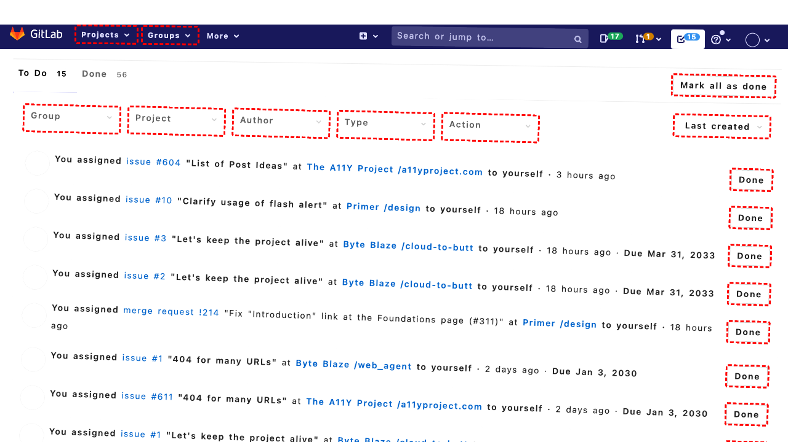

## Intent

Find the article titled 'Building A PC, Part IX: Downsizing'.

## RM

Thoughts: The user's intent is to find the article titled 'Building A PC, Part IX: Downsizing'. This is an information-seeking task where the user wants to locate and presumably view the article. The agent's action history shows it performed a search by filling a search box and pressing Enter, then clicked on the link with bid 85, which corresponds to the article title. The final state description indicates the search results are displayed and the article link is present, and it notes that clicking the link will take the user to the article page. However, the bot's response to the user is "None." For an information-seeking task, the bot's response must contain the requested information or state it's not available. Since the bot provided no response, even if the actions might have navigated to the article, the user receives no information. Therefore, the task fails due to lack of response.

Status: failure

## Final Response 

## Captions

===============Looking at the current page, I can see it's a blog homepage with multiple articles. The goal is to find the article titled "Building A PC, Part IX: Downsizing". This article is not visible in the current view. I need to search for it. I notice there is a search box in the sidebar (complementary section) with bid 370. I can use that to search for the article.

I'll click on the search box to focus it, then type the search query, and press Enter.

First, click the search box.
===============Looking at the page, I've clicked the search box. Now I need to type the search query "Building A PC, Part IX: Downsizing" and press Enter. I'll use the fill action to enter the text into the search box (bid 370 is the searchbox), then press Enter.
===============Looking at the accessibility tree, I can see that the search box (bid 370) already has the value "Building A PC, Part IX: Downsizing" filled in. This suggests that my previous fill action was successful. Now I need to submit the search. I can either click the search button (bid 371) or press Enter. Since the search box is already focused (as indicated by "focused" in the tree), pressing Enter would be efficient.

I'll use keyboard_press to press Enter.
===============Looking at the current page, I can see that the search has already been executed. The page shows "SEARCH RESULTS FOR: BUILDING A PC, PART IX: DOWNSIZING" and there is an article with the exact title "Building a PC, Part IX: Downsizing" as a link (bid 85). The goal is to find the article titled 'Building A PC, Part IX: Downsizing', which means we need to open it. Since the article is listed in the search results, I should click on its title link to open the article.

The link with bid 85 has the text "Building a PC, Part IX: Downsizing" and URL 'http://localhost:8000/?p=467'. Clicking this will take us to the article page.

## Images





## Main Prompt

```md
User Intent: Find the article titled 'Building A PC, Part IX: Downsizing'.

Action History:
1: click("370")
2: fill("370", "Building A PC, Part IX: Downsizing")
3: keyboard_press("Enter")
4: click("85")


The detailed final state of the webpage:

```md
Looking at the current page, I can see that the search has already been executed. The page shows "SEARCH RESULTS FOR: BUILDING A PC, PART IX: DOWNSIZING" and there is an article with the exact title "Building a PC, Part IX: Downsizing" as a link (bid 85). The goal is to find the article titled 'Building A PC, Part IX: Downsizing', which means we need to open it. Since the article is listed in the search results, I should click on its title link to open the article.

The link with bid 85 has the text "Building a PC, Part IX: Downsizing" and URL 'http://localhost:8000/?p=467'. Clicking this will take us to the article page.
```

Bot response to the user: None.
```
