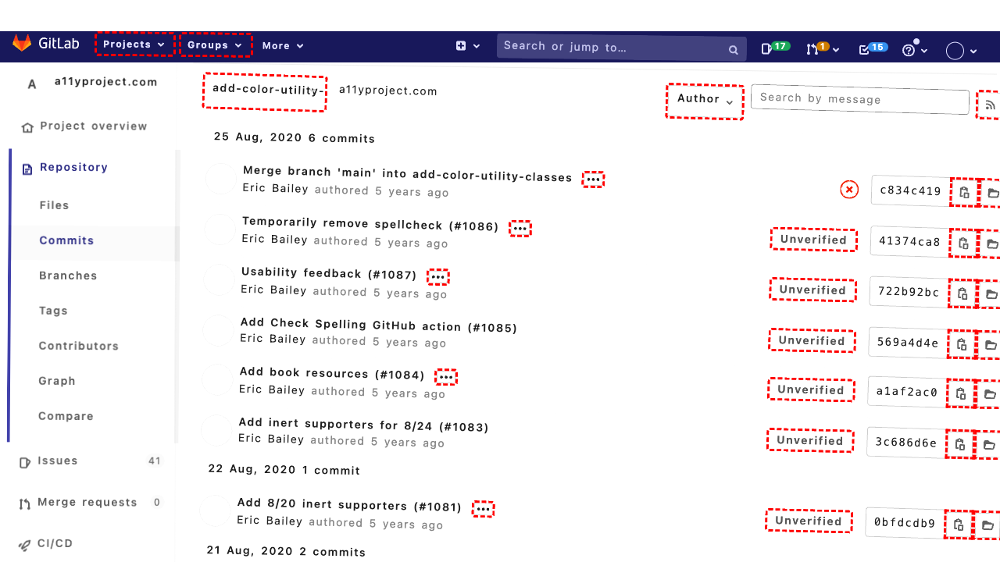
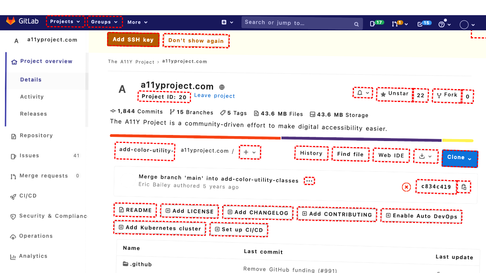
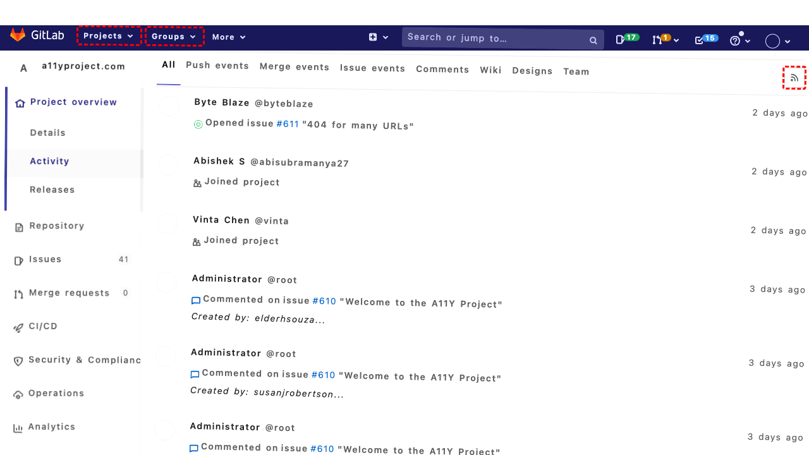
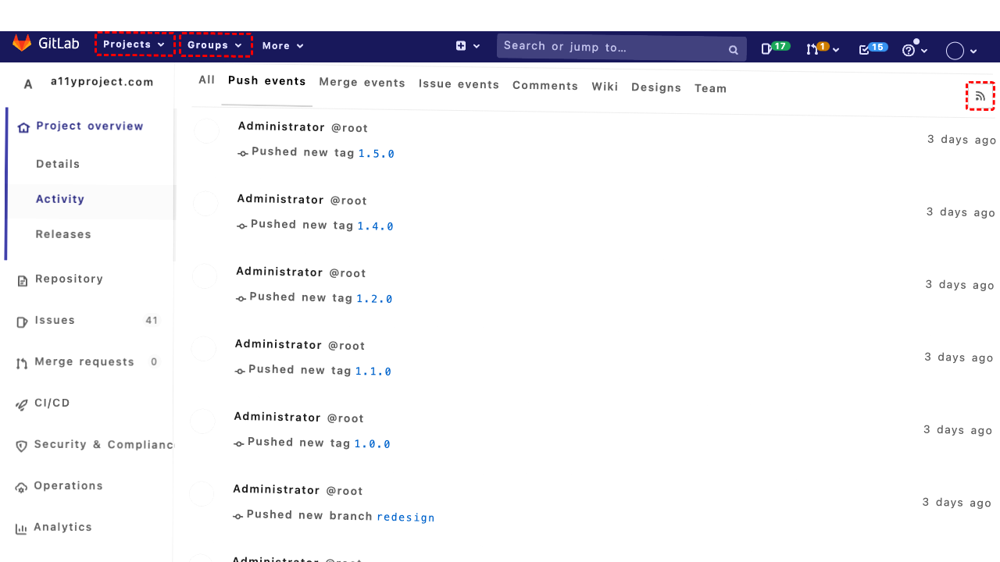
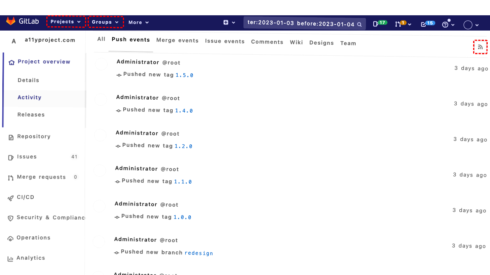

## Intent

How many commits did Eric and Kilian make to a11yproject on 1/3/2023?

## RM

Thoughts: The user's intent is to find the number of commits made by Eric and Kilian to the a11yproject on 1/3/2023, which is an information-seeking task. The agent's action history shows that it performed a search using a filter for the author and date range, but the final state of the webpage indicates that the activities displayed are from November 2025, not the target date. This suggests the search did not successfully retrieve the correct data, and the agent did not provide any response to the user with the requested information or an explanation. Since the agent failed to deliver the required information and the final state does not show the correct results, the task is a failure.

Status: failure

## Final Response 

## Captions

===============Looking at the current page, I can see I'm on the GitLab dashboard showing a list of projects. I need to find the "a11yproject" repository and then navigate to its commit history to check commits by Eric and Kilian on 1/3/2023.

First, I should search for the "a11yproject" repository using the search functionality available on the page. I can see there's a search box with bid '156' that appears to be for searching projects.
===============Looking at the current page, I can see that the search has already been performed for "a11yproject" and there's a result showing "The A11Y Project / a11yproject.com". I need to click on this project link to access the repository where I can then navigate to the commit history and filter by date and authors.

The project link appears to be in the heading with bid '341' (based on the accessibility tree showing "The A11Y Project / a11yproject.com" as a link).
===============Looking at the current page, I can see I'm now on the a11yproject.com repository page. I need to access the commit history to find commits by Eric and Kilian on 1/3/2023. I can see there's a "History" link with bid '778' in the navigation area, which should take me to the commit history where I can then filter by date and authors.
===============Looking at the current page, I can see I'm on the a11yproject.com repository page, but the commit history link I tried to click ('778') timed out. Let me examine the accessibility tree more carefully to find the correct link to the commit history.

From the accessibility tree, I can see there's a "Repository" section with a nested list that includes a "Commits" link with bid '321'. This appears to be the correct navigation path to access the commit history for this repository.
===============Looking at the current page, I can see I'm on a specific branch's commit history page (add-color-utility-classes branch) rather than the main repository's commit history. The commits shown are from 2020, which is much earlier than the target date of 1/3/2023.

I need to navigate to the main repository's commit history where I can see all commits across all branches and then filter by date and authors. From the accessibility tree, I can see there's a "Repository" section in the sidebar with a "Commits" link (bid '321') that should take me to the main commit history page.
===============Looking at the current page, I can see I'm still on the specific branch commit history page (add-color-utility-classes branch) showing commits from 2020. The commits I need to find are from 1/3/2023, which is much later than what's currently displayed.

I need to navigate to the main repository's commit history where I can see all commits across all branches. From the accessibility tree, I can see there's a "Repository" section in the sidebar navigation with a "Commits" link (bid '321') that should take me to the main commit history page for the entire repository, not just this specific branch.
===============Looking at the current page, I can see I'm still on the specific branch commit history (add-color-utility-classes) showing only commits from 2020. The goal is to find commits from Eric and Kilian on 1/3/2023, which requires accessing the main repository's commit history where all commits across all branches are visible.

From the accessibility tree, I can see there's a "Repository" section in the sidebar navigation with a "Commits" link (bid '321'). However, clicking this link multiple times hasn't taken me to the main commit history page. This suggests I might need to navigate differently.

Let me try clicking on the main repository link first to go back to the project overview, then navigate to the commits from there. I can see there's a link to "a11yproject.com" with bid '282' in the sidebar.
===============Looking at the current situation, I've been trying to navigate to the main repository's commit history but keep ending up on a specific branch's commit history. The commits shown are from 2020, but I need to find commits from 1/3/2023 by Eric and Kilian.

From the accessibility tree, I can see there's a "Repository" section in the sidebar with a "Commits" link (bid '321'), but clicking it repeatedly hasn't taken me to the main commit history. Let me try a different approach - I'll navigate to the "Activity" section in the sidebar, which might provide access to all project activity including commits across all branches and time periods.

The "Activity" link appears to have bid '313' in the sidebar navigation under the "Project overview" section.
===============Looking at the current situation, I've been trying to navigate to the commit history but keep encountering issues. I'm now on the Activity page, which shows various project activities like issue openings, comments, and member joins, but I don't see commit information here.

The goal is to find commits by Eric and Kilian on 1/3/2023. Since I'm on the Activity page and it's showing recent activities (from November 2025), I need to find a way to filter or navigate to commit-specific activity.

Looking at the accessibility tree, I can see there's a list of activity filters at the top of the main content area (bids 578-601) including "Push events" which typically contains commit information. Let me click on "Push events" to filter the activity to only show commit-related activities.
===============Looking at the current page, I'm on the Activity page with "Push events" filtered, which should show commit-related activities. However, the activities shown are from November 2025 (3 days ago), which is much later than the target date of 1/3/2023.

I need to find a way to filter or search for activities from the specific date of 1/3/2023. The current page doesn't show any obvious date filtering controls in the accessibility tree, but GitLab typically has search/filter functionality at the top of activity pages.

Let me look for a search box or filter option that would allow me to search by date or author. From the accessibility tree, I can see there's a searchbox with bid '167' in the top navigation bar that might allow me to search for specific activities. I'll try using this to search for commits by Eric and Kilian on the specific date.

## Images









## Main Prompt

```md
User Intent: How many commits did Eric and Kilian make to a11yproject on 1/3/2023?

Action History:
1: search_project('156', 'a11yproject')
2: click('341')
3: click('778')
4: click('321')
5: click('321')
6: click('321')
7: click('282')
8: click('313')
9: click('582')
10: fill('167', 'author:(Eric OR Kilian) after:2023-01-03 before:2023-01-04')


The detailed final state of the webpage:

```md
Looking at the current page, I'm on the Activity page with "Push events" filtered, which should show commit-related activities. However, the activities shown are from November 2025 (3 days ago), which is much later than the target date of 1/3/2023.

I need to find a way to filter or search for activities from the specific date of 1/3/2023. The current page doesn't show any obvious date filtering controls in the accessibility tree, but GitLab typically has search/filter functionality at the top of activity pages.

Let me look for a search box or filter option that would allow me to search by date or author. From the accessibility tree, I can see there's a searchbox with bid '167' in the top navigation bar that might allow me to search for specific activities. I'll try using this to search for commits by Eric and Kilian on the specific date.
```

Bot response to the user: None.
```
