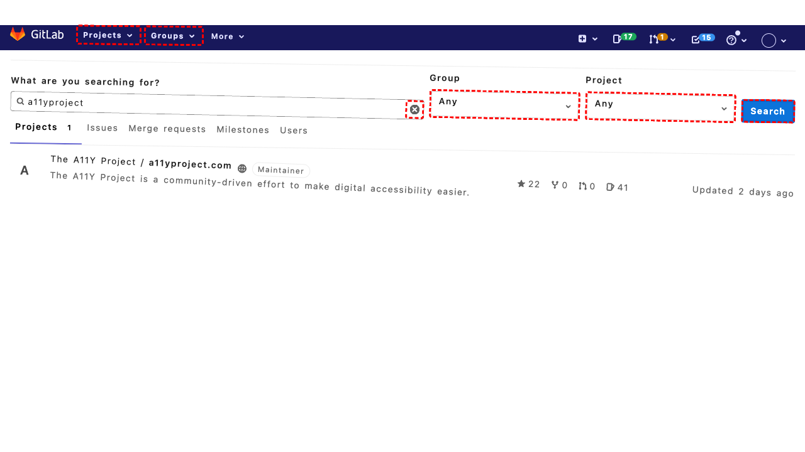
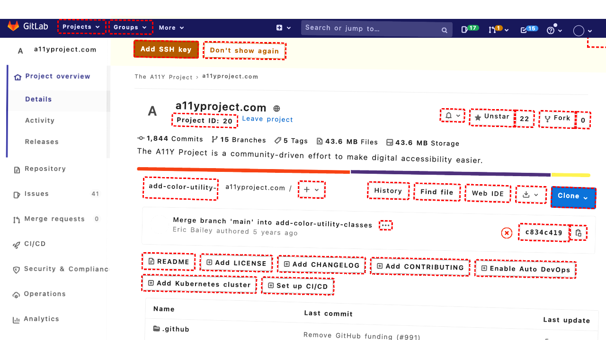
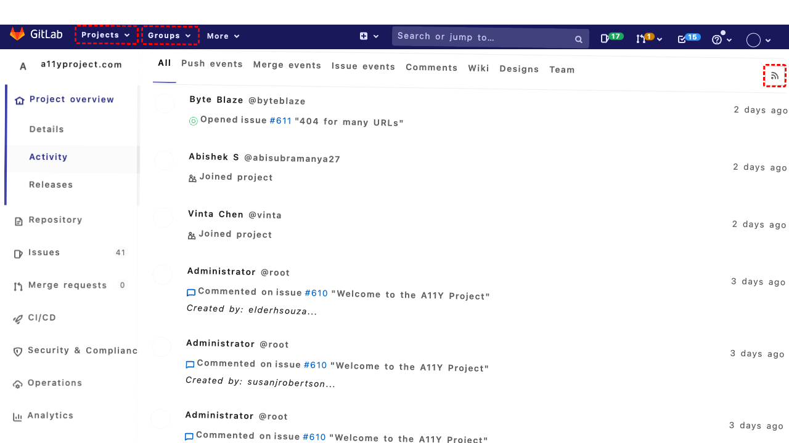
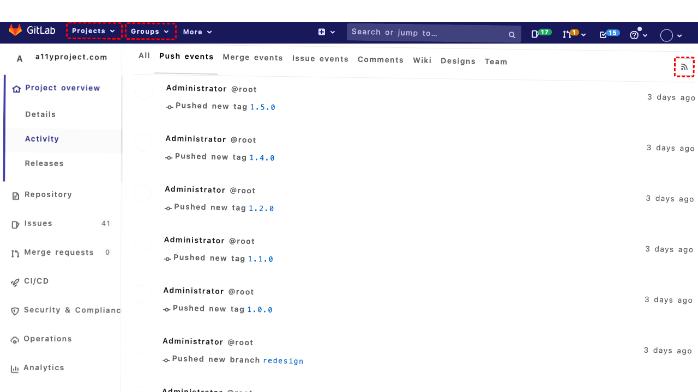
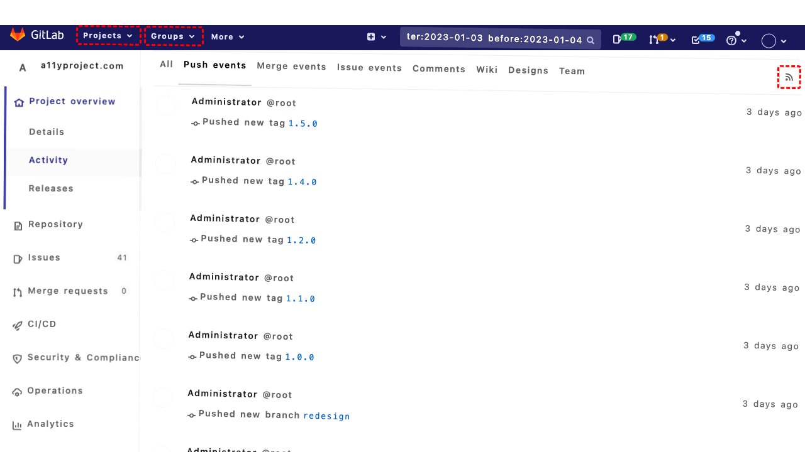

## Intent

How many commits did kilian make to a11yproject on 3/1/2023?

## RM

Thoughts: The user's intent is to find out how many commits "kilian" made to the "a11yproject" on 3/1/2023, which is an information-seeking task. The agent's action history shows multiple attempts to interact with elements, including filling in "kilian" in bid "500" and "502", but there is no indication that the agent successfully retrieved or displayed the number of commits for the specified date. The final state of the webpage is a description of the agent's internal reasoning and error correction, not the actual information or a confirmation that the data is unavailable. The bot's response is "None", meaning it did not provide the requested information or state its unavailability. Therefore, the task has failed.

Status: failure

## Final Response 

## Captions

===============Looking at the goal, I need to find how many commits Kilian made to the a11yproject repository on March 1, 2023. I can see the a11yproject repository is listed in the current dashboard view. I should first click on that repository to navigate to its detailed page where I can access commit history and filtering options.

The a11yproject repository link has bid '284' according to the accessibility tree.
===============Looking at the current page, I can see I'm now on the a11yproject.com repository page. I need to access the commit history to find Kilian's commits from March 1, 2023. I can see there's a "History" link with bid '657' that should take me to the commit history for this repository.
===============Looking at the current page, I can see I'm on the commits page for the "add-color-utility-classes" branch of the a11yproject repository. The commits shown are from 2020 (5 years ago), but I need to find commits from March 1, 2023.

I notice there's a search box with the text "Filter by commit message" (bid '500'). I should use this to search for commits by Kilian on the specific date. First, I'll try searching for "kilian" to see if there are any commits by that author, then I can filter further by date.
===============Looking at the current state, I can see I'm on the commits page for the "add-color-utility-classes" branch, but all the commits shown are from 2020. I need to find commits from March 1, 2023 by Kilian.

The search box (bid '500') is focused and ready for input. I should search for "kilian" first to filter commits by that author, then I can look for the specific date. This will help narrow down the results before I try to filter by date.
===============Looking at the current state, I can see that I've already filled the search box with "kilian" to filter commits by that author. The page should now show only Kilian's commits. However, I need to find commits specifically from March 1, 2023.

The current view shows commits from 2020, which suggests that either there are no Kilian commits in this branch, or I need to change the branch or use additional filtering. Since the goal is to find Kilian's commits to a11yproject on 3/1/2023, I should first check if there are any results from the current search, and if not, I might need to switch to a different branch or use the main repository commits page.

Let me first execute the search by pressing Enter to see the filtered results.
===============Looking at the current state, I've searched for "kilian" in the commit message filter on the "add-color-utility-classes" branch, but all the commits shown are from 2020. This suggests either:

1. There are no Kilian commits in this specific branch
2. I need to search in a different branch (likely the main/default branch)
3. I need to use a different filtering approach

Since the goal is to find Kilian's commits to the entire a11yproject repository on 3/1/2023, I should navigate to the main repository commits page rather than being limited to the "add-color-utility-classes" branch. I can see there's a branch selector button with bid '477' that says "add-color-utility-classes" - I should click this to switch to a different branch, likely the main branch.
===============Looking at the current situation, I can see I'm on the "add-color-utility-classes" branch commits page, but all the commits shown are from 2020. I need to find Kilian's commits from March 1, 2023. Since the branch selector is expanded (bid '477' shows "expanded=True"), I can see a list of available branches including "main" (bid '513'). I should switch to the main branch to see if Kilian's 2023 commits are there.
===============Looking at the current state, I can see I've successfully switched to the main branch and now I'm viewing commits from March 2023. I can see several commit groups with dates like "14 Mar, 2023", "12 Mar, 2023", "07 Mar, 2023", "05 Mar, 2023", etc.

I need to specifically look for March 1, 2023 (3/1/2023). Scanning through the visible commits, I can see:
- 14 Mar, 2023: 2 commits
- 12 Mar, 2023: 1 commit
- 07 Mar, 2023: 2 commits
- 05 Mar, 2023: 1 commit (by Kilian Valkhof)
- 02 Mar, 2023: 3 commits

I don't see March 1, 2023 in the currently visible portion. Since March 1 would be earlier than March 2, I should scroll up to see if there are earlier March dates that might include March 1.
===============Looking at the current state, I can see I'm on the main branch commits page and I've scrolled to see more commits. I can see commit groups for February dates but I still don't see March 1, 2023 in the visible portion. The commits are organized by date with labels like "14 Mar, 2023", "12 Mar, 2023", etc., but March 1 isn't visible.

Since I need to find commits specifically from March 1, 2023 by Kilian, and the current view doesn't show that date, I should use the search functionality to filter for that specific date. I can see there's a search box (bid '500') that says "Filter by commit message" - I can use this to search for commits from March 1, 2023, though it might require a specific date format or I might need to search for "kilian" and then manually look for March 1 in the results.

Let me first clear the current search and search for "kilian" again to see all of Kilian's commits across all dates, then I can look for March 1, 2023 in the results.
===============Looking at the error, I see that the element with bid '500' is actually a form element, not a simple input field. I need to find the actual input field within this form to perform the search. Let me examine the accessibility tree more carefully to find the correct input element for searching commits.

Looking at the accessibility tree, I can see there's a searchbox with bid '502' that has the label "Filter by commit message". This is likely the actual input field I should use for searching, not the form element with bid '500'.

Let me use the correct search input field to search for "kilian" and then look for March 1, 2023 commits in the results.

## Images









## Main Prompt

```md
User Intent: How many commits did kilian make to a11yproject on 3/1/2023?

Action History:
1: click("284")
2: click("657")
3: click("500")
4: fill("500", "kilian")
5: keyboard_press("Enter")
6: click("477")
7: click("513")
8: scroll(0, -500)
9: fill("500", "kilian")
10: fill("502", "kilian")


The detailed final state of the webpage:

```md
Looking at the error, I see that the element with bid '500' is actually a form element, not a simple input field. I need to find the actual input field within this form to perform the search. Let me examine the accessibility tree more carefully to find the correct input element for searching commits.

Looking at the accessibility tree, I can see there's a searchbox with bid '502' that has the label "Filter by commit message". This is likely the actual input field I should use for searching, not the form element with bid '500'.

Let me use the correct search input field to search for "kilian" and then look for March 1, 2023 commits in the results.
```

Bot response to the user: None.
```
