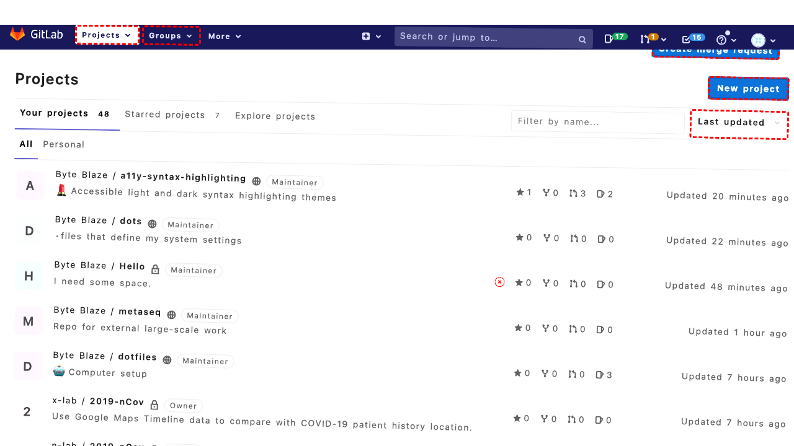
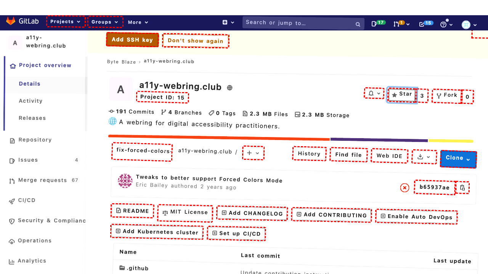
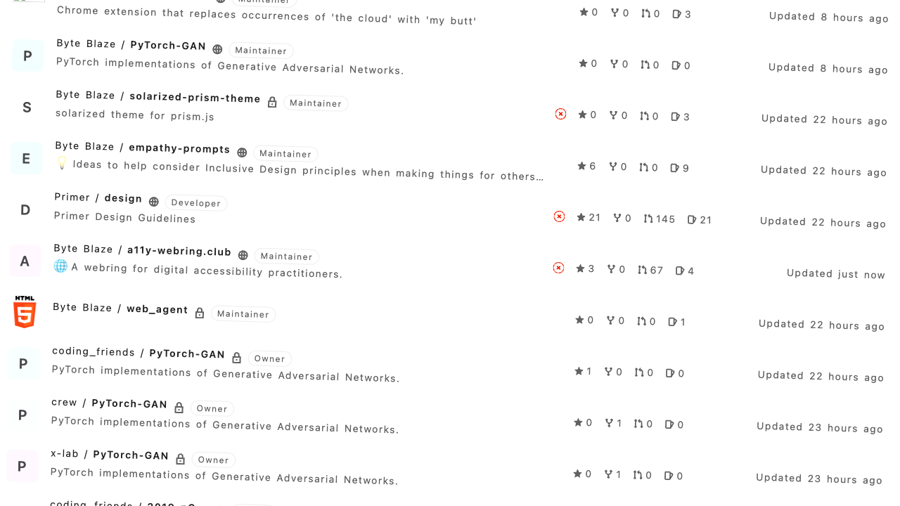
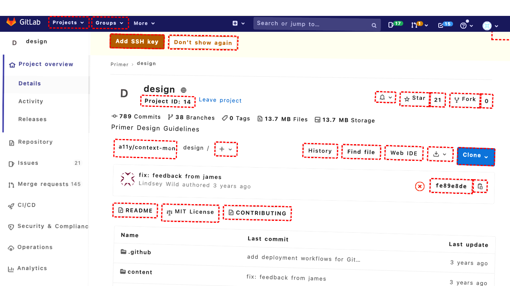
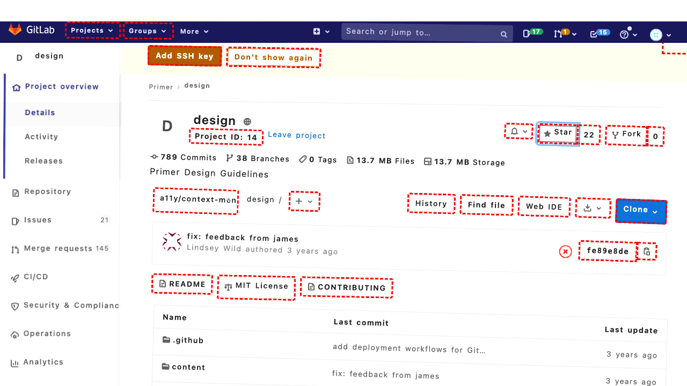
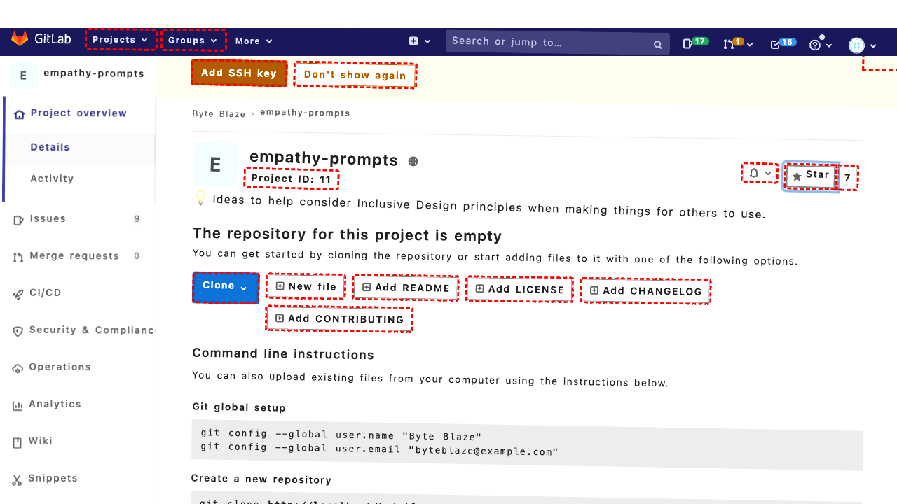

## Intent

Draft a new marketing price rule for Pride Month that offers 45% off on all products for all customers

## RM

Thoughts: The user's intent is to draft a new marketing price rule for Pride Month offering 45% off on all products for all customers. This is a content modification task, as the user wants to create a new rule. The action history shows the agent navigating to the promo quote page, clicking to add a new rule, filling in the rule name and description, selecting the Main Website, and selecting multiple customer groups. However, the final state indicates the agent is still in the process of selecting customer groups and hasn't completed the rule creation. The bot response is "None," suggesting the task wasn't finished. For content modification tasks, success requires examining the action history and final state to confirm completion. Here, the final state shows the agent is still working on selecting customer groups, and there's no indication of saving or submitting the rule. Therefore, the task is incomplete and fails.

Status: failure

## Final Response 

## Captions

===============Looking at the goal: "Draft a new marketing price rule for Pride Month that offers 45% off on all products for all customers." This is a shopping cart price rule (promotion) in Magento. Currently, I'm on the Dashboard. I need to navigate to the Promotions section, then to Shopping Cart Price Rules, and create a new rule.

From the accessibility tree, I can see the left navigation menu. Under "Promotions" (bid 172), there's a submenu with "Shopping Cart Price Rules" (bid 179). I should click on "Promotions" to expand it, then click "Shopping Cart Price Rules."

Let's do that.
===============I need to expand the Promotions menu first, then click on Shopping Cart Price Rules. I just clicked on "Promotions" (bid 172). Now I should wait a moment for the submenu to expand, then click on "Shopping Cart Price Rules" (bid 179).
===============Looking at the current state, I've clicked on "Promotions" and then "Shopping Cart Price Rules." The next step should be to wait for the page to load and then look for a button to add a new rule. However, I don't see the content of the Shopping Cart Price Rules page yet in the accessibility tree - the tree still shows the Dashboard page. This suggests the page might still be loading or the tree hasn't been updated.

Let me wait a bit longer for the page to load and then check if we can see any "Add New Rule" button or similar.
===============Looking at the current situation, I've navigated to the Shopping Cart Price Rules page but the accessibility tree still shows the Dashboard page. This suggests the page might still be loading or the tree hasn't been updated. I should wait a bit more and then check if we can see any elements related to price rules. If not, I might need to refresh the view or check for loading indicators.

Let me wait a bit longer and then see if the page has loaded by looking for elements like "Add New Rule" or "Shopping Cart Price Rules" heading.
===============Looking at the current situation, I've waited for the page to load but the accessibility tree still shows the Dashboard page. This suggests the navigation might not have completed successfully or the tree hasn't been updated. I should check if there are any loading indicators or try to navigate again. However, since I can't see the current page content, I should first verify if I'm actually on the Shopping Cart Price Rules page by checking the URL or looking for any signs of page change.

Let me try to navigate more directly by using the full URL for the Shopping Cart Price Rules page. From the accessibility tree, I can see the URL for "Shopping Cart Price Rules" is: http://dockerized-magento.local/index.php/admin/promo_quote/

I'll use the goto action to navigate directly to that URL.
===============Looking at the current situation, I've navigated directly to the Shopping Cart Price Rules page. Now I can see from the accessibility tree that I'm on the correct page - there's a heading "Shopping Cart Price Rules" and a button "Add New Rule . . ." (bid 447). To create a new price rule for Pride Month, I need to click this "Add New Rule" button.
===============Looking at the current state, I can see I'm on the "New Rule" page for creating a shopping cart price rule. The accessibility tree shows the form with various fields like "Rule Name", "Description", "Status", etc. I need to fill out this form to create a Pride Month promotion with 45% off on all products for all customers.

From the tree, I can see:
- Rule Name field (bid 516)
- Description field (bid 521)
- Status dropdown (bid 527) - already set to "Active"
- Websites multiselect (bid 536) - needs to include "Main Website"
- Customer Groups multiselect (bid 544) - needs to include all groups
- Coupon dropdown (bid 555) - should be "No Coupon" for automatic discount
- Actions tab needs to be configured for 45% discount

First, I need to fill in the basic information:
1. Rule Name: "Pride Month 45% Off"
2. Description: "45% off on all products for Pride Month"
3. Ensure Websites includes "Main Website"
4. Ensure all Customer Groups are selected
5. Set Coupon to "No Coupon" (it already is)

Let me start by filling the Rule Name field.
===============Looking at the current state, I've filled in the Rule Name. Now I need to fill in the Description field (bid 521) and configure the other required fields.
===============Looking at the current state, I've filled in the Rule Name and Description. Now I need to configure the other required fields:

1. **Websites**: The "Main Website" option (bid 537) needs to be selected. Currently it shows as selected=False in the tree.
2. **Customer Groups**: All groups (NOT LOGGED IN, General, Wholesale, VIP Member, Private Sales Member) need to be selected.
3. **Coupon**: Should remain "No Coupon" (already selected).
4. **Actions**: I need to click on the "Actions" tab to set up the 45% discount.

Let me first select the Main Website and all Customer Groups.
===============Looking at the current state, I've selected the Main Website. Now I need to select all Customer Groups. The Customer Groups listbox (bid 544) has multiple options that need to be selected: "NOT LOGGED IN", "General", "Wholesale", "VIP Member", and "Private Sales Member". I'll select all of them.

## Images












## Main Prompt

```md
User Intent: Draft a new marketing price rule for Pride Month that offers 45% off on all products for all customers

Action History:
1: click("172")
2: noop(500)
3: click("179")
4: noop(2000)
5: noop(3000)
6: goto("http://dockerized-magento.local/index.php/admin/promo_quote/")
7: click("447")
8: fill("516", "Pride Month 45% Off")
9: fill("521", "45% off on all products for Pride Month")
10: select_option("536", "Main Website")
11: select_option("544", ["NOT LOGGED IN", "General", "Wholesale", "VIP Member", "Private Sales Member"])


The detailed final state of the webpage:

```md
Looking at the current state, I've selected the Main Website. Now I need to select all Customer Groups. The Customer Groups listbox (bid 544) has multiple options that need to be selected: "NOT LOGGED IN", "General", "Wholesale", "VIP Member", and "Private Sales Member". I'll select all of them.
```

Bot response to the user: None.
```
