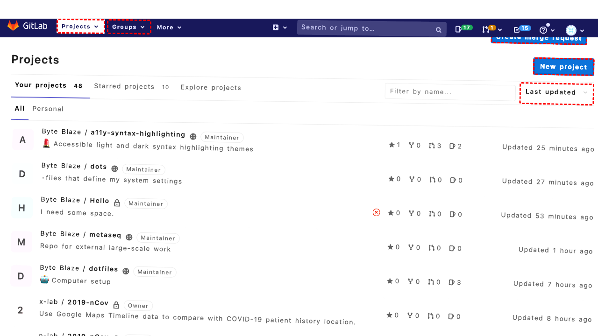
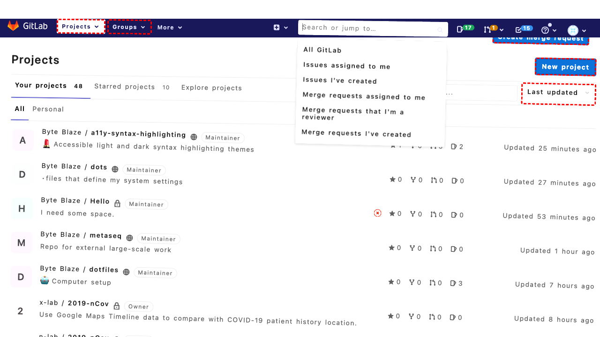

## Intent

Invite Benoît and Abishek as collaborator to my HTML5 markup extention repo

## RM

Thoughts: The user's intent is to invite Benoît and Abishek as collaborators to their HTML5 markup extension repo, which is a content modification task. The action history shows the agent clicking various elements and scrolling, but it ends with clicking ID 395 (likely "Settings") without any further actions to actually add collaborators. The final state of the webpage indicates the agent is still navigating and has not reached or performed the member invitation process. Since no modifications were made to add the specified collaborators, the task is incomplete and unsuccessful.

Status: failure

## Final Response 

## Captions

===============Looking at the goal to invite Benoît and Abishek as collaborators to my "HTML5 markup extension repo", I need to first identify which repository this refers to. Based on the project list, the most likely candidate is "accessible-html-content-patterns" which has the description "The full HTML5 Doctor Element Index as well as common markup patterns for quick reference."

I need to navigate to this repository first, then access the member management section to add collaborators.

Let me click on the "accessible-html-content-patterns" repository link.
===============Looking at the current page, I can see I'm already on the "accessible-html-content-patterns" repository page. To add collaborators, I need to navigate to the member management section. I can see there's a "Settings" link in the sidebar with ID 395. Clicking this should take me to the project settings where I can manage members.
===============Looking at the error message, I can see that the click on ID "395" (Settings link) failed because there's an element with ID "422" (the "Toggle sidebar" button) intercepting pointer events. This suggests the sidebar might be collapsed or there's some overlay issue.

Let me try a different approach. I notice there's a "Settings" link in the main navigation area with ID 396. Let me try clicking that instead, which should also take me to the project settings.
===============Looking at the error, I can see that the "Toggle sidebar" button (ID 422) is intercepting clicks on the Settings link. This suggests the sidebar might be partially covering the Settings link. Let me try a different approach - I'll first collapse the sidebar by clicking the toggle button, then try to access Settings.
===============Looking at the current situation, I can see that the "Toggle sidebar" button (ID 422) was interfering with accessing the Settings link. Since I just clicked the toggle button, the sidebar should now be collapsed or out of the way. Now I should be able to access the Settings link (ID 396) to navigate to the project settings where I can manage members and add collaborators.
===============Looking at the current situation, I can see that I'm still on the project settings page (the URL shows "/edit" which is the settings page). However, I need to navigate to the specific section for managing members/collaborators.

From the accessibility tree, I can see various settings sections like "Visibility, project features, permissions" and "Merge requests" but I don't see a specific "Members" section visible yet. I need to find the member management area where I can add collaborators.

Let me scroll down to see if there are more settings sections below, particularly looking for a "Members" or "Collaborators" section.
===============Looking at the current situation, I can see I'm on the project settings page but haven't found the member management section yet. The accessibility tree shows various settings sections like "Visibility, project features, permissions", "Merge requests", "Badges", and "Advanced", but no "Members" section is visible in the current view.

Since I just scrolled down, I should continue scrolling further to find the "Members" section where I can add collaborators. The member management is typically located in the project settings, so I need to keep scrolling until I find it.
===============Looking at the current situation, I can see I'm on the project settings page but haven't found the member management section yet. The accessibility tree shows I've scrolled through various sections but haven't reached the "Members" area. In GitLab, the member management section is typically located in the project settings, so I need to continue scrolling to find it. Let me scroll further down to locate the "Members" section where I can add collaborators.
===============Looking at the current situation, I can see I'm on the project settings page but haven't found the member management section yet. The accessibility tree shows I've scrolled through various sections including "Visibility, project features, permissions", "Merge requests", "Badges", and "Advanced", but no "Members" section is visible.

In GitLab, the member management section is typically located in the project settings, but it might be under a different navigation path. Let me try a different approach - I'll navigate back to the main project page and then access the member management through a different path. I can see there's a project link with ID 229 that should take me back to the main project page.
===============Looking at the current situation, I can see I'm back on the main project page for "accessible-html-content-patterns". I need to find a different way to access the member management section. In GitLab, the member management is typically accessed through the project settings, but there might be a more direct path.

I notice in the accessibility tree there's a navigation section with various links. Let me look for a "Members" or "People" link that might be directly accessible from the project page. I can see there are links for "Project information", "Repository", "Issues", "Merge requests", etc., but no direct "Members" link is visible in the current view.

Let me try accessing the project settings again, but this time I'll use the navigation menu on the left side. I can see there's a "Settings" link with ID 395 in the sidebar navigation. Let me try clicking that since the sidebar toggle issue might be resolved now.

## Images





## Main Prompt

```md
User Intent: Invite Benoît and Abishek as collaborator to my HTML5 markup extention repo

Action History:
1: click("758")
2: click("395")
3: click("396")
4: click("422")
5: click("396")
6: scroll(0, 500)
7: scroll(0, 800)
8: scroll(0, 1200)
9: click("229")
10: click("395")


The detailed final state of the webpage:

```md
Looking at the current situation, I can see I'm back on the main project page for "accessible-html-content-patterns". I need to find a different way to access the member management section. In GitLab, the member management is typically accessed through the project settings, but there might be a more direct path.

I notice in the accessibility tree there's a navigation section with various links. Let me look for a "Members" or "People" link that might be directly accessible from the project page. I can see there are links for "Project information", "Repository", "Issues", "Merge requests", etc., but no direct "Members" link is visible in the current view.

Let me try accessing the project settings again, but this time I'll use the navigation menu on the left side. I can see there's a "Settings" link with ID 395 in the sidebar navigation. Let me try clicking that since the sidebar toggle issue might be resolved now.
```

Bot response to the user: None.
```
