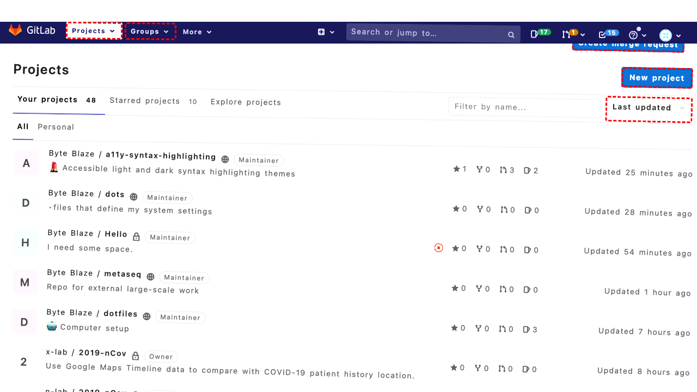
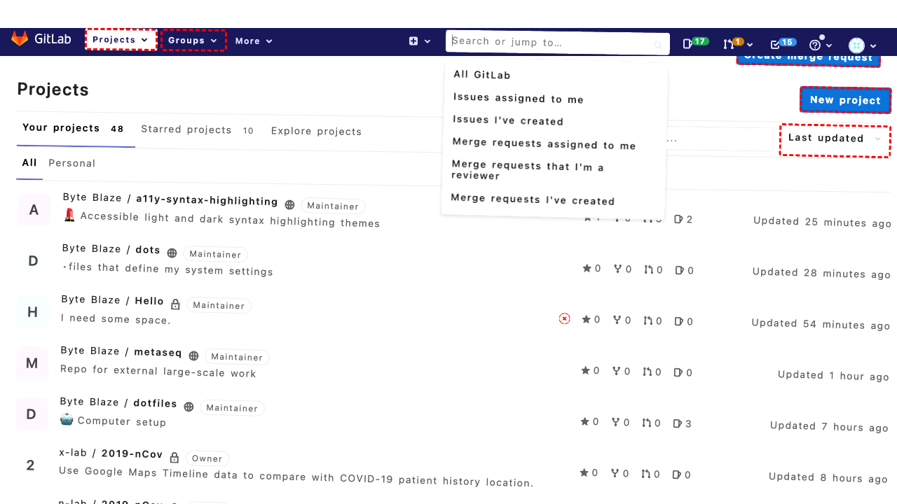

## Intent

Today is 3/15/2023, generate a sales order report over the last 45 days

## RM

Thoughts: The user's intent is to generate a sales order report over the last 45 days, with today's date given as 3/15/2023. The action history shows the agent performed clicks and filled date fields: "From" with 01/29/2023 and "To" with 03/15/2023. The final state of the webpage indicates that the agent has filled the dates but has not yet clicked the "Show Report" button to generate the report. The bot response is "None," meaning no report or confirmation was provided to the user. Since the task involves generating a report (which could be considered a form of information seeking or content modification, but likely requires an action to produce the output), and the agent did not complete the final step (clicking "Show Report"), the task is not successfully executed. The final state is a description of intent, not a completed report generation.

Status: failure

## Final Response 

## Captions

===============I need to generate a sales order report over the last 45 days. Today is 3/15/2023. I should navigate to the Reports section, specifically the Sales Orders report, and set the date range to the last 45 days.

Looking at the accessibility tree, I can see the Reports menu item (bid 211). I need to expand it, then expand the Sales submenu (bid 215), then click on Orders (bid 219) to get to the sales order report page.

Let me first click on Reports to expand it.
===============I clicked the Reports menu to expand it. Now I need to expand the Sales submenu within Reports to access the Orders report. Looking at the accessibility tree, after clicking Reports, the submenu should be visible. I see the list item with link "Sales" (bid 215) inside the expanded Reports list. I need to click that to expand further.
===============I've expanded the Reports menu and then the Sales submenu. Now I need to click on the "Orders" link (bid 219) to navigate to the sales order report page where I can set the date range for the last 45 days.
===============Looking at the current page, I can see I'm already on the "Sales / Sales / Reports" page (URL: `/admin/report_sales/sales/`). This appears to be the Orders report page based on the title and the presence of filter controls like "Period", "From", "To", etc. The page shows "Total Ordered Report" and has a "Show Report" button.

Since I'm already on the sales order report page, I need to set the date range to the last 45 days. Today is 3/15/2023, so I need to calculate:
- Start date: 45 days before 3/15/2023 = January 29, 2023 (3/15 minus 45 days)
- End date: March 15, 2023

I need to fill the "From" and "To" date fields. Looking at the accessibility tree:
- "From *" field has bid 508
- "To *" field has bid 516

I should also ensure the "Period" dropdown is set appropriately. It's currently set to "Day" (bid 499), which is fine for a daily breakdown over 45 days.

Let me fill in the dates in MM/DD/YYYY format (common in Magento):
- From: 01/29/2023
- To: 03/15/2023

Then I'll click the "Show Report" button (bid 456) to generate the report.
===============Looking at the current state, I've filled the "From" date with 01/29/2023. Now I need to fill the "To" date with 03/15/2023 and then click the "Show Report" button to generate the report for the last 45 days.

## Images





## Main Prompt

```md
User Intent: Today is 3/15/2023, generate a sales order report over the last 45 days

Action History:
1: click("211")
2: click("215")
3: click("219")
4: fill("508", "01/29/2023")
5: fill("516", "03/15/2023")


The detailed final state of the webpage:

```md
Looking at the current state, I've filled the "From" date with 01/29/2023. Now I need to fill the "To" date with 03/15/2023 and then click the "Show Report" button to generate the report for the last 45 days.
```

Bot response to the user: None.
```
