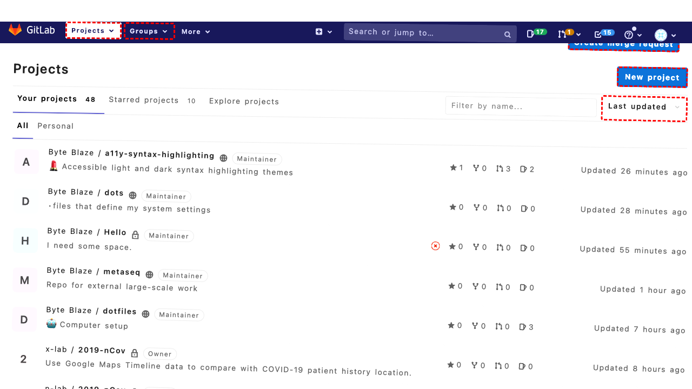
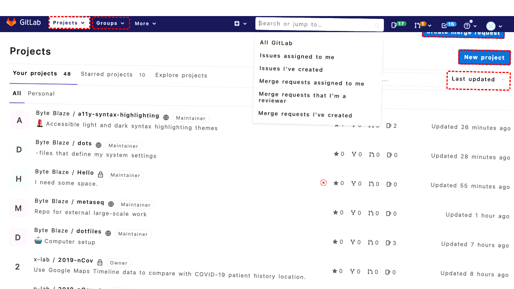
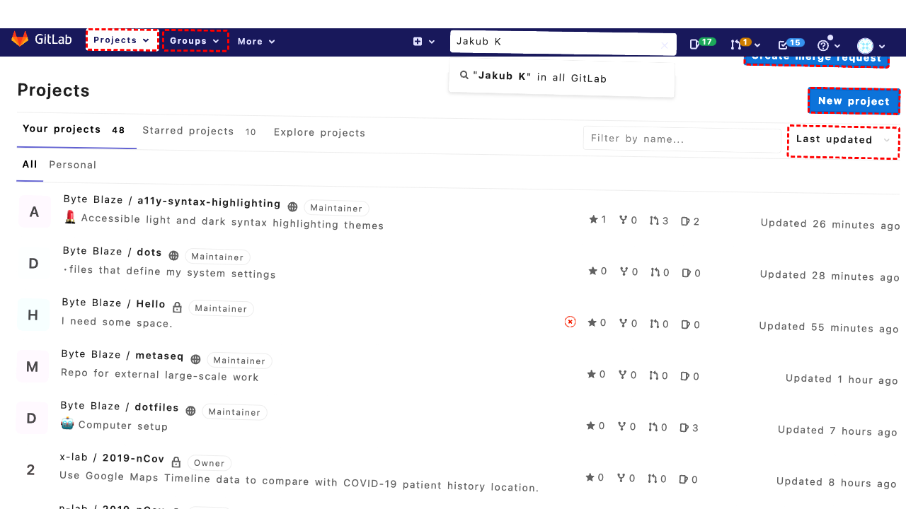
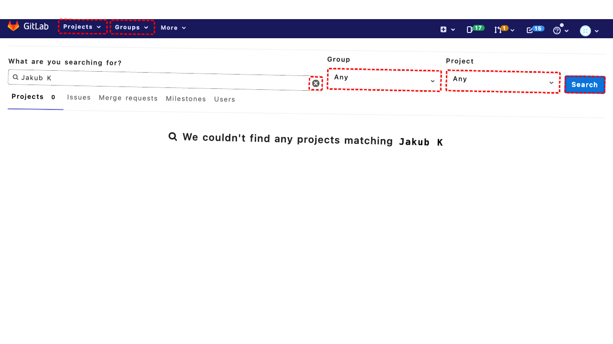
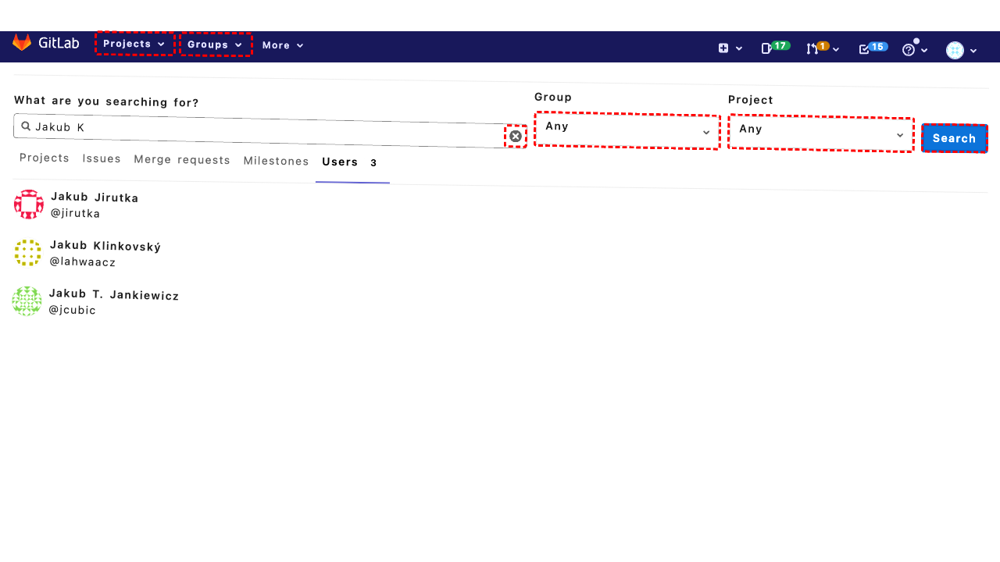
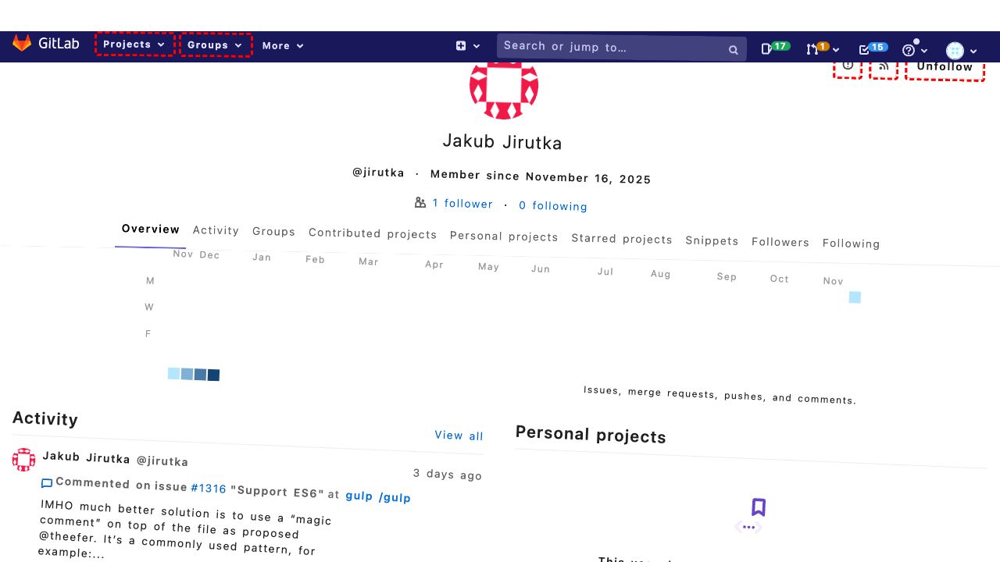
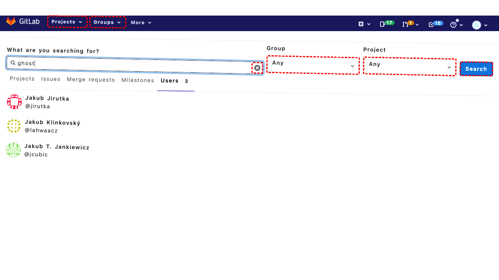

## Intent

Follow ['Jakub K', 'ghost', 'Benoît Blanchon'] on Gitlab

## RM

Thoughts: The user's intent is to follow three specific users on GitLab. The action history shows the agent successfully searched for and navigated to the profiles of 'Jakub K' and 'ghost', and the final state indicates that 'ghost' is already being followed (as shown by the "Unfollow" link). However, the agent did not complete the action for 'Benoît Blanchon'—it only started to search for this user but did not actually navigate to the profile or perform the follow action. Since the task requires following all three users and one is incomplete, the execution is unsuccessful.

Status: failure

## Final Response 

## Captions

===============Looking at the current page, I'm on the GitLab dashboard showing projects. To follow users on GitLab, I need to navigate to the search functionality and search for these specific users. The search box is available in the navigation bar with the ID '156' according to the accessibility tree.

I'll use the search box to look for the first user 'Jakub K' and then navigate to their profile to follow them.
===============Looking at the current state, I've clicked on the search box (bid '156') which should now be focused. Now I need to search for the first user 'Jakub K' by typing their username into the search box and pressing Enter to execute the search.
===============Looking at the current state, I've filled the search box with "Jakub K" but haven't executed the search yet. I need to press Enter to perform the search and see the results for this user. The search results should include user profiles that I can then interact with to follow them.
===============Looking at the current page state, I can see that we're already on a search results page for "Jakub K" (as shown in the URL and the accessibility tree). The search has been executed and we're seeing results, but the page indicates "We couldn't find any projects matching Jakub K" and shows tabs for different result types including "Users" at the bottom.

Since we want to follow users rather than projects, I should click on the "Users" tab to see if there are any user results for "Jakub K" that we can follow.
===============Looking at the current page state, I can see we're on the search results page for "Jakub K" and the "Users" tab shows there are 3 users found (as indicated by "Users 3" in the accessibility tree). The page lists three users: Jakub Jirutka (@jirutka), Jakub Klinkovský (@lahwaacz), and Jakub T. Jankiewicz (@jcubic).

However, I notice that none of these usernames exactly match "Jakub K" - they all have different last names. Since the goal is to follow specific users including 'Jakub K', I should first check if any of these users match the intended target. If not, I may need to refine the search or look for the other users ('ghost' and 'Benoît Blanchon').

Let me first click on one of the user results to see their profile and check if they're the right person to follow.
===============Looking at the current situation, I can see that I've clicked on a user result (likely Jakub Jirutka) from the search results. The goal is to follow specific users: ['Jakub K', 'ghost', 'Benoît Blanchon'].

From the search results, I found users with similar names but not an exact match for "Jakub K". Since I'm now on a user profile page (Jakub Jirutka's profile), I should check if this is one of the users we want to follow. However, looking at the accessibility tree, I can see there's an "Unfollow" link (bid '275'), which means we're currently following this user.

Since this doesn't appear to be the exact "Jakub K" we're looking for, and we need to follow three specific users, I should go back to the search results and either:
1. Try a more specific search for "Jakub K"
2. Search for the other users ('ghost' and 'Benoît Blanchon')
3. Check if any of the current search results match our targets

Let me first go back to the search results page to continue searching for the correct users.
===============Looking at the current situation, I'm back on the search results page for "Jakub K". The search returned three users, but none exactly match "Jakub K" - they have different last names. Since the goal is to follow specific users including 'Jakub K', 'ghost', and 'Benoît Blanchon', I should:

1. First verify if any of the current results match 'Jakub K' (they don't appear to)
2. Search for the other users instead

Let me search for 'ghost' next, as it might be a more specific username that will yield exact matches.
===============Looking at the current state, I can see that I've filled the search box with "ghost" but haven't executed the search yet. The search box (bid '253') currently has the value "ghost" and is focused. To see the search results for "ghost", I need to press Enter to execute the search.
===============Looking at the current state, I can see we're on a search results page for "ghost" that shows 3 user results: "Ghost User @ghost", "Ghost User @ghost1", and "litghost @litghost". The goal is to follow the user 'ghost', which appears to be the first result "Ghost User @ghost". I should click on this user's profile link to navigate to their profile where I can follow them.
===============Looking at the current situation, I can see I've successfully navigated to the Ghost User's profile page (as indicated by the page title "Ghost User · GitLab" and the username "@ghost" in the accessibility tree).

On this profile page, I can see there's an "Unfollow" link (bid '275'), which indicates that we're currently following this user. However, the goal is to follow this user, and since we're already following them, no action is needed for this user.

Now I should proceed to search for and follow the remaining user 'Benoît Blanchon'. I'll use the search functionality again to find this user.

## Images











## Main Prompt

```md
User Intent: Follow ['Jakub K', 'ghost', 'Benoît Blanchon'] on Gitlab

Action History:
1: click("156")
2: fill("156", "Jakub K")
3: keyboard_press("Enter")
4: click("322")
5: click("333")
6: go_back()
7: fill("253", "ghost")
8: keyboard_press("Enter")
9: click("333")
10: click("156")


The detailed final state of the webpage:

```md
Looking at the current situation, I can see I've successfully navigated to the Ghost User's profile page (as indicated by the page title "Ghost User · GitLab" and the username "@ghost" in the accessibility tree).

On this profile page, I can see there's an "Unfollow" link (bid '275'), which indicates that we're currently following this user. However, the goal is to follow this user, and since we're already following them, no action is needed for this user.

Now I should proceed to search for and follow the remaining user 'Benoît Blanchon'. I'll use the search functionality again to find this user.
```

Bot response to the user: None.
```
