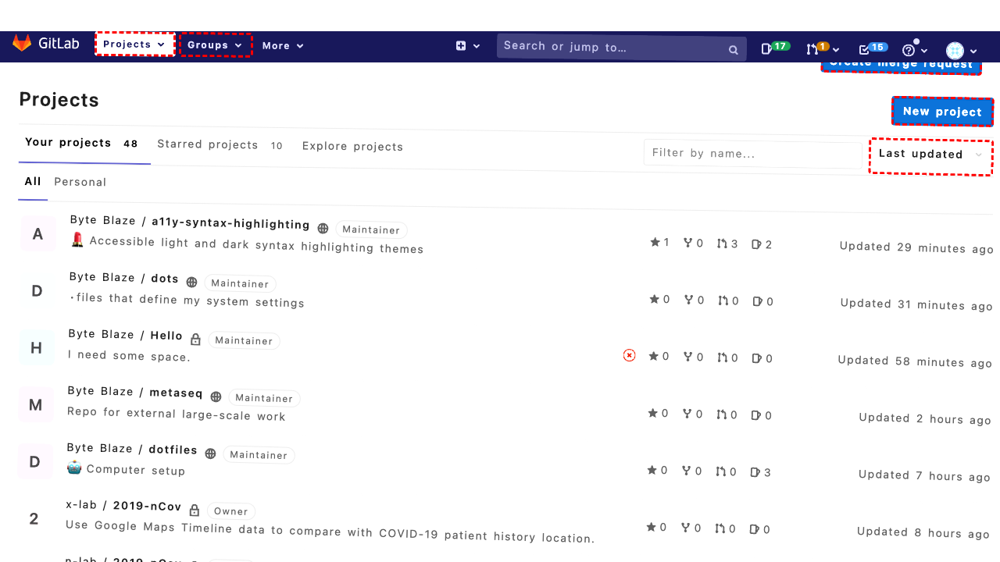
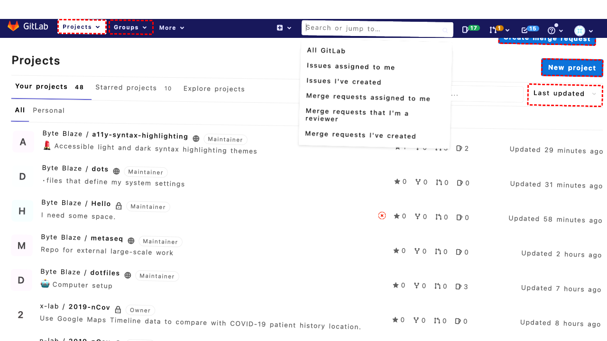
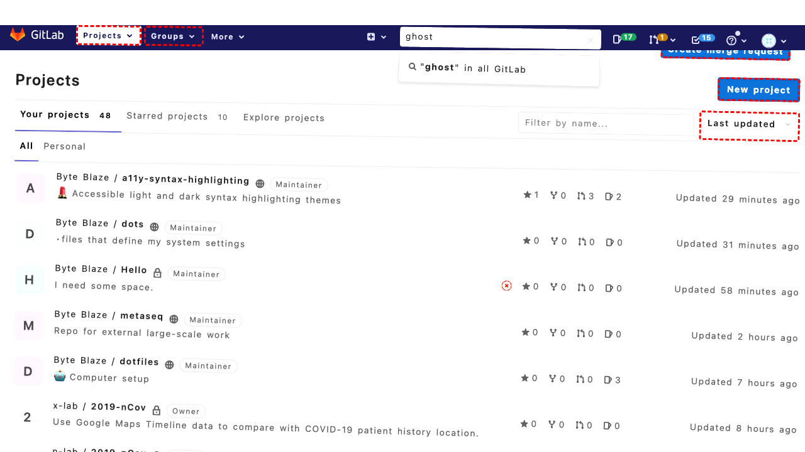
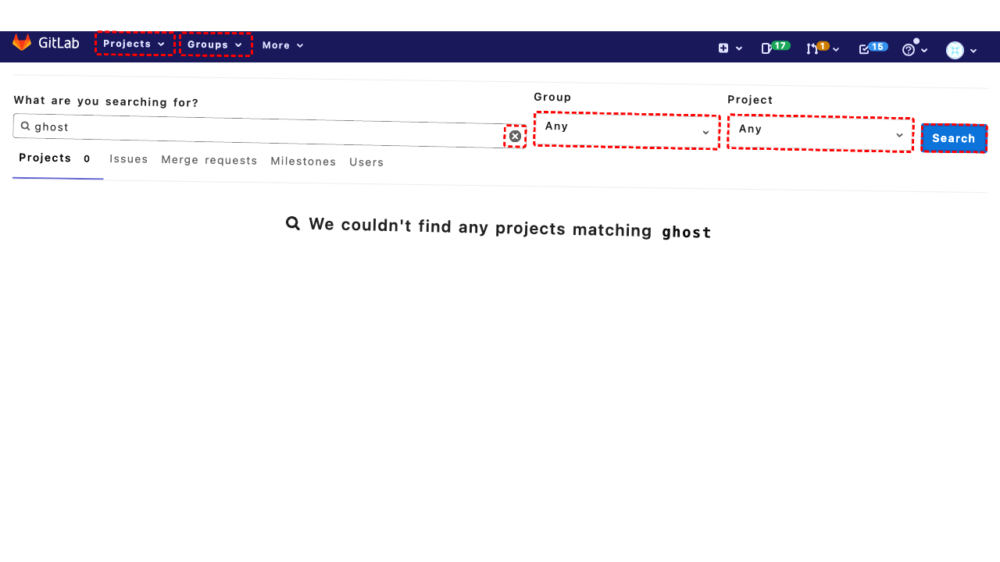
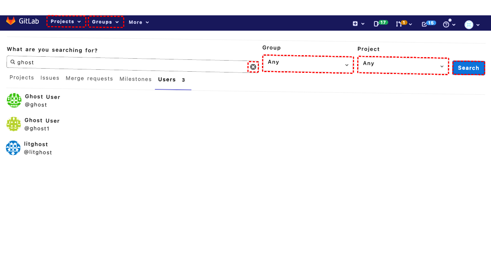
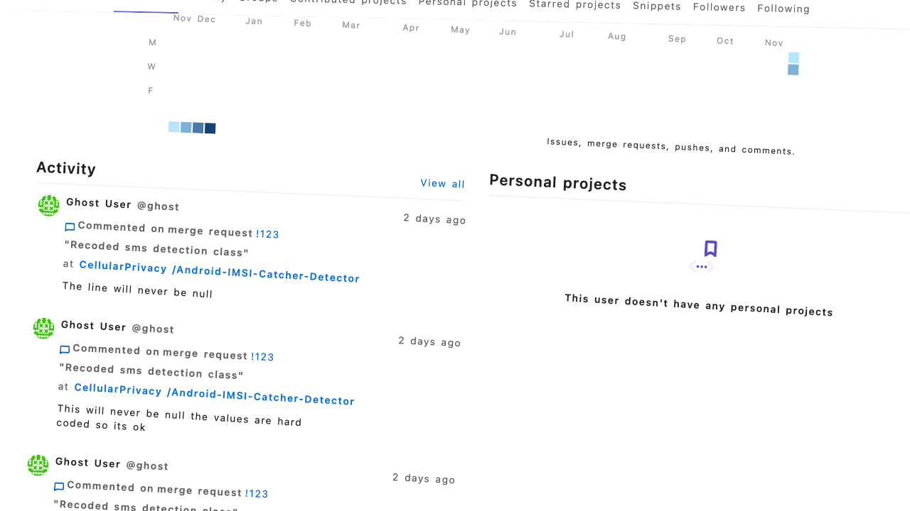
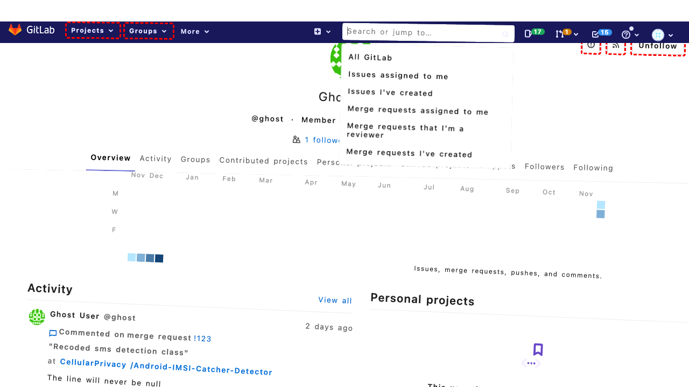

## Intent

Add the following users to my GitHub timeline item management extension as maintainer: ['abisubramanya27', 'lahwaacz']

## RM

Thoughts: The user's intent is to add two users as maintainers to a GitHub timeline item management extension, which falls under the "Content modification" task type. The action history shows that the agent successfully added 'abisubramanya27' as a maintainer (steps 4-9), but for 'lahwaacz', the agent only filled the search field (step 10) without completing the subsequent steps (selecting the user, setting the role, and adding to the project). The final state indicates the agent recognized the need to add the second user but had not yet done so, and the bot provided no response. Since the task requires both users to be added and only one was completed, the execution is incomplete and thus a failure.

Status: failure

## Final Response 

## Captions

===============Looking at the goal to add users as maintainers to a GitHub timeline item management extension, I need to first identify which repository this refers to. From the accessibility tree, I can see several repositories, but the one that matches the description appears to be "remove-board-movement-events-from-the-github-issue-timeline" which has the description about removing timeline items from GitHub's timeline.

I need to navigate to this project's member management section to add the users. Let me first click on this project link.
===============Looking at the current page, I can see I'm already on the project page for "remove-board-movement-events-from-the-github-issue-timeline" which appears to be the GitHub timeline item management extension mentioned in the goal. To add users as maintainers, I need to navigate to the project settings and then to the members management section.

From the accessibility tree, I can see there's a "Settings" link with ID '363'. Let me click that to access the project settings where I can manage members.
===============Looking at the current page, I can see I'm already in the Settings section of the project. From the accessibility tree, I can see there's a "Members" link in the settings sidebar with ID '376'. This is where I need to go to add users as maintainers to the project.

Let me click on the Members link to access the member management page.
===============Looking at the current page, I can see I'm already on the Members page for the "remove-board-movement-events-from-the-github-issue-timeline" project. The accessibility tree shows the "Invite member" tab is available with a search field for "Select members to invite" (ID '453'), a role selection combobox (ID '461'), and an "Add to project" button (ID '475').

To add the users 'abisubramanya27' and 'lahwaacz' as maintainers, I need to:
1. Search for each user in the member search field
2. Select the "Maintainer" role from the role dropdown
3. Click the "Add to project" button

Let me start by searching for the first user 'abisubramanya27'.
===============Looking at the current state, I can see that after filling 'abisubramanya27' in the search field, the accessibility tree shows that this user appears in the search results as an option with ID '570' (labeled "Abishek S @abisubramanya27").

Now I need to select this user from the search results, then set their role to "Maintainer", and finally add them to the project. Let me first select the user from the search results.
===============Looking at the current state, I can see that I've successfully searched for 'abisubramanya27' and selected them from the search results. Now I need to set their role to "Maintainer" before adding them to the project.

From the accessibility tree, I can see there's a combobox for role selection with ID '461' that currently has the value "Guest". I need to change this to "Maintainer" by clicking the combobox and selecting the "Maintainer" option.
===============Looking at the current state, I can see that I've clicked on the role selection combobox (ID '461') which is now expanded and showing the available role options including "Guest" (selected), "Reporter", "Developer", and "Maintainer".

Now I need to select the "Maintainer" option from the dropdown to assign the maintainer role to the user 'abisubramanya27' before adding them to the project.
===============Looking at the error, it seems the "Maintainer" option (ID '465') might not be visible or accessible in the current view. Let me try a different approach by using the select_option function which is designed to handle dropdown selections more reliably. The role selection combobox has ID '461' and I need to select the "Maintainer" option.
===============Looking at the current state, I can see that I've successfully:
- Searched for 'abisubramanya27' and selected them from search results
- Set their role to "Maintainer" using the select_option function

Now I need to add this user to the project by clicking the "Add to project" button. From the accessibility tree, I can see the "Add to project" button has ID '475'.
===============Looking at the current state, I can see from the accessibility tree that there's a success message "Users were successfully added." which suggests the first user 'abisubramanya27' has been successfully added as a maintainer. Now I need to add the second user 'lahwaacz' as a maintainer.

I need to repeat the same process:
1. Search for 'lahwaacz' in the member search field
2. Select them from search results
3. Set their role to "Maintainer"
4. Click "Add to project"

Let me start by searching for the second user.

## Images











## Main Prompt

```md
User Intent: Add the following users to my GitHub timeline item management extension as maintainer: ['abisubramanya27', 'lahwaacz']

Action History:
1: click('628')
2: click('363')
3: click('376')
4: fill('453', 'abisubramanya27')
5: click('570')
6: click('461')
7: click('465')
8: select_option('461', 'Maintainer')
9: click('475')
10: fill('453', 'lahwaacz')


The detailed final state of the webpage:

```md
Looking at the current state, I can see from the accessibility tree that there's a success message "Users were successfully added." which suggests the first user 'abisubramanya27' has been successfully added as a maintainer. Now I need to add the second user 'lahwaacz' as a maintainer.

I need to repeat the same process:
1. Search for 'lahwaacz' in the member search field
2. Select them from search results
3. Set their role to "Maintainer"
4. Click "Add to project"

Let me start by searching for the second user.
```

Bot response to the user: None.
```
