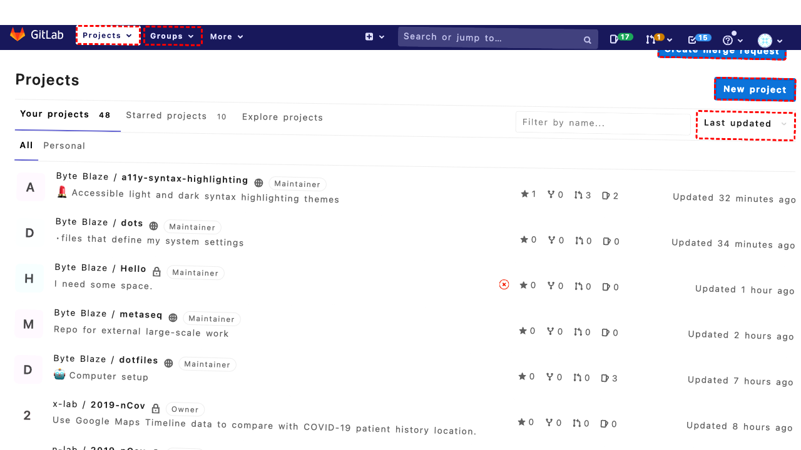
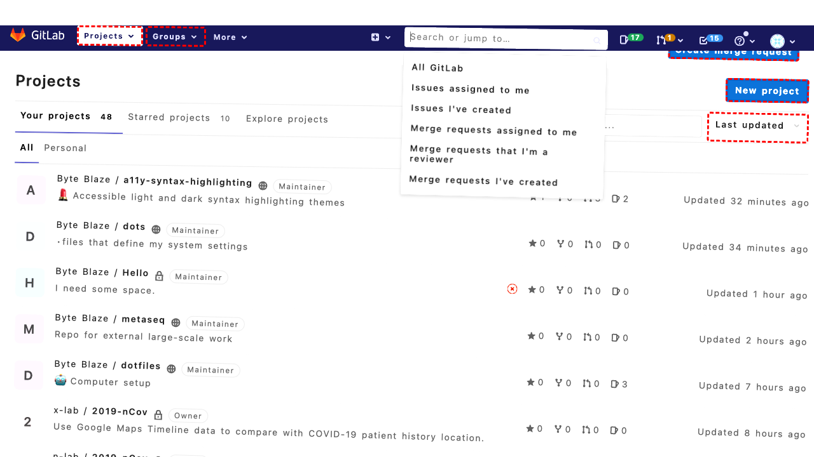
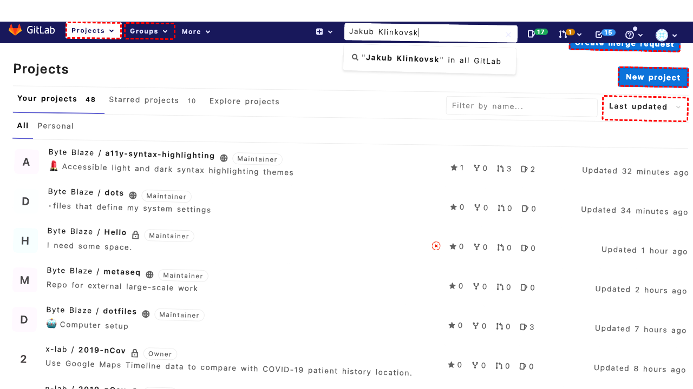
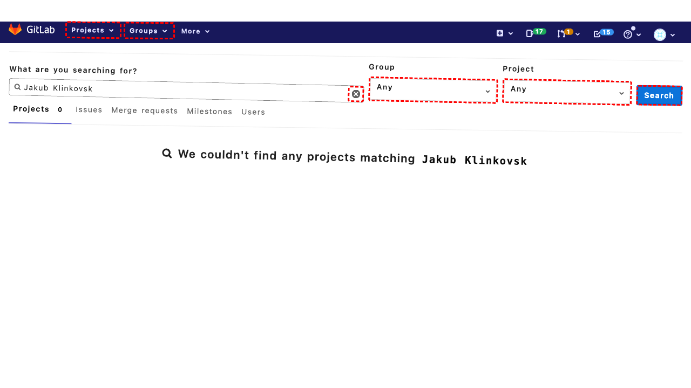
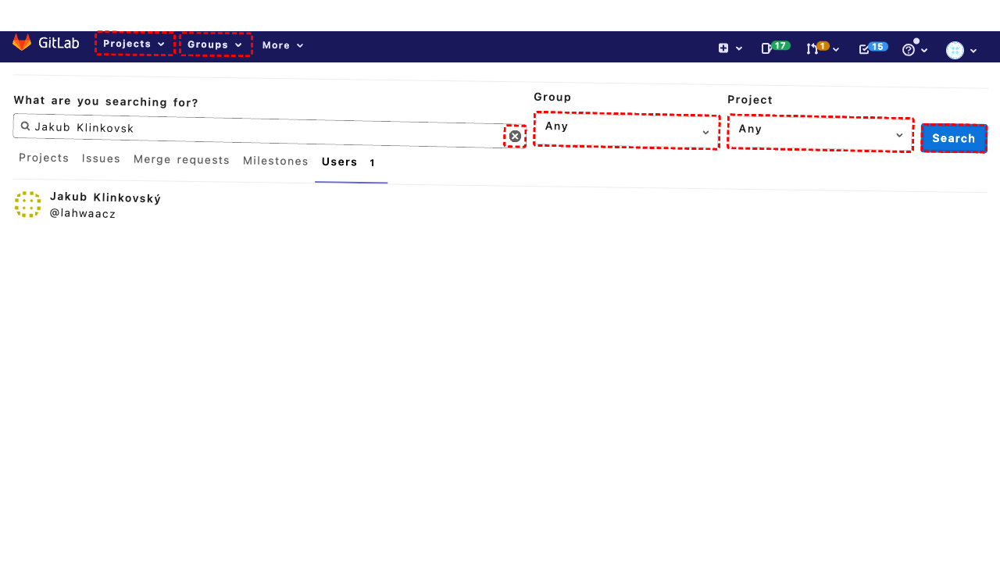
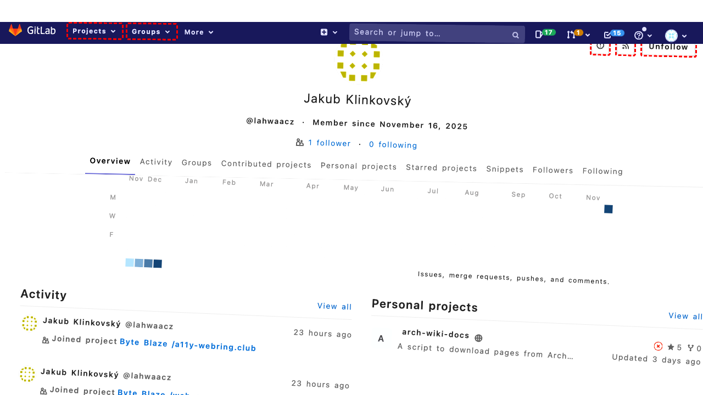
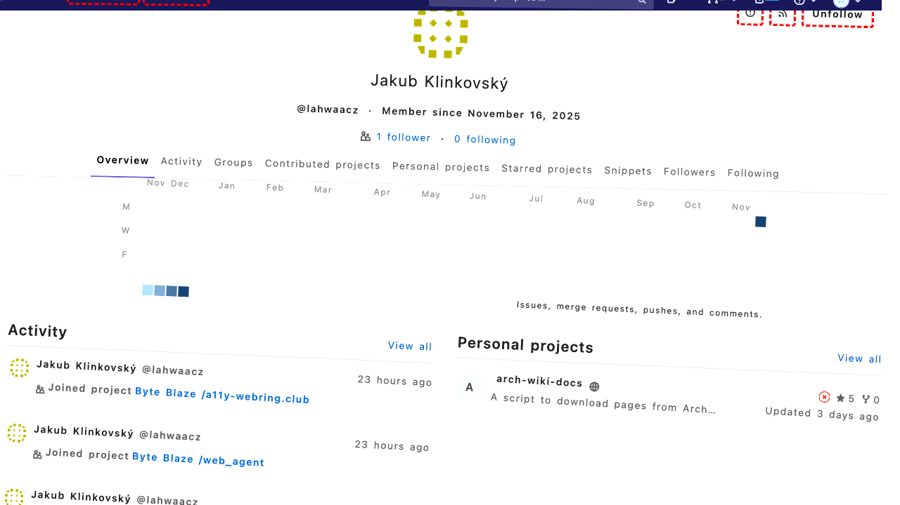
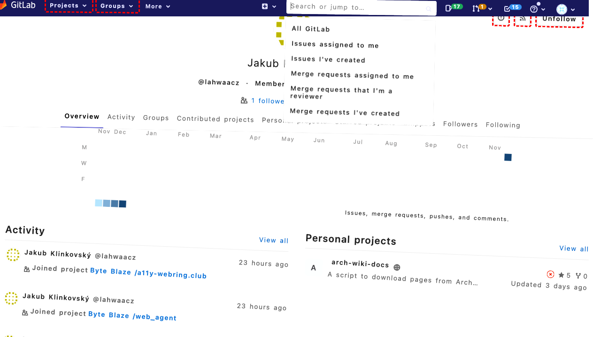

## Intent

Add the following users to repo millennials-to-snake-people as reporter: ['yjlou', 'a11yproject']

## RM

Thoughts: The user's intent is to add users 'yjlou' and 'a11yproject' as reporters to the repo 'millennials-to-snake-people'. This is a content modification task. The action history shows that the agent attempted to fill in the search field with 'yjlou' using ID '491', which is incorrect as it's a `<ul>` element, not a text input. The agent then correctly used ID '494' for 'a11yproject' but only after an error. The final state indicates the agent realized the mistake but did not complete the actions for both users successfully. Since the agent did not successfully add both users as reporters due to incorrect element usage and incomplete actions, the task fails.

Status: failure

## Final Response 

## Captions

===============Looking at the current page, I can see we're on the GitLab dashboard showing a list of projects. I need to add users 'yjlou' and 'a11yproject' as reporters to the 'millennials-to-snake-people' repository.

First, I need to navigate to the specific repository page. I can see the 'millennials-to-snake-people' repository in the project list with the link ID '826'.
===============Looking at the current page, I can see we're already on the 'millennials-to-snake-people' repository page. The accessibility tree shows we're viewing the repository details with various navigation options available. To add users as reporters, I need to navigate to the member management section where I can add users with specific roles.

I can see there's a "Settings" link in the sidebar with ID '395'. Clicking this should take me to the project settings where I can access the member management section.
===============Looking at the current page, I can see we're on the General Settings page for the 'millennials-to-snake-people' repository. To add users as reporters, I need to navigate to the Members section where user management occurs. I can see in the accessibility tree that there's a "Members" link in the Settings sidebar with ID '407'. This is where I can add users with specific roles like reporter.
===============Looking at the current page, I can see we're now on the Members page for the 'millennials-to-snake-people' repository. The accessibility tree shows the "Invite member" tab is available with a search field for selecting members, a role permission dropdown currently set to "Guest", and an "Add to project" button that is currently disabled.

To add users 'yjlou' and 'a11yproject' as reporters, I need to:
1. Search for each user in the "Select members to invite" field
2. Change the role from "Guest" to "Reporter"
3. Click the "Add to project" button

I can see the search field has ID '491', the role dropdown has ID '499', and the add button has ID '513'. I'll start by searching for the first user 'yjlou'.
===============Looking at the current state, I can see that after filling "yjlou" in the search field, the user 'yjlou' appears in the search results as an option with ID '608'. I need to select this user from the search results before proceeding to set the role and add them to the project.
===============Looking at the current state, I can see that I've successfully searched for and selected the user 'yjlou' from the search results. Now I need to change the role from the default "Guest" to "Reporter" before adding the user to the project. The role dropdown has ID '499' and is currently set to "Guest". I need to open this dropdown and select the "Reporter" option.
===============Looking at the current state, I can see that I've clicked the role dropdown (ID '499') which is now expanded and showing the available role options including "Reporter" (option ID '501'). Since the goal is to add users as reporters, I need to select the "Reporter" option from the dropdown menu.
===============Looking at the current state, I can see that I've successfully:
1. Searched for and selected user 'yjlou' from the search results
2. Changed the role from "Guest" to "Reporter" using the dropdown

Now I need to click the "Add to project" button to actually add 'yjlou' as a reporter to the repository. The add button has ID '513' as shown in the accessibility tree.
===============Looking at the current state, I can see that user 'yjlou' has been successfully added as a reporter to the repository (shown in the "Existing members and groups" section with "Reporter" role and "just now" timestamp). Now I need to add the second user 'a11yproject' as a reporter.

I need to repeat the same process: search for 'a11yproject' in the member search field, select them from results, ensure the role is set to "Reporter", and add them to the project. The search field still has ID '491'.
===============Looking at the error message, I see that the element with ID '491' is actually a `<ul>` (unordered list) element, not a text input field. This means I was using the wrong ID for the search field.

Looking back at the accessibility tree, I can see that the actual search textbox has ID '494' with the description "Select members to invite" and value "Search for members to update or invite". This is the correct element to use for searching for users.

Let me use the correct ID for the search field to search for 'a11yproject'.

## Images











## Main Prompt

```md
User Intent: Add the following users to repo millennials-to-snake-people as reporter: ['yjlou', 'a11yproject']

Action History:
1: click("826")
2: click("395")
3: click("407")
4: fill("491", "yjlou")
5: click("608")
6: click("499")
7: select_option("499", "Reporter")
8: click("513")
9: fill("491", "a11yproject")
10: fill("494", "a11yproject")


The detailed final state of the webpage:

```md
Looking at the error message, I see that the element with ID '491' is actually a `<ul>` (unordered list) element, not a text input field. This means I was using the wrong ID for the search field.

Looking back at the accessibility tree, I can see that the actual search textbox has ID '494' with the description "Select members to invite" and value "Search for members to update or invite". This is the correct element to use for searching for users.

Let me use the correct ID for the search field to search for 'a11yproject'.
```

Bot response to the user: None.
```
