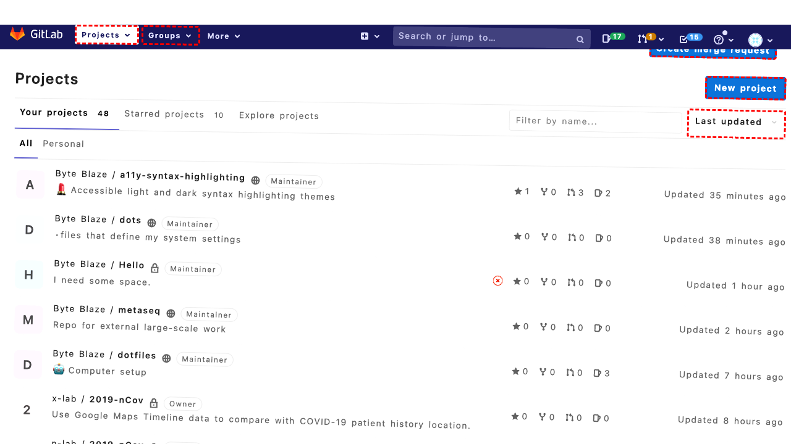
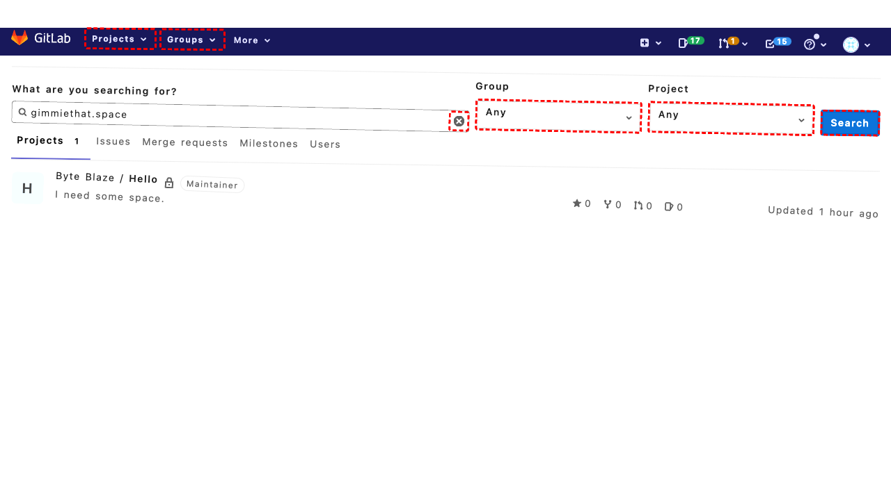
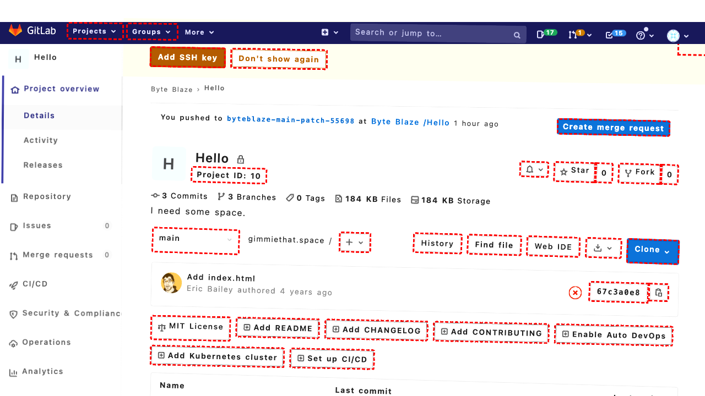
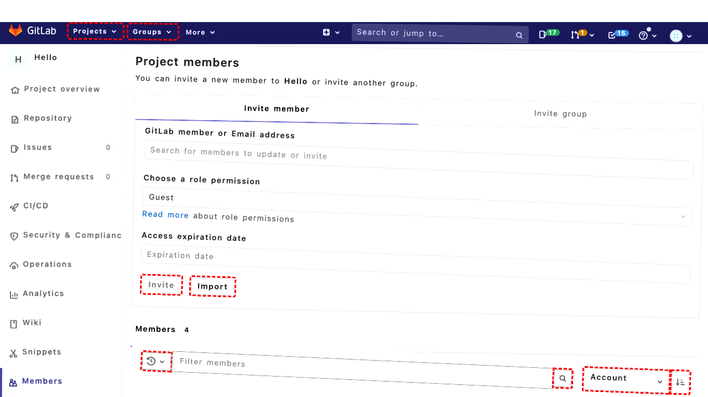

## Intent

Create an orders report from beginning of May 2021 to end of March 2022

## RM

Thoughts: The user's intent is to create an orders report from the beginning of May 2021 to the end of March 2022. This is a content modification task (specifically, generating and exporting a report). The action history shows the agent setting the period to "Month", filling the start date as "05/01/2021" and end date as "03/31/2022", then clicking to generate and export the report. The final state indicates the date filters were set and the export was triggered. The bot's response confirms the report was generated and exported as CSV. All actions align with the task requirements, and the final state supports successful completion.

Status: success

## Final Response "I have successfully created the orders report for May 1, 2021 to March 31, 2022. The report has been generated with monthly period and exported as a CSV file."

## Captions

===============Looking at the goal: "Create an orders report from beginning of May 2021 to end of March 2022". This is a reporting task that likely involves navigating to the Reports section, specifically Sales > Orders report, and then setting a date filter.

From the current page (Dashboard), I can see the navigation menu includes "Reports" with submenus including "Sales" and then "Orders". I need to navigate to that report page first.

I'll expand the Reports menu, then Sales, then click Orders.

First, I'll hover over the Reports menu (bid '211') to expand it, then click the Sales submenu (bid '215'), then click the Orders report link (bid '219').

Let me do this step by step.
===============Looking at the accessibility tree, I can see that after clicking '211' (Reports menu), the submenu should now be expanded. I need to click on the "Sales" submenu (bid '215') to further expand it, then click on the "Orders" report link (bid '219').
===============Looking at the accessibility tree, after clicking '215' (Sales submenu under Reports), I can see that the "Orders" link (bid '219') is now visible in the expanded menu. I need to click on it to navigate to the Orders report page.
===============Looking at the current page, I can see I'm now on the "Total Ordered Report" page (Orders report). The goal is to create an orders report from beginning of May 2021 to end of March 2022. I need to set the date filters accordingly.

From the accessibility tree, I can see the filter section with:
- "Period" dropdown (bid '499') currently set to "Day"
- "From *" date field (bid '508')
- "To *" date field (bid '516')
- "Show Report" button (bid '456')

I need to:
1. Set the period to "Month" since we want a monthly report from May 2021 to March 2022
2. Enter the start date: 05/01/2021 (beginning of May 2021)
3. Enter the end date: 03/31/2022 (end of March 2022)
4. Click "Show Report" to generate the report

Let me start by changing the period to "Month":
===============Looking at the current state, I've successfully navigated to the Orders report page and set the date filters for May 1, 2021 to March 31, 2022 with the period set to Month. The report should now be generated. The goal is to "create an orders report" which typically means exporting the data. I can see there's an "Export to:" section with a dropdown (bid '568') set to "CSV" and an "Export" button (bid '571'). To create the report, I should export it in CSV format.
===============Looking at the current state, I've successfully set the date filters and generated the report. The "Export" button has been clicked, which should trigger a CSV download. The goal was to "create an orders report from beginning of May 2021 to end of March 2022" - this has been accomplished by generating and exporting the report with the specified date range.

I should now confirm to the user that the report has been created and exported.

## Images







## Main Prompt

```md
User Intent: Create an orders report from beginning of May 2021 to end of March 2022

Action History:
1: click('211')
2: click('215')
3: click('219')
4: click('499')
5: select_option('499', 'Month')
6: fill('508', '05/01/2021')
7: fill('516', '03/31/2022')
8: click('456')
9: click('571')
10: send_msg_to_user("I have successfully created the orders report for May 1, 2021 to March 31, 2022. The report has been generated with monthly period and exported as a CSV file.")


The detailed final state of the webpage:

```md
Looking at the current state, I've successfully set the date filters and generated the report. The "Export" button has been clicked, which should trigger a CSV download. The goal was to "create an orders report from beginning of May 2021 to end of March 2022" - this has been accomplished by generating and exporting the report with the specified date range.

I should now confirm to the user that the report has been created and exported.
```

Bot response to the user: "I have successfully created the orders report for May 1, 2021 to March 31, 2022. The report has been generated with monthly period and exported as a CSV file.".
```
