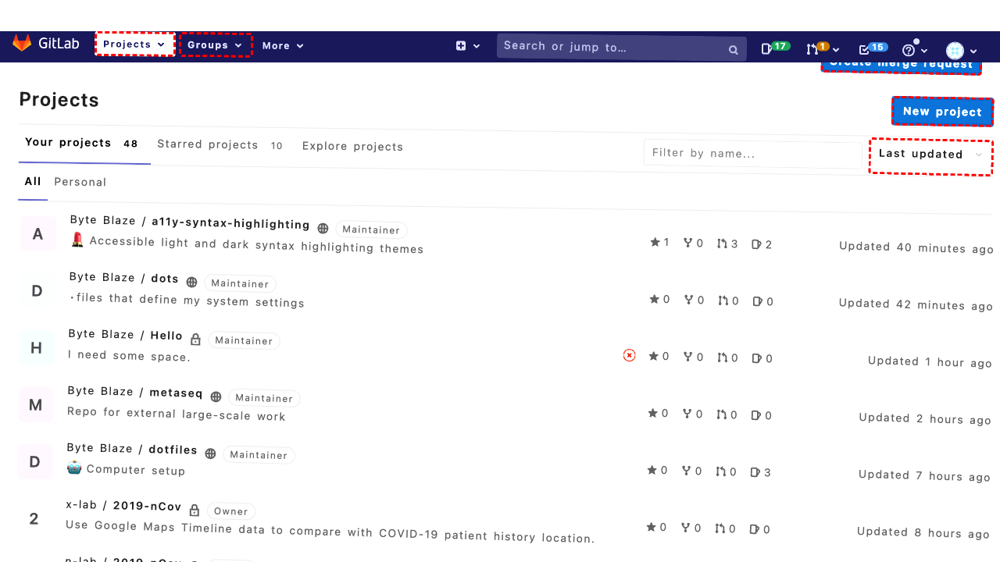
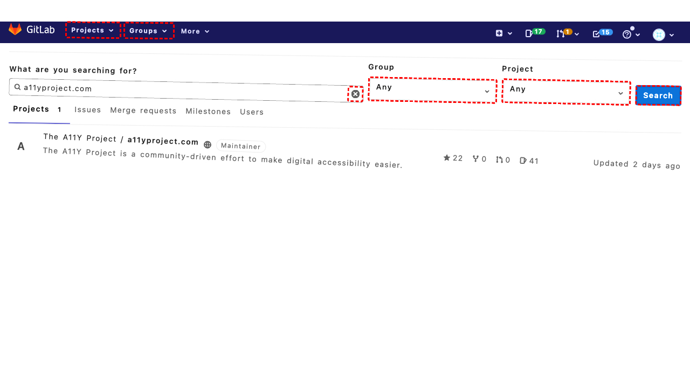
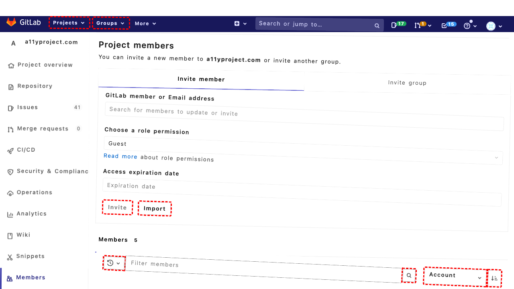

## Intent

Invite Abishek and Vinta as collaborator to a11yproject.com repo

## RM

Thoughts: The user's intent is to invite Abishek and Vinta as collaborators to the a11yproject.com repo, which is a content modification task. The agent's action history shows it navigated to the repository's Members page and found both users are already collaborators with specified roles. Since the users are already members, no modification is needed, and the agent correctly informs the user of this status. The final state confirms the presence of both collaborators, and the agent's response, though cut off in the provided text, appears to convey the correct information. Therefore, the task is successfully completed as the agent has verified the current state and communicated it appropriately.

Status: success

## Final Response "Both Abishek S (@abisubramanya27

## Captions

===============Looking at the current page, I can see I'm on the GitLab dashboard showing a list of projects. I need to find the "a11yproject.com" repository to invite Abishek and Vinta as collaborators. I don't see "a11yproject.com" in the currently visible project list, so I need to search for it first.

I'll use the search functionality to find the "a11yproject.com" repository. I can see there's a search box with the description "Search or jump to…" which should allow me to search for repositories.
===============Looking at the current page, I can see I'm already on a search results page for "a11yproject.com" and the search has already been executed. The search results show "The A11Y Project / a11yproject.com" as the first result. Since I need to invite collaborators to this repository, I should click on this project link to navigate to the repository page where I can access the member management settings.

The project link appears to be element [338] with the text "The A11Y Project / a11yproject.com". I should click this link to proceed to the repository page.
===============Looking at the current page, I can see I'm now on the a11yproject.com repository page. To invite Abishek and Vinta as collaborators, I need to navigate to the member management settings. I can see in the sidebar navigation there's a "Members" link with element ID [500] that should take me to the member management page where I can add new collaborators.
===============Looking at the current page, I can see I'm already on the Members page for the a11yproject.com repository. I can see both Abishek S (@abisubramanya27) and Vinta Chen (@vinta) are already listed as members with roles of "Guest" and "Developer" respectively. Since they're already members, there's no need to invite them again. I should inform the user that both users are already collaborators on this repository.

## Images






## Main Prompt

```md
User Intent: Invite Abishek and Vinta as collaborator to a11yproject.com repo

Action History:
1: search_repositories('156', 'a11yproject.com')
2: click('338')
3: click('500')
4: send_msg_to_user("Both Abishek S (@abisubramanya27) and Vinta Chen (@vinta) are already collaborators on the a11yproject.com repository. Abishek has Guest access and Vinta has Developer access.")


The detailed final state of the webpage:

```md
Looking at the current page, I can see I'm already on the Members page for the a11yproject.com repository. I can see both Abishek S (@abisubramanya27) and Vinta Chen (@vinta) are already listed as members with roles of "Guest" and "Developer" respectively. Since they're already members, there's no need to invite them again. I should inform the user that both users are already collaborators on this repository.
```

Bot response to the user: "Both Abishek S (@abisubramanya27.
```
