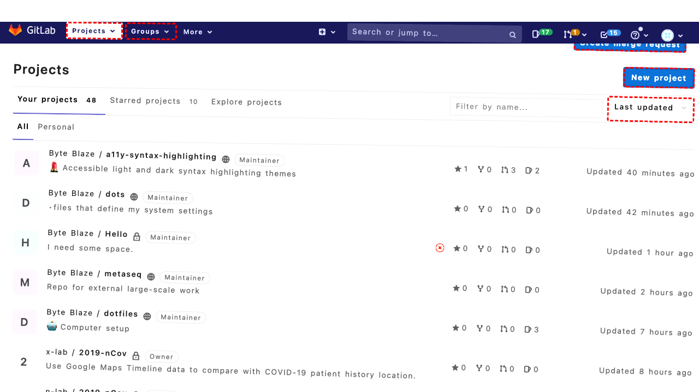
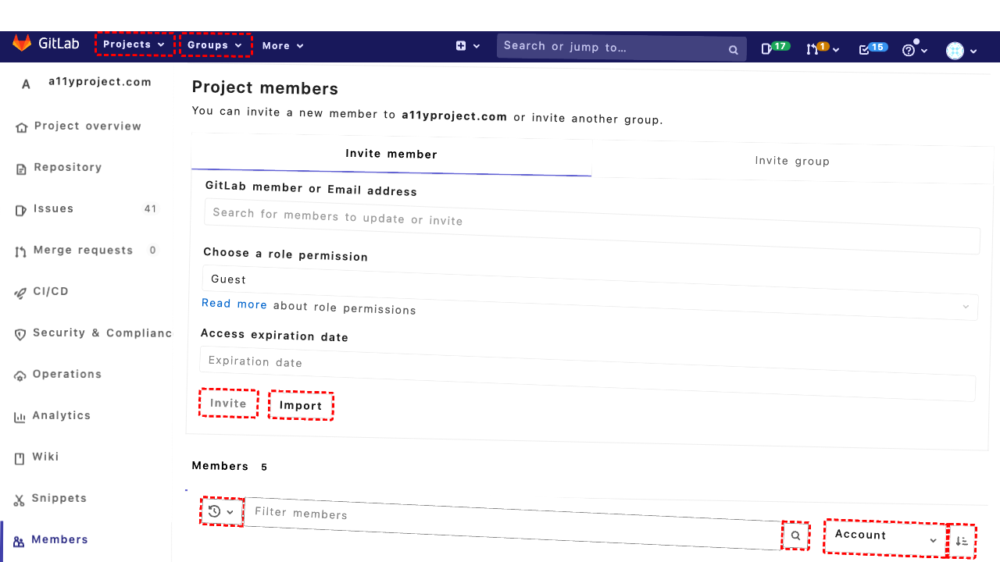

## Intent

Create a shipping report from 08/05/2022 to 03/01/2023

## RM

Thoughts: The user's intent is to create a shipping report from 08/05/2022 to 03/01/2023. The action history shows the agent performed clicks and filled date fields, but the final state indicates only the "From" date field has been filled, and the agent is about to fill the "To" date field. The bot response is "None," meaning no completion message or report generation is indicated. The task likely involves submitting the form or generating the report after filling the dates, but the actions stop at filling the second date. There's no evidence of submitting or creating the report. Therefore, the task is incomplete and unsuccessful.

Status: failure

## Final Response 

## Captions

===============I need to generate a shipping report from 08/05/2022 to 03/01/2023. Looking at the action trajectories, I see a pattern for generating reports: expand the Reports menu, then Sales submenu, then click the specific report link, fill date fields, and click generate. For shipping report specifically, I need to navigate to the Shipping report under Reports > Sales > Shipping.

From the current page accessibility tree, I can see:
- Reports menu is at [211] link 'Reports'
- Under it, [215] link 'Sales' expands the Sales submenu
- Under that, [228] link 'Shipping' should be the shipping report link

So the steps are:
1. Click Reports menu to expand
2. Click Sales submenu to expand
3. Click Shipping report link
4. Fill start date (08/05/2022) and end date (03/01/2023)
5. Click generate button

Let me start by expanding the Reports menu.
===============Looking at the current state, I've clicked the Reports menu (bid 211). Now I need to expand the Sales submenu to access the Shipping report. In the accessibility tree, I can see that after clicking Reports, the Sales submenu should be available at [215] link 'Sales'. I'll click that to expand it.
===============Looking at the current state after expanding the Reports and Sales menus, I can see in the accessibility tree that the Shipping report link is at [228] link 'Shipping'. I need to click that to navigate to the shipping report page where I can set the date range.
===============Looking at the current page, I can see I'm already on the Shipping report page (URL: http://dockerized-magento.local/index.php/admin/report_sales/shipping/). The page shows "Total Shipped Report" as a heading and has filter controls including date fields. I need to set the date range from 08/05/2022 to 03/01/2023 and generate the report.

From the accessibility tree, I can see:
- "From *" date field at [506] textbox 'From *'
- "To *" date field at [514] textbox 'To *'
- There's also a "Show Report" button at [456] button 'Show Report'

I need to fill the start date (08/05/2022) in the "From" field and end date (03/01/2023) in the "To" field, then click the "Show Report" button.

Let me fill the start date first.
===============Looking at the current state, I've filled the "From" date field with 08/05/2022. Now I need to fill the "To" date field with 03/01/2023. In the accessibility tree, the "To" date field is at [514] textbox 'To *'. I'll fill that now.

## Images






## Main Prompt

```md
User Intent: Create a shipping report from 08/05/2022 to 03/01/2023

Action History:
1: click("211")
2: click("215")
3: click("228")
4: fill("506", "08/05/2022")
5: fill("514", "03/01/2023")


The detailed final state of the webpage:

```md
Looking at the current state, I've filled the "From" date field with 08/05/2022. Now I need to fill the "To" date field with 03/01/2023. In the accessibility tree, the "To" date field is at [514] textbox 'To *'. I'll fill that now.
```

Bot response to the user: None.
```
