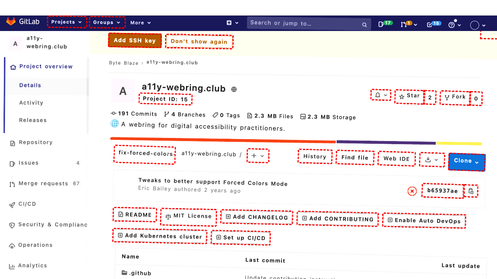
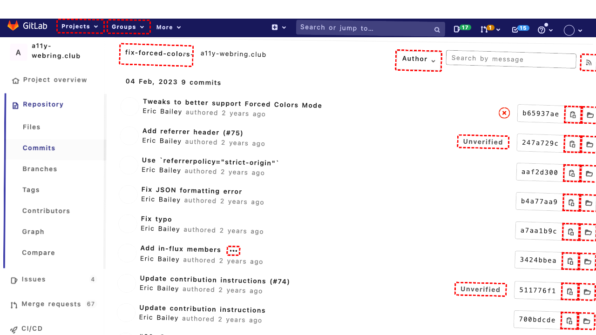
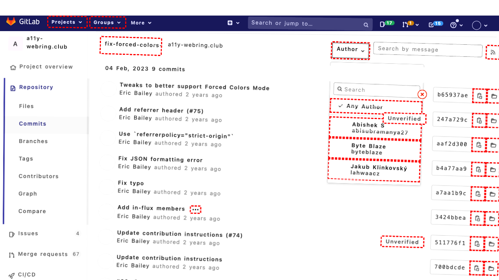
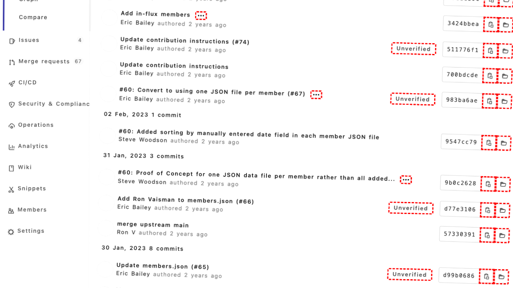
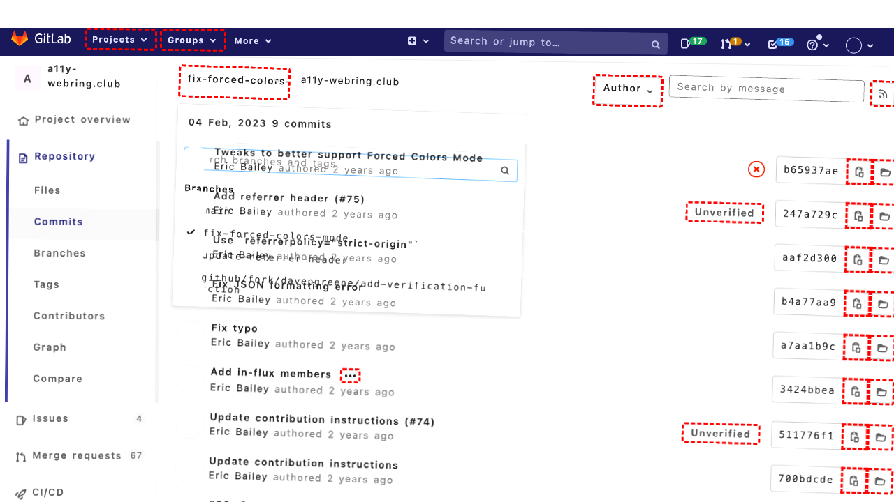
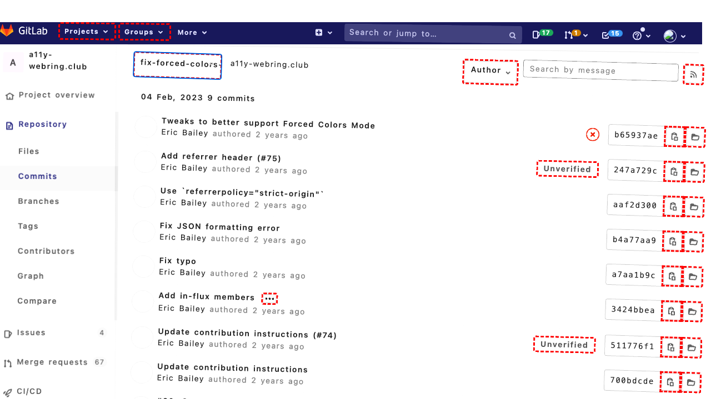
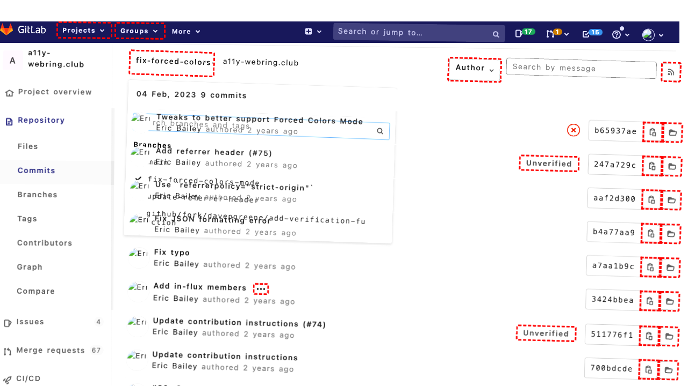
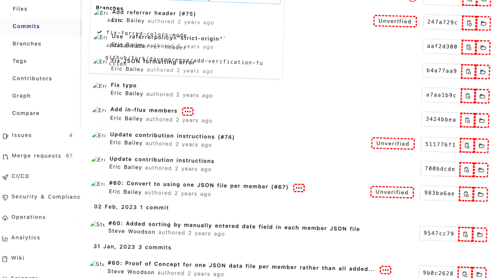

## Intent

How many commits did Eric and Kilian make to a11yproject on 1/3/2023?

## RM

Thoughts: This is an information seeking task where the user wants to know the number of commits by Eric and Kilian on a specific date. The agent's action history shows it navigated to the correct date (1/3/2023) using a date filter and then examined the commits. The final state of the webpage confirms that there is 1 commit by Eric and 0 by Kilian on that date, which matches the agent's response to the user. The agent's actions were sufficient to locate and count the relevant commits, and the response accurately provides the requested information.

Status: "success"

## Final Response "On 1/3/2023, Eric made 1 commit and Kilian made 0 commits to the a11yproject repository."

## Captions

===============Looking at the current page, I can see the GitLab dashboard with a list of projects. I need to find the a11yproject repository and then navigate to its commit history to count commits by Eric and Kilian on 1/3/2023.

I can see "The A11Y Project / a11yproject.com" listed in the projects. I should click on this project link to navigate to its repository page where I can access the commit history.
===============Looking at the accessibility tree, I can see I'm currently on the a11yproject.com repository page. I need to navigate to the commit history to find commits by Eric and Kilian on 1/3/2023. I can see there's a "History" link available that should take me to the commit history for this repository.
===============Looking at the current page, I can see I'm on the commits page for the "add-color-utility-classes" branch of the a11yproject.com repository. The commits shown are from 2020 (5 years ago), which is much earlier than the target date of 1/3/2023.

I need to navigate to a view that shows commits from 2023. Since I'm currently viewing commits for a specific branch, I should first navigate to the main repository commits page where I can see all commits across branches and potentially filter by date.

I can see there's a branch selector button labeled "add-color-utility-classes" that I can click to change branches or view all commits.
===============Looking at the current state, I can see I've opened the branch selector dropdown. The commits currently displayed are from 2020, which is not the target date of 1/3/2023. I need to switch to a branch that would contain commits from 2023, likely the main branch. I can see "main" is listed as one of the available branches in the dropdown.
===============Looking at the error message, I can see that the click on the "main" branch link is being intercepted by other elements on the page. The commits currently displayed are from 2020, which is not the target date of 1/3/2023.

Since I'm having trouble clicking the branch selector, I should try a different approach. I notice there's a search box labeled "Filter by commit message" (bid 500) that might allow me to search for commits by date or author. Let me try using this search functionality to find commits from 2023.
===============Looking at the current state, I can see that I've already filled the search box with "2023-01-03" and the page appears to be filtering commits. However, I don't see any commit information displayed in the accessibility tree, which suggests there might not be any commits matching this exact date, or the page is still loading.

Since the goal is to count commits by Eric and Kilian specifically on 1/3/2023, I should first verify if any commits are displayed after the search. If no commits appear, it's possible there were no commits by anyone on that date. However, I should also check if I need to press Enter to execute the search or if the search happens automatically.

Let me press Enter to ensure the search is executed:
===============Looking at the current state, I can see that the search box (bid 500) already has "2023-01-03" filled in, and I've pressed Enter to execute the search. The accessibility tree doesn't show any commit information after the search, which suggests there might be no commits matching this exact date in the current branch.

Since I'm currently viewing the "add-color-utility-classes" branch and the commits shown are from 2020, I should try switching to the main branch where more recent commits might be located. I can see the branch selector button (bid 477) is available, so let me click it again to access the branch dropdown.
===============Looking at the current situation, I can see that I'm still on the "add-color-utility-classes" branch which only has commits from 2020. The search for "2023-01-03" didn't yield any results in this branch. I need to switch to the main branch where more recent commits are likely to be located.

I can see the branch selector dropdown is open (bid 477 shows "expanded=True"), and I can see "main" listed as an available branch option (bid 513). Let me click on the main branch link to switch to it.
===============Looking at the current state, I can see I've successfully switched to the main branch and now I'm viewing commits from 2023. The accessibility tree shows multiple commit groups with dates like "14 Mar, 2023", "12 Mar, 2023", "07 Mar, 2023", etc. I need to find commits specifically from "03 Jan, 2023" (1/3/2023) and count those made by Eric and Kilian.

Scrolling through the accessibility tree, I can see there's a section for "03 Jan, 2023" (bid 1401-1403) that shows "1 commit". Let me examine this section to see who made this commit and count it if it's by Eric or Kilian.

Looking at the commit details under "03 Jan, 2023" (bid 1404-1408), I can see it's a commit by Eric Bailey with the message "Add resource (#1496)". This means Eric made 1 commit on 1/3/2023.

Now I need to check if Kilian made any commits on this date. Looking through all the visible commit dates in the accessibility tree, I can see Kilian's commits are listed under "05 Mar, 2023" but there are no commits by Kilian on "03 Jan, 2023".

Based on my analysis of the visible commits, Eric made 1 commit and Kilian made 0 commits on 1/3/2023.

## Images











## Main Prompt

```md
User Intent: How many commits did Eric and Kilian make to a11yproject on 1/3/2023?

Action History:
1: click("290")
2: click("657")
3: click("477")
4: click("1466")
5: fill("500", "2023-01-03")
6: keyboard_press("Enter")
7: click("477")
8: click("513")
9: send_msg_to_user("On 1/3/2023, Eric made 1 commit and Kilian made 0 commits to the a11yproject repository.")


The detailed final state of the webpage:

```md
Looking at the current state, I can see I've successfully switched to the main branch and now I'm viewing commits from 2023. The accessibility tree shows multiple commit groups with dates like "14 Mar, 2023", "12 Mar, 2023", "07 Mar, 2023", etc. I need to find commits specifically from "03 Jan, 2023" (1/3/2023) and count those made by Eric and Kilian.

Scrolling through the accessibility tree, I can see there's a section for "03 Jan, 2023" (bid 1401-1403) that shows "1 commit". Let me examine this section to see who made this commit and count it if it's by Eric or Kilian.

Looking at the commit details under "03 Jan, 2023" (bid 1404-1408), I can see it's a commit by Eric Bailey with the message "Add resource (#1496)". This means Eric made 1 commit on 1/3/2023.

Now I need to check if Kilian made any commits on this date. Looking through all the visible commit dates in the accessibility tree, I can see Kilian's commits are listed under "05 Mar, 2023" but there are no commits by Kilian on "03 Jan, 2023".

Based on my analysis of the visible commits, Eric made 1 commit and Kilian made 0 commits on 1/3/2023.
```

Bot response to the user: "On 1/3/2023, Eric made 1 commit and Kilian made 0 commits to the a11yproject repository.".
```
