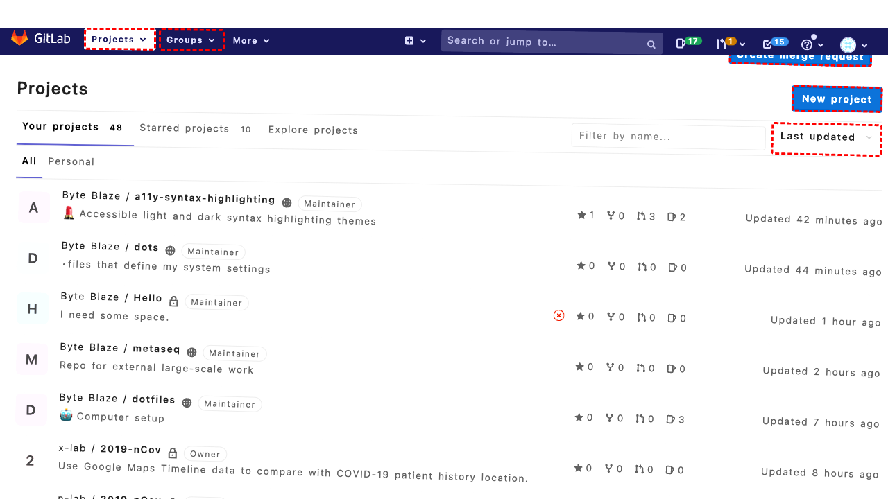
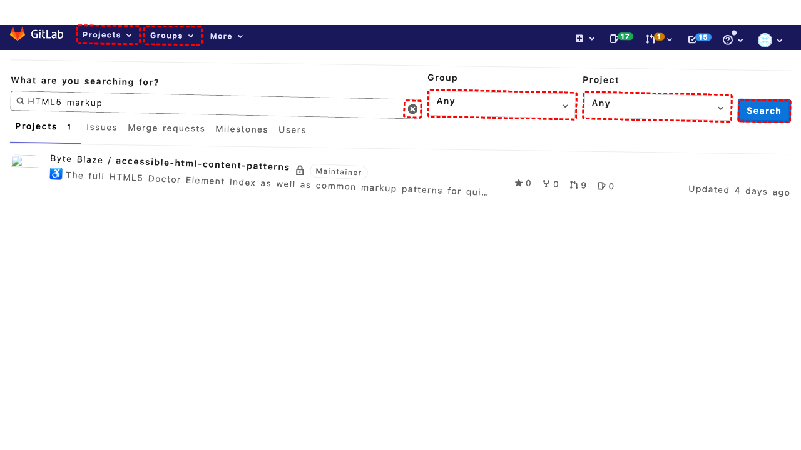
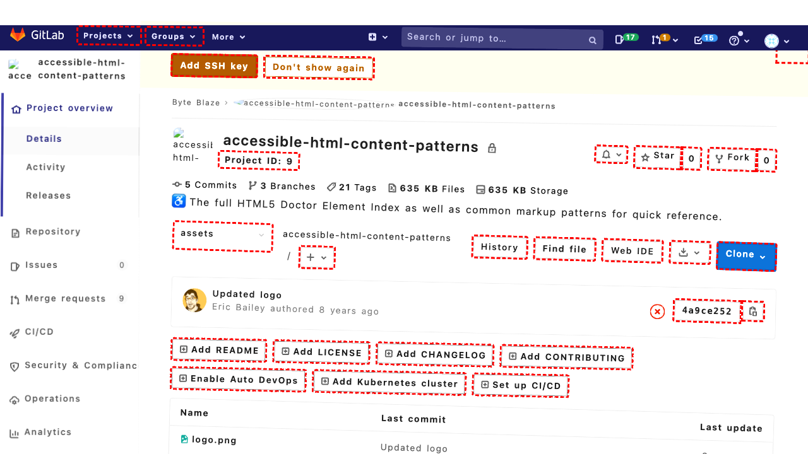
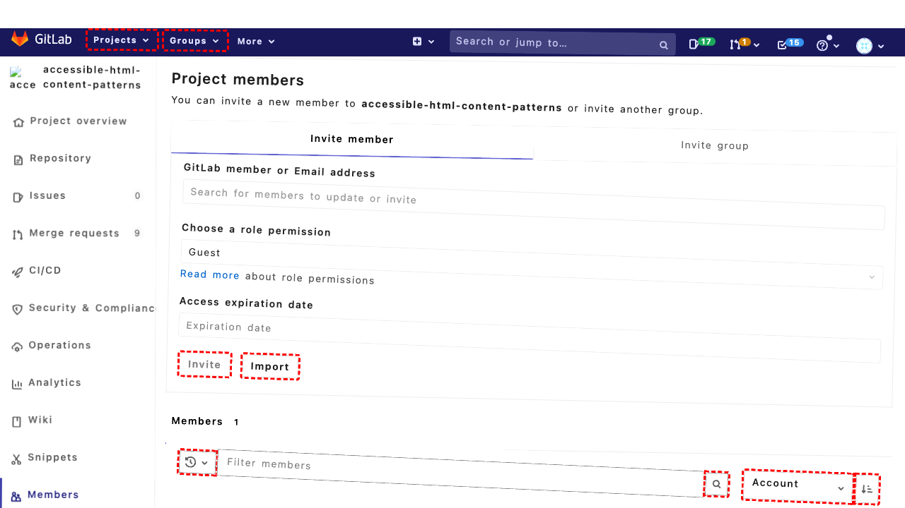
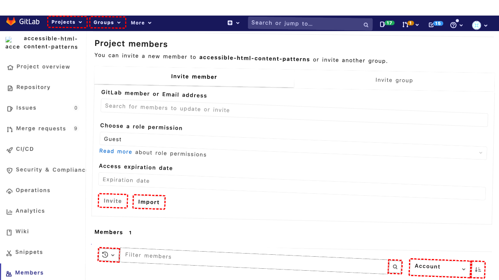
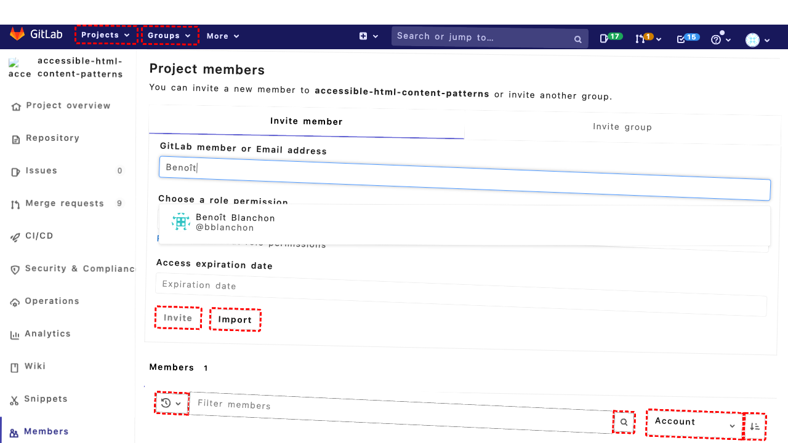
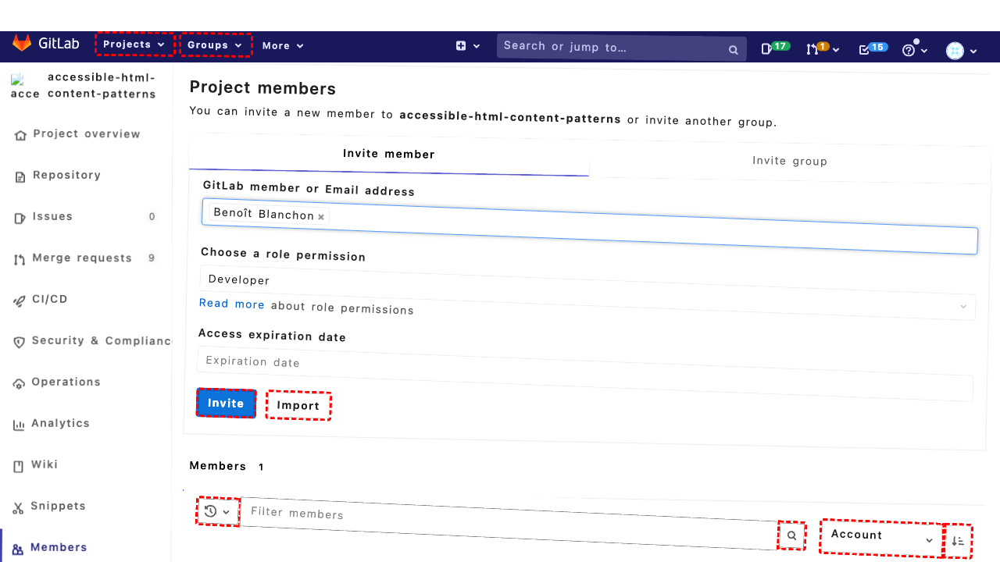
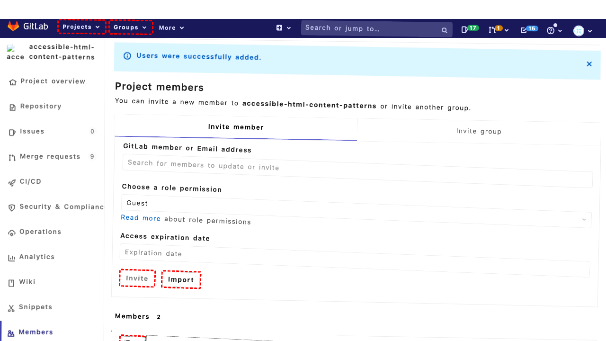
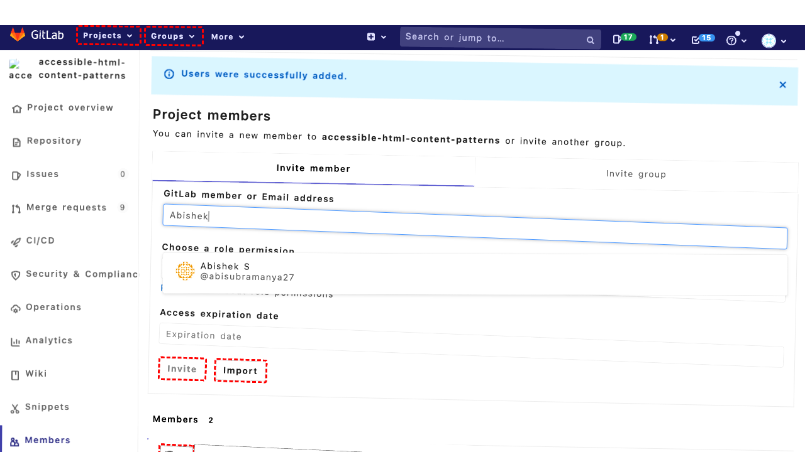

## Intent

Invite Benoît and Abishek as collaborator to my HTML5 markup extention repo

## RM

Thoughts: The user's intent is to invite two collaborators (Benoît and Abishek) to a repository, which is a content modification task. The action history shows that the agent attempted to fill in names and select roles, but there is a critical error: for "Benoît", the agent filled bid "604" (which is a label, not the input field) and then clicked "787" (likely an "Invite" or similar button), but without using the correct input field (bid "609"), the invitation for Benoît likely failed. For "Abishek", the agent correctly filled bid "609" but did not complete the role selection or invitation step (no click after filling). The final state indicates the agent recognized the error but did not correct it in the actions taken. Since the task requires both collaborators to be invited and the actions are incomplete/incorrect, the execution fails.

Status: failure

## Final Response 

## Captions

===============Looking at the current page, I can see I'm on the GitLab dashboard showing a list of projects. I need to find the "HTML5 markup extension" repository to invite collaborators. Let me first search for this specific repository.

I can see there's a search box available with bid 156 (labeled "Search or jump to…"). I'll use this to search for the HTML5 markup extension repository.
===============Looking at the current page, I can see that my previous search for "HTML5 markup" has already been executed and is showing results. The search results include a project called "Byte Blaze / accessible-html-content-patterns" which appears to be the HTML5 markup repository I'm looking for based on the description mentioning "The full HTML5 Doctor Element Index as well as common markup patterns for quick reference."

I should click on this repository link to navigate to its main page where I can access the member management settings to invite collaborators.
===============Looking at the current page, I can see I'm now on the repository page for "accessible-html-content-patterns" which matches the HTML5 markup extension repository mentioned in the goal. To invite collaborators Benoît and Abishek, I need to navigate to the member management settings.

From the accessibility tree, I can see there's a "Members" link in the project navigation sidebar with bid 500. This is where I can manage project members and invite collaborators.
===============Looking at the current page, I can see I'm already on the Members page for the "accessible-html-content-patterns" repository. The page shows the "Invite member" tab is available but not currently selected. I need to click on the "Invite member" tab to access the form where I can invite Benoît and Abishek as collaborators.

From the accessibility tree, I can see the "Invite member" tab has bid 588. I'll click this to access the invitation form.
===============Looking at the current page state, I can see I'm on the Members page with the "Invite member" tab already selected (it shows as "focused, selected=True" in the accessibility tree). The invitation form is visible with a search box for "GitLab member or Email address" (bid 604), a role dropdown (bid 612), and an "Invite" button (bid 626) that is currently disabled.

I need to invite both Benoît and Abishek. I'll start by searching for Benoît in the member search box and assigning a role. Since the goal is to add them as collaborators, I should choose an appropriate role like "Developer" or "Reporter" depending on their needs.
===============Looking at the current page state, I can see that I've already entered "Benoît" in the search box (bid 604), and the accessibility tree shows an autocomplete menu with an option for "Benoît Blanchon @bblanchon" (bid 787). This appears to be the correct user I need to invite. I should select this user from the autocomplete menu to proceed with the invitation.
===============Looking at the current state, I can see that I successfully selected Benoît Blanchon from the autocomplete menu. Now I need to assign a role to Benoît before inviting him. The role dropdown (bid 612) is currently set to "Guest" but for a collaborator, I should choose a more appropriate role like "Developer" or "Reporter". Since they're being invited as collaborators, "Developer" would be appropriate as it allows them to contribute code.
===============Looking at the current state, I can see that I've successfully selected Benoît Blanchon and set his role to "Developer". Now I need to actually invite him by clicking the "Invite" button. The accessibility tree shows the "Invite" button has bid 626, and it should now be enabled since I've selected both a user and a role.
===============Looking at the current state, I can see that Benoît Blanchon has been successfully added as a collaborator with the Developer role - the page shows a success message "Users were successfully added." and Benoît now appears in the members list. Now I need to invite the second collaborator, Abishek. I should use the same invitation form to search for and add Abishek.

The invitation form is still available, so I'll search for Abishek in the same search box (bid 604).
===============Looking at the error message, I see that bid "604" is actually a label element, not the input field itself. The accessibility tree shows that the actual search textbox has bid "609" with the description "GitLab member or Email address" and value "Search for members to update or invite". This is the element I should be interacting with to search for Abishek.

I need to use the correct bid for the search textbox to invite the second collaborator.

## Images












## Main Prompt

```md
User Intent: Invite Benoît and Abishek as collaborator to my HTML5 markup extention repo

Action History:
1: search_repositories('156', 'HTML5 markup')
2: click("338")
3: click("500")
4: click("588")
5: fill("604", "Benoît")
6: click("787")
7: select_option("612", "Developer")
8: click("626")
9: fill("604", "Abishek")
10: fill("609", "Abishek")


The detailed final state of the webpage:

```md
Looking at the error message, I see that bid "604" is actually a label element, not the input field itself. The accessibility tree shows that the actual search textbox has bid "609" with the description "GitLab member or Email address" and value "Search for members to update or invite". This is the element I should be interacting with to search for Abishek.

I need to use the correct bid for the search textbox to invite the second collaborator.
```

Bot response to the user: None.
```
