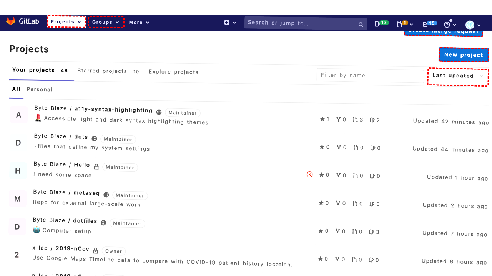
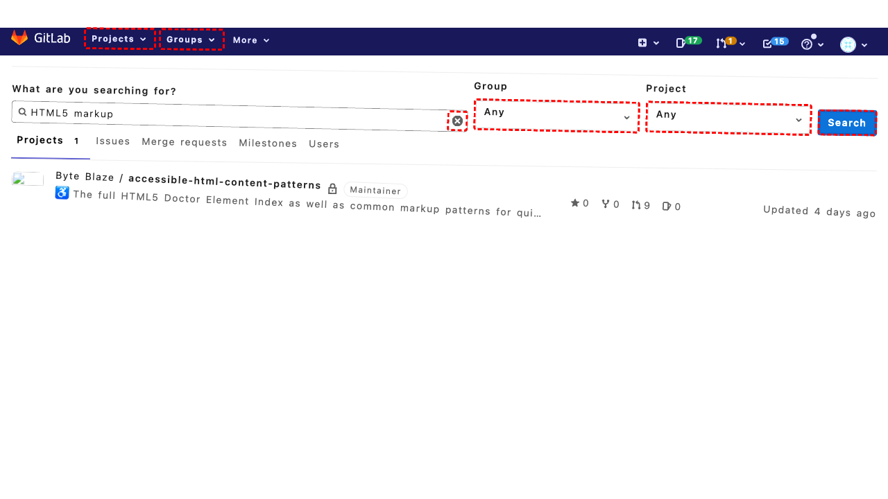
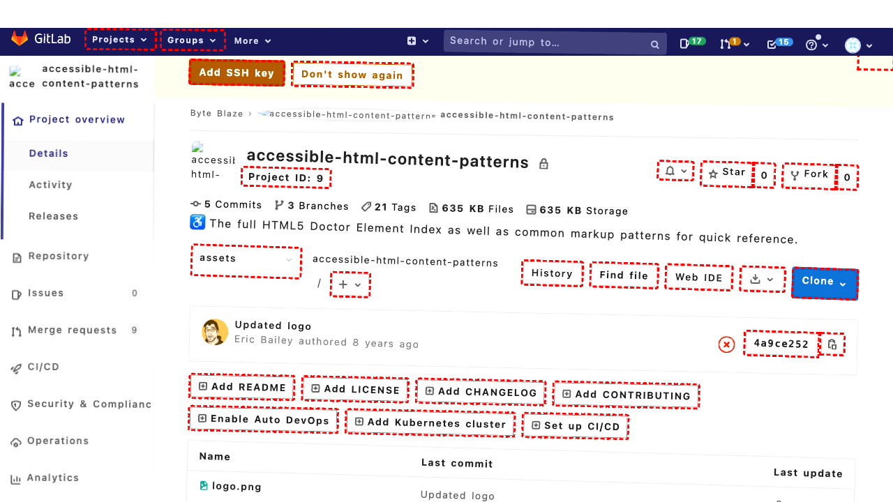
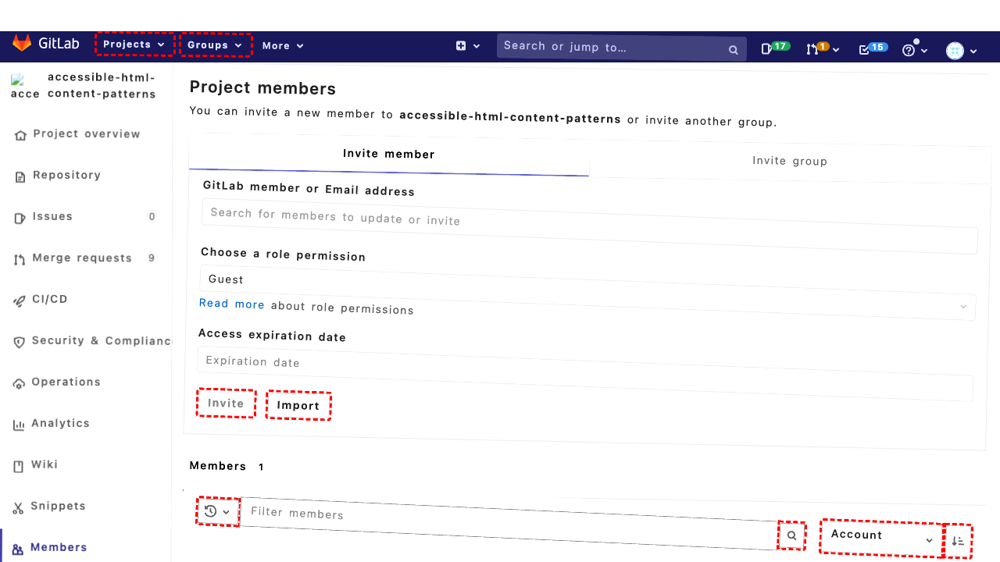
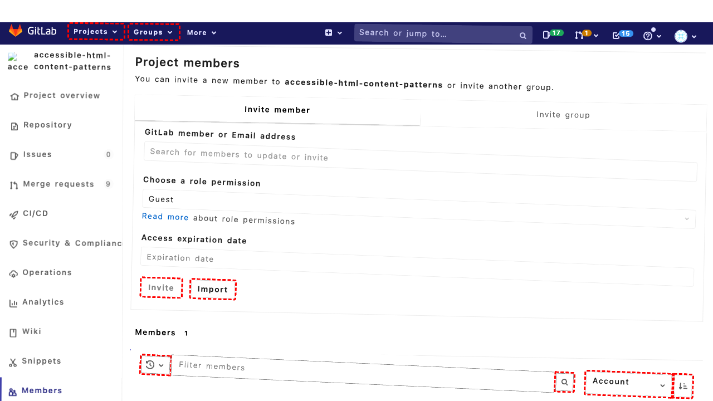
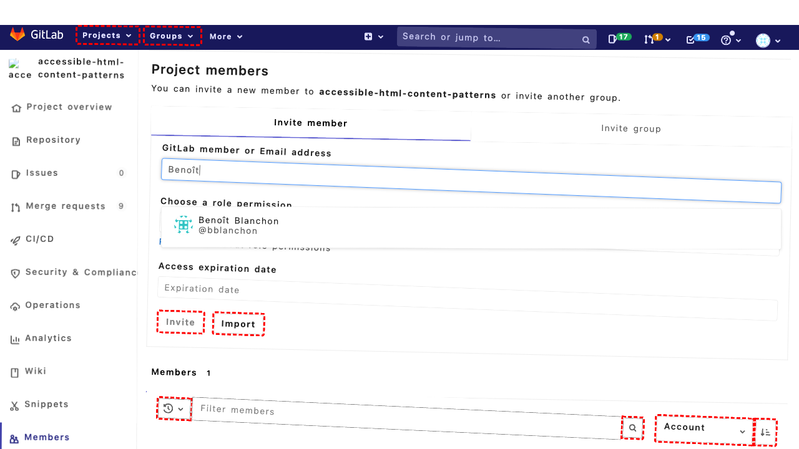

## Intent

Create a product view report from 07/05/2021 to 05/31/2023

## RM

Thoughts: The user's intent is to create a product view report from 07/05/2021 to 05/31/2023. The action history shows the agent performed clicks and filled date fields, but the final state indicates the agent is still in the process of filling the "To" date field and hasn't completed the report generation (e.g., no action like clicking a "Generate" or "Submit" button). The bot response is "None," suggesting the task was not completed. Since this is a content modification task (creating a report involves modifying or generating content), we examine the action history and final state. The actions are incomplete; the agent hasn't triggered the report creation, so the task fails.

Status: failure

## Final Response 

## Captions

===============I need to generate a product view report from 07/05/2021 to 05/31/2023. Looking at the action trajectories, I see that for generating reports, I need to navigate through the Reports menu. Specifically, I need to go to Products > Most Viewed (which is the product view report). The action trajectory for generating a report within a date range involves:

1. Clicking the Reports menu (bid 211)
2. Expanding the Products submenu (bid 250)
3. Clicking the "Most Viewed" link (bid 260)
4. Filling the start and end date fields
5. Clicking the generate button

From the current page, I can see the Reports menu is available. I need to click it to expand, then navigate to Products > Most Viewed.

Let me start by clicking the Reports menu.
===============I can see that after clicking the Reports menu, it expanded (the link is focused). Now I need to expand the Products submenu (bid 250) to access the "Most Viewed" report link.
===============Looking at the current state, I've expanded the Reports menu and then clicked on the "Products" submenu (bid 250). Now I need to click on the "Most Viewed" link (bid 260) to navigate to the product view report page where I can set the date range.
===============Looking at the current page, I can see I'm already on the "Most Viewed / Products / Reports" page (as indicated by the title and URL). The page shows the filter section with date fields. I need to set the date range from 07/05/2021 to 05/31/2023.

From the accessibility tree, I can see:
- "From *" textbox with bid 499
- "To *" textbox with bid 507
- There's also a "Show Report" button with bid 456

I need to fill in the start date (07/05/2021) and end date (05/31/2023), then click "Show Report" to generate the report.

Let me fill the date fields:
===============Looking at the current state, I've successfully filled the "From" date field with 07/05/2021. Now I need to fill the "To" date field with 05/31/2023. The "To" field has bid 507 according to the accessibility tree.

## Images







## Main Prompt

```md
User Intent: Create a product view report from 07/05/2021 to 05/31/2023

Action History:
1: click("211")
2: click("250")
3: click("260")
4: fill("499", "07/05/2021")
5: fill("507", "05/31/2023")


The detailed final state of the webpage:

```md
Looking at the current state, I've successfully filled the "From" date field with 07/05/2021. Now I need to fill the "To" date field with 05/31/2023. The "To" field has bid 507 according to the accessibility tree.
```

Bot response to the user: None.
```
