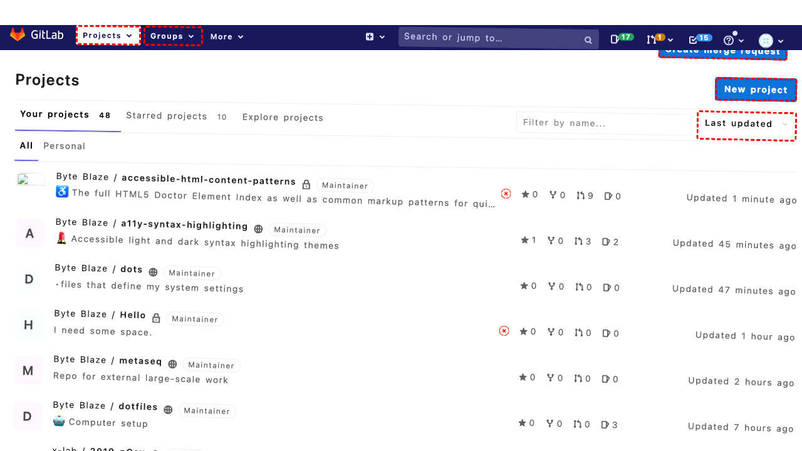
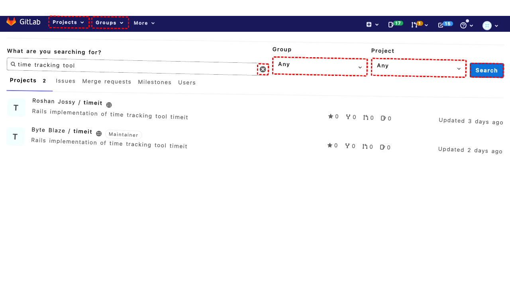
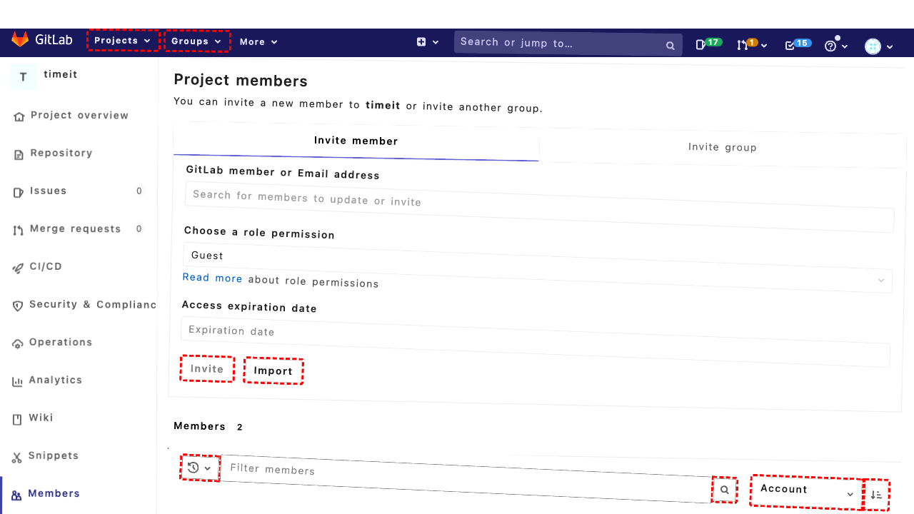
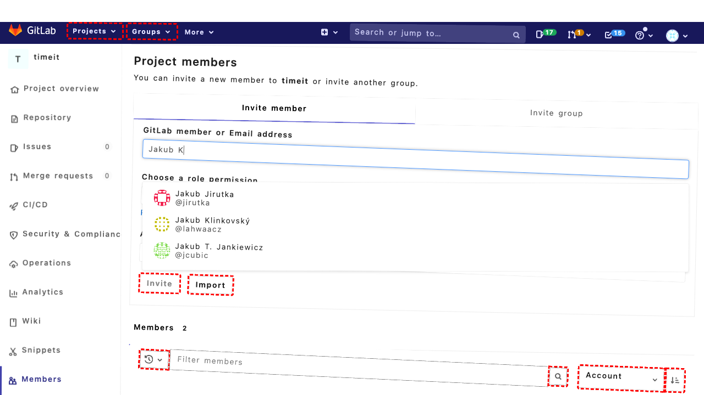
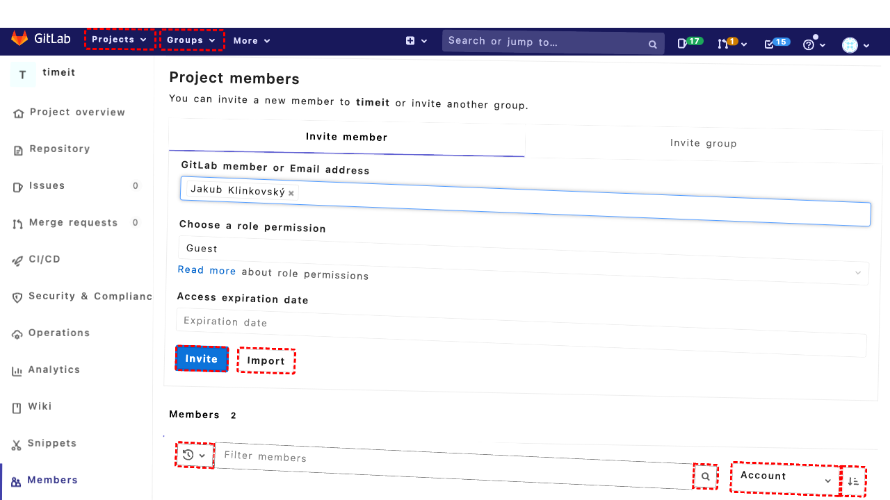
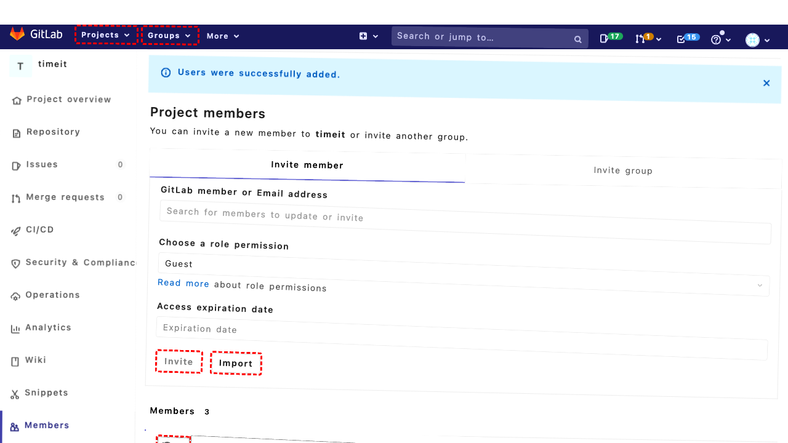
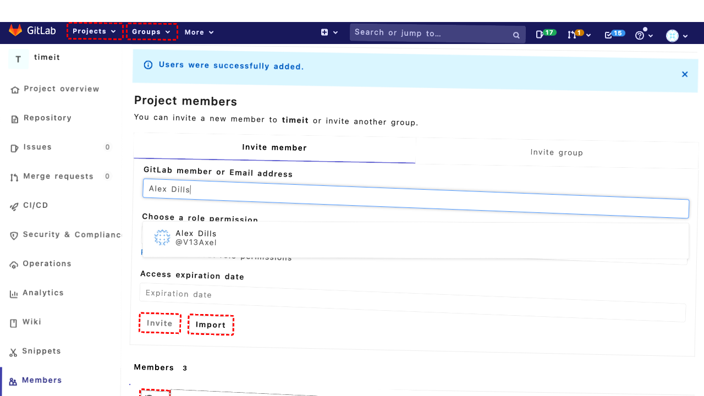
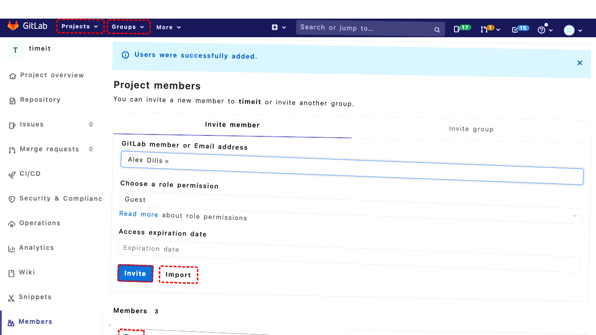

## Intent

Invite Jakub K, Alex Dills, Alex Hutnik and Benoît Blanchon as collaborator to my time tracking tool project repo

## RM

Thoughts: The user's intent is to invite four collaborators (Jakub K, Alex Dills, Alex Hutnik, and Benoît Blanchon) to a time tracking tool project repo. This is a content modification task, so I need to examine the action history and final state to determine success. The action history shows the agent searched for the project, clicked to access it, and began adding collaborators. It successfully added Jakub K as a Developer, but then only started adding Alex Dills by filling the search field and seeing a dropdown with the correct user. However, the agent did not complete the action to select Alex Dills from the dropdown (bid '930'), and there is no record of attempting to add Alex Hutnik or Benoît Blanchon. The final state only confirms that the dropdown for Alex Dills appeared but was not selected. Since the task requires adding all four collaborators and the agent only partially completed one and did not address the others, the task is not successfully completed.

Status: failure

## Final Response 

## Captions

===============Looking at the current page, I can see I'm on the GitLab dashboard showing a list of projects. To invite collaborators to my time tracking tool project, I first need to identify which project is the time tracking tool and then navigate to its member settings.

From the project list, I can see several Byte Blaze projects, but none are explicitly named "time tracking tool". I should search for the specific project to find it more efficiently.

I'll use the search functionality to find the time tracking tool project.<｜end▁of▁thinking｜>
===============Looking at the current page, I can see I'm already on a search results page for "time tracking tool" and there are two projects listed:
1. "Roshan Jossy / timeit"
2. "Byte Blaze / timeit" (where I'm listed as Maintainer)

Since I need to invite collaborators to my time tracking tool project, I should click on the "Byte Blaze / timeit" project link, as that appears to be the project I maintain and want to add collaborators to.
===============Looking at the current state, I can see I'm now on the "Byte Blaze / timeit" project page. To invite collaborators, I need to navigate to the project's member management settings. From the accessibility tree, I can see there's a "Members" link in the project navigation sidebar with the ID '500'. This is where I can manage project members and invite collaborators.
===============Looking at the current page, I can see I'm already on the "Members" page for the timeit project. The page shows the current members list and has an "Invite member" section. I can see:

1. A search box for "GitLab member or Email address" (bid '603')
2. A role dropdown (bid '611') currently set to "Guest"
3. An "Invite" button (bid '625') that is currently disabled

To invite the collaborators (Jakub K, Alex Dills, Alex Hutnik, and Benoît Blanchon), I need to search for each user in the search box and select the appropriate role. The "Invite" button will become enabled once I've selected a user.

Let me start by searching for the first user, Jakub K.
===============Looking at the current state, I can see that after typing "Jakub K" in the search box, a dropdown list has appeared with several matching users:
- Jakub Jirutka @jirutka
- Jakub Klinkovský @lahwaacz
- Jakub T. Jankiewicz @jcubic

I need to select the correct Jakub K from this list. Since the dropdown shows options and I can see "Jakub Klinkovský @lahwaacz" which matches the "Jakub K" I'm looking for, I should select this option from the dropdown.
===============Looking at the current state, I can see that after clicking on "Jakub Klinkovský @lahwaacz", the user has been selected in the member invitation form. The search box now shows the selected user, and the "Invite" button should now be enabled.

Now I need to set the appropriate role for Jakub. The role dropdown (bid '611') is currently set to "Guest" by default. I should select a more appropriate role - likely "Developer" or "Reporter" depending on the level of access needed for collaborators. Since these are collaborators who will likely need to contribute code, "Developer" would be appropriate.
===============Looking at the current state, I can see that Jakub Klinkovský has been successfully selected as a user to invite, and the role has been set to "Developer". The "Invite" button should now be enabled and ready to click to add Jakub as a collaborator to the project.

Now I need to click the "Invite" button to actually add Jakub to the project. After that, I'll need to repeat the process for the other three collaborators (Alex Dills, Alex Hutnik, and Benoît Blanchon).
===============Looking at the current state, I can see that after clicking the "Invite" button, Jakub Klinkovský has been successfully added as a collaborator to the project. The page shows a success message "Users were successfully added." and Jakub now appears in the members list with "Developer" role.

Now I need to add the remaining three collaborators: Alex Dills, Alex Hutnik, and Benoît Blanchon. I'll continue using the same member invitation form to search for and add each user one by one.

Let me start by searching for the next user, Alex Dills.
===============Looking at the error, I see that I tried to fill element with bid '603', but that's actually a label element, not the input field. I need to find the actual text input field for searching members. From the accessibility tree, I can see there's a textbox with bid '608' that has the description "GitLab member or Email address" and value "Search for members to update or invite". This is the actual input field I should use.

Let me use the correct element ID to search for Alex Dills.
===============Looking at the current state, I can see that after filling "Alex Dills" in the search box (bid '608'), a dropdown has appeared with matching users. I can see "Alex Dills @V13Axel" is listed as an option (bid '930'). This appears to be the correct user I'm looking for. I need to select this user from the dropdown to add them as a collaborator.

## Images












## Main Prompt

```md
User Intent: Invite Jakub K, Alex Dills, Alex Hutnik and Benoît Blanchon as collaborator to my time tracking tool project repo

Action History:
1: search_project('156', 'time tracking tool')
2: click('368')
3: click('500')
4: fill('603', 'Jakub K')
5: click('866')
6: select_option('611', 'Developer')
7: 
8: click('625')
9: fill('603', 'Alex Dills')
10: fill('608', 'Alex Dills')
11: click('930')


The detailed final state of the webpage:

```md
Looking at the current state, I can see that after filling "Alex Dills" in the search box (bid '608'), a dropdown has appeared with matching users. I can see "Alex Dills @V13Axel" is listed as an option (bid '930'). This appears to be the correct user I'm looking for. I need to select this user from the dropdown to add them as a collaborator.
```

Bot response to the user: None.
```
