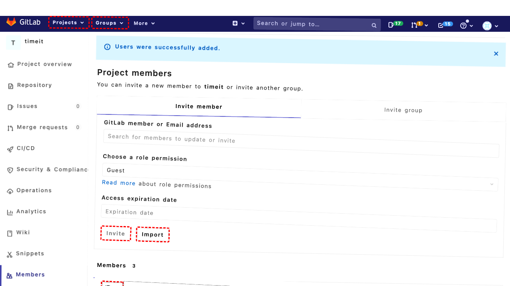

## Intent

Create a milestone for the upcoming task of cleaning sensitive information starting on 2/16/2023 and ending on in 20 days

## RM

Thoughts: This is a content modification task where the user wants to create a milestone with specific details. The action history shows the agent filling in the milestone title, start date, and due date correctly (with the due date calculated as 20 days from the start date), and clicking to submit. The final state confirms the milestone was created with the correct details and is visible in the milestones list. The bot's response accurately summarizes the successful creation. Therefore, the task is successful.

Status: success

## Final Response "Successfully created the milestone 'cleaning sensitive information' with start date 2/16/2023 and due date 3/8/2023 (20 days from start

## Captions

===============Looking at the current page, I can see I'm on a GitLab project page for "Primer / design". To create a milestone for the task of cleaning sensitive information, I need to navigate to the milestones section. I can see in the sidebar there's a "Milestones" link under the dashboard section (bid 102), but that appears to be for global milestones. For project-specific milestones, I should look for a milestones section within this specific project.

Let me first check if there's a milestones link in the project navigation. I can see various project tabs like "Issues", "Merge Requests", "CI/CD", etc., but no direct milestones link visible. Since milestones are typically associated with issues, I should navigate to the issues section first, where I can likely find milestones management.

I'll click on the "Issues" link (bid 283) to go to the issues page where milestones are typically managed.<｜end▁of▁thinking｜>
===============Looking at the current page, I can see I'm already on the Issues page for the "Primer / design" project. In the project navigation sidebar, I can see there's a "Milestones" link (bid 304) under the Issues section. This is exactly what I need to create a milestone for the cleaning sensitive information task.

I should click on the "Milestones" link to navigate to the milestones management page where I can create a new milestone.
===============Looking at the current page, I can see I'm already on the Milestones page for the "Primer / design" project. The accessibility tree shows there's a "New milestone" link (bid 459) available, and the page currently shows "No milestones to show". Since I need to create a milestone for the cleaning sensitive information task, I should click the "New milestone" link to start creating the milestone.
===============Looking at the current page, I can see I'm on the "New Milestone" page for the "Primer / design" project. The form has several fields that need to be filled out:

1. Title field (bid 446) - focused and required
2. Description field (bid 483)
3. Start Date field (bid 517)
4. Due Date field (bid 524)

The goal is to create a milestone for "cleaning sensitive information" starting on 2/16/2023 and ending in 20 days. First, I need to fill in the title with the milestone name.
===============Looking at the current state, I can see that the title field has already been filled with "cleaning sensitive information" (as shown in the accessibility tree). Now I need to set the start date to 2/16/2023 and calculate the due date which should be 20 days from the start date.

Since 2/16/2023 + 20 days = 3/8/2023, I need to fill the start date field with "2023-02-16" and the due date field with "2023-03-08".

Let me first fill the start date field:
===============Looking at the current state, I can see that the start date field (bid 517) already shows "2023-02-16" as its value, which matches the required start date. Now I need to set the due date to be 20 days from the start date, which would be March 8, 2023 (2023-03-08).

The due date field has bid 524 and is currently empty. I should fill this field with the calculated due date.
===============Looking at the current state, I can see that both the title field (bid 446) and start date field (bid 517) are already filled with the correct values. The due date field (bid 524) has been filled with "2023-03-08" which correctly represents 20 days from the start date of 2/16/2023. All the required information for the milestone has been entered.

Now I need to create the milestone by clicking the "Create milestone" button (bid 528) to submit the form and complete the task.
===============Looking at the current state, I can see that the milestone creation form has been successfully submitted. The page has navigated back to the milestones list page, and the newly created "cleaning sensitive information" milestone is now visible in the list. The accessibility tree shows the milestone details including the correct date range "Feb 16, 2023–Mar 8, 2023" and the status shows "Past due" (which makes sense since the current date is past these dates in the simulation).

The milestone has been successfully created with:
- Title: "cleaning sensitive information"
- Start date: February 16, 2023
- Due date: March 8, 2023 (20 days from start date)

The task has been completed successfully. I should send a confirmation message to the user.

## Images



## Main Prompt

```md
User Intent: Create a milestone for the upcoming task of cleaning sensitive information starting on 2/16/2023 and ending on in 20 days

Action History:
1: click("283")
2: click("304")
3: click("459")
4: fill("446", "cleaning sensitive information")
5: fill("517", "2023-02-16")
6: fill("524", "2023-03-08")
7: click("528")
8: send_msg_to_user("Successfully created the milestone 'cleaning sensitive information' with start date 2/16/2023 and due date 3/8/2023 (20 days from start). The milestone is now available in the project.")


The detailed final state of the webpage:

```md
Looking at the current state, I can see that the milestone creation form has been successfully submitted. The page has navigated back to the milestones list page, and the newly created "cleaning sensitive information" milestone is now visible in the list. The accessibility tree shows the milestone details including the correct date range "Feb 16, 2023–Mar 8, 2023" and the status shows "Past due" (which makes sense since the current date is past these dates in the simulation).

The milestone has been successfully created with:
- Title: "cleaning sensitive information"
- Start date: February 16, 2023
- Due date: March 8, 2023 (20 days from start date)

The task has been completed successfully. I should send a confirmation message to the user.
```

Bot response to the user: "Successfully created the milestone 'cleaning sensitive information' with start date 2/16/2023 and due date 3/8/2023 (20 days from start.
```
