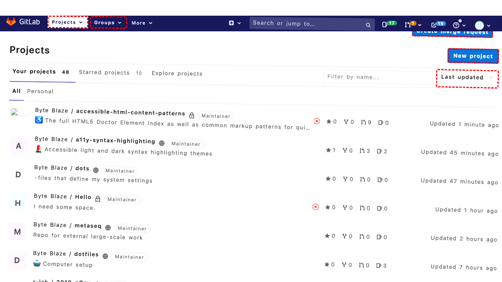
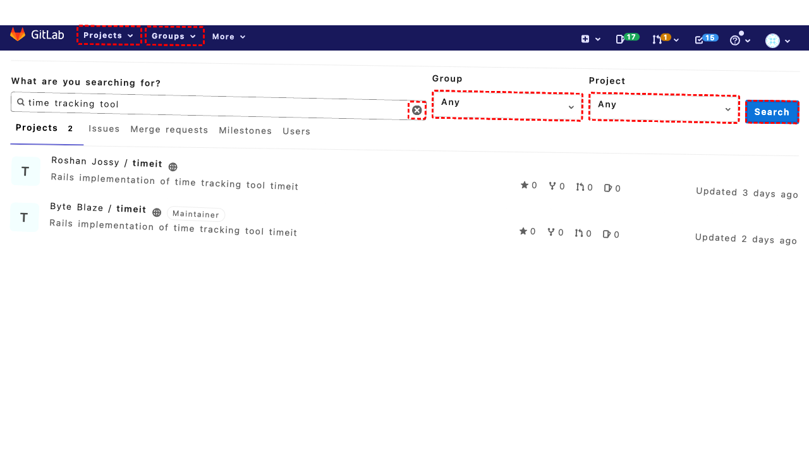
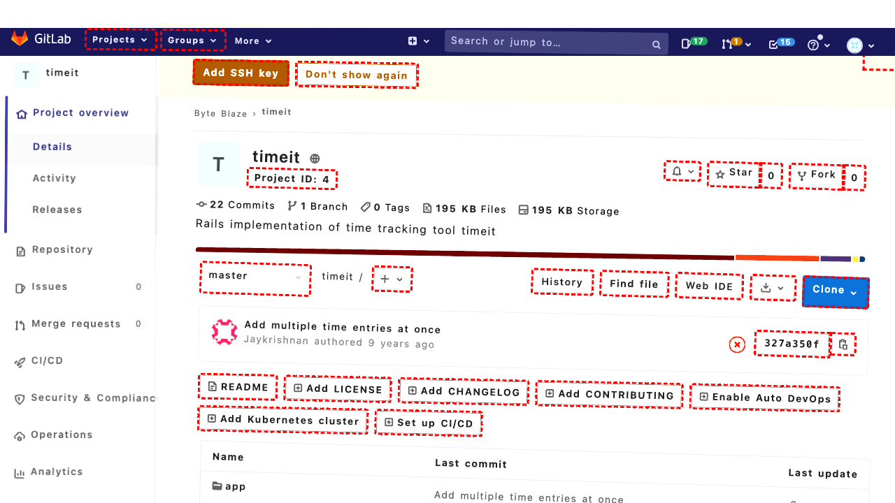
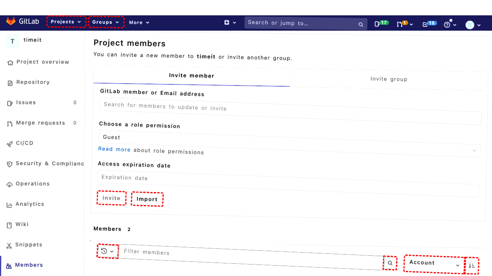
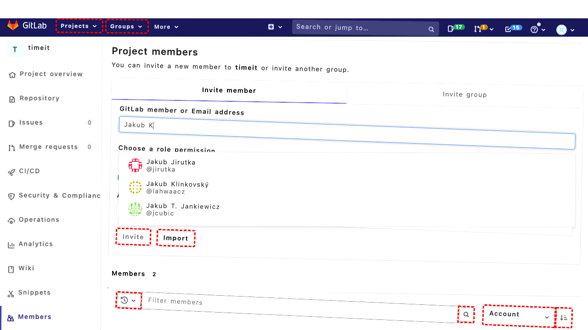
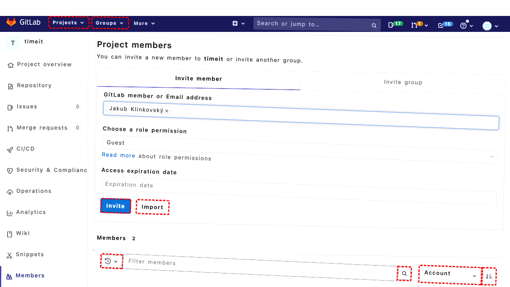

## Intent

Create a coupons report from 05/01/2021 to 05/15/2023

## RM

Thoughts: The user's intent is to create a coupons report from 05/01/2021 to 05/15/2023. This is a content modification task (specifically, generating a report based on input parameters). The action history shows the agent clicked several elements (likely navigating to the report section) and filled the "From" and "To" date fields correctly. However, the final state indicates the agent has not yet clicked the "Show Report" button to generate the report; it only describes the next intended action. The bot response is "None," and there is no indication in the final state that the report was actually created. Since the task requires generating the report, and the agent stopped before completing the final step, the execution is incomplete and thus unsuccessful.

Status: failure

## Final Response 

## Captions

===============I need to create a coupons report from 05/01/2021 to 05/15/2023. Looking at the current page, I'm on the Magento Admin Dashboard. To generate a coupons report, I need to navigate to the Reports section, specifically the Sales reports, and then find the Coupons report.

From the accessibility tree, I can see there's a "Reports" menu item (bid 211) that expands to show submenus including "Sales" (bid 215), and under that there's "Coupons" (bid 234). This is exactly what I need.

First, I should click on the "Reports" menu to expand it, then click on "Sales", then click on "Coupons". After that, I'll need to set the date range from 05/01/2021 to 05/15/2023.

Let me start by clicking on the Reports menu.
===============Looking at the current state, I've clicked on the "Reports" menu (bid 211). Now I need to click on the "Sales" submenu (bid 215) to expand it further, then click on "Coupons" (bid 234). After that, I'll need to set the date range.
===============Looking at the current state, I've clicked on the "Reports" menu and then the "Sales" submenu. Now I need to click on the "Coupons" link (bid 234) to navigate to the coupons report page. After that, I'll need to set the date range from 05/01/2021 to 05/15/2023.
===============Looking at the current state, I've navigated to the Coupons report page (as confirmed by the URL and page title). Now I need to set up the date range filter for the report from 05/01/2021 to 05/15/2023.

From the accessibility tree, I can see:
- "From *" date field with bid 508
- "To *" date field with bid 516
- "Show Report" button with bid 456

I need to fill in both date fields and then click the "Show Report" button. The dates should be in MM/DD/YYYY format as per the examples in the action space.
===============Looking at the current state, I've filled the "From" date field with 05/01/2021. Now I need to fill the "To" date field with 05/15/2023, then click the "Show Report" button to generate the report.

## Images







## Main Prompt

```md
User Intent: Create a coupons report from 05/01/2021 to 05/15/2023

Action History:
1: click("211")
2: click("215")
3: click("234")
4: fill("508", "05/01/2021")
5: fill("516", "05/15/2023")


The detailed final state of the webpage:

```md
Looking at the current state, I've filled the "From" date field with 05/01/2021. Now I need to fill the "To" date field with 05/15/2023, then click the "Show Report" button to generate the report.
```

Bot response to the user: None.
```
