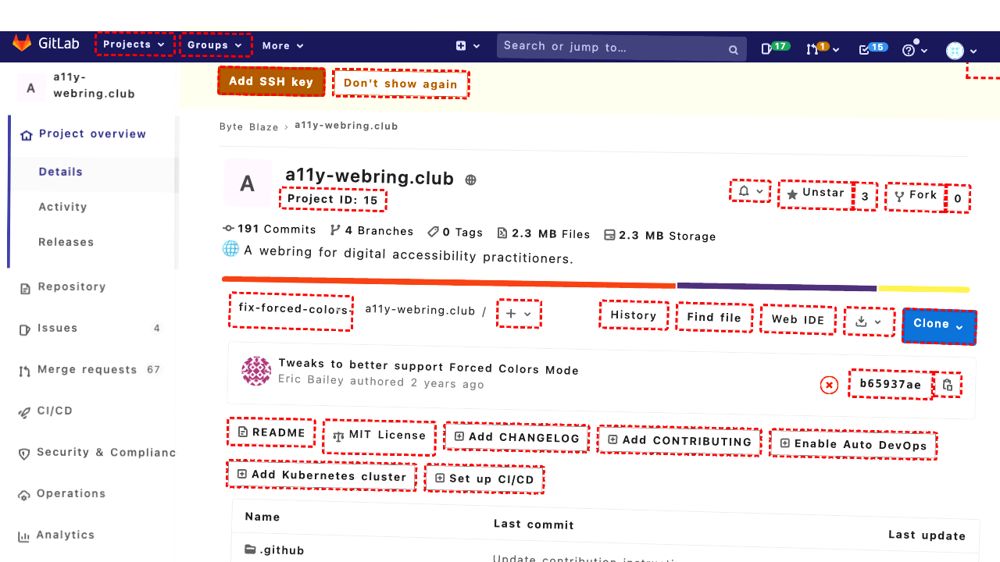
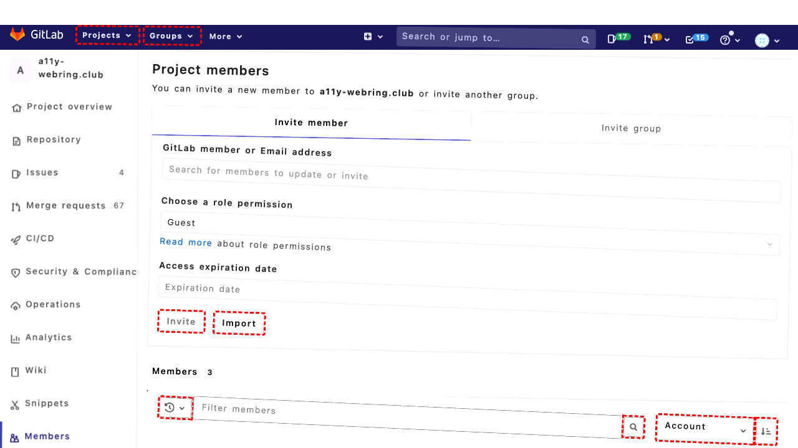

## Intent

Add the following users to repo a11y-webring.club as developer: ['abisubramanya27', 'lahwaacz']

## RM

Thoughts: This is a content modification task where the user wants to add two users as developers to the repository. The agent's action history shows it clicked two elements and then sent a message to the user stating the users are already members with the Developer role. The final state of the webpage confirms that both users are already present with the correct role, meaning the desired state is already achieved. Since the task is to ensure the users are developers in the repo and they already are, the agent correctly identified this and no further action was needed. Therefore, the execution is successful.

Status: success

## Final Response "Both users 'abisubramanya27' and 'lahwaacz' are already members of the a11y-webring.club repository with Developer role, as shown in the current members list. No action needed."

## Captions

===============Looking at the current page, I can see we're on the GitLab dashboard showing a list of projects. I need to navigate to the specific repository "a11y-webring.club" to add users as developers. I can see this repository in the project list with the heading "Byte Blaze / a11y-webring.club" and link ID '847'.

The best next action is to click on this repository link to navigate to its page, where I can then access the member management settings to add users.
===============Looking at the current page, I can see we're now on the repository page for "a11y-webring.club". To add users as developers, I need to navigate to the member management settings. From the accessibility tree, I can see there's a "Members" link in the project navigation sidebar with ID '500'. This is the correct place to manage project members.
===============Looking at the current page, I can see we're already on the Members page for the a11y-webring.club repository. The page shows the "Invite member" tab is active, and I can see the form elements needed to add new members.

I need to add two users as developers: 'abisubramanya27' and 'lahwaacz'. I can see from the existing members table that 'abisubramanya27' and 'lahwaacz' are already members with Developer role, so they don't need to be added again. The goal is already accomplished - both users are already developers in this repository.

Since the requested users are already members with the correct role, I should inform the user that this task is already complete.

## Images





## Main Prompt

```md
User Intent: Add the following users to repo a11y-webring.club as developer: ['abisubramanya27', 'lahwaacz']

Action History:
1: click("847")
2: click("500")
3: send_msg_to_user("Both users 'abisubramanya27' and 'lahwaacz' are already members of the a11y-webring.club repository with Developer role, as shown in the current members list. No action needed.")


The detailed final state of the webpage:

```md
Looking at the current page, I can see we're already on the Members page for the a11y-webring.club repository. The page shows the "Invite member" tab is active, and I can see the form elements needed to add new members.

I need to add two users as developers: 'abisubramanya27' and 'lahwaacz'. I can see from the existing members table that 'abisubramanya27' and 'lahwaacz' are already members with Developer role, so they don't need to be added again. The goal is already accomplished - both users are already developers in this repository.

Since the requested users are already members with the correct role, I should inform the user that this task is already complete.
```

Bot response to the user: "Both users 'abisubramanya27' and 'lahwaacz' are already members of the a11y-webring.club repository with Developer role, as shown in the current members list. No action needed.".
```
