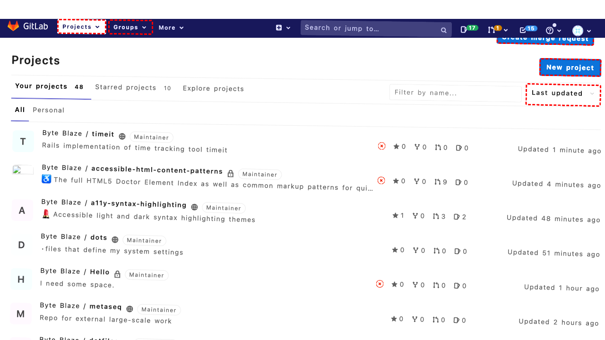
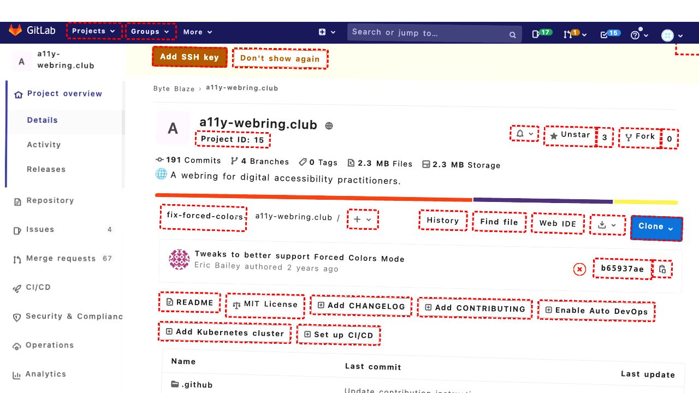
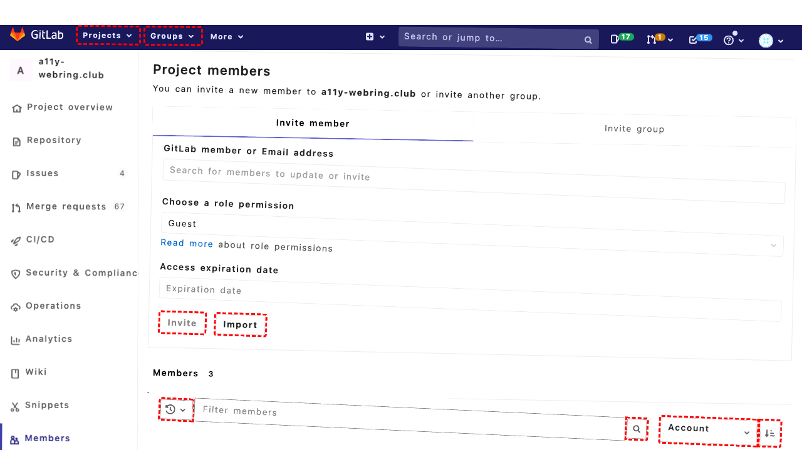

## Intent

Create a milestone for the upcoming task of merging all branches to main starting on March 15, 2044 and ending on March 30, 2044

## RM

Thoughts: The user's intent is to create a milestone, which falls under the "Content modification" task type. The action history shows the agent attempting to interact with form fields (e.g., fill, keyboard_press, click), but the final state of the webpage indicates persistent issues: elements are not visible, and the milestone creation form is not successfully accessed or completed. The agent's actions did not result in the milestone being created, as evidenced by the error messages and the need to try a different approach. Since the task is content modification and the final state confirms the milestone was not created, the execution is a failure.

Status: failure

## Final Response 

## Captions

===============Looking at the current page, I can see I'm on the GitLab project page for "dotfiles". To create a milestone for the task of merging all branches to main, I need to navigate to the milestones section. I can see there's a "Milestones" link in the left sidebar navigation (bid 102) that should take me to the milestones dashboard where I can create a new milestone.

Let me click on the Milestones link to navigate to the milestones section.<｜end▁of▁thinking｜>
===============Looking at the current page, I can see I'm already on the Milestones dashboard page. The accessibility tree shows there's a link with the text "Select project to create milestone" (bid 223). This appears to be the button or link I need to click to start creating a new milestone. Since I'm already on the milestones page and need to create a new milestone for the task of merging all branches to main, clicking this link should take me to the milestone creation form where I can specify the details like title, start date (March 15, 2044), and due date (March 30, 2044).
===============Looking at the current state, I can see that I'm on the Milestones dashboard page. I notice there's a combobox element (bid 235) that appears to be a project selector, currently expanded with various project options. This is likely the "Select project to create milestone" interface that I need to interact with to specify which project the milestone should be created for.

Since the goal is to create a milestone for merging all branches to main, I need to select the appropriate project first. Looking at the list of projects in the combobox, I can see "Byte Blaze / dotfiles" (bid 424) which appears to be the relevant project for this milestone creation.

I'll select the "Byte Blaze / dotfiles" project from the dropdown to proceed with milestone creation.
===============Looking at the error message, I see that the element with bid 235 is actually an input field, not a select element. The accessibility tree shows it's a combobox with autocomplete functionality that's currently expanded with a list of project options.

Since this is a search/autocomplete combobox rather than a traditional select element, I need to use a different approach. I can see that "Byte Blaze / dotfiles" is one of the options in the listbox (bid 424). I should click on that option directly to select it.
===============Looking at the current state, I can see that I successfully selected the "Byte Blaze / dotfiles" project from the dropdown. The page has now navigated to the milestone creation form for this specific project. I can see various form fields in the accessibility tree including:

- A title field (bid 237) where I need to enter "Merge all branches to main"
- A start date field (bid 239) where I need to set March 15, 2044
- A due date field (bid 241) where I need to set March 30, 2044

Since I'm now on the milestone creation form, I should first fill in the title field with the milestone name.
===============Looking at the error message, it appears the element with bid 237 (the title field) is not currently visible on the page. This suggests I may need to scroll the page to make the form fields visible before I can interact with them.

The error indicates that the system tried to scroll the element into view but couldn't because it's not visible. Since I'm on a milestone creation form, it's likely that the form extends beyond the initial viewport and requires scrolling to access all fields.

Let me scroll down the page to make the form fields visible, then I'll be able to fill in the title field.
===============Looking at the current situation, I successfully scrolled down the page to make form fields visible. Now I can see the milestone creation form properly. The accessibility tree shows:

- A title field (bid 237) for the milestone name
- A description field (bid 239)
- A start date field (bid 241)
- A due date field (bid 243)

I need to fill in the title field with "Merge all branches to main" first, then set the start date to March 15, 2044 and the due date to March 30, 2044. Let me start by filling the title field now that it should be visible after scrolling.
===============Looking at the error message, it appears the title field (bid 237) is still not visible even after scrolling. This suggests the form might be in a modal or overlay that requires different interaction. Let me check the current accessibility tree more carefully.

I notice there's a status element (bid 409) that mentions "Byte Blaze / dotfiles" which suggests I'm in the right context. The form fields might be in a modal dialog that needs to be focused first. Let me try a different approach - I'll look for a "New milestone" button or the main form container that might need to be activated.

Since the error persists and the element remains not visible, let me try pressing the Tab key to navigate through form elements, which might help focus the title field and make it interactable.
===============Looking at the current situation, I've tried scrolling and tab navigation but the title field (bid 237) remains not visible. The accessibility tree shows I'm on the milestone creation page for "Byte Blaze / dotfiles" but the form fields aren't accessible.

Let me try a different approach - I'll look for any "Create milestone" or "New milestone" button that might need to be clicked first to activate the form, or I'll try pressing Enter to see if that activates the form fields. Since I'm already on the milestone creation page but the form isn't interactable, pressing Enter might trigger form activation.
===============Looking at the current situation, I'm still having trouble accessing the form fields on the milestone creation page. The error messages indicate the elements aren't visible even after scrolling and keyboard navigation.

Let me try a different approach - I'll look for the main content area or form container that might need to be focused first. I notice in the accessibility tree there's a main content area (likely the root web area) and various form-related elements. Let me try clicking on a different part of the page to ensure the form has focus, then attempt to fill the title field again.

## Images







## Main Prompt

```md
User Intent: Create a milestone for the upcoming task of merging all branches to main starting on March 15, 2044 and ending on March 30, 2044

Action History:
1: click("102")
2: click("223")
3: select_option("235", "Byte Blaze / dotfiles")
4: click("424")
5: fill("237", "Merge all branches to main")
6: scroll(0, 300)
7: fill("237", "Merge all branches to main")
8: keyboard_press("Tab")
9: keyboard_press("Enter")
10: click("237")


The detailed final state of the webpage:

```md
Looking at the current situation, I'm still having trouble accessing the form fields on the milestone creation page. The error messages indicate the elements aren't visible even after scrolling and keyboard navigation.

Let me try a different approach - I'll look for the main content area or form container that might need to be focused first. I notice in the accessibility tree there's a main content area (likely the root web area) and various form-related elements. Let me try clicking on a different part of the page to ensure the form has focus, then attempt to fill the title field again.
```

Bot response to the user: None.
```
