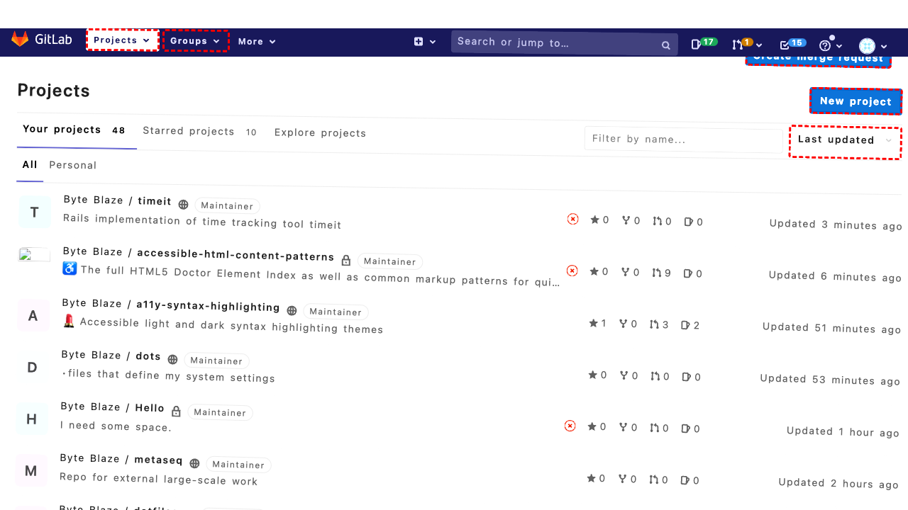

## Intent

Increase the price of black fitness tshirts from Desiree with size XS by 37%

## RM

Thoughts: The user's intent is to increase the price of a specific product (black fitness tshirts from Desiree with size XS) by 37%. This is a content modification task. The action history shows the agent performed a series of actions, including clicks and fills, but the final action (click("478")) is clicking the "Prices" tab. The final state of the webpage is described as being on the product edit page, with instructions on what to do next (navigate to Prices tab, calculate new price, fill, save). However, the agent did not complete the modification: it did not calculate or fill the new price, nor did it save the product. The bot response is "None," indicating no confirmation or error. Since the price was not actually changed, the task fails.

Status: failure

## Final Response 

## Captions

===============I need to increase the price of black fitness tshirts from Desiree with size XS by 37%. This involves finding the specific product, navigating to its edit page, and adjusting the price. First, I need to go to the Manage Products page to search for the product.

Looking at the current page, I'm on the Dashboard. I need to navigate to Catalog > Manage Products. I can see the Catalog menu item (bid 113) in the sidebar. I'll click it to expand, then click "Manage Products" (bid 116).
===============I need to expand the Catalog menu to access the Manage Products link. I just clicked "Catalog" (bid 113). Now I should wait for the menu to expand and then click "Manage Products" (bid 116).
===============Looking at the current page, I can see I'm already on the "Manage Products" page (the title says "Manage Products / Catalog / Magento Admin"). The Catalog menu is likely already expanded since I clicked it. The page shows a list of products with filter fields at the top.

I need to find "black fitness tshirts from Desiree with size XS". This is a specific product variant. I should use the filter fields to narrow down the search. I can filter by:
- Name: might contain "Desiree" or "fitness tshirt"
- Color: black
- Size: XS

However, looking at the filter row in the table, I see fields for:
- ID (Any checkbox)
- Name (textbox at bid 615)
- Type (dropdown at bid 617)
- Attribute Set Name (dropdown at bid 626)
- SKU (textbox at bid 642)
- Price (From/To fields)
- Qty (From/To fields)
- Visibility (dropdown at bid 664)
- Status (dropdown at bid 671)
- Websites (dropdown at bid 676)

I don't see specific filters for color or size attributes. Those might be custom attributes that aren't in the default filter row. I might need to search by product name or SKU.

Let me first try filtering by name containing "Desiree" or "fitness". I'll use the Name filter field (bid 615).
===============I can see the Name filter is already filled with "Desiree" (it was focused in the accessibility tree). The page shows products filtered by "Desiree" - I can see products like "Phoebe Zipper Sweatshirt", "Erika Running Short", etc. These appear to be Desiree brand products, but I need to find "black fitness tshirts" specifically.

Looking at the displayed products, I don't see any t-shirts yet. I need to scroll or search more specifically. Let me try searching for "fitness" or "tshirt" in the Name filter instead.

First, I'll clear the current filter and search for "fitness tshirt":
===============Looking at the current page, I can see the Name filter is now set to "fitness tshirt". The product list shows various "Erika Running Short" and "Ina Compression Short" products, but no t-shirts. This suggests the product might not be in the first 20 results or might have a different name.

I need to search more specifically. The goal is "black fitness tshirts from Desiree with size XS". This is likely a configurable product with variations. Let me try searching for "Desiree fitness" or check if there's a SKU pattern.

First, let me click the Search button to apply the current filter:
===============Looking at the page, I've filtered by "fitness tshirt" and clicked Search. The results show various products but not the specific black XS t-shirt. I need to find the exact product variant. Since this is likely a configurable product with color and size attributes, I might need to:

1. First find the parent product (e.g., "Desiree Fitness Tee" or similar)
2. Then edit it to access the configurations
3. Find the specific variant (black, XS) and adjust its price

Let me try searching for "Desiree" again to see all Desiree products:
===============Looking at the error, I can't find element with bid "615". Let me examine the accessibility tree more carefully. I see the filter row in the table. The Name filter appears to be at bid 1240 (textbox with value 'fitness tshirt'). Let me check the structure: in row with bid 1223, there's a columnheader 'fitness tshirt .' at bid 1238, containing a textbox at bid 1240. That's likely the Name filter. Let me use that bid.

I need to search for Desiree products. I'll fill the Name filter with "Desiree":
===============Looking at the current page, I've filled the Name filter with "Desiree" and need to apply the filter by clicking the Search button. I can see the Search button at bid 1113 in the accessibility tree (in the LayoutTableCell with text "Reset Filter Search"). Let me click it to filter for Desiree products.
===============Looking at the current page after filtering for "Desiree", I can see the product list now shows Desiree Fitness Tee products in various sizes and colors. Specifically, I can see rows for:
- Desiree Fitness Tee-XL-Yellow
- Desiree Fitness Tee-XL-Orange
- Desiree Fitness Tee-XL-Black
- Desiree Fitness Tee-L-Yellow
- etc.

I need to find the specific variant: "black fitness tshirts from Desiree with size XS". Looking at the list, I can see there's a row for "Desiree Fitness Tee-XS-Black" (row with bid 1734). This matches exactly what I need: black, XS size, Desiree brand, fitness tee.

I need to edit this specific product to adjust its price. In the row for "Desiree Fitness Tee-XS-Black", there's an "Edit" link at bid 1748. I should click that to go to the product edit page.
===============Looking at the current page, I'm now on the product edit page for "Desiree Fitness Tee-XS-Black" (as shown in the title). I need to increase the price by 37%. To do this, I need to:

1. Navigate to the "Prices" tab since that's where price information is located.
2. Find the current price field and calculate the new price (current price × 1.37).
3. Fill in the new price and save the product.

From the accessibility tree, I can see the product information tabs at bid 471. The "Prices" tab is at bid 478. I should click that first to access the price fields.

## Images




## Main Prompt

```md
User Intent: Increase the price of black fitness tshirts from Desiree with size XS by 37%

Action History:
1: click("113")
2: click("116")
3: fill("615", "Desiree")
4: fill("615", "fitness tshirt")
5: click("488")
6: fill("615", "Desiree")
7: fill("1240", "Desiree")
8: click("1113")
9: click("1748")
10: click("478")


The detailed final state of the webpage:

```md
Looking at the current page, I'm now on the product edit page for "Desiree Fitness Tee-XS-Black" (as shown in the title). I need to increase the price by 37%. To do this, I need to:

1. Navigate to the "Prices" tab since that's where price information is located.
2. Find the current price field and calculate the new price (current price × 1.37).
3. Fill in the new price and save the product.

From the accessibility tree, I can see the product information tabs at bid 471. The "Prices" tab is at bid 478. I should click that first to access the price fields.
```

Bot response to the user: None.
```
