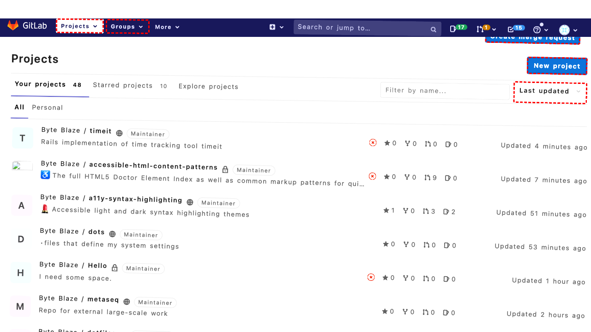
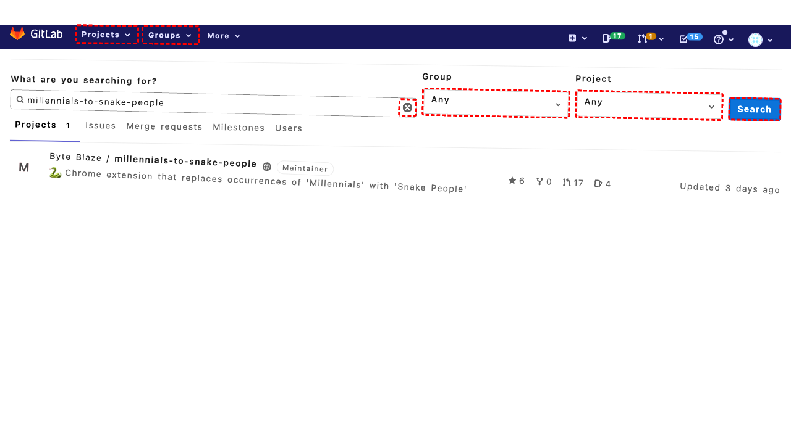
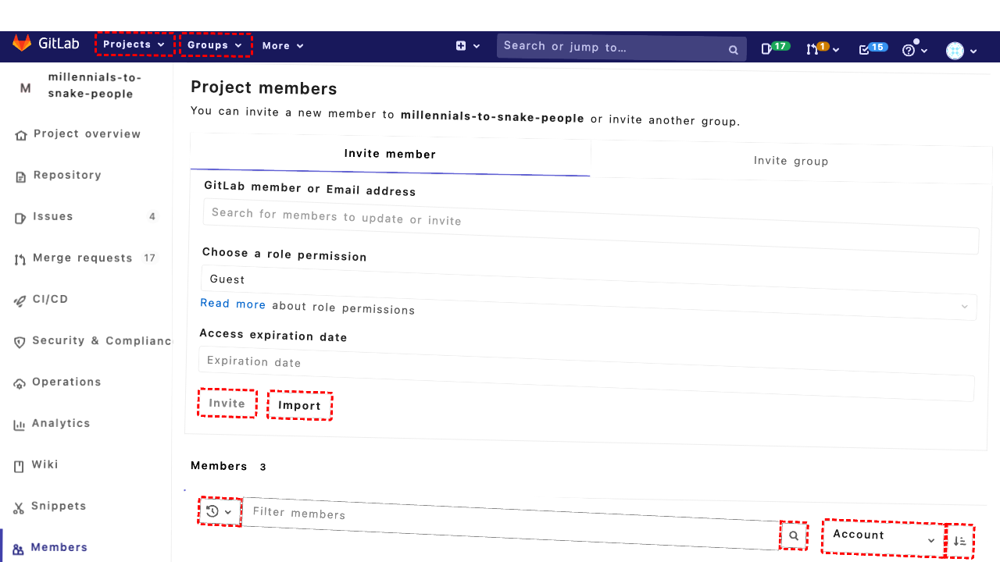
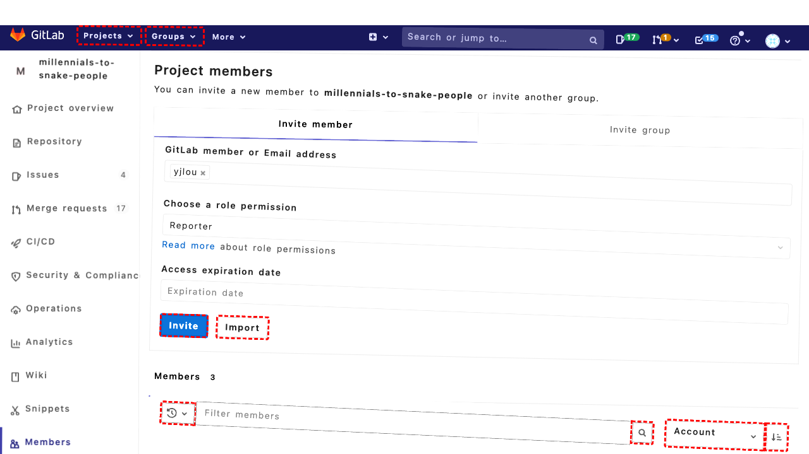

## Intent

Add the following users to repo millennials-to-snake-people as reporter: ['yjlou', 'a11yproject']

## RM

Thoughts: This is a content modification task where the user wants to add two users to a repository with the "Reporter" role. The agent's action history shows that it attempted to add 'yjlou' but then stopped and sent a message stating both users are already members with the correct role. The final state of the webpage confirms that both users are indeed already listed as "Reporter" members. Since the goal is to have these users as reporters, and they already are, the task is successfully completed without needing further modification.

Status: success

## Final Response "Both users 'yjlou' and 'a11yproject' are already members of the repository with 'Reporter' role. No action needed as the goal is already satisfied."

## Captions

===============Looking at the current page, I can see I'm on the GitLab dashboard showing a list of projects. I need to find and navigate to the "millennials-to-snake-people" repository to add users as reporters. Since this repository isn't visible in the current project list, I should use the search functionality to find it.

The search box is available with bid '156' (as seen in the accessibility tree under the searchbox 'Search or jump to…'). I'll use this to search for the repository.
===============Looking at the error, the previous action failed because it couldn't find element with bid "341" which was assumed to be the repository link. The current page shows search results, and I can see the repository "Byte Blaze / millennials-to-snake-people" is listed in the search results with a link element that contains the project name. I should click on this specific repository link to navigate to the project page.

From the accessibility tree, I can see the repository link has the text "Byte Blaze / millennials-to-snake-people" and appears to be a heading element. Let me click on this link to access the repository.
===============Looking at the current page, I can see I'm now on the "millennials-to-snake-people" repository page. To add users as reporters, I need to navigate to the Members section where I can manage user permissions. From the accessibility tree, I can see there's a "Members" link in the project navigation sidebar with bid '500'. This is where I can add new members and assign them roles.
===============Looking at the current page, I can see I'm on the Members page for the "millennials-to-snake-people" repository. I can see there are already 3 members listed in the table, including "yjlou" and "a11yproject" who are currently reporters. However, the goal is to add these users as reporters, which suggests they might not be members yet or need their roles updated.

From the accessibility tree, I can see:
- A search box with bid '603' for "GitLab member or Email address"
- A role dropdown with bid '611' that currently shows "Guest" but has "Reporter" as an option
- An "Invite" button with bid '625' that is currently disabled

Since both users are already listed as members with "Reporter" role, they appear to already have the correct access. But let me verify if they need to be added or if their roles need confirmation. I'll first try to add "yjlou" using the invitation form to see if the system recognizes they're already members.
===============Looking at the current situation, I can see that both 'yjlou' and 'a11yproject' are already listed as members with the "Reporter" role in the members table. The previous action to add 'yjlou' was attempted, but since they're already a member with the correct role, the system likely won't allow duplicate additions.

From the accessibility tree, I can see:
- 'yjlou @yjlou' is already listed as a "Reporter" (row with bid 849-913)
- 'The A11Y Project @a11yproject' is also already listed as a "Reporter" (row with bid 783-847)

Both users already have the exact role and access that was requested in the goal. Therefore, no further action is needed as the goal has already been accomplished.

## Images







## Main Prompt

```md
User Intent: Add the following users to repo millennials-to-snake-people as reporter: ['yjlou', 'a11yproject']

Action History:
1: search_and_select_repo('156', 'millennials-to-snake-people')
2: click('338')
3: click('500')
4: add_user_with_role('603', 'yjlou', '611', 'Reporter')
5: send_msg_to_user("Both users 'yjlou' and 'a11yproject' are already members of the repository with 'Reporter' role. No action needed as the goal is already satisfied.")


The detailed final state of the webpage:

```md
Looking at the current situation, I can see that both 'yjlou' and 'a11yproject' are already listed as members with the "Reporter" role in the members table. The previous action to add 'yjlou' was attempted, but since they're already a member with the correct role, the system likely won't allow duplicate additions.

From the accessibility tree, I can see:
- 'yjlou @yjlou' is already listed as a "Reporter" (row with bid 849-913)
- 'The A11Y Project @a11yproject' is also already listed as a "Reporter" (row with bid 783-847)

Both users already have the exact role and access that was requested in the goal. Therefore, no further action is needed as the goal has already been accomplished.
```

Bot response to the user: "Both users 'yjlou' and 'a11yproject' are already members of the repository with 'Reporter' role. No action needed as the goal is already satisfied.".
```
