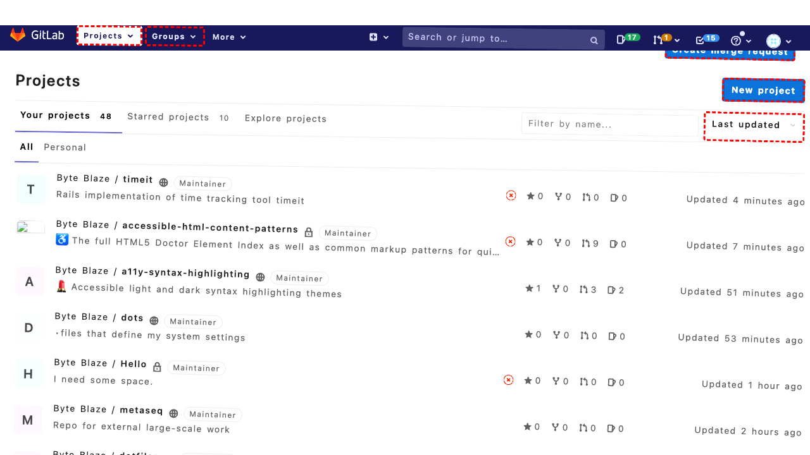
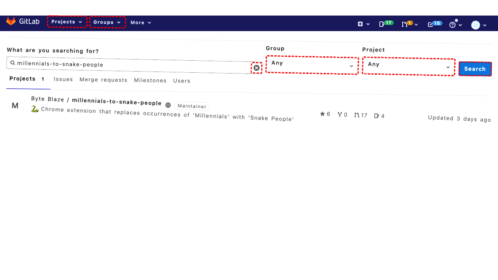
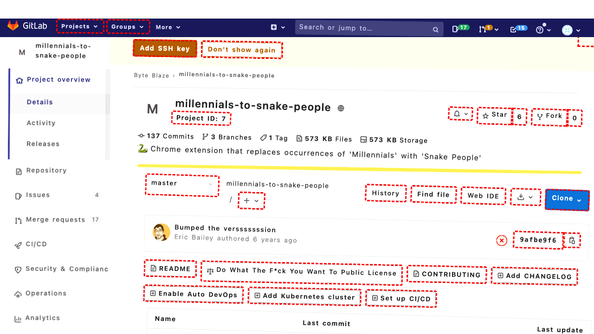
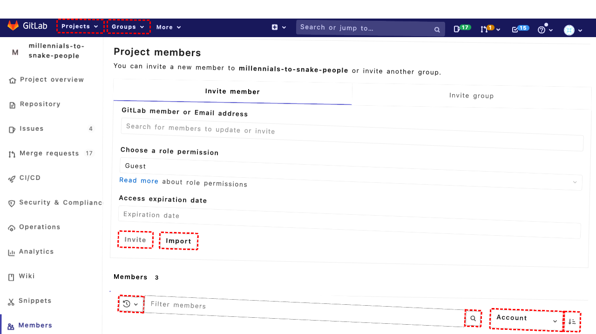
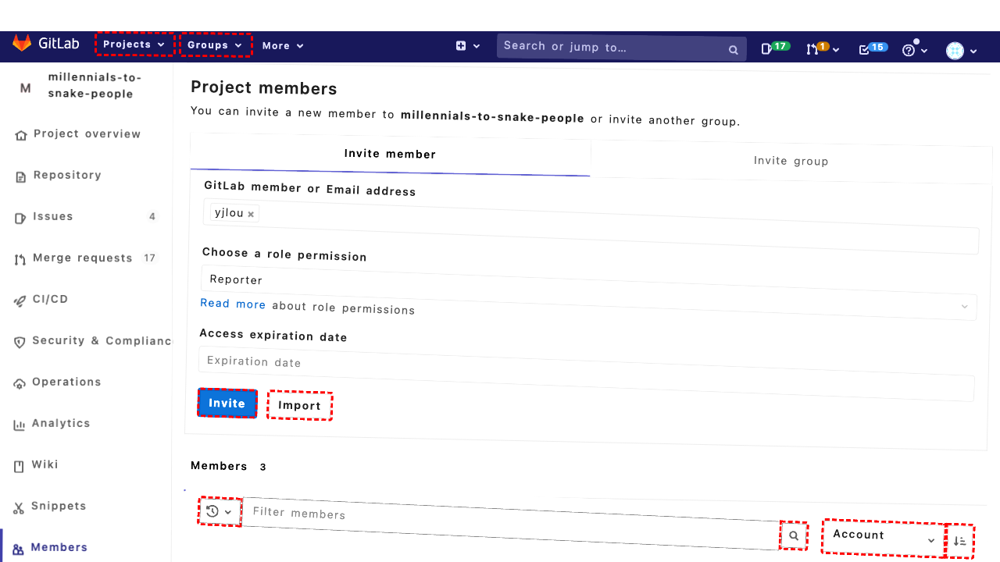

## Intent

Create an issue in a11yproject repo with title "401 bad gateway". Assign the issue to Roshanjossey. Set due date to be the end of 2030

## RM

Thoughts: This is a content modification task where the user wants to create an issue with specific details. The action history shows the agent performed a series of clicks and fills to create the issue, set the title, assignee, and due date. The final state of the webpage confirms that the issue was successfully created with the correct title "401 bad gateway", assigned to "Roshanjossey", and with the due date set to "Dec 31, 2030" (which is the end of 2030). All requirements from the user intent have been met, so the execution is successful.

Status: success

## Final Response "Successfully created issue #612 with title '401 bad gateway' in the a11yproject repository. The issue has been assigned to Roshanjossey and the due date is set to December 31, 2030."

## Captions

===============Looking at the goal, I need to create an issue in the "a11yproject" repository with specific details. From the current page, I can see the "a11yproject/a11yproject.com" repository listed in the projects. I should navigate to that repository first to access its issues section.

The repository link for "The A11Y Project / a11yproject.com" has bid '526' according to the accessibility tree. I'll click on this to navigate to the repository page where I can then create a new issue.
===============Looking at the current state, I can see I'm on the a11yproject/a11yproject.com repository page. I can see there's an "Issues" link in the sidebar with bid '283' that shows "Issues 41". I need to navigate to the issues section first to create a new issue.
===============Looking at the current page, I can see I'm on the Issues page for the a11yproject repository. I can see a "New issue" link with bid '492' in the accessibility tree. This is exactly what I need to click to start creating a new issue with the specified title "401 bad gateway", assign it to Roshanjossey, and set the due date to the end of 2030.
===============Looking at the current page, I can see I'm on the "New Issue" page for the a11yproject repository. The accessibility tree shows:

- A title textbox with bid '479' (currently focused)
- An assignee dropdown with bid '572' showing "Unassigned"
- A due date textbox with bid '688' showing "Select due date"
- A submit button with bid '694' (currently disabled)

I need to:
1. Fill in the title "401 bad gateway"
2. Assign to Roshanjossey
3. Set due date to end of 2030 (December 31, 2030)
4. Submit the issue

The submit button is currently disabled because the required title field is empty. I'll start by filling the title field.
===============Looking at the current state, I can see the title field has been filled with "401 bad gateway". Now I need to assign the issue to Roshanjossey. The assignee dropdown has bid '572' and shows "Unassigned". I need to click this dropdown to open the assignment options and select Roshanjossey.
===============Looking at the current state, I can see the assignee dropdown is now open (expanded=True) and shows a search box with bid '581' that's focused. I can see the list of assignable users includes "Roshan Jossy @Roshanjossey" with bid '713'. I need to click on this option to assign the issue to Roshanjossey.
===============Looking at the current state, I can see the issue has been assigned to Roshan Jossy (Roshanjossey). Now I need to set the due date to the end of 2030, which would be December 31, 2030. The due date field has bid '688' and currently shows "Select due date". I need to fill this field with the date in the appropriate format (likely YYYY-MM-DD).
===============Looking at the current state, I can see the due date field has been filled with "2030-12-31" (the end of 2030 as requested). All the required fields have been completed:
- Title: "401 bad gateway" ✓
- Assignee: Roshan Jossy (Roshanjossey) ✓
- Due date: 2030-12-31 ✓

The submit button (bid '694') should now be enabled since the required title field is filled. I can now submit the issue to complete the goal.
===============Looking at the current state, I can see that the issue creation was successful. The page has navigated to the newly created issue (#612) with the title "401 bad gateway". The accessibility tree shows:

- The issue title is displayed as "401 bad gateway" (bid '519')
- The assignee is correctly set to "Roshan Jossy @Roshanjossey" (bid '741')
- The due date is correctly set to "Dec 31, 2030" (bid '812')

All the requirements from the goal have been successfully completed:
- ✅ Issue created in a11yproject repo
- ✅ Title set to "401 bad gateway"
- ✅ Assigned to Roshanjossey
- ✅ Due date set to end of 2030 (December 31, 2030)

The issue has been successfully created with all the specified details. I should notify the user that the task has been completed.

## Images








## Main Prompt

```md
User Intent: Create an issue in a11yproject repo with title "401 bad gateway". Assign the issue to Roshanjossey. Set due date to be the end of 2030

Action History:
1: click("526")
2: click("283")
3: click("492")
4: fill("479", "401 bad gateway")
5: click("572")
6: click("713")
7: fill("688", "2030-12-31")
8: click("694")
9: send_msg_to_user("Successfully created issue #612 with title '401 bad gateway' in the a11yproject repository. The issue has been assigned to Roshanjossey and the due date is set to December 31, 2030.")


The detailed final state of the webpage:

```md
Looking at the current state, I can see that the issue creation was successful. The page has navigated to the newly created issue (#612) with the title "401 bad gateway". The accessibility tree shows:

- The issue title is displayed as "401 bad gateway" (bid '519')
- The assignee is correctly set to "Roshan Jossy @Roshanjossey" (bid '741')
- The due date is correctly set to "Dec 31, 2030" (bid '812')

All the requirements from the goal have been successfully completed:
- ✅ Issue created in a11yproject repo
- ✅ Title set to "401 bad gateway"
- ✅ Assigned to Roshanjossey
- ✅ Due date set to end of 2030 (December 31, 2030)

The issue has been successfully created with all the specified details. I should notify the user that the task has been completed.
```

Bot response to the user: "Successfully created issue #612 with title '401 bad gateway' in the a11yproject repository. The issue has been assigned to Roshanjossey and the due date is set to December 31, 2030.".
```
