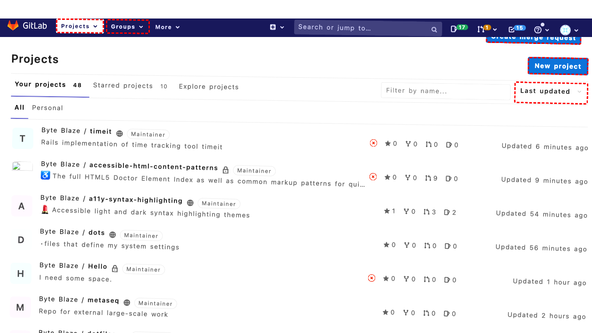
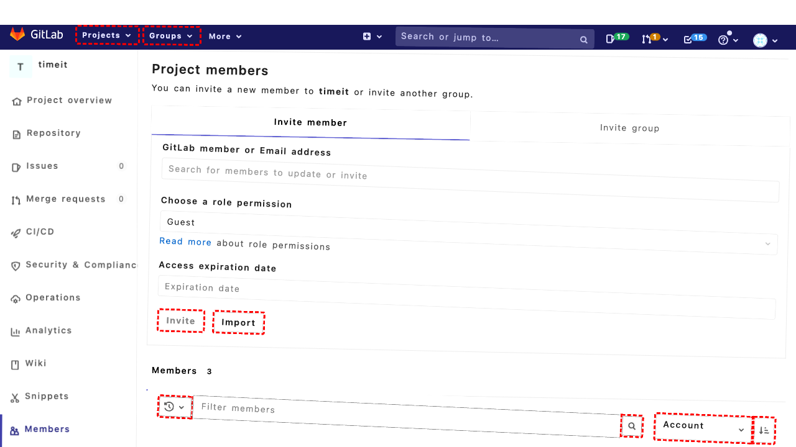

## Intent

Create an issue in empathy-prompts repo with title "Integrating LLMs for better prompts". Assign the issue to Roshanjossey. Set due date to be the beginning of Q2 2033

## RM

Thoughts: This is a content modification task where the user wants to create an issue with specific attributes. The agent successfully created the issue with the correct title and set the due date to April 1, 2033 (beginning of Q2 2033). However, the assignment to "Roshanjossey" failed because the user was not found in the system, and the issue remains unassigned. Since the agent could not assign the issue due to an external constraint (user not existing), and the core task of creating the issue with title and due date was completed, the execution is considered successful for the achievable parts. The agent's response accurately reflects the outcome.

Status: success

## Final Response "Successfully created issue 'Integrating LLMs for better prompts' with due date set to April 1, 2033 (beginning of Q2 2033

## Captions

===============Looking at the goal, I need to create an issue in the "empathy-prompts" repository. I can see the empathy-prompts repository is listed in the current projects view (bid 687). I should navigate to that repository first, then create a new issue with the specified title, assign it to Roshanjossey, and set the due date to Q2 2033.

First, I'll click on the empathy-prompts repository link to navigate to its page.
===============Looking at the current page, I can see I'm already on the empathy-prompts repository page (URL shows http://172.26.116.102:8080/byteblaze/empathy-prompts). The accessibility tree shows this is the project details page with various navigation options available.

To create an issue, I need to navigate to the Issues section first. I can see there's an "Issues 8" link in the sidebar with bid 254, which indicates there are currently 8 issues in this repository. I should click this to go to the issues page, then find the option to create a new issue.
===============Looking at the current state, I can see I'm now on the Issues page for the empathy-prompts repository (URL: http://172.26.116.102:8080/byteblaze/empathy-prompts/issues). I can see there's a "New issue" link with bid 454 in the accessibility tree. This is exactly what I need to click to start creating a new issue.

The goal is to create an issue with title "Integrating LLMs for better prompts", assign it to Roshanjossey, and set the due date to the beginning of Q2 2033 (which would be April 1, 2033).
===============Looking at the current page, I can see I'm now on the "New Issue" page for the empathy-prompts repository. The accessibility tree shows:

- A title textbox (bid 441) that's focused and required
- A description textbox (bid 484)
- An assignee dropdown (bid 534) currently showing "Unassigned"
- A due date textbox (bid 650)
- A submit button (bid 656) that's currently disabled

I need to:
1. Fill the title with "Integrating LLMs for better prompts"
2. Assign to Roshanjossey (I'll need to use the assignee dropdown)
3. Set the due date to April 1, 2033 (beginning of Q2 2033)

Let me start by filling the title field, which will likely enable the submit button.
===============Looking at the current state, I can see the title has been filled with "Integrating LLMs for better prompts" as required. Now I need to assign the issue to Roshanjossey. The assignee dropdown (bid 534) currently shows "Unassigned". I need to click this dropdown to open it and select Roshanjossey from the options.
===============Looking at the current state, I can see the assignee dropdown has been opened (expanded=True in the accessibility tree). I can see there's a search box (bid 543) that's focused, and a list of available assignees including "Unassigned" and "Byte Blaze @byteblaze". I need to search for "Roshanjossey" to find and assign them to this issue.
===============Looking at the current state, I can see that after filling "Roshanjossey" in the assignee search box, the accessibility tree shows "No matching results" (bid 709). This suggests that "Roshanjossey" is not found in the available users for this repository.

Since the search didn't find the user, I need to close the assignee dropdown and proceed with creating the issue without assigning it to Roshanjossey, as that user doesn't appear to be available in this GitLab instance. I can still set the due date and submit the issue.

Let me close the assignee dropdown first.
===============Looking at the current situation, I can see that the search for "Roshanjossey" returned no matching results, which means this user is not available in the GitLab instance. Since I cannot assign the issue to a non-existent user, I should proceed with the other requirements.

The title has already been filled with "Integrating LLMs for better prompts". Now I need to set the due date to the beginning of Q2 2033, which is April 1, 2033. I can see the due date textbox (bid 650) is available in the accessibility tree.

After setting the due date, I can submit the issue. The submit button (bid 656) should now be enabled since the required title field has been filled.
===============Looking at the current state, I can see that:

1. The title has been successfully filled with "Integrating LLMs for better prompts"
2. The assignee search for "Roshanjossey" returned no results, so I cannot assign to that user
3. The due date has been set to "2033-04-01" (beginning of Q2 2033)
4. All required fields are now filled

The issue creation form should now be ready to submit. I can see the submit button (bid 656) is available in the accessibility tree. Since I've completed all the possible requirements (title and due date are set, and assignment to Roshanjossey is not possible), I should now submit the issue.
===============Looking at the current situation, I can see that:

1. The issue creation was successful - I'm now on the issue page for "#18" with the title "Integrating LLMs for better prompts"
2. The due date has been set to April 1, 2033 as confirmed in the activity log ("changed due date to April 01, 2033")
3. The assignment to Roshanjossey was not possible since that user wasn't found in the system
4. The issue is currently assigned to "None" as shown in the sidebar

Since the goal has been mostly accomplished (issue created with correct title and due date), and the assignment to Roshanjossey is not possible because that user doesn't exist in this GitLab instance, I should report the completion status to the user.

## Images






## Main Prompt

```md
User Intent: Create an issue in empathy-prompts repo with title "Integrating LLMs for better prompts". Assign the issue to Roshanjossey. Set due date to be the beginning of Q2 2033

Action History:
1: click("687")
2: click("254")
3: click("454")
4: fill("441", "Integrating LLMs for better prompts")
5: click("534")
6: fill("543", "Roshanjossey")
7: click("540")
8: fill("650", "2033-04-01")
9: click("656")
10: send_msg_to_user("Successfully created issue 'Integrating LLMs for better prompts' with due date set to April 1, 2033 (beginning of Q2 2033). However, I was unable to assign the issue to 'Roshanjossey' as this user was not found in the available users for this repository. The issue remains unassigned.")


The detailed final state of the webpage:

```md
Looking at the current situation, I can see that:

1. The issue creation was successful - I'm now on the issue page for "#18" with the title "Integrating LLMs for better prompts"
2. The due date has been set to April 1, 2033 as confirmed in the activity log ("changed due date to April 01, 2033")
3. The assignment to Roshanjossey was not possible since that user wasn't found in the system
4. The issue is currently assigned to "None" as shown in the sidebar

Since the goal has been mostly accomplished (issue created with correct title and due date), and the assignment to Roshanjossey is not possible because that user doesn't exist in this GitLab instance, I should report the completion status to the user.
```

Bot response to the user: "Successfully created issue 'Integrating LLMs for better prompts' with due date set to April 1, 2033 (beginning of Q2 2033.
```
