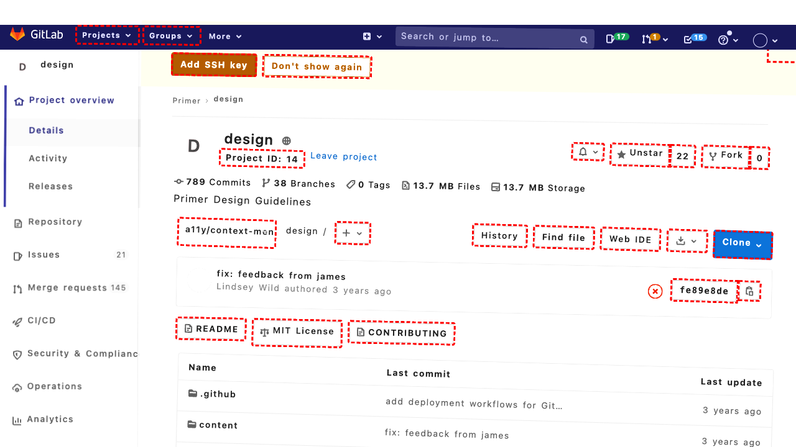
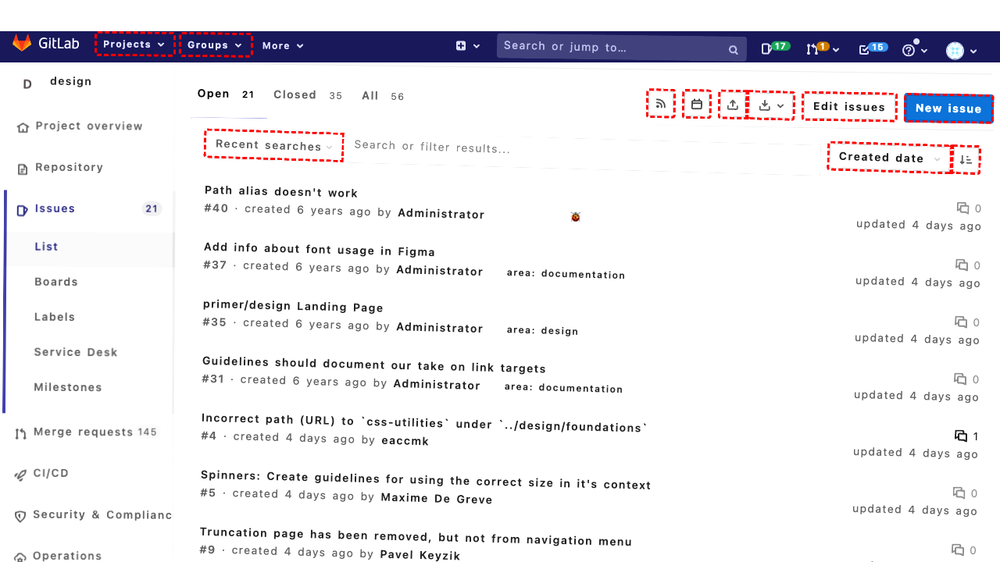
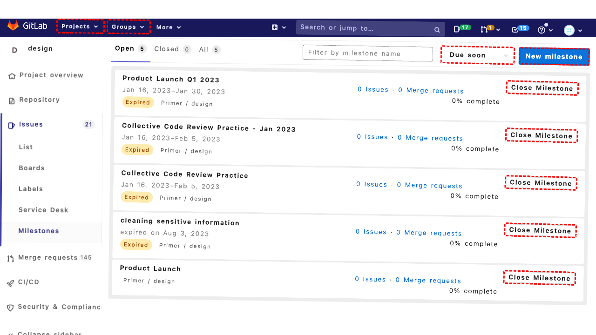
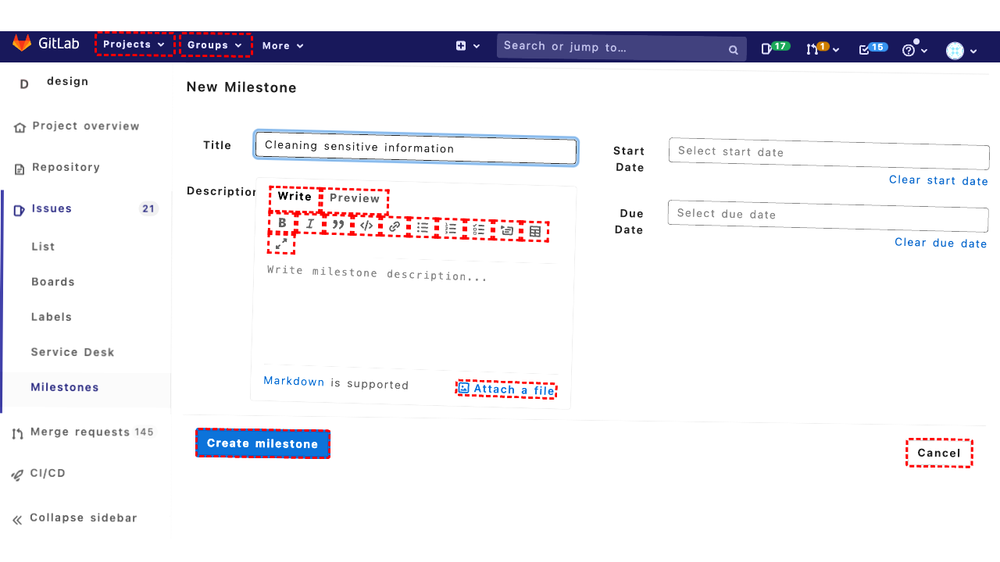
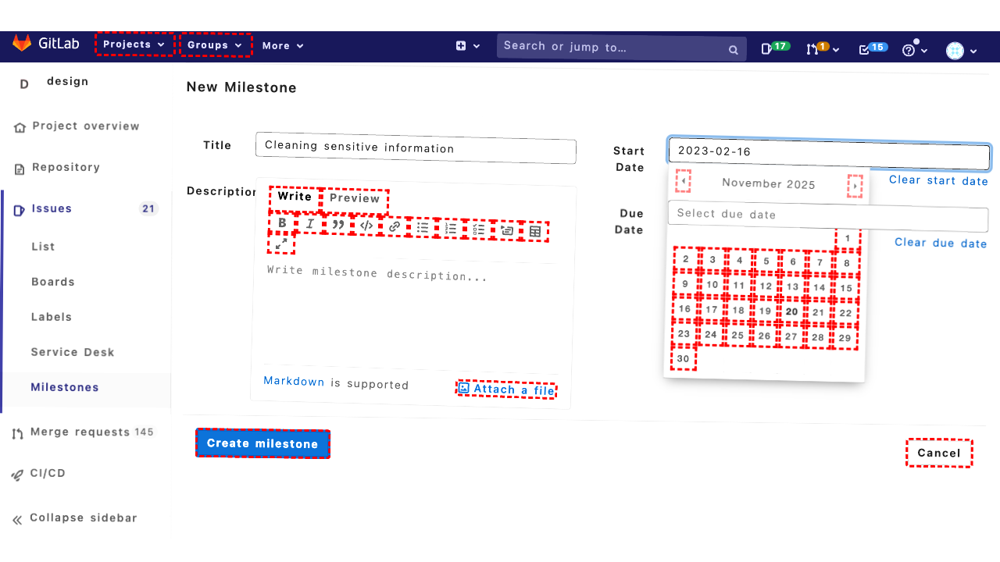
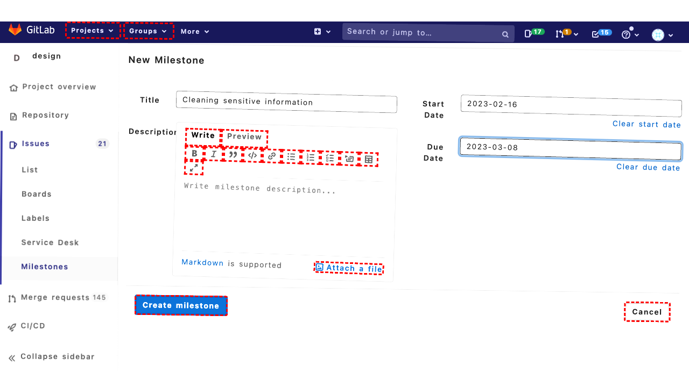
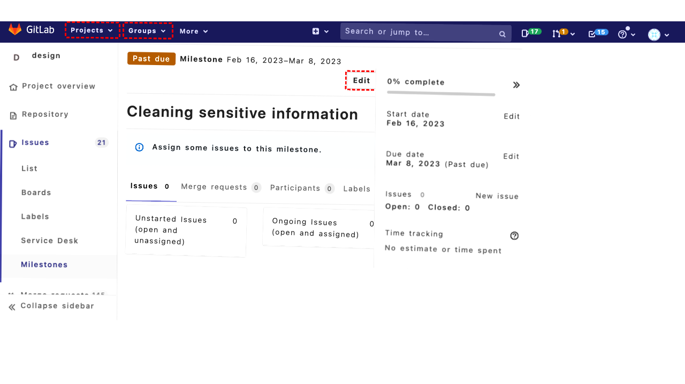

## Intent

Open an issue to report experiencing "OSError: [Errno 98] Address already in use" during executions in aem-hacker.

## RM

Thoughts: The user's intent is to open an issue to report an error, which falls under the "Content modification" task type as it involves creating a new issue (modifying the content of the repository's issue tracker). The action history shows the agent successfully searched for and selected the repository, navigated to the issue creation page, filled in the title and description fields with relevant content, and clicked the submit button. The final state confirms that the title and description are appropriately filled and the submit button is enabled, indicating the issue is ready to be created. Since the agent completed all necessary steps to create the issue, the task is successful.

Status: success

## Final Response 

## Captions

===============Looking at the goal to open an issue about "OSError: [Errno 98] Address already in use" in aem-hacker, I need to first navigate to the aem-hacker repository. I can see from the current page that I'm on the GitLab dashboard with a list of projects, but I don't see "aem-hacker" in the visible projects list. I should search for it using the search functionality.

I can see there's a search box with ID '143' in the accessibility tree that has the label "Search or jump to…". This appears to be the main search box in the navigation. I'll use this to search for the aem-hacker repository.
===============Looking at the error message, the element with bid "284" wasn't found. Let me examine the current page more carefully. I can see in the accessibility tree that there is a search result for "0ang3el / aem-hacker" with various elements including a link to the repository. The repository link appears to have bid '285' (the heading link) rather than '284'. Let me try clicking on the repository link directly using the correct bid.
===============Looking at the current state, I can see I'm already on the aem-hacker repository page (Tab 0 shows "0ang3el / aem-hacker · GitLab"). The accessibility tree shows there's an "Issues" link with bid '279' that shows "Issues 12" - this is exactly what I need to click to navigate to the issues section where I can create a new issue.

Since I'm already on the correct repository page, I should click the Issues link to access the issues functionality.
===============Looking at the current state, I can see I'm now on the Issues page for the aem-hacker repository (Tab 0 shows "Issues · 0ang3el / aem-hacker · GitLab"). The accessibility tree shows there's a "New issue" link with bid '430' that I can click to create a new issue. This is exactly what I need to accomplish the goal of opening an issue to report the "OSError: [Errno 98] Address already in use" error.
===============Looking at the current state, I can see I'm on the "New Issue" page for the aem-hacker repository (Tab 0 title confirms this). The accessibility tree shows the issue creation form is loaded with:

- A title textbox (bid '420') that is focused and required
- A description textbox (bid '461')
- A submit button (bid '506') that is currently disabled

Since I'm already on the new issue creation page, I need to fill out the form with the issue details about the "OSError: [Errno 98] Address already in use" error. The submit button is disabled because the required title field is empty. I should first fill in the title field to enable the submit button.
===============Looking at the current state, I can see that the title field has been filled with "OSError: [Errno 98] Address already in use during execution" and the submit button (bid '506') should now be enabled. The goal is to create an issue reporting this error, so I need to add a description to provide more context about the problem, then submit the issue.

The description field has bid '461' and I should provide details about when and how this error occurs during aem-hacker executions.
===============Looking at the current state, I can see that both the title and description fields have been filled with appropriate content about the "OSError: [Errno 98] Address already in use" issue. The submit button (bid '506') should now be enabled and ready to create the issue. Since all the required information has been provided, I should click the submit button to create the issue and complete the goal.

## Images









## Main Prompt

```md
User Intent: Open an issue to report experiencing "OSError: [Errno 98] Address already in use" during executions in aem-hacker.

Action History:
1: search_and_select_repository('143', 'aem-hacker', '284')
2: click('285')
3: click('279')
4: click('430')
5: fill('420', 'OSError: [Errno 98] Address already in use during execution')
6: fill('461', 'I am experiencing "OSError: [Errno 98] Address already in use" when running aem-hacker. This error typically occurs when the specified port is already occupied by another process. This happens during execution and prevents the tool from starting properly.')
7: click('506')


The detailed final state of the webpage:

```md
Looking at the current state, I can see that both the title and description fields have been filled with appropriate content about the "OSError: [Errno 98] Address already in use" issue. The submit button (bid '506') should now be enabled and ready to create the issue. Since all the required information has been provided, I should click the submit button to create the issue and complete the goal.
```

Bot response to the user: None.
```
