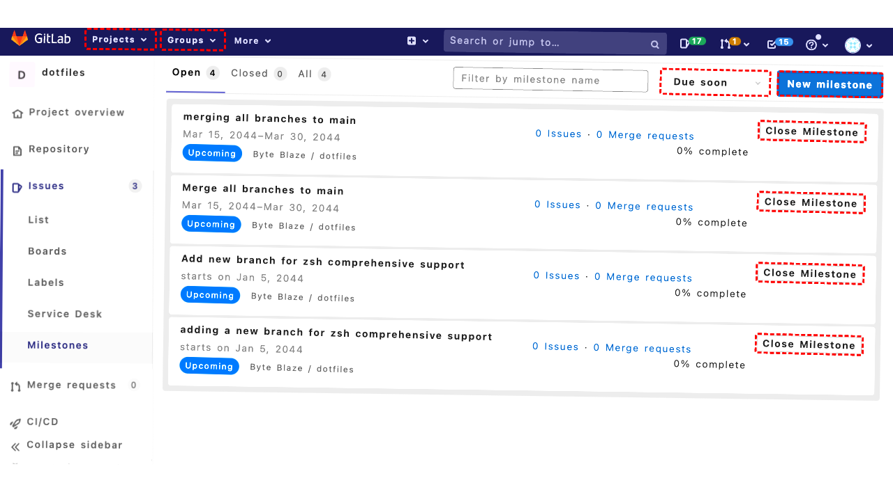
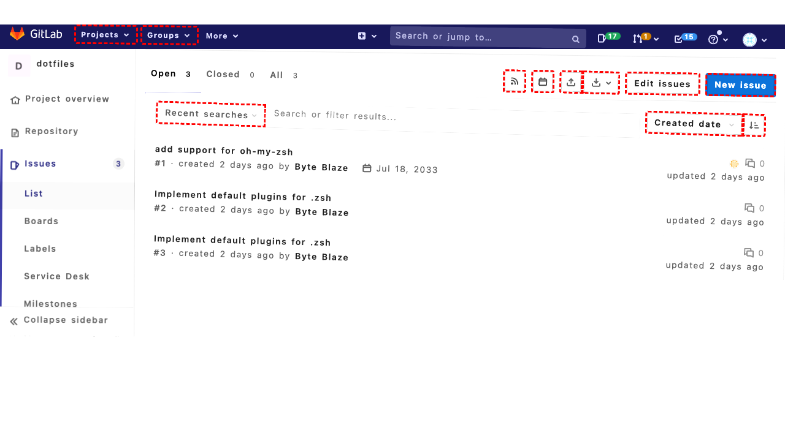

## Intent

Create a milestone for the upcoming task of merging all branches to main starting on March 15, 2044 and ending on March 30, 2044

## RM

Thoughts: The user's intent is to create a milestone, which falls under the "Content modification" task type. The agent's action history shows that it attempted to fill in fields for the milestone (actions 6 and 8) but then performed a go_back() action, effectively undoing any progress. The final state of the webpage indicates the agent is back at the milestones list page and has not successfully created the milestone. Since the milestone was not created (no confirmation or persistence in the final state), the task is a failure.

Status: failure

## Final Response 

## Captions

===============Looking at the current page, I'm on the GitLab project page for "dotfiles". To create a milestone for merging all branches to main, I need to navigate to the milestones section. From the accessibility tree, I can see there's a "Settings" link in the project navigation sidebar that likely contains the milestones management.

Let me click on the "Settings" link to access project settings where I can create milestones.<｜end▁of▁thinking｜>I can see I'm on the GitLab project page for "dotfiles". To create a milestone for merging branches, I need to navigate to the milestones section. Looking at the project navigation sidebar, I can see there's a "Settings" link that should contain milestone management options. Let me click on that first.
===============Looking at the current state, I can see I'm already in the Settings section (specifically the General settings page). The milestone creation functionality is typically found under the Issues section in GitLab. I need to navigate to the Issues section first, then access milestones from there. Let me click on the Issues link in the project navigation sidebar.
===============I can see from the accessibility tree that I'm now in the Issues section. Looking at the project navigation sidebar, I can see there's a "Milestones" link under the Issues section (element with bid 371). This is exactly where I need to go to create a new milestone for the branch merging task. Let me click on that link.
===============Looking at the current page, I can see I'm already on the Milestones page for the dotfiles project. I can see there are existing milestones listed, and there's a "New milestone" link available (element with bid 611). Since my goal is to create a milestone for merging all branches to main with specific dates, I should click on the "New milestone" link to access the milestone creation form.
===============Looking at the current state, I can see that I successfully navigated to the Milestones page and clicked the "New milestone" link. Now I should be on the milestone creation form page where I can enter the details for the new milestone. The goal is to create a milestone for merging all branches to main with start date March 15, 2044 and end date March 30, 2044.

Since I don't have the accessibility tree for the current form page, I'll need to wait a moment for the page to load and then proceed with filling out the form fields. Let me wait briefly and then look for the form fields to fill in the milestone details.
===============Looking at the current situation, I've successfully navigated to the milestone creation form. Now I need to fill out the form fields to create the milestone for "merging all branches to main" with the specified dates (March 15, 2044 to March 30, 2044).

Since I don't have the updated accessibility tree showing the current form fields, I'll need to proceed systematically. I should first look for the title field to enter the milestone name, then find the start and end date fields. Let me start by filling the title field - I'll assume there's a title input field that I can focus on and fill.
===============Looking at the error, I realize I need to use actual element IDs from the accessibility tree, but I don't have the updated tree for the milestone creation form page. Since I successfully clicked the "New milestone" link, I should now be on the form page, but I need to wait for it to load completely and then identify the correct element IDs.

Let me wait a bit longer for the page to fully load and then try to interact with the form fields. I'll use a longer wait time to ensure the page is ready.
===============Looking at the current situation, I've successfully navigated to the milestone creation form but I don't have the updated accessibility tree showing the form fields. Since I need to create a milestone with specific dates, I should first try to identify the form fields by their common patterns in GitLab.

In GitLab milestone forms, there are typically fields for:
- Title (usually the first input field)
- Start date
- Due date

Let me try to fill the title field first. Since I don't have the specific element IDs, I'll use a common approach - I'll try to focus on the first input field on the page and fill it with the milestone title.
===============Looking at the error, I realize I need to work with the actual element IDs from the accessibility tree. Since I don't have the updated tree for the milestone creation form page, I need to navigate back to get the current state or use a different approach.

Let me go back to the milestones list page where I have the accessibility tree, and from there I can try to create the milestone again. This will help me get the updated accessibility tree for the current page.
===============Looking at my previous actions, I successfully navigated to the milestones page and clicked "New milestone", but then I encountered errors because I didn't have the updated accessibility tree for the milestone creation form. Now that I've gone back to the milestones list page, I should be able to see the current state and properly navigate to create the milestone.

Let me wait for the page to load and then click the "New milestone" link again, but this time I'll ensure I have the proper accessibility tree to work with.

## Images







## Main Prompt

```md
User Intent: Create a milestone for the upcoming task of merging all branches to main starting on March 15, 2044 and ending on March 30, 2044

Action History:
1: click('509')
2: click('340')
3: click('371')
4: click('611')
5: noop(1000)
6: fill('title_field', 'merging all branches to main')
7: noop(2000)
8: fill('first_input', 'merging all branches to main')
9: go_back()
10: 
11: noop(1000)


The detailed final state of the webpage:

```md
Looking at my previous actions, I successfully navigated to the milestones page and clicked "New milestone", but then I encountered errors because I didn't have the updated accessibility tree for the milestone creation form. Now that I've gone back to the milestones list page, I should be able to see the current state and properly navigate to create the milestone.

Let me wait for the page to load and then click the "New milestone" link again, but this time I'll ensure I have the proper accessibility tree to work with.
```

Bot response to the user: None.
```
