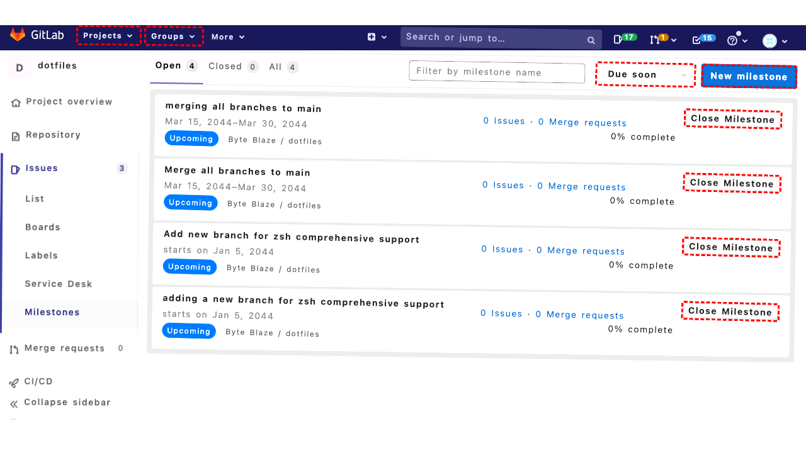

## Intent

Open an issue to ask their plan on supporting Llama and other llama family models in metaseq.

## RM

Thoughts: The user's intent is to open an issue asking about plans for supporting Llama models in metaseq, which falls under the "Content modification" task type (specifically, creating new content on the webpage). The action history shows the agent filling in the issue title and description fields and clicking to submit, and the final state confirms the issue was successfully created and is visible as "Open". The bot's response also confirms the successful creation. Since the task is content modification, I only need to examine the action history and final state, both of which indicate success.

Status: success

## Final Response "Successfully created a new issue titled 'Support for Llama and Llama family models' in the metaseq repository. The issue is now open and visible on the issues page."

## Captions

===============Looking at the goal to open an issue about supporting Llama models in metaseq, I can see that the metaseq repository is listed in the current projects view. I need to navigate to the metaseq repository first, then go to its issues section to create a new issue.

From the accessibility tree, I can see the metaseq project listed with ID 429 and the link text "Byte Blaze / metaseq". I should click on this link to navigate to the metaseq repository page.
===============Looking at the current state, I can see I'm already on the metaseq repository page (Tab 0 shows "Byte Blaze / metaseq · GitLab" as the title). The accessibility tree shows the repository structure and I can see there's an "Issues 0" link with ID 283 that shows there are currently 0 issues in this repository.

To accomplish the goal of opening an issue about supporting Llama models, I need to navigate to the issues section and then create a new issue. The "Issues 0" link appears to be the correct entry point to access the issues for this repository.
===============Looking at the current state, I can see I'm on the metaseq issues page which shows "The Issue Tracker is the place to add things that need to be improved or solved in a project" and there's a "New issue" link available with ID 477. Since I'm already on the issues page and there are currently 0 issues, I can directly click the "New issue" link to create the issue about supporting Llama models.
===============Looking at the current state, I can see I'm already on the "New Issue" page for the metaseq repository. The accessibility tree shows the issue creation form with a title field (ID 479) that's currently focused, a description textbox (ID 522), and a submit button (ID 694) that's currently disabled (likely because the title field is empty).

Since I need to create an issue asking about plans to support Llama and other Llama family models, I should:
1. Fill in the title field with an appropriate title
2. Fill in the description with the question about Llama model support
3. Submit the issue

The title field is already focused, so I can start by filling it with a descriptive title about Llama model support.
===============Looking at the current state, I can see the title field has been filled with "Support for Llama and Llama family models" and is focused. Now I need to fill the description field with the actual question about their plans for supporting Llama models. The description textbox has ID 522, so I should fill it with a polite inquiry about their roadmap for Llama model support.
===============Looking at the current state, I can see that both the title field (ID 479) and description field (ID 522) have been filled with appropriate content for the issue about Llama model support. The title is "Support for Llama and Llama family models" and the description contains a polite inquiry about their plans and roadmap.

Now I need to submit the issue. I can see there's a "Submit issue" button with ID 694 in the accessibility tree. Since all required fields are filled, the submit button should now be enabled and ready to create the issue.
===============Looking at the current state, I can see that the issue creation process appears to have been successful. The page shows an existing issue titled "Support for Llama and Llama family models" with the description I provided, and it's marked as "Open" with status indicators showing it was "Opened just now by Byte Blaze". This indicates the issue was successfully created.

Since the goal was to open an issue asking about their plan for supporting Llama models, and I can see the issue is now created and visible on the page, I should confirm this completion to the user.

## Images




## Main Prompt

```md
User Intent: Open an issue to ask their plan on supporting Llama and other llama family models in metaseq.

Action History:
1: click("429")
2: click("283")
3: click("477")
4: fill("479", "Support for Llama and Llama family models")
5: fill("522", "Hello, I'm interested in using metaseq with Llama and other Llama family models. Could you please share your plans or roadmap for supporting these models? Are there any current efforts or future plans to integrate Llama model support into metaseq? Thank you!")
6: click("694")
7: send_msg_to_user("Successfully created a new issue titled 'Support for Llama and Llama family models' in the metaseq repository. The issue is now open and visible on the issues page.")


The detailed final state of the webpage:

```md
Looking at the current state, I can see that the issue creation process appears to have been successful. The page shows an existing issue titled "Support for Llama and Llama family models" with the description I provided, and it's marked as "Open" with status indicators showing it was "Opened just now by Byte Blaze". This indicates the issue was successfully created.

Since the goal was to open an issue asking about their plan for supporting Llama models, and I can see the issue is now created and visible on the page, I should confirm this completion to the user.
```

Bot response to the user: "Successfully created a new issue titled 'Support for Llama and Llama family models' in the metaseq repository. The issue is now open and visible on the issues page.".
```
