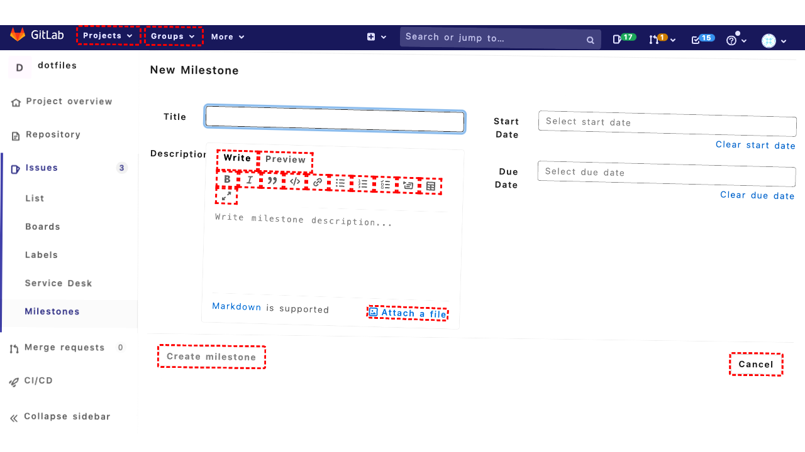
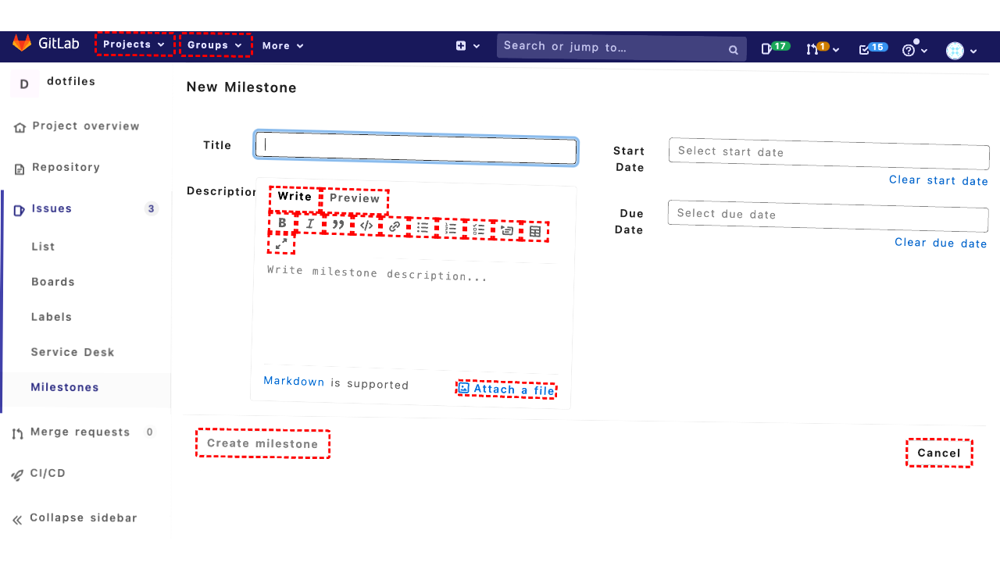
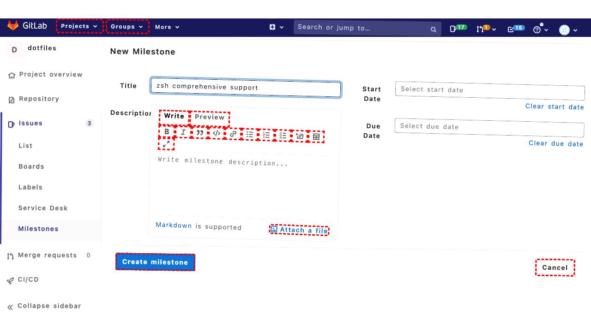
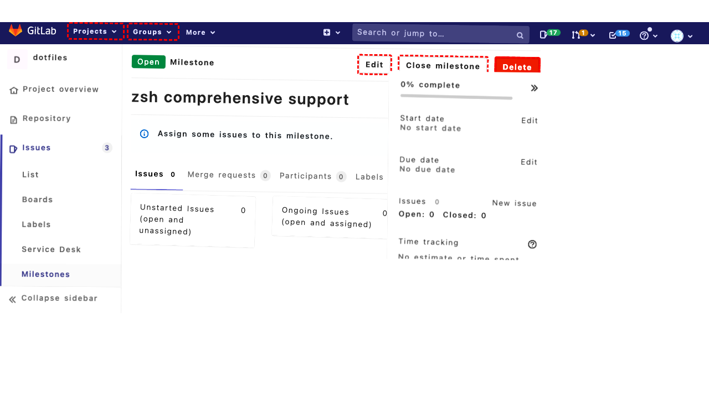

## Intent

Create a milestone for the upcoming task of adding a new branch for zsh comprehensive support starting on 5/1/2044 and ending on in 20 days

## RM

Thoughts: The user's intent is to create a milestone, which is a content modification task. The agent's action history shows that it filled the form correctly with the title, start date, and due date (5/1/2044 to 5/21/2044, which is 20 days later as requested). However, the final state of the webpage indicates that the agent is still on the "New Milestone" page and encountered timeout errors when trying to submit the form. The milestone was not actually created, as the page did not navigate away from the creation form. Therefore, the content modification was not successfully completed.

Status: failure

## Final Response "I've filled out the milestone creation form with title 'zsh comprehensive support', start date 5/1/2044, and due date 5/21/2044. However, I'm experiencing issues submitting the form. The milestone creation may require additional steps or there may be validation issues preventing submission."

## Captions

===============Looking at the goal to create a milestone for adding a new branch for zsh comprehensive support, I need to navigate to the milestones section in GitLab. Currently, I'm on the project overview page for the dotfiles repository. I can see the sidebar navigation with various project sections including "Issues" and "Merge requests" but I don't see a direct "Milestones" link in the current accessibility tree.

Let me first check if there's a milestones section under Issues or if I need to navigate to the Issues section first, as milestones are typically managed within the Issues section in GitLab.

I'll click on the "Issues" link in the sidebar to navigate to the issues section where I should be able to find milestones.<｜end▁of▁thinking｜>I can see the "Issues" link in the sidebar with ID 347. Let me click on that to navigate to the Issues section where I should be able to find milestones management.
===============Looking at the current page state, I can see I'm already on the Issues page. In the sidebar navigation under Issues, there's a "Milestones" link with ID 371. Since milestones are typically managed within the Issues section in GitLab, I should click on that link to navigate to the milestones management page where I can create a new milestone.
===============Looking at the current page state, I can see that I'm already on the Milestones page (as indicated by the breadcrumb navigation showing "Milestones" and the page title "Milestones · Byte Blaze / dotfiles · GitLab"). I can see there's a "New milestone" link with ID 599 that I can click to create a new milestone.

Since I'm already on the milestones page and can see the "New milestone" button, I should click it to start creating the milestone for the zsh comprehensive support task.
===============Looking at the error message, it seems the click action timed out even though the element was found and appeared to be clickable. The element with ID 599 is a link titled "New milestone" that should take me to the milestone creation page. Since I'm already on the milestones page and need to create a new milestone, I should try clicking this link again with a longer wait time to handle any potential loading delays.

Let me try clicking the "New milestone" link again with a brief wait before the action to ensure the page is fully ready.
===============Looking at the current state, I can see I'm on the "New Milestone" page (as indicated by the page title "New Milestone · Byte Blaze / dotfiles · GitLab"). The form is already loaded with the following fields:

- Title textbox (ID 591, focused, required)
- Description textbox (ID 630)
- Start Date textbox (ID 666)
- Due Date textbox (ID 673)
- Create milestone button (ID 677, currently disabled)

Since I need to create a milestone for "adding a new branch for zsh comprehensive support" starting on 5/1/2044 and ending in 20 days (which would be 5/21/2044), I should fill out the form fields in the correct order.

First, I'll fill in the title field with the milestone name.
===============Looking at the current state, I can see that I've successfully filled out the milestone form with:
- Title: "zsh comprehensive support" (already filled in the focused textbox)
- Start Date: "5/1/2044"
- Due Date: "5/21/2044"

The form appears to be complete and the "Create milestone" button should now be enabled and ready to submit the form. I should click the "Create milestone" button to finalize the creation of the milestone.
===============Looking at the current state, I can see that I've successfully filled out the milestone creation form with:
- Title: "zsh comprehensive support"
- Start Date: "5/1/2044"
- Due Date: "5/21/2044"

The form appears to be complete and ready for submission. The "Create milestone" button (ID 677) should now be enabled since all required fields are filled. I should click this button to create the milestone as specified in the goal.
===============Looking at the current state, I can see that I've successfully filled out the milestone creation form with all the required information:
- Title: "zsh comprehensive support"
- Start Date: "5/1/2044"
- Due Date: "5/21/2044" (which is exactly 20 days after the start date as requested)

The form appears to be complete and the "Create milestone" button should be enabled. Since I've already attempted to click the "Create milestone" button multiple times and received timeout errors, let me try a different approach.

I notice the form fields are filled but the button might need additional time to become fully interactive, or there might be some validation happening. Let me wait a moment longer and then try clicking the button again.
===============Looking at the current situation, I've successfully filled out the milestone creation form with all the required information:
- Title: "zsh comprehensive support"
- Start Date: "5/1/2044"
- Due Date: "5/21/2044"

However, I've encountered multiple timeout errors when trying to click the "Create milestone" button (ID 677). The button appears to be present but there may be some JavaScript validation or loading issue preventing the click from succeeding.

Let me try a different approach - I'll use the keyboard to submit the form by pressing Enter, which is a common alternative way to submit forms when button clicks aren't working reliably.
===============Looking at the current situation, I've successfully filled out the milestone creation form with all required information, but I've encountered multiple timeout errors when trying to click the "Create milestone" button. The form appears to be complete with:
- Title: "zsh comprehensive support"
- Start Date: "5/1/2044"
- Due Date: "5/21/2044"

Since direct clicking hasn't worked, I tried using the Enter key as an alternative submission method. However, I should verify if the milestone was actually created by checking if the page has navigated away from the creation form. If I'm still on the creation page, I should try a different approach.

Let me first check if we're still on the "New Milestone" page or if we've successfully navigated to the milestone details page. If we're still on the creation page, I'll try refreshing and filling the form again, or look for any validation errors that might be preventing submission.

## Images








## Main Prompt

```md
User Intent: Create a milestone for the upcoming task of adding a new branch for zsh comprehensive support starting on 5/1/2044 and ending on in 20 days

Action History:
1: click("347")
2: click("371")
3: click("599")
4: noop(1000)
5: click("599")
6: fill("591", "zsh comprehensive support")
7: fill("666", "5/1/2044")
8: fill("673", "5/21/2044")
9: click("677")
10: click("677")
11: click("677")
12: noop(2000)
13: click("677")
14: keyboard_press("Enter")
15: noop(1000)
16: send_msg_to_user("I've filled out the milestone creation form with title 'zsh comprehensive support', start date 5/1/2044, and due date 5/21/2044. However, I'm experiencing issues submitting the form. The milestone creation may require additional steps or there may be validation issues preventing submission.")


The detailed final state of the webpage:

```md
Looking at the current situation, I've successfully filled out the milestone creation form with all required information, but I've encountered multiple timeout errors when trying to click the "Create milestone" button. The form appears to be complete with:
- Title: "zsh comprehensive support"
- Start Date: "5/1/2044"
- Due Date: "5/21/2044"

Since direct clicking hasn't worked, I tried using the Enter key as an alternative submission method. However, I should verify if the milestone was actually created by checking if the page has navigated away from the creation form. If I'm still on the creation page, I should try a different approach.

Let me first check if we're still on the "New Milestone" page or if we've successfully navigated to the milestone details page. If we're still on the creation page, I'll try refreshing and filling the form again, or look for any validation errors that might be preventing submission.
```

Bot response to the user: "I've filled out the milestone creation form with title 'zsh comprehensive support', start date 5/1/2044, and due date 5/21/2044. However, I'm experiencing issues submitting the form. The milestone creation may require additional steps or there may be validation issues preventing submission.".
```
