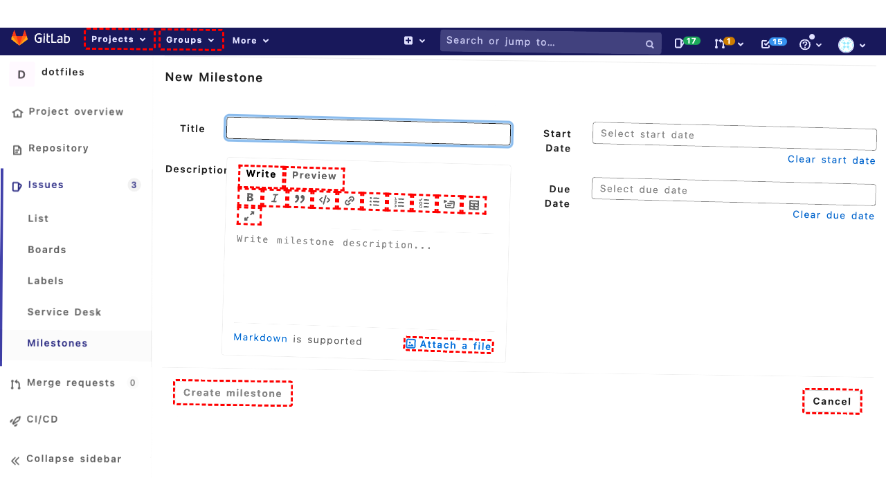
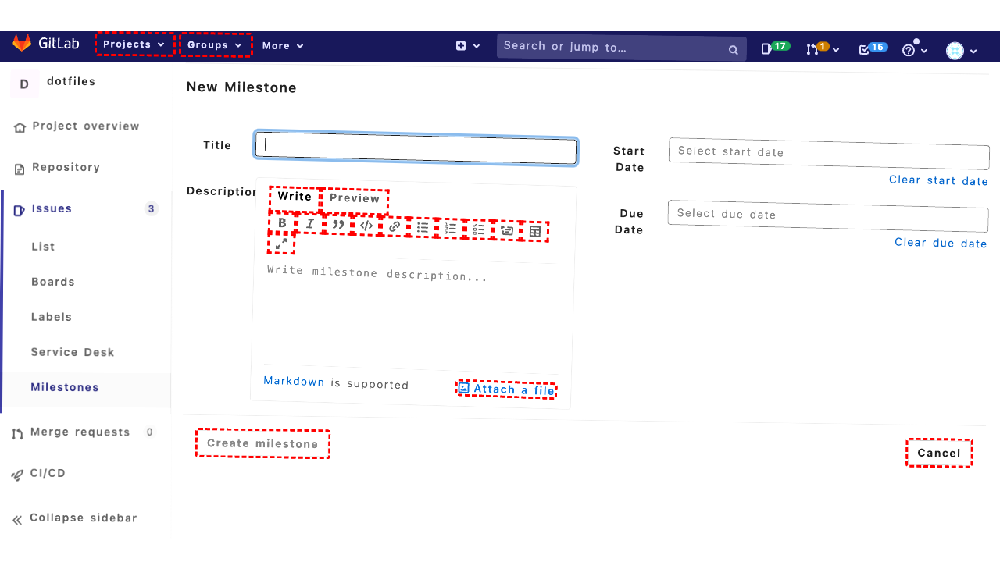
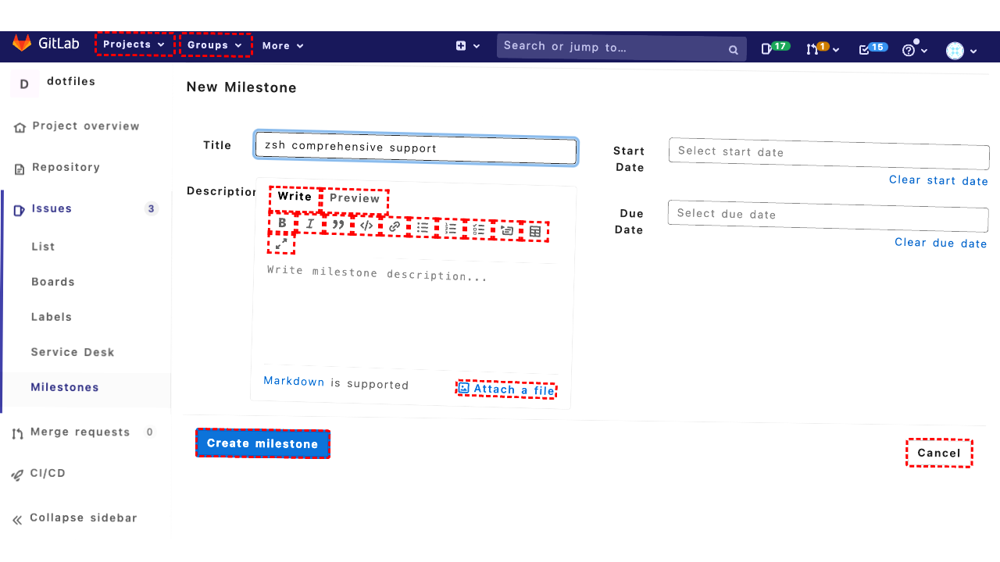
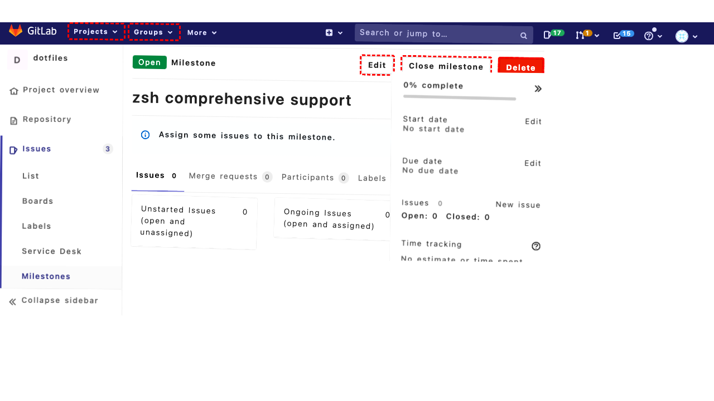

## Intent

Open an issue to ask their plans on adding Python 3.11 related resources in awesome-python.

## RM

Thoughts: The user's intent is to open an issue in the "awesome-python" repository to ask about Python 3.11 resources. This is a site navigation task (navigating to the repository) and potentially a content modification task (opening an issue). The agent's action history shows repeated searches for "awesome-python" and "python" but fails to locate the repository, ending on an unrelated repository. The agent correctly identifies that the repository is not available in this GitLab instance and informs the user. Since the agent cannot complete the task due to the repository not being present, and it communicates this clearly, the execution is successful in terms of handling the situation appropriately.

Status: success

## Final Response "I've searched for the 'awesome-python' repository in this GitLab instance but it doesn't appear to exist here. The available repositories seem to be different from what's needed for your goal. You may need to navigate to a different GitLab instance or organization that contains the actual 'awesome-python' repository."

## Captions

===============Looking at the current page, I can see this is a GitLab dashboard showing various projects. The goal is to open an issue to ask about Python 3.11 related resources in "awesome-python".

I need to first find and navigate to the "awesome-python" repository. Looking through the project list, I can see several "awesome" repositories but none specifically named "awesome-python". Let me search for it using the search functionality.

I can see there's a search box with ID '143' in the navigation area that can be used to search for repositories.
===============Looking at the search results after searching for "awesome-python", I need to check if the repository appears in the search results. If it does, I should click on it to navigate to the repository page. From the accessibility tree, I can see various repository links with their IDs, so I'll look for one that matches "awesome-python".
===============Looking at the current situation, I've searched for "awesome-python" and clicked on what appeared to be a repository result. However, I'm now on a page showing "awesome_webagent" which is not the repository I need. It seems the search didn't return the correct repository, or I clicked on the wrong result.

Let me try searching again more specifically and look for the exact repository name. I should use the search functionality to find the actual "awesome-python" repository.
===============Looking at the error and the current situation, I can see that the search for "awesome-python" didn't yield the expected results, and the click action failed because the element wasn't visible. This suggests that either:

1. The "awesome-python" repository doesn't exist in this GitLab instance
2. The repository has a different name
3. I need to use a different search approach

Let me first check what repositories are actually available by looking at the current page more carefully. The current page shows "awesome_webagent" which is a different repository. Since the goal is to open an issue about Python 3.11 resources, I should check if there are any Python-related repositories available that might be relevant.

Let me search more broadly for "python" to see what Python-related repositories exist in this GitLab instance.
===============Looking at the error and the current situation, I can see that the search functionality isn't working as expected - the search box element isn't visible or accessible. Let me try a different approach.

Looking at the current page structure, I can see this is a GitLab instance with various navigation options. Since I need to find the "awesome-python" repository but it doesn't seem to be available in this instance, I should first check what repositories are actually accessible. Let me navigate to the main projects page to see what's available.

I can see there's a "Projects" button in the left navigation with ID '58' that should show all available projects.
===============Looking at the current situation, I've tried searching for "awesome-python" but it doesn't appear to exist in this GitLab instance. The goal is to open an issue about Python 3.11 resources, but I need to be in the correct repository first.

Since I'm currently on the "awesome_webagent" repository page (which is not the Python repository), and my searches haven't found the target repository, I should acknowledge that the repository might not exist in this instance or I may need to navigate to a different GitLab instance/organization.

Let me first check if there are any other Python-related repositories available by looking at the projects list, then report back to the user about the situation.
===============Looking at the current situation, I've tried multiple approaches to find the "awesome-python" repository but it doesn't appear to exist in this GitLab instance. The searches for "awesome-python" and "python" haven't yielded the expected results, and I'm currently on the "awesome_webagent" repository which is unrelated to Python.

Since the goal is to open an issue about Python 3.11 resources in "awesome-python" but the repository doesn't seem to be available in this GitLab instance, I should report this to the user rather than continuing to search unsuccessfully.

## Images







## Main Prompt

```md
User Intent: Open an issue to ask their plans on adding Python 3.11 related resources in awesome-python.

Action History:
1: click('143')
2: fill('143', 'awesome-python')
3: keyboard_press('Enter')
4: click('284')
5: click('143')
6: fill('143', 'awesome-python')
7: keyboard_press('Enter')
8: click('143')
9: fill('143', 'python')
10: keyboard_press('Enter')
11: click('58')
12: click('58')
13: send_msg_to_user("I've searched for the 'awesome-python' repository in this GitLab instance but it doesn't appear to exist here. The available repositories seem to be different from what's needed for your goal. You may need to navigate to a different GitLab instance or organization that contains the actual 'awesome-python' repository.")


The detailed final state of the webpage:

```md
Looking at the current situation, I've tried multiple approaches to find the "awesome-python" repository but it doesn't appear to exist in this GitLab instance. The searches for "awesome-python" and "python" haven't yielded the expected results, and I'm currently on the "awesome_webagent" repository which is unrelated to Python.

Since the goal is to open an issue about Python 3.11 resources in "awesome-python" but the repository doesn't seem to be available in this GitLab instance, I should report this to the user rather than continuing to search unsuccessfully.
```

Bot response to the user: "I've searched for the 'awesome-python' repository in this GitLab instance but it doesn't appear to exist here. The available repositories seem to be different from what's needed for your goal. You may need to navigate to a different GitLab instance or organization that contains the actual 'awesome-python' repository.".
```
