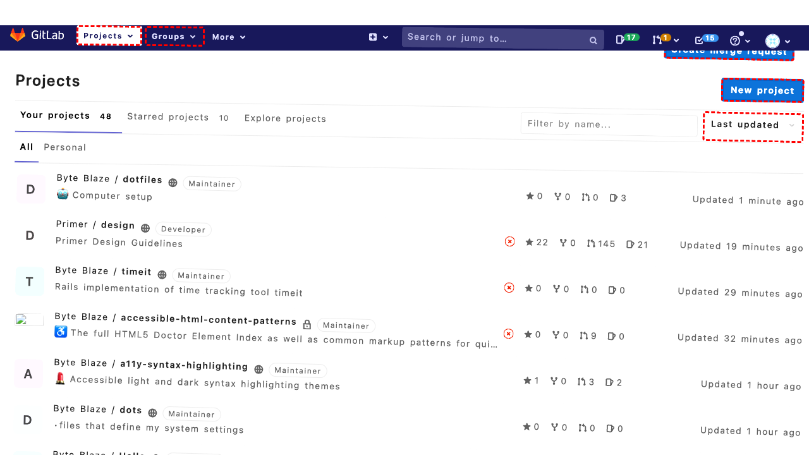
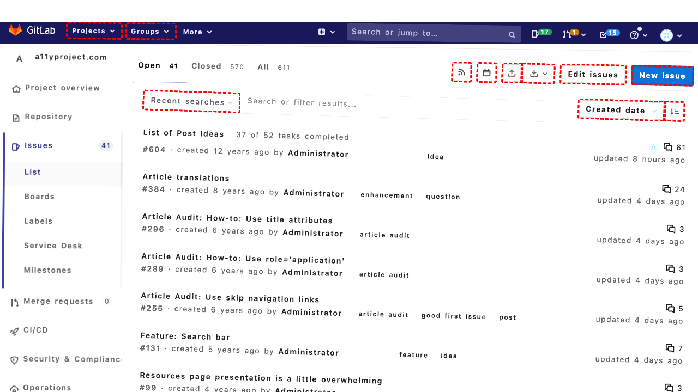
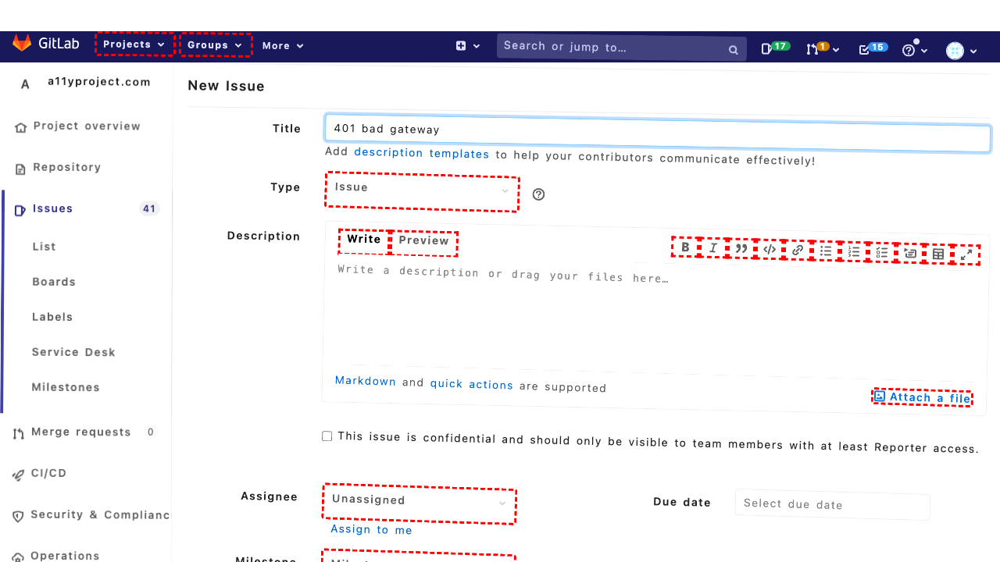
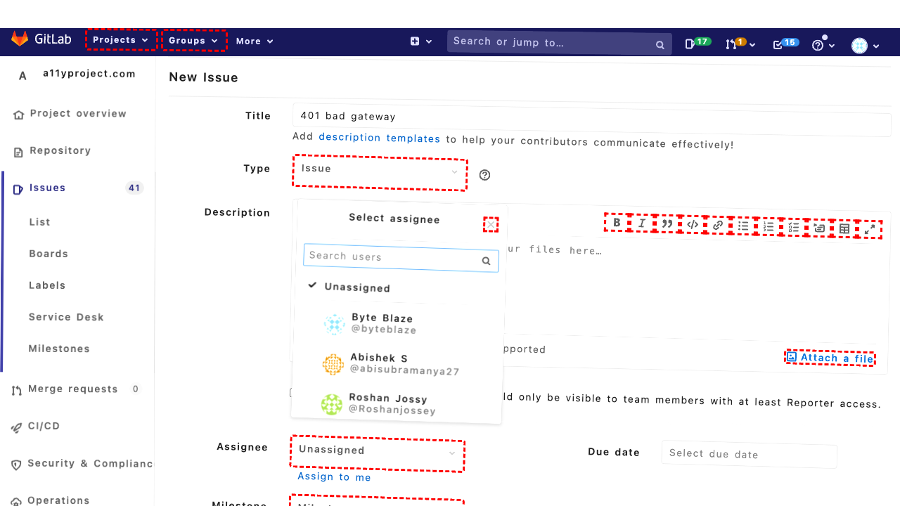
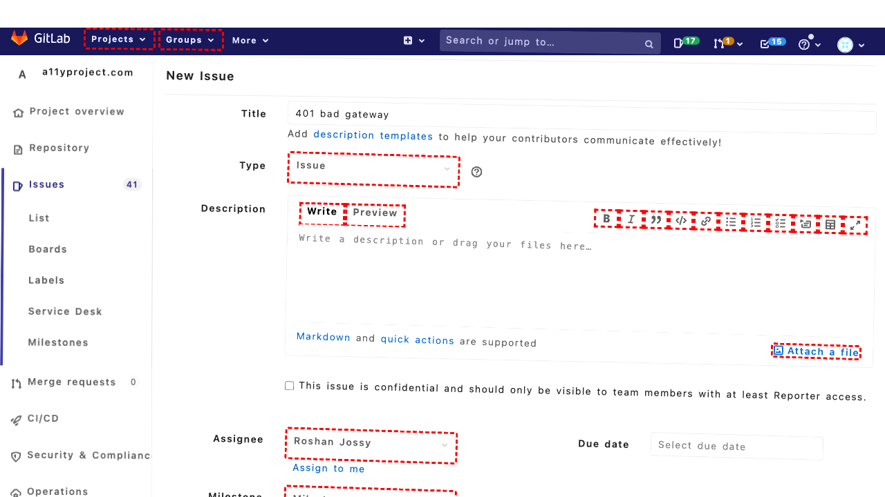
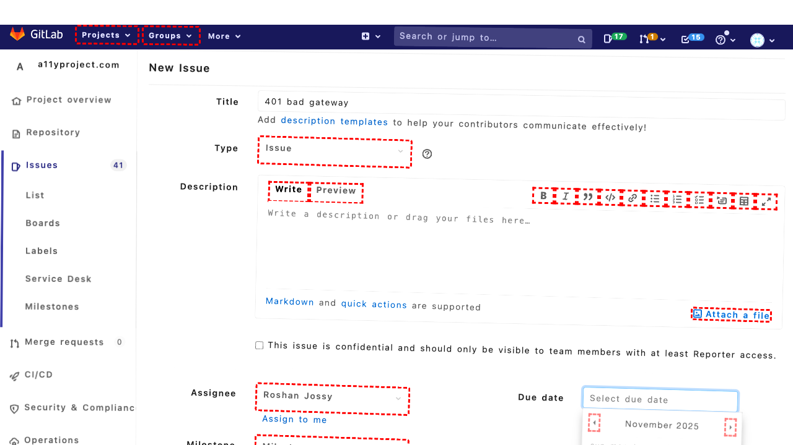
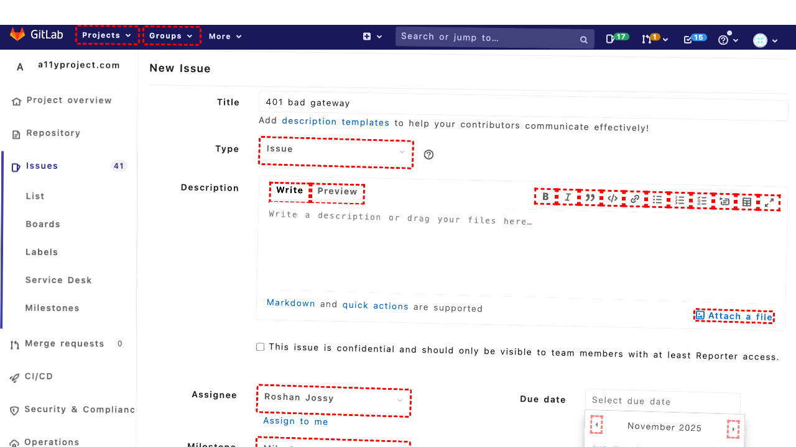

## Intent

Create an issue in a11yproject repo with title "401 bad gateway". Assign the issue to Roshanjossey. Set due date to be the end of 2030

## RM

Thoughts: The user's intent is to create an issue in the a11yproject repo with specific details: title "401 bad gateway", assign to Roshanjossey, and set due date to end of 2030. The action history shows the agent performed steps to search for the repo, navigate to issues, click to create a new issue, fill in the title, and then a series of clicks that appear to be interacting with a date picker (as indicated by the final state). However, the final state only describes that the year dropdown is open and 2030 is available, but there is no confirmation that the year was actually selected, nor that the assignee was set to Roshanjossey, nor that the issue was successfully created. The bot response is "None," which does not confirm completion. Since the task is content modification (creating an issue with specific attributes), and the final state does not show the issue created or the attributes set, the execution is incomplete and thus a failure.

Status: failure

## Final Response 

## Captions

===============Looking at the current page, I can see I'm on a GitLab dashboard showing various projects. The goal is to create an issue in the "a11yproject" repo, but I don't see that specific repository listed in the current project view. I need to first navigate to the a11yproject repository before I can create an issue there.

I can see there's a search box available that I can use to find the a11yproject repository. The search box has bid '156' based on the accessibility tree.
===============Looking at the current state, I can see that I'm on a GitLab search results page for "a11yproject". The search has already been executed and I can see one project result: "The A11Y Project / a11yproject.com". This is exactly the repository I need to access to create an issue.

Since the repository is already found in the search results, I should click on it to navigate to the project page where I can then create an issue.
===============Looking at the current state, I can see I'm now on the a11yproject.com repository page. I can see various navigation options in the sidebar, including an "Issues" link with bid '347'. To create a new issue, I need to navigate to the issues section first.
===============Looking at the current state, I can see I'm now on the Issues page for the a11yproject repository. I can see a "New issue" link with bid '623' in the accessibility tree. This is exactly what I need to click to start creating a new issue.
===============Looking at the current state, I can see I'm on the "New Issue" page for the a11yproject repository. The form is already loaded and ready for input. I need to:

1. Fill in the title with "401 bad gateway"
2. Assign the issue to Roshanjossey
3. Set the due date to the end of 2030

I can see the title textbox is already focused (bid '591'), so I'll start by filling in the title.
===============Looking at the current state, I can see the title has been successfully filled with "401 bad gateway". Now I need to assign the issue to Roshanjossey. I can see there's an "Assignee" section with a button that currently shows "Unassigned" (bid '717'). I need to click this button to open the assignee selection interface.
===============Looking at the current state, I can see that after clicking the "Unassigned" button, the assignee dropdown has opened. I can see a search box (bid '726') that's already focused, and a list of assignee options including "Roshan Jossy @Roshanjossey" (bid '869'). To assign the issue to Roshanjossey, I need to click on his entry in the dropdown list.
===============Looking at the current state, I can see the issue title has been set to "401 bad gateway" and the assignee has been successfully set to "Roshan Jossy". Now I need to set the due date to the end of 2030. I can see there's a "Due date" field with a textbox (bid '837') that says "Select due date". I need to click on this field to open the date picker and select the appropriate date.
===============Looking at the current state, I can see that after clicking the due date field, a date picker calendar has opened showing November 2025. I need to set the due date to the end of 2030, which means I need to:

1. First change the year from 2025 to 2030
2. Then select December 31, 2030 (the end of 2030)

I can see there's a year combobox (bid '950') that currently shows "2025". I need to click this to open the year dropdown and select 2030.
===============Looking at the current state, I can see that after clicking the year combobox, the year dropdown has opened showing various year options from 2015 to 2035. The current year is set to 2025 (bid '961'), and I need to select 2030. I can see that 2030 is available in the dropdown (bid '966'). I need to click on the 2030 option to select it.

## Images












## Main Prompt

```md
User Intent: Create an issue in a11yproject repo with title "401 bad gateway". Assign the issue to Roshanjossey. Set due date to be the end of 2030

Action History:
1: search_repositories('156', 'a11yproject')
2: click('338')
3: navigate_to_issues('347')
4: click('623')
5: fill('591', '401 bad gateway')
6: click('717')
7: click('869')
8: click('837')
9: click('950')
10: click('966')


The detailed final state of the webpage:

```md
Looking at the current state, I can see that after clicking the year combobox, the year dropdown has opened showing various year options from 2015 to 2035. The current year is set to 2025 (bid '961'), and I need to select 2030. I can see that 2030 is available in the dropdown (bid '966'). I need to click on the 2030 option to select it.
```

Bot response to the user: None.
```
