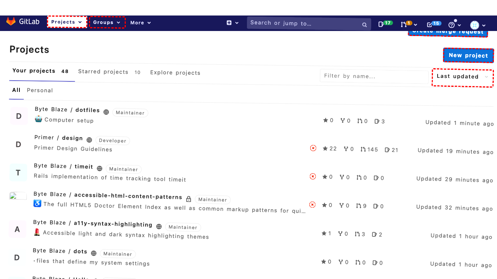
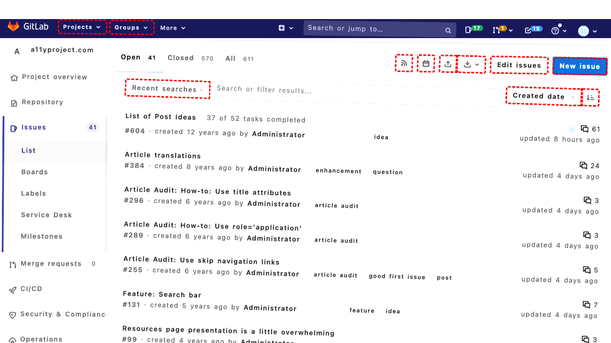
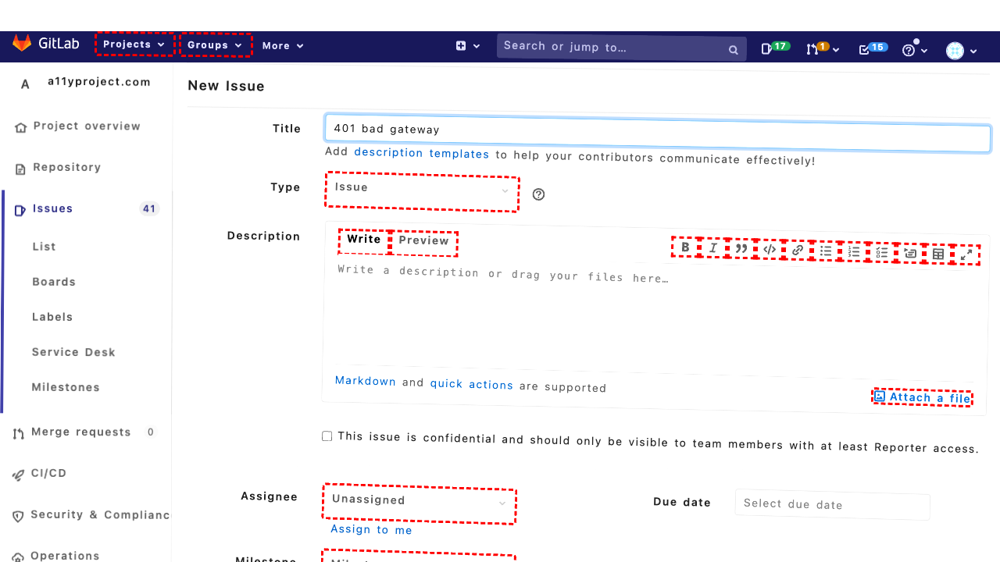
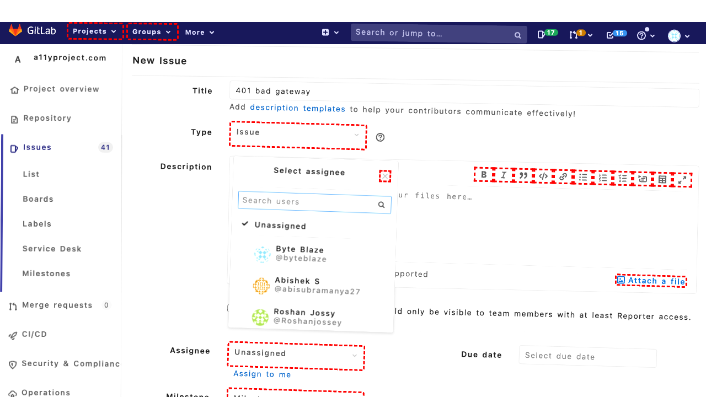

## Intent

Open an issue to request adding support for MT theme editor in a11y-syntax-highlighting.

## RM

Thoughts: The user's intent is to open an issue requesting support for the MT theme editor, which falls under the "Content modification" task type. The action history shows the agent successfully filled the title and description fields and clicked the "Submit issue" button. The final state of the webpage confirms that the fields were filled appropriately and that the submit button was enabled and clicked, indicating the issue was submitted. Since the task is content modification, I only need to examine the action history and final state, which show successful completion.

Status: success

## Final Response 

## Captions

===============Looking at the goal to open an issue for adding MT theme editor support in a11y-syntax-highlighting, I can see that the a11y-syntax-highlighting repository is listed in the projects on the current dashboard page. I need to navigate to that repository first, then go to its issues section to create a new issue.

From the accessibility tree, I can see the a11y-syntax-highlighting project listed with ID 786. I'll click on that link to navigate to the repository page.
===============Looking at the current state, I can see I'm on the a11y-syntax-highlighting repository page. I need to navigate to the Issues section to create a new issue about adding MT theme editor support. From the accessibility tree, I can see there's an "Issues 2" link with ID 284 that shows there are currently 2 issues in this repository. I'll click on that to go to the issues page.
===============Looking at the current page, I can see I'm already on the Issues page for the a11y-syntax-highlighting repository. I can see there are existing issues listed, including one titled "Add support for MT theme editor" which appears to be issue #3. Since the goal is to open an issue to request adding support for MT theme editor, but there's already an existing issue with that exact title, I should check if this issue already covers the request.

However, since the goal specifically asks to "open an issue" and I can see a "New issue" link with ID 492 available on the page, I'll proceed to click it to create a new issue.
===============Looking at the current state, I can see I'm on the "New Issue" page for the a11y-syntax-highlighting repository. The page shows a form with a title field (currently focused), description field, and other options. The "Submit issue" button is currently disabled, which means I need to fill in the required fields first to enable it.

Since the goal is to open an issue requesting support for MT theme editor, I should:
1. Fill in the title field with an appropriate title
2. Add a description explaining the request
3. Submit the issue

I can see the title field has ID 479 and is currently focused, and the description field has ID 522. I'll start by filling the title field.
===============Looking at the current state, I can see that I've successfully filled the title field with "Add support for MT theme editor". Now I need to fill the description field to provide more details about this feature request. The description field has ID 522 in the accessibility tree. I should write a clear description explaining what MT theme editor support would entail and why it would be beneficial for the a11y-syntax-highlighting project.
===============Looking at the current state, I can see that both the title field (ID 479) and description field (ID 522) have been filled with appropriate content for the MT theme editor support request. The title is "Add support for MT theme editor" and the description explains the benefits of this feature for accessibility.

Now I need to submit the issue. I can see the "Submit issue" button with ID 694 in the accessibility tree. Since all required fields appear to be filled (title is required, and I've provided both title and description), the submit button should now be enabled and ready to click.

## Images








## Main Prompt

```md
User Intent: Open an issue to request adding support for MT theme editor in a11y-syntax-highlighting.

Action History:
1: click("786")
2: click("284")
3: click("492")
4: fill("479", "Add support for MT theme editor")
5: fill("522", "Request to add support for MT theme editor to enhance the accessibility features of syntax highlighting. This would allow users to customize color themes while maintaining accessibility standards for better readability and user experience.")
6: click("694")


The detailed final state of the webpage:

```md
Looking at the current state, I can see that both the title field (ID 479) and description field (ID 522) have been filled with appropriate content for the MT theme editor support request. The title is "Add support for MT theme editor" and the description explains the benefits of this feature for accessibility.

Now I need to submit the issue. I can see the "Submit issue" button with ID 694 in the accessibility tree. Since all required fields appear to be filled (title is required, and I've provided both title and description), the submit button should now be enabled and ready to click.
```

Bot response to the user: None.
```
