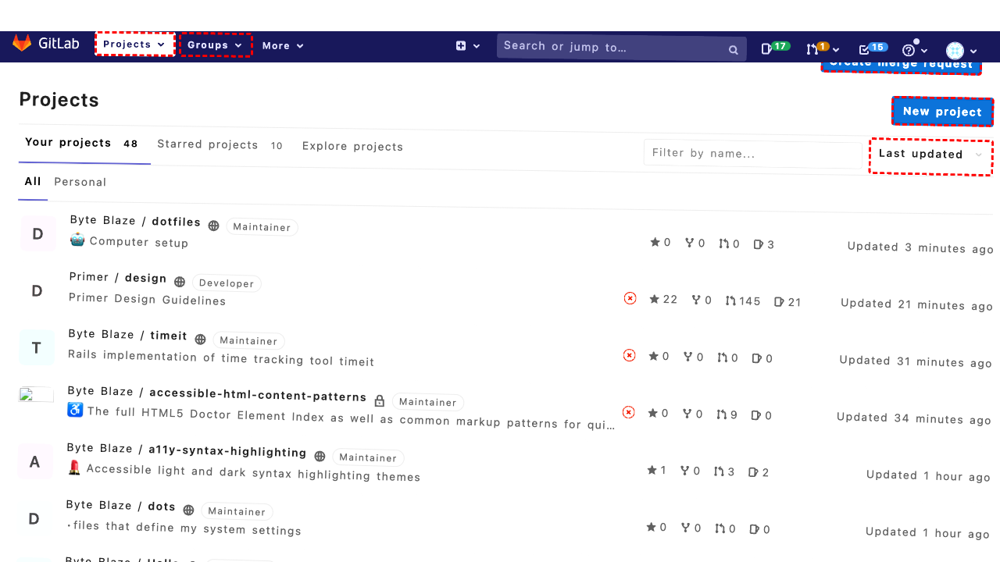
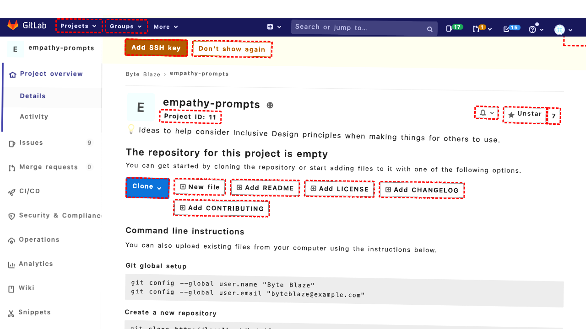
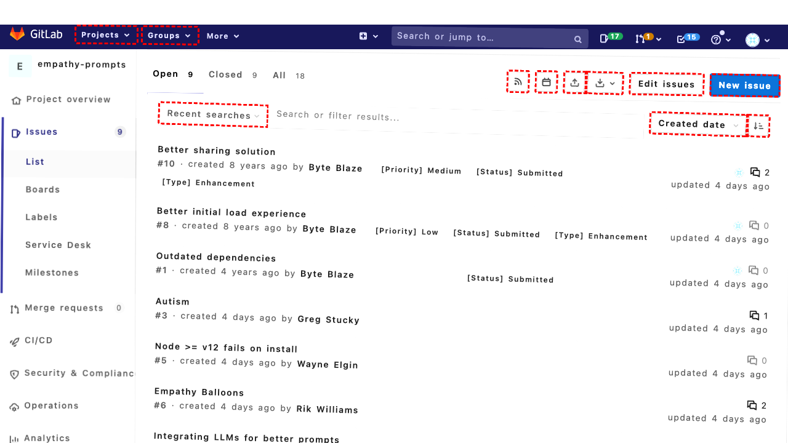
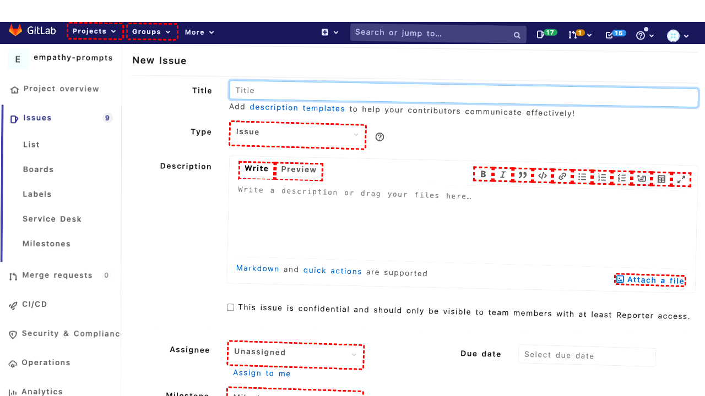
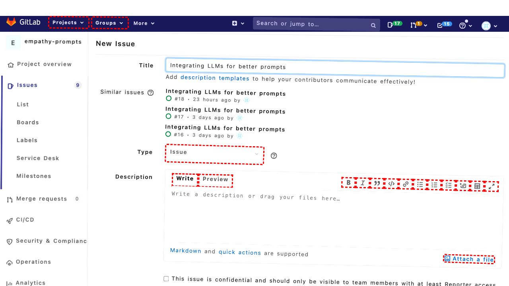
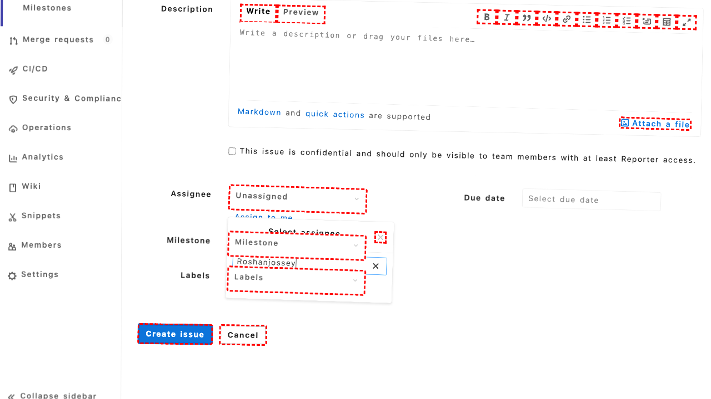
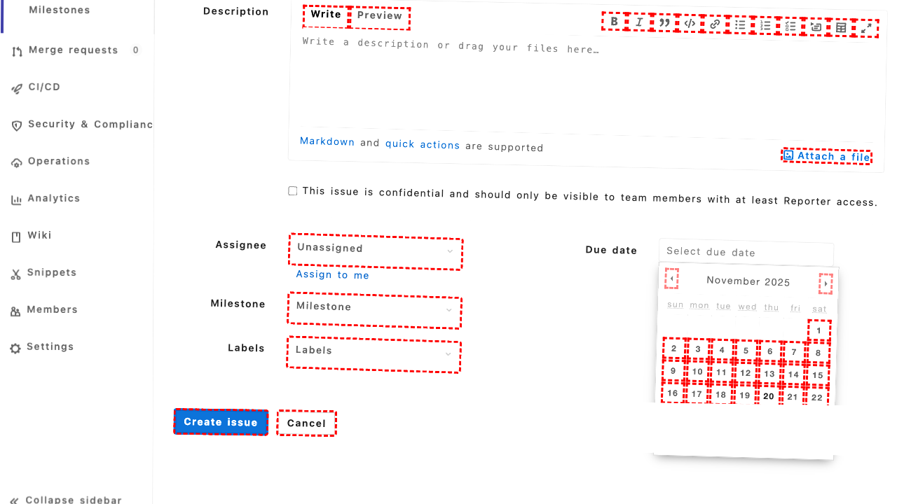

## Intent

Create an issue in empathy-prompts repo with title "Integrating LLMs for better prompts". Assign the issue to Roshanjossey. Set due date to be the beginning of Q2 2033

## RM

Thoughts: The user's intent is to create an issue in the empathy-prompts repo with specific details: title "Integrating LLMs for better prompts", assign to Roshanjossey, and set due date to the beginning of Q2 2033. This is a content modification task. The action history shows the agent filled the title, assigned to Roshanjossey, and interacted with the date selection by opening the year dropdown and clicking on 2033. However, the final state only describes the dropdown being open with 2033 selected, but does not confirm the issue was successfully created or that the due date was fully set (e.g., selecting the quarter or finalizing the date). Without evidence of completion (like a confirmation or the issue being listed), and given the bot provided no response, the task appears incomplete.

Status: failure

## Final Response 

## Captions

===============Looking at the current page, I can see we're on the GitLab dashboard showing a list of projects. I need to create an issue in the "empathy-prompts" repository. I can see this repository in the project list - it's listed as "Byte Blaze / empathy-prompts" with bid 815.

First, I need to navigate to the empathy-prompts repository page, then I can create an issue there.
===============Looking at the error, it seems the click action timed out even though the element was found. Let me check the current page structure again. I can see we're already on the empathy-prompts repository page (Tab 0 shows "Byte Blaze / empathy-prompts · GitLab" and the accessibility tree shows we're on the project overview page).

Since we're already on the correct repository page, I should navigate to the Issues section to create a new issue. I can see the Issues link in the sidebar with bid 311.
===============Looking at the current page, I can see we're already on the Issues page for the empathy-prompts repository. I can see there are already several issues listed, including some with the title "Integrating LLMs for better prompts" (issues #16, #17, and #18).

Since the goal is to create a new issue with this title, I need to click the "New issue" button that I can see in the accessibility tree with bid 579.
===============Looking at the current page, I can see we're on the "New Issue" page for the empathy-prompts repository. The form is already open and ready to be filled out. I need to:

1. Fill in the title "Integrating LLMs for better prompts" in the title field (bid 547)
2. Assign the issue to Roshanjossey using the assignee field (bid 673)
3. Set the due date to the beginning of Q2 2033 (which would be April 1, 2033) in the due date field (bid 793)

I'll start by filling in the title field first.
===============Looking at the current state, I can see that the title field has already been filled with "Integrating LLMs for better prompts" (as shown in the accessibility tree: `textbox 'Title' value='Integrating LLMs for better prompts'`).

Now I need to assign the issue to Roshanjossey. I can see the assignee field is currently set to "Unassigned" with bid 673. I should click on this to open the assignee selection dropdown.
===============Looking at the current state, I can see that after clicking the assignee field (bid 673), the dropdown has opened and is showing options. The search box (bid 682) is focused and ready for input. I need to search for "Roshanjossey" in the assignee search to assign the issue to them.
===============Looking at the current state, I can see that after filling "Roshanjossey" in the assignee search box (bid 682), the accessibility tree shows "No matching results" in the dropdown list. This suggests that either the username "Roshanjossey" doesn't exist in this GitLab instance or there might be a different username format needed.

Since the search didn't find any matching users, I should clear the search and try to see if there are other available users, or perhaps the user needs to be added to the project first. However, given the goal is to assign to Roshanjossey specifically, I'll first try pressing Enter to see if that triggers any selection, or I should close the assignee dropdown and proceed with other fields.

Let me press Enter to see if it selects the search term as a user (though unlikely since it shows no results), then I'll move on to setting the due date.
===============Looking at the current state, I can see that after pressing Enter in the assignee search, the search for "Roshanjossey" still shows "No matching results" in the dropdown. This means the user "Roshanjossey" is not available in this GitLab instance or project. Since I cannot assign to a non-existent user, I should proceed with setting the due date as the next requirement.

I can see the due date field has bid 793. I need to set it to the beginning of Q2 2033, which is April 1, 2033. I'll click on the due date field to open the date picker.
===============Looking at the current state, I can see that after clicking the due date field (bid 793), a date picker calendar has opened showing November 2025. I need to set the due date to April 1, 2033.

To do this, I need to:
1. Change the year from 2025 to 2033 using the year dropdown (bid 870)
2. Change the month from November to April using the month dropdown (bid 856)
3. Select April 1st from the calendar grid

I'll start by opening the year dropdown to select 2033.
===============Looking at the current state, I can see that after clicking the year dropdown (bid 870), the dropdown is now open and focused, showing years from 2015 to 2035. I need to select "2033" from this list. The option for 2033 has bid 889 in the accessibility tree. I should click on this option to select the year 2033.

## Images












## Main Prompt

```md
User Intent: Create an issue in empathy-prompts repo with title "Integrating LLMs for better prompts". Assign the issue to Roshanjossey. Set due date to be the beginning of Q2 2033

Action History:
1: click("815")
2: click("311")
3: click("579")
4: fill("547", "Integrating LLMs for better prompts")
5: click("673")
6: fill("682", "Roshanjossey")
7: keyboard_press("Enter")
8: click("793")
9: click("870")
10: click("889")


The detailed final state of the webpage:

```md
Looking at the current state, I can see that after clicking the year dropdown (bid 870), the dropdown is now open and focused, showing years from 2015 to 2035. I need to select "2033" from this list. The option for 2033 has bid 889 in the accessibility tree. I should click on this option to select the year 2033.
```

Bot response to the user: None.
```
