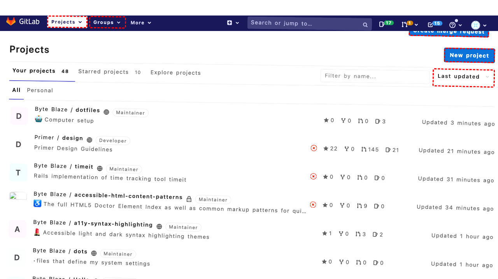
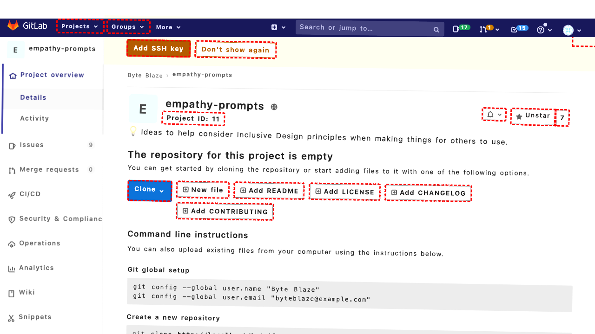
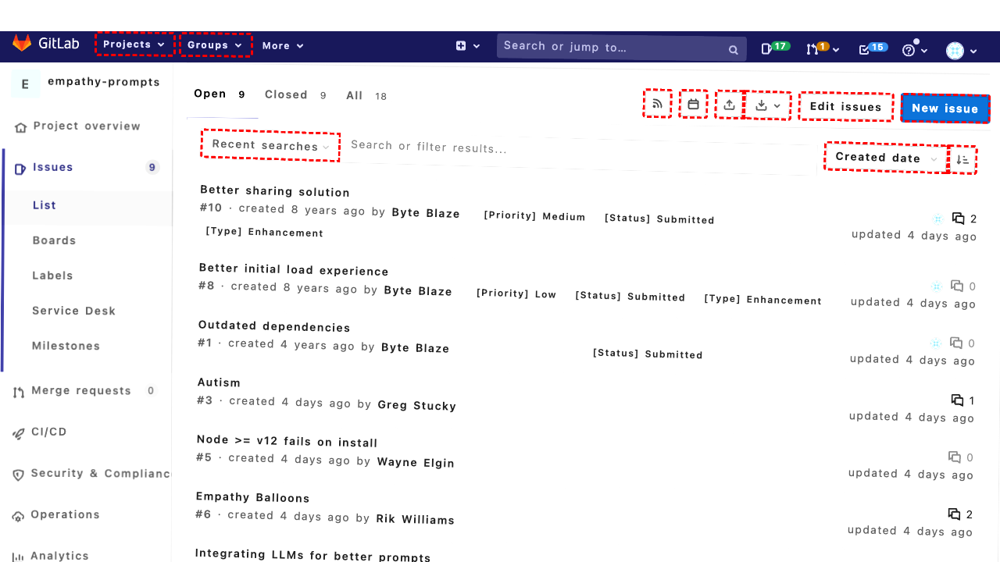
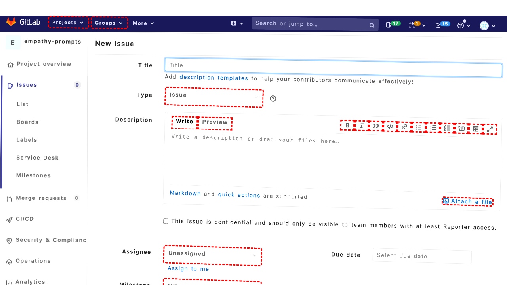
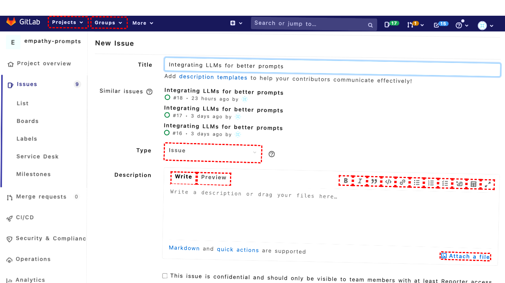
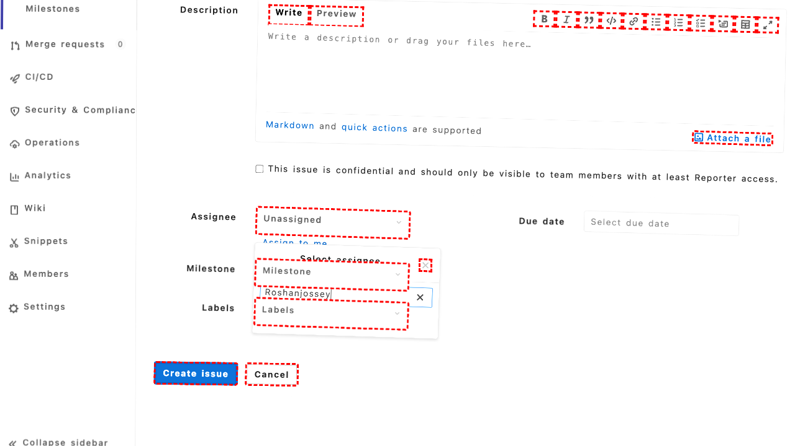
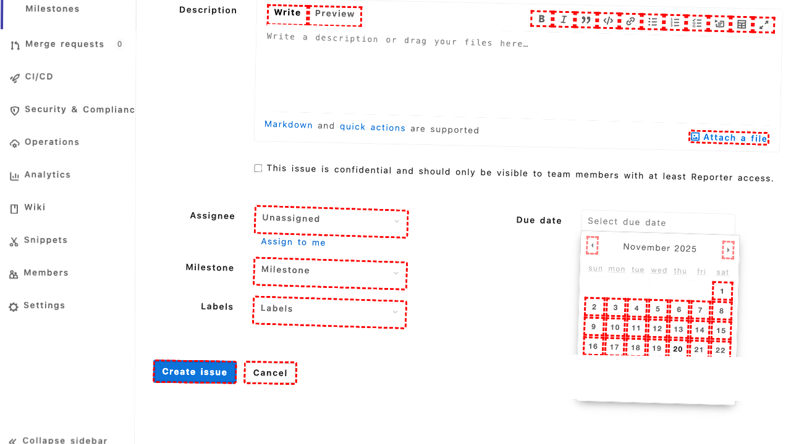

## Intent

Submit a request to merge dialog-component branch into dialog branch, assign Carol as the reviewer

## RM

Thoughts: The user's intent is to submit a merge request and assign Carol as the reviewer, which falls under the "Content modification" task type. The agent's action history shows that it attempted to fill "Carol" into the assignee search box, but the final state indicates "No matching results" in the dropdown, meaning Carol was not successfully assigned. Since the specific requirement to assign Carol as the reviewer was not met, the task is a failure.

Status: failure

## Final Response 

## Captions

===============Looking at the current page, I can see I'm on the project details page for "Primer / design". To submit a merge request from dialog-component branch into dialog branch and assign Carol as reviewer, I need to navigate to the Merge Requests section first.

I can see there's a "Merge Requests" link in the sidebar with the text "Merge Requests 146". This should take me to the merge requests page where I can create a new merge request.
===============Looking at the current state, I can see I'm already on the Merge Requests page for the Primer/design project (as indicated by the URL and page title). I can see a "New merge request" link with bid 452 that should allow me to create a new merge request. Since I need to submit a request to merge dialog-component branch into dialog branch and assign Carol as reviewer, I should click this link to start creating a new merge request.
===============Looking at the current page, I can see I'm on the "New Merge Request" page for the Primer/design project. I need to:

1. Set the source branch to "dialog-component"
2. Set the target branch to "dialog"
3. Assign Carol as reviewer

I can see there are buttons for selecting both source and target branches. The source branch selector has bid 462 ("Select source branch") and the target branch selector has bid 505 (currently showing "a11y/context-menu-accessibility-docs"). I should first click the source branch selector to change it to "dialog-component".
===============Looking at the current state, I can see that clicking the source branch selector has expanded a dropdown list showing all available branches. I can see "dialog-component" is available in the list with bid 564. I need to select this branch as the source branch.
===============Looking at the current state, I can see that I successfully selected "dialog-component" as the source branch. Now I need to change the target branch from "a11y/context-menu-accessibility-docs" to "dialog". I can see the target branch selector has bid 505. I should click this to open the target branch dropdown.
===============Looking at the current state, I can see that clicking the target branch selector has expanded a dropdown list showing all available branches. I can see "dialog" is available in the list with bid 658. I need to select this branch as the target branch to complete the branch selection part of the merge request.
===============Looking at the current state, I can see that I've successfully set both the source branch to "dialog-component" and the target branch to "dialog". The next step is to click the "Compare branches and continue" button (bid 543) to proceed to the next page where I can assign Carol as the reviewer and complete the merge request submission.
===============Looking at the current state, I can see I'm on the "New Merge Request" page with the source branch already set to "dialog-component" and target branch set to "dialog" (as shown in the accessibility tree). The page shows the merge request creation form with fields for title, description, assignee, milestone, and labels.

I need to assign Carol as the reviewer. I can see there's an "Assignee" section with a button that currently shows "Unassigned" (bid 540). I should click this to open the assignee selection dropdown so I can assign Carol as the reviewer.
===============Looking at the current state, I can see that clicking the assignee button has expanded a dropdown with a search box (bid 549) that's currently focused. I need to search for "Carol" to assign her as the reviewer. I should type "Carol" into the search box to find her in the user list.
===============Looking at the current state, I can see that I've filled "Carol" into the assignee search box (bid 549), but the accessibility tree shows "No matching results" in the dropdown list (bid 1030). This suggests that either Carol is not a valid user in this GitLab instance, or there might be a different spelling or username needed.

Since the goal is to assign Carol as the reviewer, and the search isn't finding her, I should check if there are any alternative ways to find her or if I need to proceed without assigning her. However, since the goal specifically requires assigning Carol, I should first try to see if there are any other users that might match.

Let me wait a moment to see if the search results update or if there are any other options available.

## Images












## Main Prompt

```md
User Intent: Submit a request to merge dialog-component branch into dialog branch, assign Carol as the reviewer

Action History:
1: click("306")
2: click("452")
3: click("462")
4: click("564")
5: click("505")
6: click("658")
7: click("543")
8: click("540")
9: fill("549", "Carol")
10: noop(1000)


The detailed final state of the webpage:

```md
Looking at the current state, I can see that I've filled "Carol" into the assignee search box (bid 549), but the accessibility tree shows "No matching results" in the dropdown list (bid 1030). This suggests that either Carol is not a valid user in this GitLab instance, or there might be a different spelling or username needed.

Since the goal is to assign Carol as the reviewer, and the search isn't finding her, I should check if there are any alternative ways to find her or if I need to proceed without assigning her. However, since the goal specifically requires assigning Carol, I should first try to see if there are any other users that might match.

Let me wait a moment to see if the search results update or if there are any other options available.
```

Bot response to the user: None.
```
