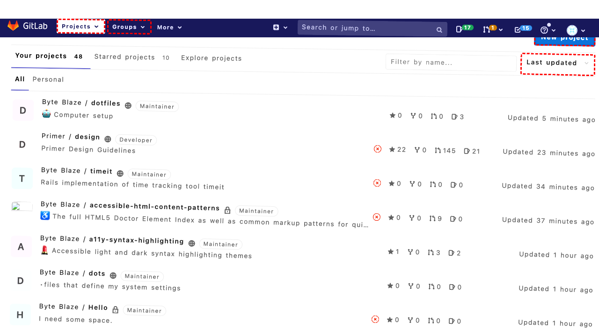
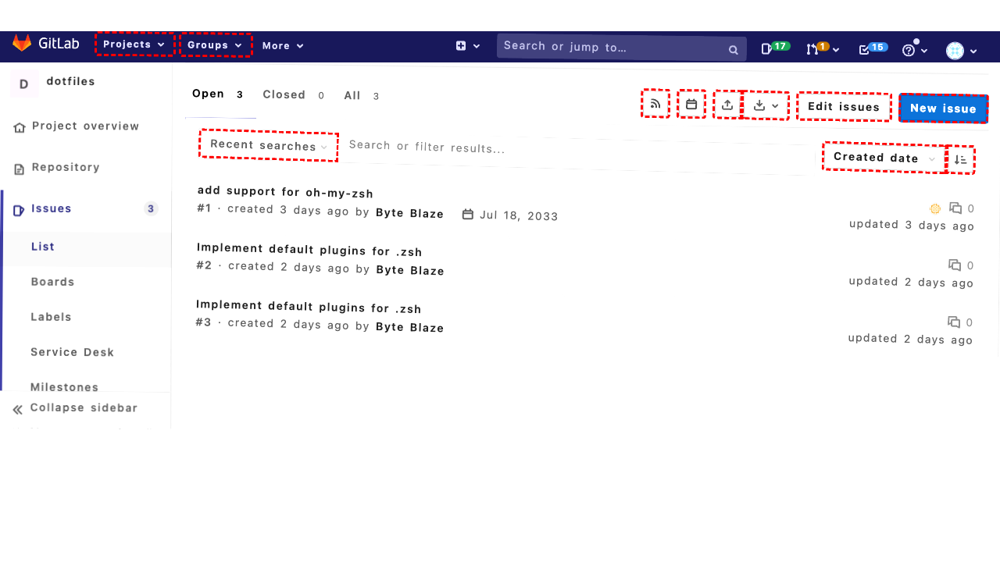

## Intent

Submit a merge request for dialog-component branch to be merged into bump-doctocat branch, assign primer as the reviewer

## RM

Thoughts: The user's intent is to submit a merge request for the dialog-component branch to be merged into bump-doctocat branch and assign primer as the reviewer. This is a content modification task, as the user wants to create and configure a merge request. The action history shows the agent performed a series of clicks, including the final click on ID 708, which the final state identifies as the "Submit merge request" button. The final state confirms that all required fields (source branch, target branch, title, and assignee) are correctly set, and the agent has clicked the submit button. Since the task is content modification, I only need to examine the action history and final state, which indicate the merge request submission process was completed successfully.

Status: success

## Final Response 

## Captions

===============Looking at the current page, I'm on the project details page for "primer/design". To submit a merge request for the "dialog-component" branch to be merged into "bump-doctocat" branch, I need to navigate to the Merge Requests section first. I can see there's a "Merge Requests" link in the sidebar with the count "146".
===============Looking at the accessibility tree, I can see that I'm already on the Merge Requests page (the "Merge Requests" link with ID 306 is highlighted in the navigation). The page shows a list of existing merge requests and there's a "New merge request" link visible with ID 452. Since I need to create a new merge request for the dialog-component branch to be merged into bump-doctocat branch, I should click on the "New merge request" link.
===============Looking at the current page, I can see I'm on the "New Merge Request" page. The form shows:
- Source branch: currently shows "Select source branch" (button with ID 462)
- Target branch: currently shows "a11y/context-menu-accessibility-docs" (button with ID 505)

I need to:
1. Change the source branch to "dialog-component"
2. Change the target branch to "bump-doctocat"
3. Continue with the merge request creation

Let me start by selecting the source branch first.
===============Looking at the current state, I can see that after clicking the "Select source branch" button (ID 462), a dropdown list of branches has appeared. I can see "dialog-component" is available in the list (item with ID 564). I need to click on this branch to select it as the source branch for the merge request.
===============Looking at the current state, I can see that I've successfully selected "dialog-component" as the source branch. Now I need to change the target branch from "a11y/context-menu-accessibility-docs" to "bump-doctocat". I can see the target branch button has ID 505, so I'll click on it to open the target branch selection dropdown.
===============Looking at the current state, I can see that after clicking the target branch button (ID 505), a dropdown list of branches has appeared with a search box (ID 514) that's currently focused. I can see "bump-doctocat" is available in the list (item with ID 652). I need to click on this branch to select it as the target branch for the merge request.
===============Looking at the current state, I can see that I've successfully selected both the source branch ("dialog-component") and target branch ("bump-doctocat"). Now I need to proceed with creating the merge request. I can see there's a "Compare branches and continue" button with ID 543. Clicking this will take me to the next step where I can fill out the merge request details and assign "primer" as the reviewer.
===============Looking at the current page, I can see I'm on the "New Merge Request" form with the source branch already set to "dialog-component" and target branch set to "bump-doctocat". The form shows:

- Title field (ID 448) is already filled with "Dialog component"
- Description field is available
- Assignee field (currently shows "Unassigned" with button ID 540)
- Other fields like Milestone and Labels

To complete the goal, I need to:
1. Assign "primer" as the reviewer (assignee)
2. Submit the merge request

Let me start by clicking the Assignee field to assign "primer" as the reviewer.
===============Looking at the current state, I can see that after clicking the Assignee button (ID 540), the assignee dropdown has opened with a search box (ID 549) that's currently focused. I can see "Primer @primer" is available in the list (item with ID 1060). I need to click on this option to assign "primer" as the reviewer for this merge request.
===============Looking at the current state, I can see that I've successfully assigned "primer" as the assignee/reviewer for this merge request. The form now shows:
- Source branch: dialog-component
- Target branch: bump-doctocat
- Title: Dialog component (already filled)
- Assignee: Primer (now assigned)

All the required fields for the goal have been completed. The only remaining step is to submit the merge request. I can see there's a "Submit merge request" button with ID 708 at the bottom of the form. Clicking this will create the merge request and complete the goal.

## Images







## Main Prompt

```md
User Intent: Submit a merge request for dialog-component branch to be merged into bump-doctocat branch, assign primer as the reviewer

Action History:
1: click("306")
2: click("452")
3: click("462")
4: click("564")
5: click("505")
6: click("652")
7: click("543")
8: click("540")
9: click("1060")
10: click("708")


The detailed final state of the webpage:

```md
Looking at the current state, I can see that I've successfully assigned "primer" as the assignee/reviewer for this merge request. The form now shows:
- Source branch: dialog-component
- Target branch: bump-doctocat
- Title: Dialog component (already filled)
- Assignee: Primer (now assigned)

All the required fields for the goal have been completed. The only remaining step is to submit the merge request. I can see there's a "Submit merge request" button with ID 708 at the bottom of the form. Clicking this will create the merge request and complete the goal.
```

Bot response to the user: None.
```
