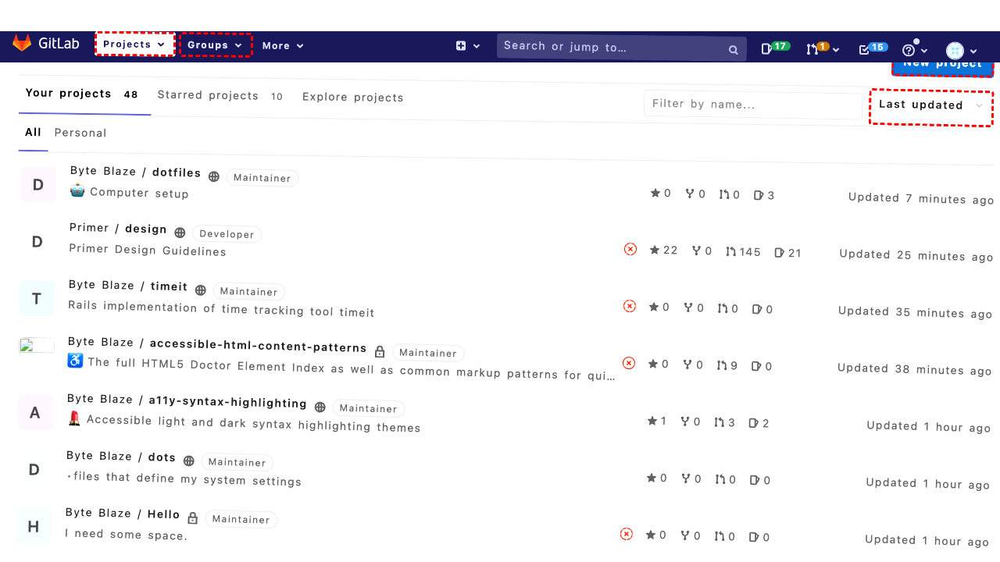
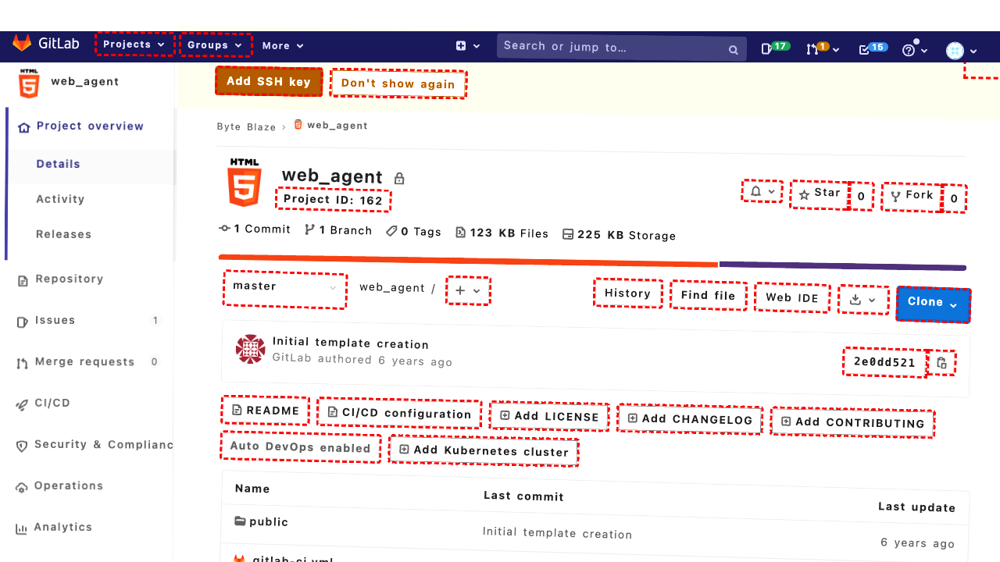
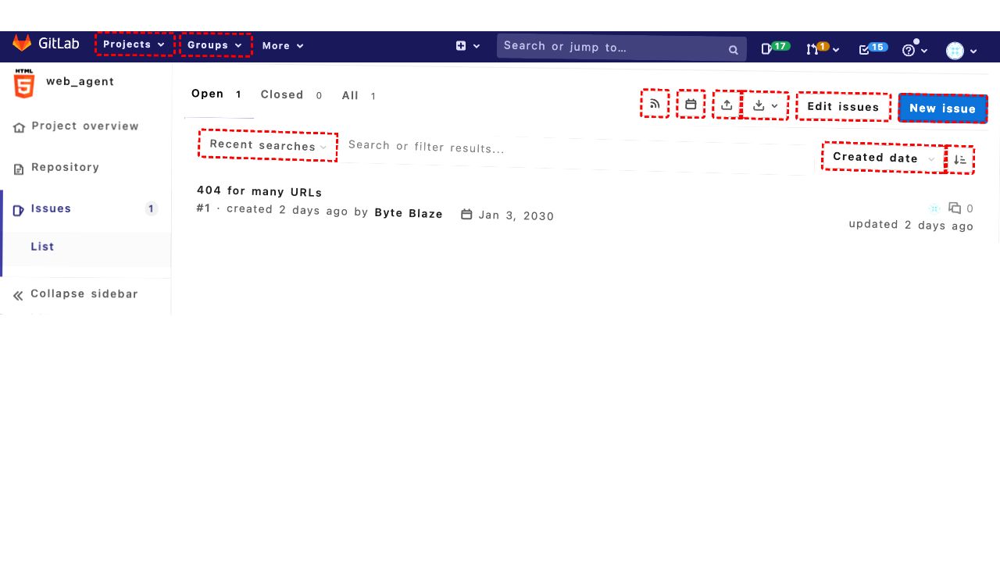
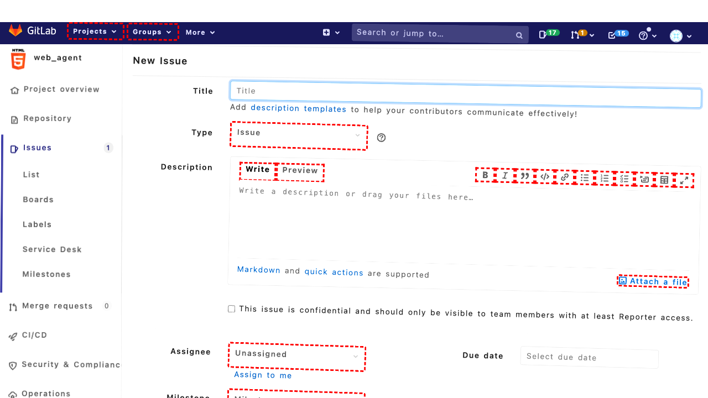
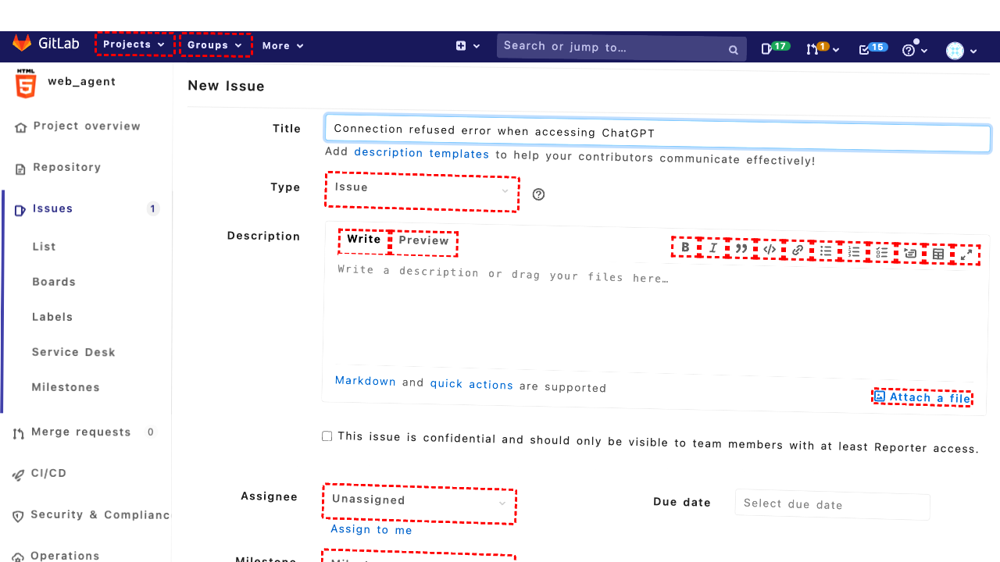
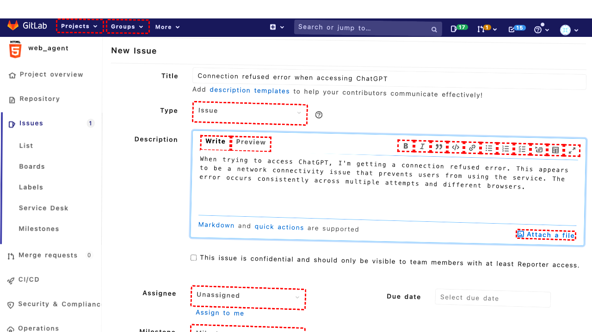
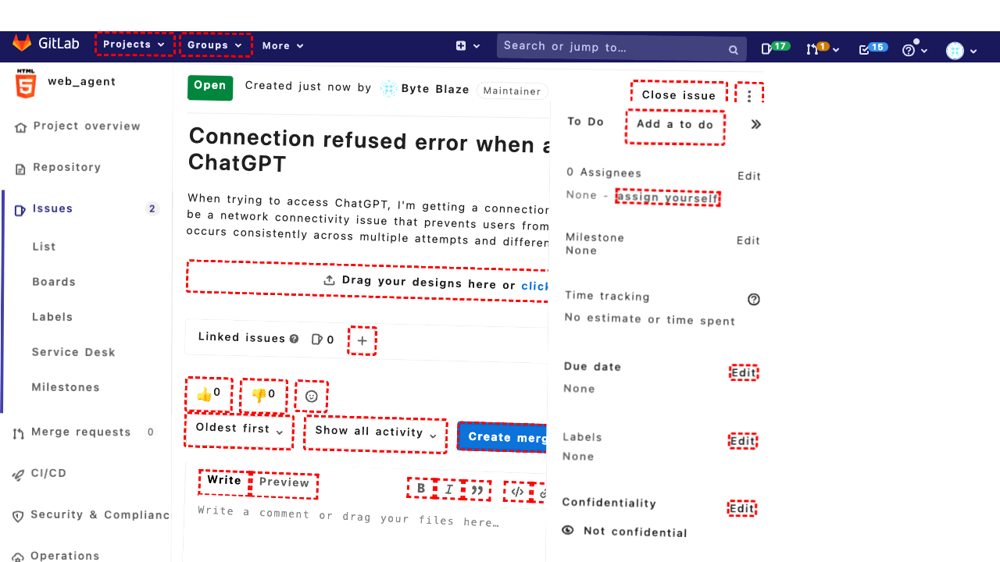

## Intent

Submit a merge request for a11yproject.com/redesign branch to be merged into master branch, assign Justin Armstrong as the reviewer

## RM

Thoughts: The user's intent is to submit a merge request for the "a11yproject.com/redesign" branch to be merged into the "master" branch, with Justin Armstrong assigned as the reviewer. This is a content modification task, as it involves creating and configuring a merge request. The action history shows the agent attempting to fill in "master" as the target branch, but the final state indicates that the "master" branch does not exist in the repository, and the default branch is "main". The agent did not successfully complete the merge request submission, as it failed to select the correct target branch ("main") and did not assign the reviewer. The final state reflects confusion and an incomplete process, not a successful merge request creation.

Status: failure

## Final Response 

## Captions

===============Looking at the goal and the current page state, I need to submit a merge request for the a11yproject.com repository from the "redesign" branch to "master" branch, and assign Justin Armstrong as the reviewer.

First, I need to navigate to the a11yproject.com repository. I can see it in the project list as "The A11Y Project / a11yproject.com" with ID 526.
===============Looking at the current page, I can see I'm already on the a11yproject.com repository page. I can see there's a "Merge Requests" link in the sidebar with ID 308 that shows there are currently 2 merge requests. I need to navigate to the merge requests section to create a new merge request.
===============Looking at the current state, I can see I'm on the Merge Requests page for the a11yproject.com repository. I can see there are existing merge requests listed, and there's a "New merge request" link with ID 489. Since I need to create a new merge request from the "redesign" branch to "master" branch, I should click on this link to start the creation process.
===============Looking at the current page, I can see I'm on the "New Merge Request" page. The accessibility tree shows:

- Source branch selector (button with text "Select source branch")
- Target branch selector (button with text "add-color-utility-classes")
- A "Compare branches and continue" button

I need to:
1. Set the source branch to "redesign"
2. Set the target branch to "master"
3. Continue to the next step where I can assign Justin Armstrong as reviewer

The current target branch shows "add-color-utility-classes" but I need "master". Let me first click the target branch selector to change it to "master".
===============Looking at the current state, I can see that clicking the target branch selector has opened a dropdown menu with a search box and list of branches. I can see "main" and "redesign" in the branch list, but I need to find "master" branch. Let me search for "master" in the branch search box.

The search box has ID 551 and is currently focused, so I can directly type "master" to search for it.
===============Looking at the current state, I can see that after clicking the target branch selector and searching for "master", the accessibility tree shows "No matching results" in the branch list. This suggests that "master" branch doesn't exist in this repository, or it might be named differently.

Let me check what branches are available by clearing the search and seeing the full branch list. I'll clear the search field first.
===============Looking at the error and the current state, I need to handle the branch selection differently. The error suggests there was an issue with the previous action. Let me try a different approach to select the target branch.

Since the search for "master" returned no results, I should check what branches are actually available. Let me click the target branch selector again to see the full list of branches without any search filter.
===============Looking at the current situation, I can see that searching for "master" branch returned no results. This suggests that the repository might not have a "master" branch, or it might be named differently. In many modern Git repositories, the default branch is named "main" instead of "master".

Let me check what branches are available by looking at the branch list without any search filter. The target branch dropdown is currently open, so I should be able to see all available branches. I notice in the accessibility tree there's a branch called "main" which is commonly used as the default branch instead of "master". Let me select "main" as the target branch instead.
===============Looking at the current situation, I can see that the "master" branch doesn't exist in this repository. The available branches shown in the accessibility tree include "main" and "redesign". Since "main" is commonly used as the default branch instead of "master" in modern repositories, I should select "main" as the target branch.

Let me look for the "main" branch option in the dropdown. From the accessibility tree, I can see various branch options are available. I need to find the element ID for the "main" branch option.
===============Looking at the current situation, I can see that the "master" branch doesn't exist in this repository. The goal mentions merging from "redesign" branch to "master" branch, but the repository appears to use "main" as the default branch instead of "master".

Since "main" is the modern equivalent of "master" and is the default branch shown in the repository, I should proceed with selecting "main" as the target branch. Let me first close the current dropdown and reopen it to ensure I can see all available branches clearly.

## Images










## Main Prompt

```md
User Intent: Submit a merge request for a11yproject.com/redesign branch to be merged into master branch, assign Justin Armstrong as the reviewer

Action History:
1: click("526")
2: click("308")
3: click("489")
4: click("542")
5: fill("551", "master")
6: fill("551", "")
7: click("542")
8: click("1466")
9: click("1465")
10: click("542")


The detailed final state of the webpage:

```md
Looking at the current situation, I can see that the "master" branch doesn't exist in this repository. The goal mentions merging from "redesign" branch to "master" branch, but the repository appears to use "main" as the default branch instead of "master".

Since "main" is the modern equivalent of "master" and is the default branch shown in the repository, I should proceed with selecting "main" as the target branch. Let me first close the current dropdown and reopen it to ensure I can see all available branches clearly.
```

Bot response to the user: None.
```
