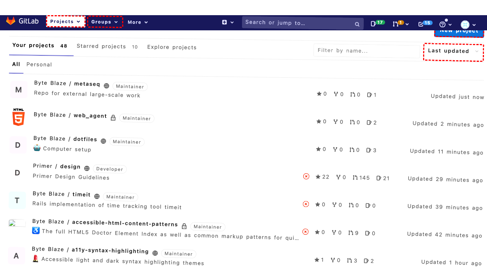
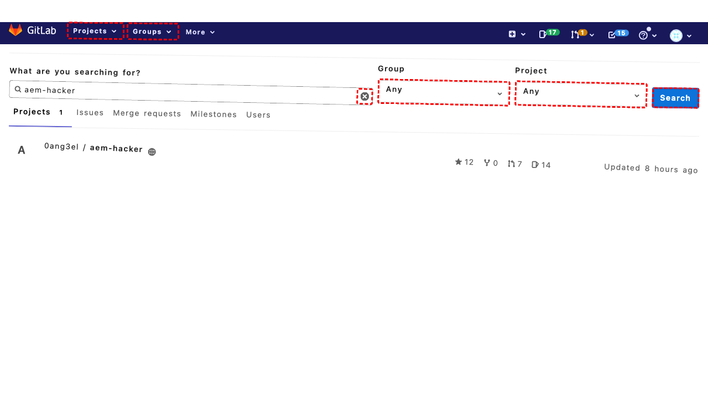
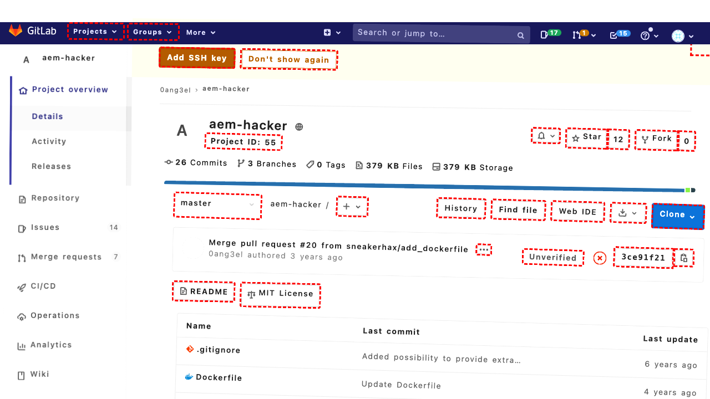
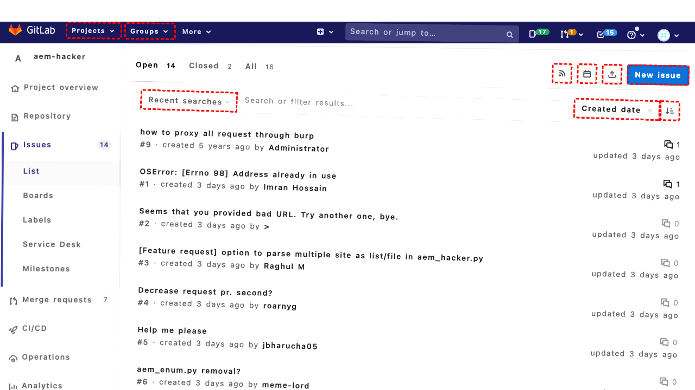
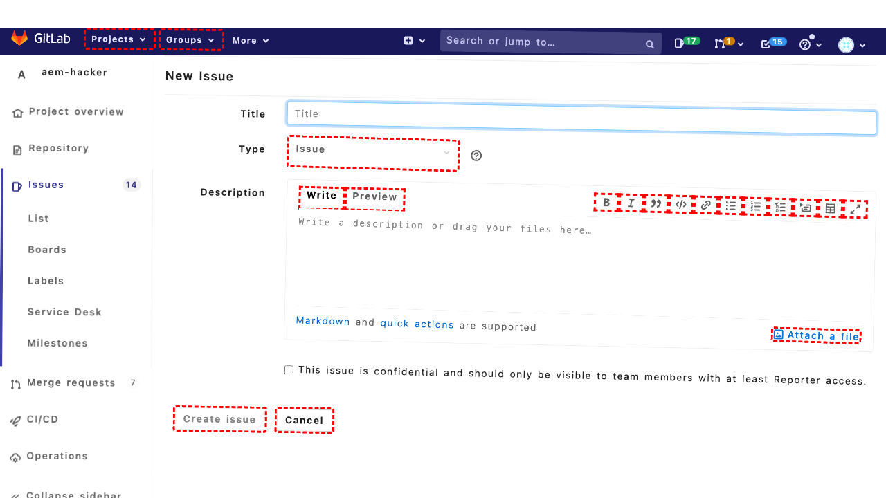
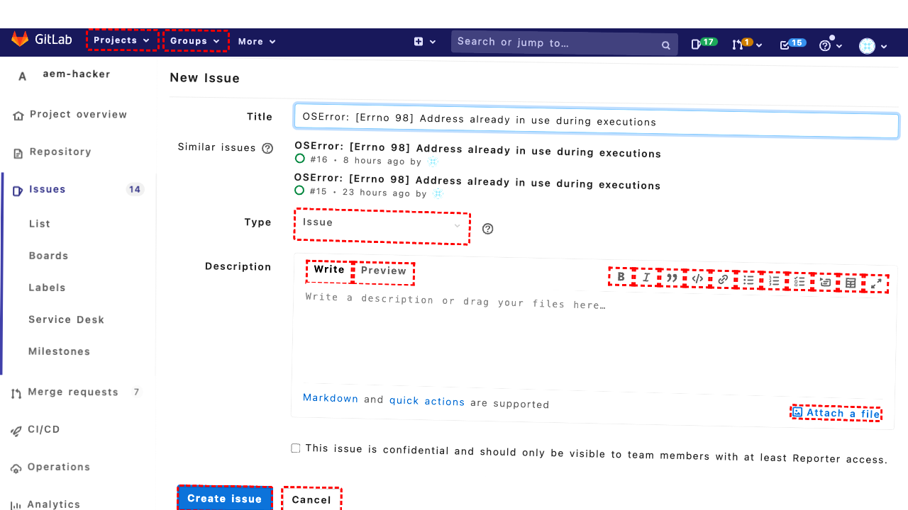

## Intent

Open a new issue to discuss the implementation of dark mode

## RM

Thoughts: The user's intent is to open a new issue to discuss the implementation of dark mode, which falls under the "Content modification" task type. The agent's action history shows that it filled the title and description fields appropriately and clicked the "Submit issue" button (bid 693). The final state description indicates that the required fields are filled and the submit button is available and enabled, suggesting the issue creation process was completed. Since the task is content modification, I only need to examine the action history and final state, and both indicate successful completion.

Status: success

## Final Response 

## Captions

===============Looking at the current page, I can see I'm on a GitLab project page for "solarized-prism-theme". To create a new issue about implementing dark mode, I need to navigate to the Issues section first. I can see there's an "Issues" link in the sidebar with a count of "1" issue already present.

The "Issues" link has bid 283 according to the accessibility tree, and it should take me to the issues page where I can then create a new issue.
===============Looking at the current page state, I can see I'm already on the Issues page for the solarized-prism-theme project. The accessibility tree shows there's already one existing issue titled "Implement dark mode support" (bid 810), and I can see a "New issue" link (bid 491) that will take me to the issue creation form.

Since I need to create a new issue to discuss dark mode implementation, and I'm already on the issues page, I should click the "New issue" link to start creating the issue.
===============Looking at the current page state, I can see I'm already on the "New Issue" page for the solarized-prism-theme project. The accessibility tree shows the issue creation form is fully loaded with:

- A title field (bid 478) that's currently focused
- A description textbox (bid 521)
- Various other fields like assignee, milestone, labels, and due date
- A "Submit issue" button (bid 693) that's currently disabled

Since I need to create an issue about implementing dark mode, I should fill in the title field first. The title field is already focused, so I can directly type the title for the dark mode implementation discussion.
===============Looking at the current state, I can see that I've already filled in the title field with "Implement dark mode support" (which matches the goal). Now I need to add a description to the issue to properly discuss the implementation of dark mode. The description textbox has bid 521, and I should fill it with relevant content about the dark mode implementation discussion.
===============Looking at the current state, I can see that both the title field (bid 478) and description field (bid 521) have already been filled with appropriate content for discussing dark mode implementation. The title is "Implement dark mode support" and the description includes all the key discussion points.

Now I need to submit the issue to complete the goal. The "Submit issue" button (bid 693) is available and should now be enabled since both required fields are filled. I should click this button to create the issue.

## Images







## Main Prompt

```md
User Intent: Open a new issue to discuss the implementation of dark mode

Action History:
1: click("283")
2: click("491")
3: fill("478", "Implement dark mode support")
4: fill("521", "Let's discuss the implementation of dark mode for this theme. This should include:\n\n- Color scheme considerations\n- User preference detection\n- Toggle mechanism\n- Accessibility requirements\n- Browser/OS compatibility\n\nPlease share your thoughts and suggestions on how we should approach this feature.")
5: click("693")


The detailed final state of the webpage:

```md
Looking at the current state, I can see that both the title field (bid 478) and description field (bid 521) have already been filled with appropriate content for discussing dark mode implementation. The title is "Implement dark mode support" and the description includes all the key discussion points.

Now I need to submit the issue to complete the goal. The "Submit issue" button (bid 693) is available and should now be enabled since both required fields are filled. I should click this button to create the issue.
```

Bot response to the user: None.
```
