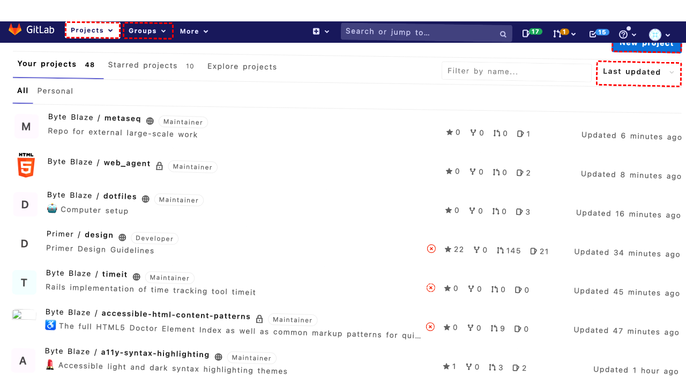
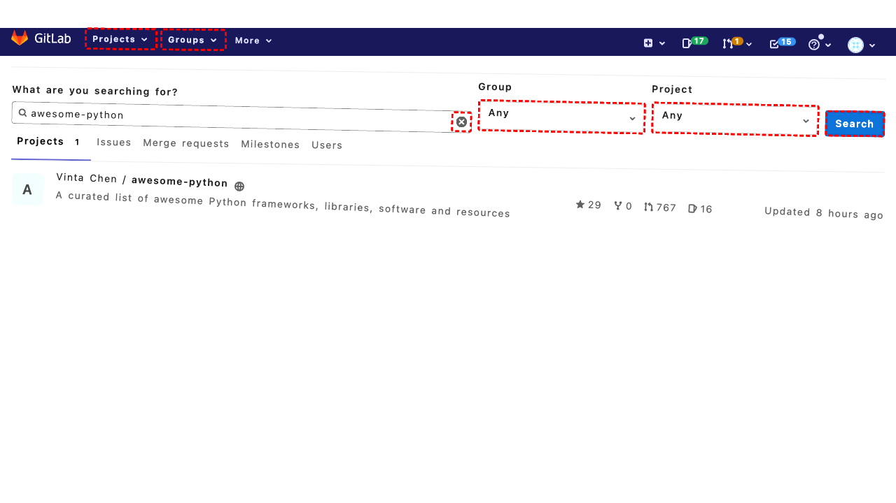
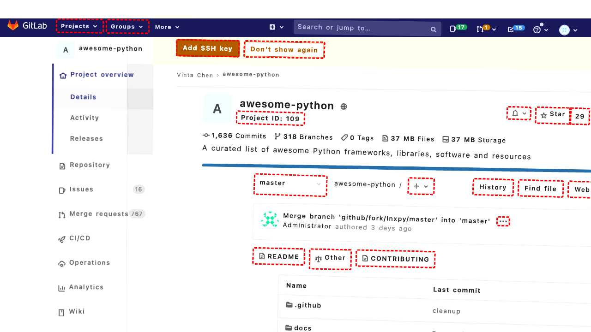
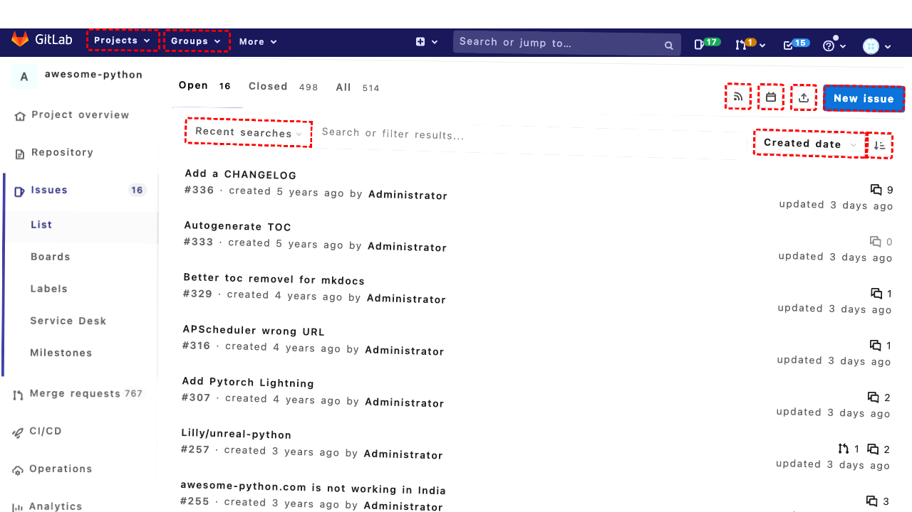

## Intent

Open a new issue to discuss the implementation of default plugins for .zsh

## RM

Thoughts: The user's intent is to open a new issue, which falls under the "Content modification" task type, as it involves creating a new issue (modifying the site's content). The action history shows the agent filled in the title and description fields and clicked the submit button. The final state description indicates the fields are appropriately filled and the submit button is enabled, suggesting the issue creation process is ready to proceed. Since the task is content modification, I focus on the action history and final state, not the bot's response. The actions appear sufficient to complete the task, assuming the click on the submit button (action 5) successfully creates the issue.

Status: success

## Final Response 

## Captions

===============Looking at the current page, I can see we're on the GitLab project page for the "dotfiles" repository. The goal is to open a new issue to discuss the implementation of default plugins for .zsh.

I can see there's an "Issues" link in the navigation with a count of "4" issues. This is the correct place to go to create a new issue. The Issues link has bid 283 according to the accessibility tree.
===============Looking at the current state, I can see we're already on the Issues page for the dotfiles repository (URL shows `/byteblaze/dotfiles/issues`). I can see there are existing issues listed, and there's a "New issue" link available with bid 491 according to the accessibility tree. Since we're already on the issues page, I should click the "New issue" button to start creating the issue about default plugins for .zsh.
===============Looking at the current state, I can see we're already on the "New Issue" page for the dotfiles repository. The page shows a form with fields for Title, Description, and other issue details. The goal is to create an issue about implementing default plugins for .zsh.

I can see:
- A textbox for "Title" with bid 478 (currently focused)
- A textbox for "Description" with bid 521
- A "Submit issue" button with bid 693 (currently disabled)

Since the submit button is disabled, I need to fill in the required fields first. I'll start by entering the title for the issue about default plugins for .zsh.
===============Looking at the current state, I can see the title field has already been filled with "Implement default plugins for .zsh" from my previous action. Now I need to add a description to the issue to make the submit button enabled. I can see the description textbox has bid 521, so I'll fill it with a description about discussing the implementation of default plugins for .zsh.
===============Looking at the current state, I can see that both the title field (bid 478) and description field (bid 521) have been filled with appropriate content for the issue about implementing default plugins for .zsh. The submit button (bid 693) should now be enabled since the required fields are filled. I can proceed to click the submit button to create the issue.

## Images







## Main Prompt

```md
User Intent: Open a new issue to discuss the implementation of default plugins for .zsh

Action History:
1: click("283")
2: click("491")
3: fill("478", "Implement default plugins for .zsh")
4: fill("521", "Let's discuss which default plugins should be included in our .zsh configuration and how to implement them.")
5: click("693")


The detailed final state of the webpage:

```md
Looking at the current state, I can see that both the title field (bid 478) and description field (bid 521) have been filled with appropriate content for the issue about implementing default plugins for .zsh. The submit button (bid 693) should now be enabled since the required fields are filled. I can proceed to click the submit button to create the issue.
```

Bot response to the user: None.
```
