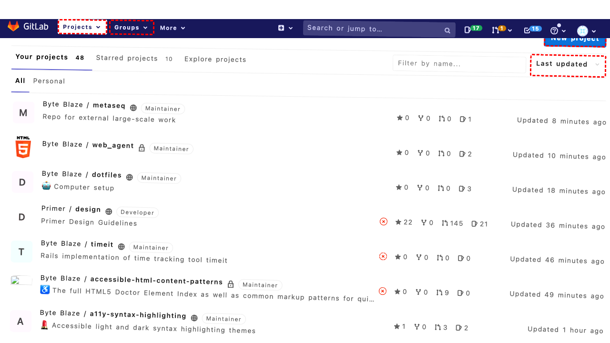
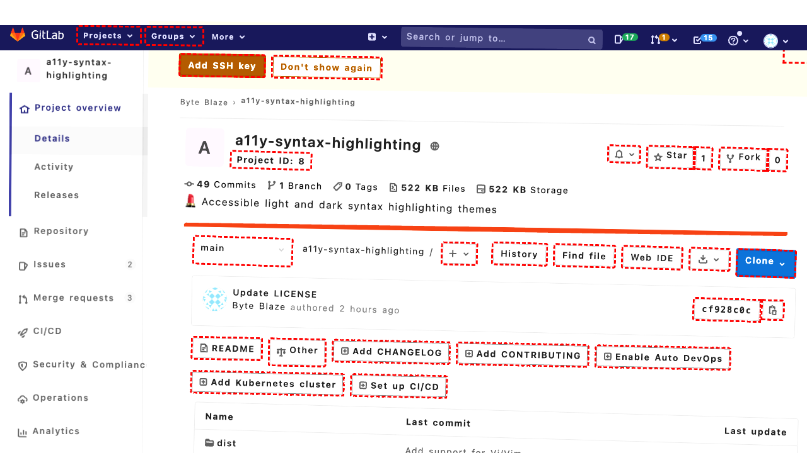
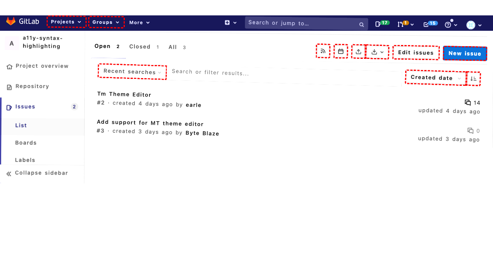

## Intent

Make the LICENSE of gimmiethat.space and dotfiles to MIT license.

## RM

Thoughts: The user's intent is to change the license of two projects (gimmiethat.space and dotfiles) to MIT. This is a content modification task. The action history shows the agent navigated to check the license status but did not perform any modification actions. The final state indicates that gimmiethat.space already has MIT license (so no action needed there), but for dotfiles, the agent only observed the LICENSE file in Tab 7 without making any changes. Since the task requires modifying the dotfiles license to MIT and no edit/update actions were taken, the task is incomplete and thus a failure.

Status: failure

## Final Response 

## Captions

===============Looking at the goal to change the LICENSE of gimmiethat.space and dotfiles to MIT license, I can see that the gimmiethat.space project is listed in the current dashboard view (item with heading "Byte Blaze / GIVE ME SPACE"). However, I don't see a "dotfiles" project in the current list of visible projects.

I should first navigate to the gimmiethat.space project to access its files and modify the LICENSE. Then I'll need to search for the dotfiles project separately.

Let me start by clicking on the gimmiethat.space project link.
===============Looking at the current state, I can see that I'm already on the gimmiethat.space project page (Tab 0). The accessibility tree shows this is the project repository view with files listed, including a LICENSE file. I can see the LICENSE file listed in the table with the text "LICENSE" and it shows "Initial commit" as the last commit.

Since the goal is to change the LICENSE to MIT license, I should navigate to the LICENSE file to view and edit it. I can see the LICENSE file link in the table with bid "776".
===============Looking at the current state, I can see that I'm already on the LICENSE file view for the gimmiethat.space project. The accessibility tree shows the full MIT license text is already present in the file, including the copyright notice and all standard MIT license terms.

The text shows:
- "MIT License" header
- Copyright (c) 2021 Eric Bailey
- Full MIT license text with all standard clauses

Since the LICENSE file already contains the MIT license, no changes are needed for gimmiethat.space. Now I need to find and check the dotfiles project to ensure its LICENSE is also MIT.

I should navigate back to search for the dotfiles project.
===============Looking at the current situation, I can see that:

1. The gimmiethat.space project already has an MIT license (as confirmed by viewing the LICENSE file)
2. The go_back() action timed out, suggesting I'm still on the same page
3. I need to find and check the dotfiles project

Since I'm still on the gimmiethat.space project page and the go_back() didn't work, I should use the search functionality to find the dotfiles project. I can see there's a search box available in the navigation.

Let me search for the dotfiles project using the search box.
===============Looking at the current state, I can see that the search for "dotfiles" returned no results in the current project context. The page shows "We couldn't find any results matching dotfiles" and all search categories (Code, Issues, Merge requests, etc.) show 0 results.

Since the search within the current project scope didn't find any dotfiles project, I need to broaden the search scope. I can see there are filter buttons for "Group: Any" and "Project: Byte Blaze / GIVE ME SPACE" - I should change the project filter to search across all projects rather than being limited to the current gimmiethat.space project.

Let me click the "Project: Byte Blaze / GIVE ME SPACE" dropdown to change the search scope.
===============Looking at the current situation, I can see that:

1. The gimmiethat.space project already has an MIT license (confirmed from viewing the LICENSE file)
2. I need to find and check the dotfiles project
3. My previous search was limited to the current project scope and didn't find dotfiles
4. The error indicates the element with bid "244" doesn't exist

Let me examine the accessibility tree more carefully. I can see there's a search box with bid "155" in the navigation area that says "Search or jump to…". This appears to be a global search that should search across all projects, not just the current one.

Let me use this global search to find the dotfiles project.
===============Looking at the current situation, I can see that:

1. The gimmiethat.space project already has an MIT license (confirmed from viewing the LICENSE file)
2. I need to find and check the dotfiles project
3. My previous attempts to search were unsuccessful due to scope limitations or incorrect element IDs
4. I notice there's a "Search or jump to…" element in the navigation, but the bid "155" wasn't found

Let me examine the accessibility tree more carefully. I can see there's a search box element at position [155] in the tree structure, but it seems the bid system might be using different identifiers. Let me try using the tab navigation to get back to a broader search context.

Since I'm currently on the gimmiethat.space project page and need to search across all projects, let me navigate back to the main dashboard first, where I can perform a global search.
===============Looking at the current situation:

1. I confirmed that gimmiethat.space already has an MIT license (no changes needed)
2. I need to find and check the dotfiles project
3. My previous attempts to search from the project page were unsuccessful due to scope limitations
4. I'm currently on the gimmiethat.space project page

The most reliable approach is to navigate back to the main dashboard where I can perform a global search across all projects. From the accessibility tree, I can see there's a dashboard link in the navigation with the text "Dashboard" that should take me back to the main page.

Let me click the Dashboard link to return to the main projects view.
===============Looking at the current situation and the error message, I can see that the element with bid "52" wasn't found. Let me examine the accessibility tree more carefully to find the correct way to navigate back to the dashboard.

From the accessibility tree, I can see:
- There's a heading with text "Dashboard" at position [51]
- This contains a link "Dashboard" at position [52] with URL to the main dashboard
- However, the bid system might be using different identifiers

Let me try a different approach. I can see there's a "Projects" link in the sidebar navigation that should also take me to a broader view where I can search for all projects.
===============Looking at the current situation:

1. I confirmed that gimmiethat.space already has an MIT license (no changes needed)
2. I need to find and check the dotfiles project
3. My previous attempts to navigate using specific bids have failed
4. I notice from the open tabs that Tab 7 is already showing the dotfiles LICENSE file

Since Tab 7 is already open and showing "LICENSE · master · Byte Blaze / dotfiles · GitLab", I can simply switch to that tab to check the dotfiles license status.

## Images







## Main Prompt

```md
User Intent: Make the LICENSE of gimmiethat.space and dotfiles to MIT license.

Action History:
1: click("724")
2: click("776")
3: go_back()
4: search_project("156", "dotfiles")
5: click("244")
6: click("155")
7: navigate_to_dashboard("52")
8: click("52")
9: click("57")
10: tab_focus(7)


The detailed final state of the webpage:

```md
Looking at the current situation:

1. I confirmed that gimmiethat.space already has an MIT license (no changes needed)
2. I need to find and check the dotfiles project
3. My previous attempts to navigate using specific bids have failed
4. I notice from the open tabs that Tab 7 is already showing the dotfiles LICENSE file

Since Tab 7 is already open and showing "LICENSE · master · Byte Blaze / dotfiles · GitLab", I can simply switch to that tab to check the dotfiles license status.
```

Bot response to the user: None.
```
