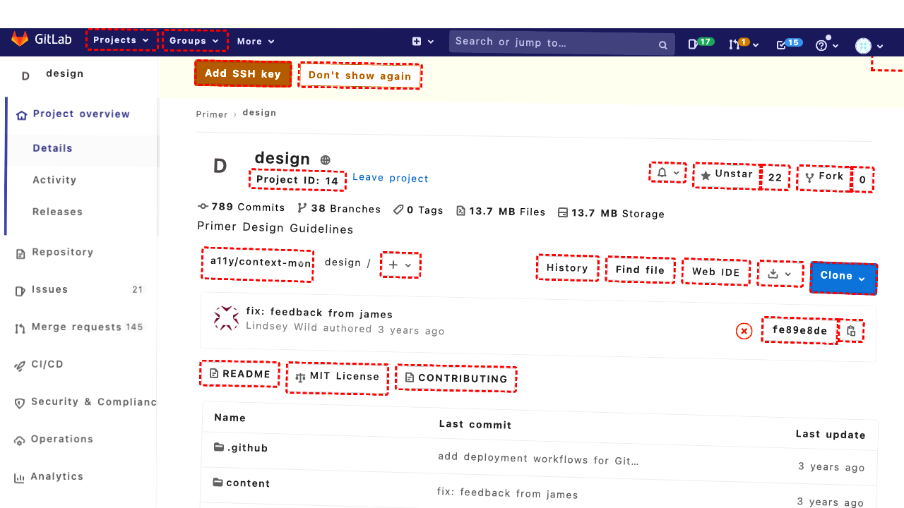
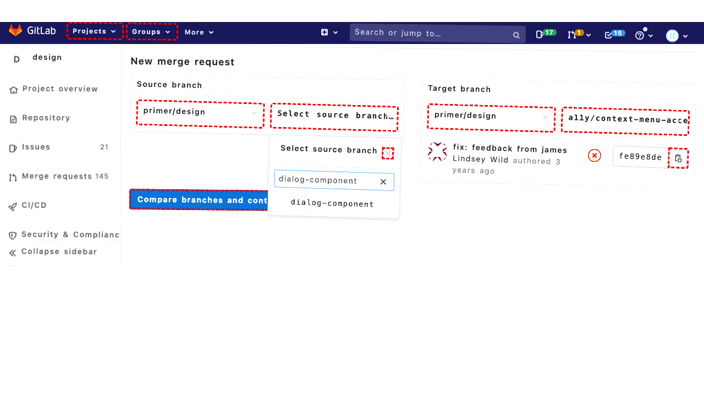
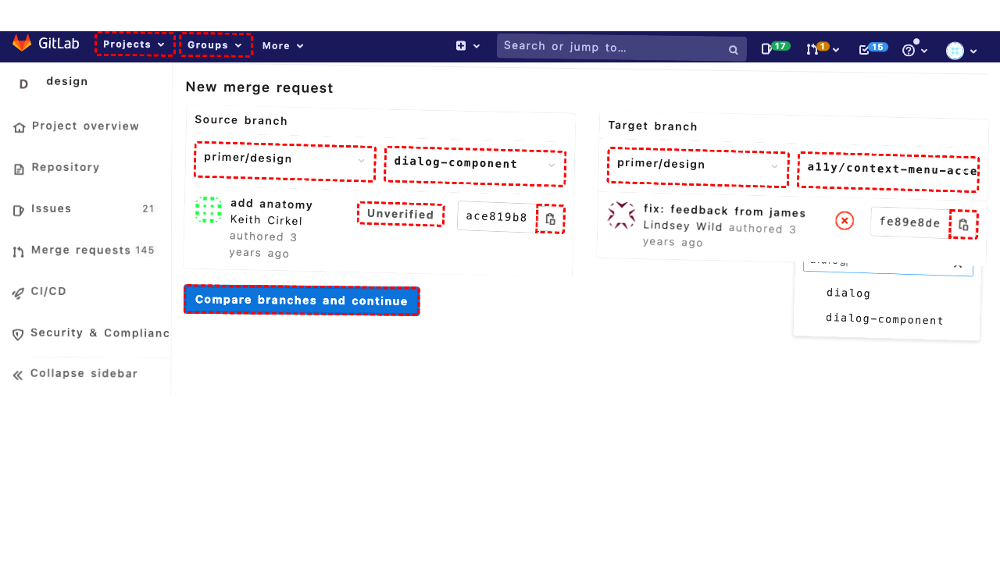
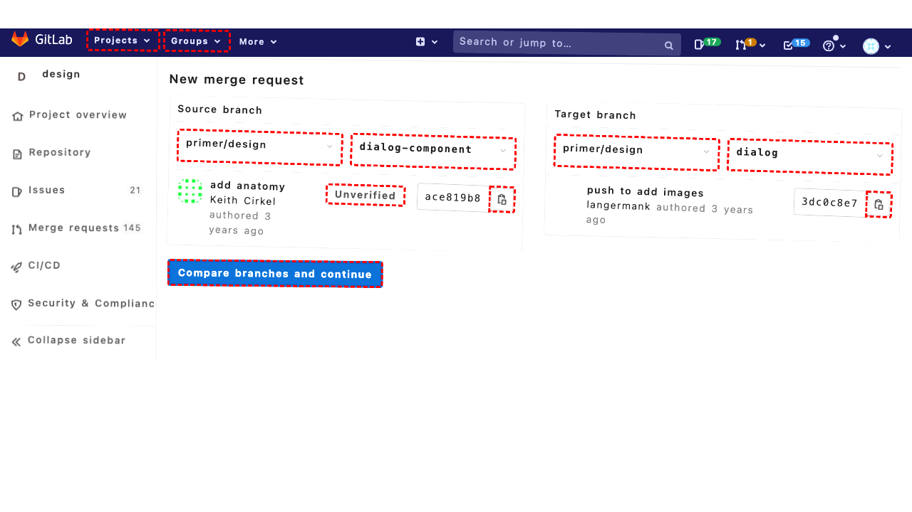

## Intent

Submit a request to merge dialog-component branch into dialog branch, assign Carol as the reviewer

## RM

Thoughts: The user's intent is to submit a merge request from the "dialog-component" branch into the "dialog" branch and assign Carol as the reviewer. The action history shows the agent filled in "dialog-component" as the source branch and "dialog" as the target branch, but the final state indicates an error: the bid "780" (likely for the target branch selection) does not exist, and the agent recognized the correct bid for "dialog" is "841" but did not complete the action. Additionally, there is no action to assign Carol as the reviewer. Since the merge request was not successfully submitted and the reviewer assignment was not addressed, the task is a failure.

Status: failure

## Final Response 

## Captions

===============Looking at the current page, I can see I'm on a GitLab project page for "design" under the "Primer" group. To submit a merge request from dialog-component branch into dialog branch and assign Carol as reviewer, I need to navigate to the Merge Requests section first.

From the accessibility tree, I can see there's a "Merge requests" link in the project navigation sidebar with the label showing "145" merge requests. This is likely the element I need to click to access the merge requests functionality.

Let me click on the "Merge requests" link in the project navigation sidebar.<｜end▁of▁thinking｜>
===============Looking at the current state, I can see I'm already on the Merge Requests page (as indicated by the page title "Merge requests · Primer / design · GitLab"). The page shows a list of existing merge requests, and I need to create a new one.

To create a new merge request, I should look for the "New merge request" button. From the accessibility tree, I can see there's a link with the text "New merge request" with bid 561. This is exactly what I need to click to start creating a new merge request.
===============Looking at the current page state, I can see I'm on the "New merge request" page. The accessibility tree shows:

- Source branch section with a button to "Select source branch" (bid 576)
- Target branch section showing "primer/design" and "a11y/context-menu-accessibility-docs" as options
- A "Compare branches and continue" button (bid 659)

To create the merge request from dialog-component branch into dialog branch, I need to:
1. First select "dialog-component" as the source branch
2. Then select "dialog" as the target branch
3. Continue to the next step where I can assign Carol as reviewer

Let me start by clicking the "Select source branch" button to choose the dialog-component branch.
===============Looking at the current state, I can see that after clicking the "Select source branch" button, a dropdown menu has appeared with a search box (bid 585) that is already focused, and a list of available branches including "dialog-component" (bid 682).

Since the search box is focused, I can simply type "dialog-component" to filter the branches and then select it. This will be more efficient than scrolling through the list.
===============Looking at the current state, I can see that I've filled "dialog-component" into the source branch search box. The accessibility tree shows the search box has value 'dialog-component' and is focused. Now I need to select the "dialog-component" branch from the filtered results. I can see there's a list item with a link for "dialog-component" (bid 682) in the dropdown menu. I should click on this to select it as the source branch.
===============Looking at the error, the element with bid "682" was not found. Let me re-examine the accessibility tree. I can see that after the search box (bid 585), there's a list with listitem containing a link for "dialog-component" (bid 742). The bid "682" I tried doesn't exist in the current tree - it must have been from a previous state.

The correct bid for the dialog-component branch link appears to be "742" based on the current accessibility tree. Let me click on that to select the source branch.
===============Looking at the current state after selecting the source branch, I can see the source branch is now set to "dialog-component" (bid 576 shows "dialog-component" as selected). Now I need to select the target branch. The target branch section shows "primer/design" and "a11y/context-menu-accessibility-docs" as options, but I need to select "dialog" branch instead.

I need to click the target branch dropdown to see all available target branches and select "dialog". The target branch button has bid 620.
===============Looking at the current state, I can see that after clicking the target branch button (bid 620), a dropdown menu has opened with a search box (bid 629) that is focused, and a list of available branches including "dialog" (bid 780).

Since the search box is already focused, I can type "dialog" to quickly filter the branches and then select the "dialog" branch from the results.
===============Looking at the current state, I can see that I've successfully filled "dialog" into the target branch search box (bid 629). The accessibility tree shows the search box has value 'dialog' and is focused. Now I can see in the list that there's a link for "dialog" branch (bid 780) that should be visible after filtering. I need to click on this "dialog" branch link to select it as the target branch.
===============Looking at the error and the current accessibility tree, I can see that after filtering for "dialog", the available branches in the list are "dialog" (bid 841) and "dialog-component" (bid 843). The bid "780" I tried doesn't exist in the current tree - it must have been from a previous state.

The correct bid for the "dialog" branch link appears to be "841" based on the current accessibility tree. Let me click on that to select it as the target branch.

## Images









## Main Prompt

```md
User Intent: Submit a request to merge dialog-component branch into dialog branch, assign Carol as the reviewer

Action History:
1: click("374")
2: click("561")
3: click("576")
4: fill("585", "dialog-component")
5: click("682")
6: click("742")
7: click("620")
8: fill("629", "dialog")
9: click("780")
10: click("841")


The detailed final state of the webpage:

```md
Looking at the error and the current accessibility tree, I can see that after filtering for "dialog", the available branches in the list are "dialog" (bid 841) and "dialog-component" (bid 843). The bid "780" I tried doesn't exist in the current tree - it must have been from a previous state.

The correct bid for the "dialog" branch link appears to be "841" based on the current accessibility tree. Let me click on that to select it as the target branch.
```

Bot response to the user: None.
```
