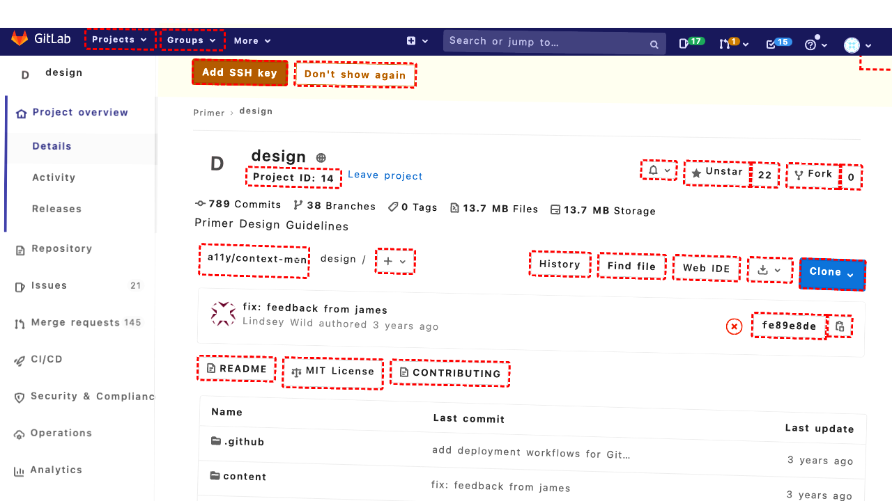
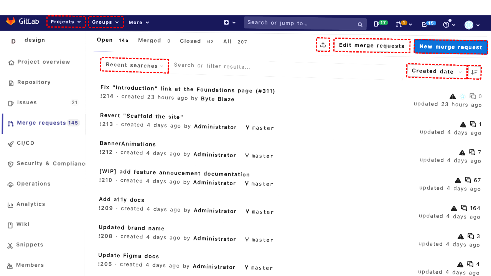
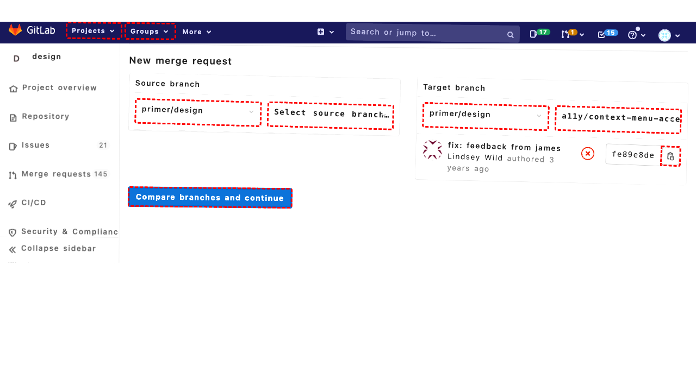
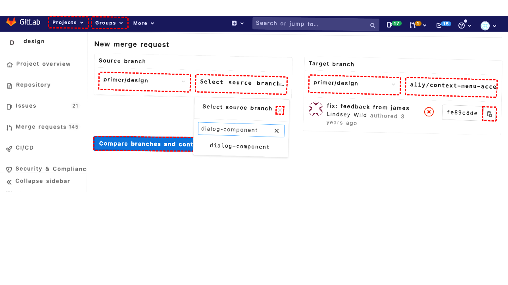
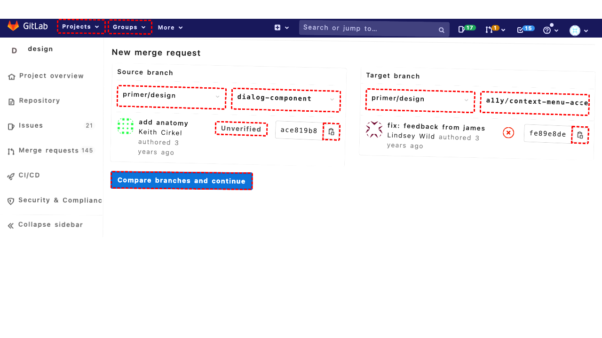
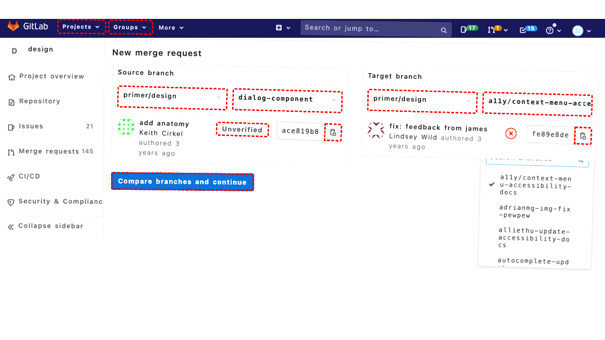
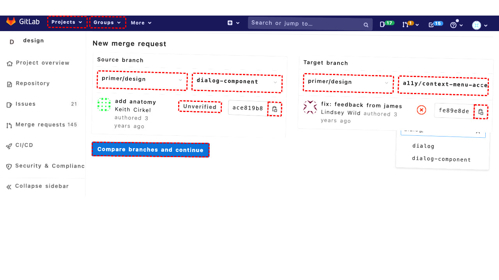
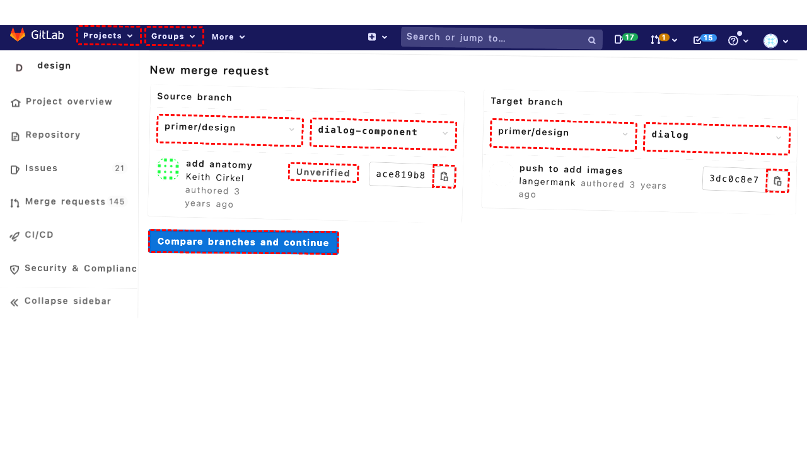

## Intent

Create a new private project "planner" and add Abishek, Vinta as members

## RM

Thoughts: The user's intent is to create a new private project named "planner" and add Abishek and Vinta as members. The action history shows that the agent filled the project name as "planner" (action 4), clicked to create it (action 5), then proceeded to add members. Abishek was added and assigned the "Developer" role (actions 8-10). However, Vinta is not mentioned in the action history or the final state description—only Abishek was added. Since the task requires adding both Abishek and Vinta as members, and the agent only added one, the task is incomplete and thus a failure.

Status: failure

## Final Response 

## Captions

===============Looking at the current page, I can see we're on the GitLab dashboard with a list of projects. To accomplish the goal of creating a new private project called "planner" and adding Abishek and Vinta as members, I need to:

1. First create the new project
2. Then navigate to the project settings to add members

I can see there's a "New project" link with bid '224' on the current page. This is the logical first step to create the new project.
===============Looking at the error message, it seems the "New project" button (bid '224') is being blocked by the user profile dropdown (bid '186') which is intercepting pointer events. This suggests there might be some overlay or positioning issue.

Let me try an alternative approach. I can see there's also a "New..." dropdown in the left navigation with bid '125' that should lead to project creation. This might be more accessible.
===============Looking at the current situation, I can see that clicking the "New..." dropdown (bid '125') was successful since it's now expanded and showing options including "New project". Now I need to click on the "New project" option from this dropdown to proceed with creating the project.

The accessibility tree shows that there's a "New project" option with bid '131' available in the expanded dropdown menu. This should take me to the project creation page.
===============Looking at the current page state, I can see we're now on the "New Project" page with the project creation form. The form has all the necessary fields to create a private project called "planner":

- Project name field (bid '260') is focused and ready for input
- Private visibility radio button (bid '283') is already checked by default
- Create project button (bid '311') is available

Now I need to:
1. Fill in the project name "planner" in the project name field
2. Since private visibility is already selected by default, no action needed there
3. Click the "Create project" button to create the project

The first step is to fill the project name field with "planner".
===============Looking at the current state, I can see that the project name field (bid '260') already has the value "planner" filled in, as shown in the accessibility tree. The private visibility option is already selected by default (bid '283' is checked), and all other settings appear to be correct for creating a private project.

Since the project name is already filled and the visibility is set to private, I can proceed directly to creating the project by clicking the "Create project" button (bid '311').
===============Looking at the current page state, I can see the project "planner" has been successfully created - the accessibility tree shows the success message "Project 'planner' was successfully created." and we're now on the project details page.

The next step is to add Abishek and Vinta as members to this project. To do this, I need to navigate to the project settings where I can manage members. I can see there's a "Settings" link in the project sidebar with bid '363' that should lead to the project settings page where I can access member management.
===============Looking at the current page state, I can see we're on the General Settings page for the "planner" project. The accessibility tree shows that under the Settings section, there's a Members link with bid '376' that leads to the project members management page. This is exactly where I need to go to add Abishek and Vinta as members to the project.
===============Looking at the current page state, I can see we're now on the Members page for the "planner" project. The accessibility tree shows the "Invite member" tab is available with:

- A search field (bid '453') labeled "Select members to invite" where I can search for users
- A role dropdown (bid '461') currently set to "Guest"
- An "Add to project" button (bid '475') that's currently disabled

To add Abishek and Vinta as members, I need to:
1. Search for each user in the search field
2. Select them from the search results
3. Choose their role (likely "Developer" or "Maintainer")
4. Click "Add to project"

Let me start by searching for "Abishek" in the member search field.
===============Looking at the current state, I can see that after searching for "Abishek", the search results are showing "Abishek S @abisubramanya27" as an option (bid '570'). This matches the user we need to add. The search field (bid '453') now contains "Abishek" and the user appears in the dropdown results.

Now I need to select Abishek from the search results to add him as a member. I can see the user option with bid '570' is available in the search results list.
===============Looking at the current state, I can see that after clicking on "Abishek S" from the search results, the user has been selected and added to the invitation list. The accessibility tree shows that Abishek is now listed as a selected member with bid '577' in the "Invite member" section.

Now I need to set the appropriate role for Abishek. The role dropdown (bid '461') is currently set to "Guest" by default. For a project member, I should set a more appropriate role like "Developer" or "Maintainer". Let me set it to "Developer" which is a common role for project contributors.

## Images












## Main Prompt

```md
User Intent: Create a new private project "planner" and add Abishek, Vinta as members

Action History:
1: click("224")
2: click("125")
3: click("131")
4: fill("260", "planner")
5: click("311")
6: click("363")
7: click("376")
8: fill("453", "Abishek")
9: click("570")
10: select_option("461", "Developer")


The detailed final state of the webpage:

```md
Looking at the current state, I can see that after clicking on "Abishek S" from the search results, the user has been selected and added to the invitation list. The accessibility tree shows that Abishek is now listed as a selected member with bid '577' in the "Invite member" section.

Now I need to set the appropriate role for Abishek. The role dropdown (bid '461') is currently set to "Guest" by default. For a project member, I should set a more appropriate role like "Developer" or "Maintainer". Let me set it to "Developer" which is a common role for project contributors.
```

Bot response to the user: None.
```
