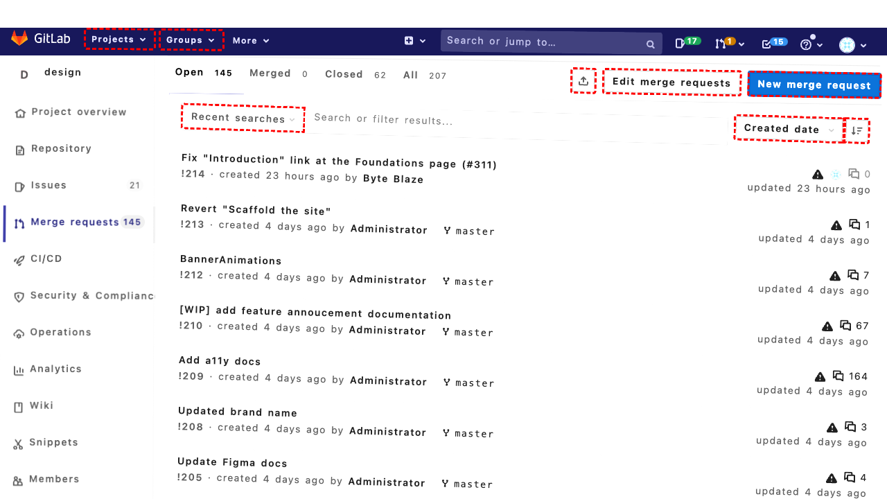
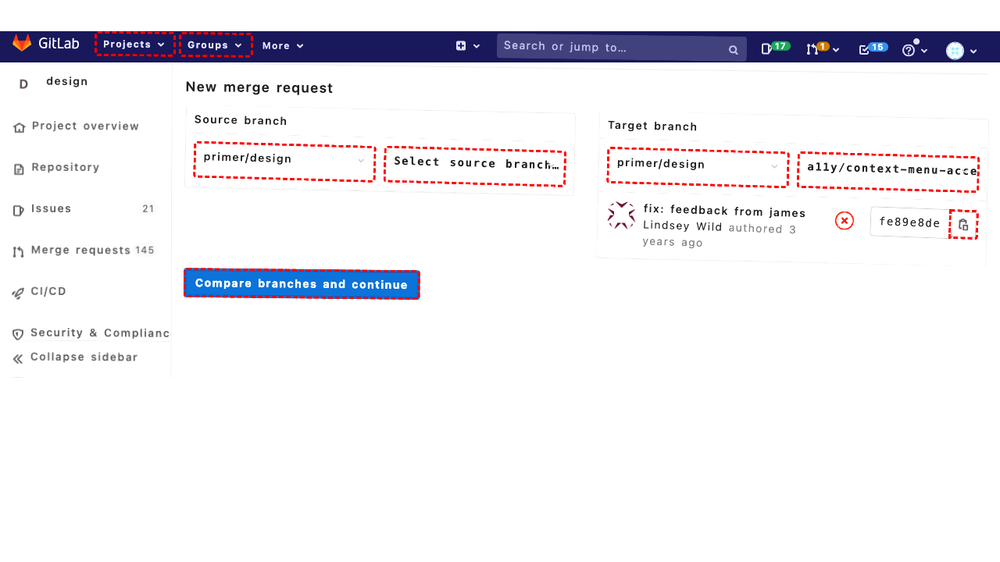
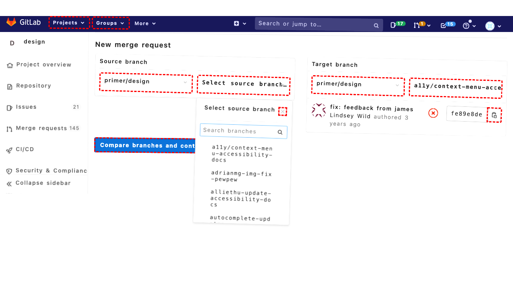
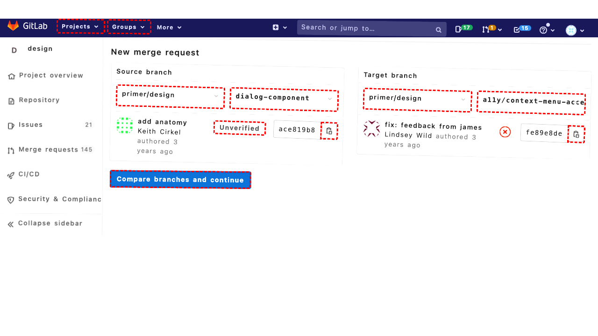
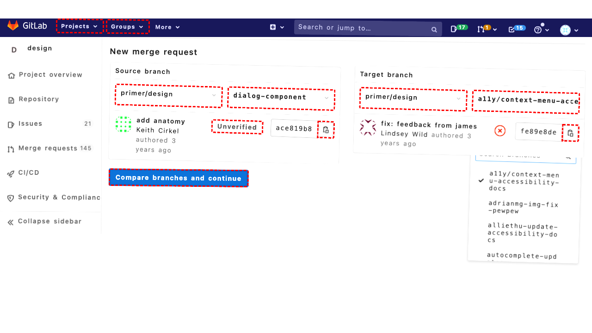
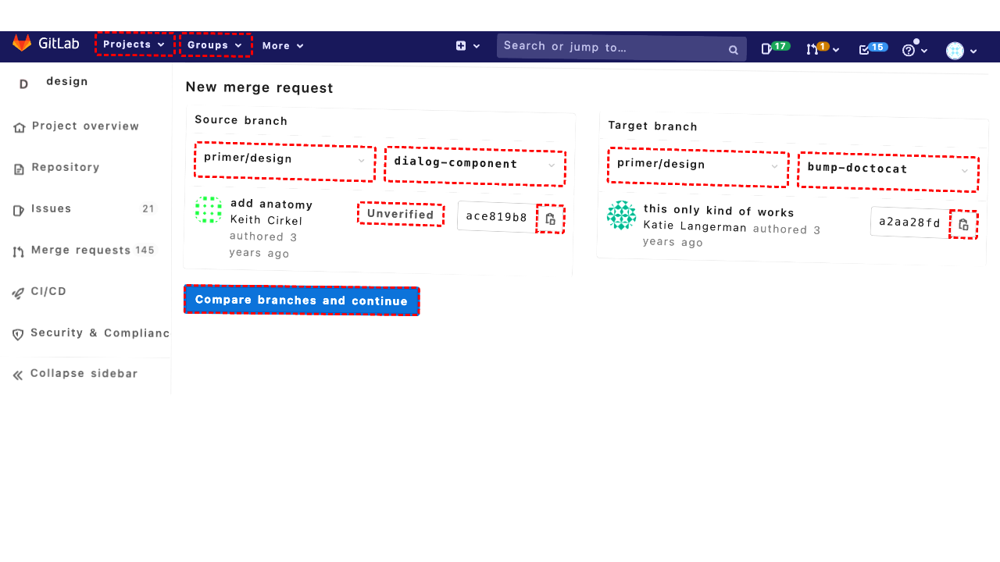
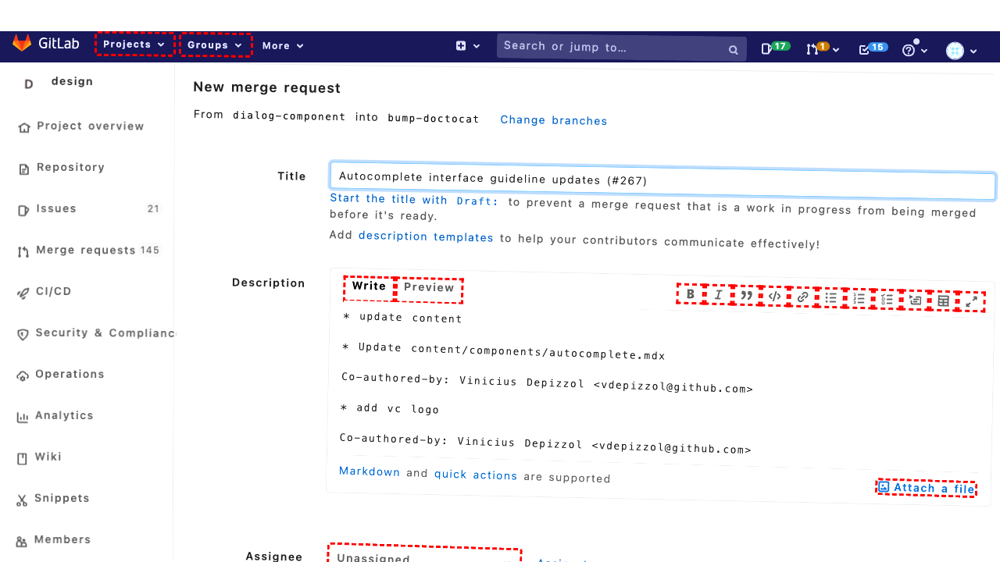
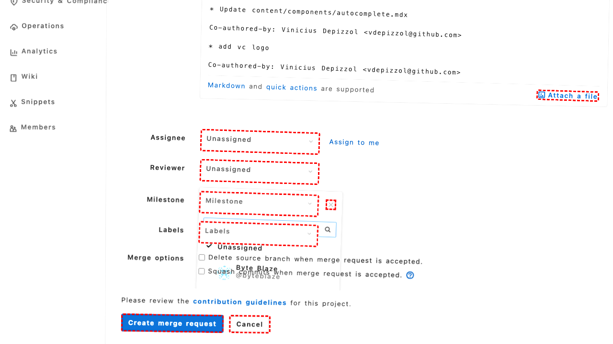
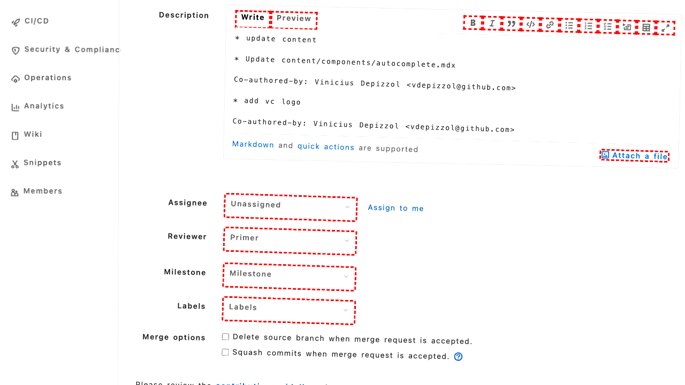
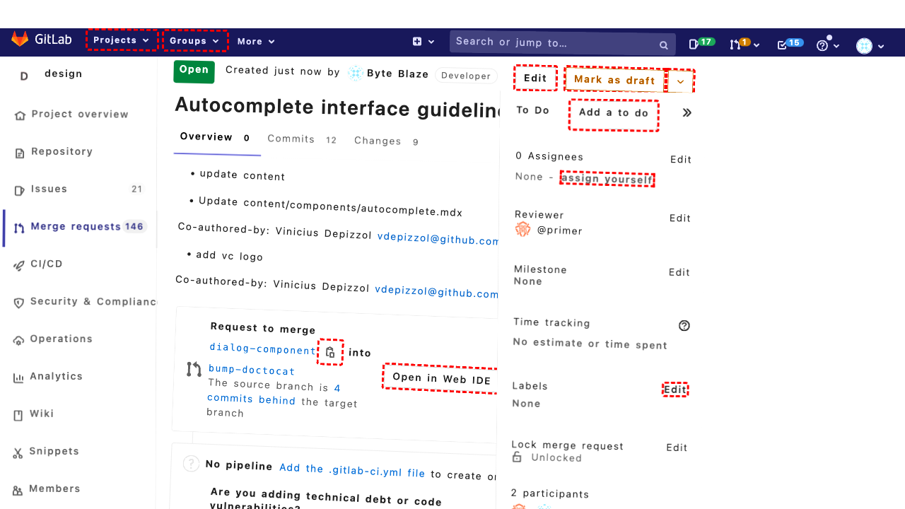

## Intent

Submit a merge request for dialog-component branch to be merged into bump-doctocat branch, assign primer as the reviewer

## RM

Thoughts: The user's intent is to submit a merge request for the dialog-component branch to be merged into the bump-doctocat branch and assign Primer as the reviewer. This is a content modification task, as it involves creating and configuring a merge request. The action history shows the agent performed a series of clicks, and the final state indicates that Primer has been assigned as the reviewer, but the merge request has not yet been submitted because the "Create merge request" button (bid "820") has not been clicked in the action history. The last action is click("820"), but the final state description suggests this action is still pending and the merge request creation is incomplete. Therefore, the task has not been successfully completed.

Status: failure

## Final Response 

## Captions

===============Looking at the current page, I can see I'm on the GitLab project page for "design" under the Primer organization. To submit a merge request for the dialog-component branch to be merged into bump-doctocat branch, I need to navigate to the Merge Requests section first.

From the accessibility tree, I can see there's a "Merge requests" link in the project navigation sidebar with the label showing "145" merge requests. This is the element I should click to navigate to the merge requests page.
===============Looking at the current state, I can see I'm already on the Merge Requests page for the Primer/design project. The page shows a list of existing merge requests, and I need to create a new one. I can see there's a "New merge request" link available in the accessibility tree with bid "561". This is exactly what I need to click to start creating a new merge request for the dialog-component branch.
===============Looking at the current page, I can see I'm on the "New merge request" page. The accessibility tree shows the form is loaded with source branch and target branch selection fields. I need to:

1. Select "dialog-component" as the source branch
2. Select "bump-doctocat" as the target branch
3. Continue to the next step where I can assign primer as reviewer

I can see the "Select source branch" button with bid "576" - this is what I need to click first to choose the dialog-component branch.
===============Looking at the current state, I can see that after clicking the "Select source branch" button, a dropdown menu has appeared with a search box (bid "585") that's already focused, and a list of available branches including "dialog-component" (bid "682"). I need to select the "dialog-component" branch from this list.

Since the search box is focused, I could type to filter, but I can see "dialog-component" is already visible in the list, so I can simply click on it directly.
===============Looking at the current state, I can see that I've successfully selected "dialog-component" as the source branch. Now I need to select "bump-doctocat" as the target branch. I can see in the accessibility tree there's a target branch selection button with bid "620" that currently shows "a11y/context-menu-accessibility-docs". I need to click this button to change the target branch to "bump-doctocat".
===============Looking at the current state, I can see that after clicking the target branch button, a dropdown has opened with a search box (bid "629") that's focused, and a list of available branches including "bump-doctocat" (bid "771"). I need to select the "bump-doctocat" branch from this list to set it as the target branch.

Since "bump-doctocat" is visible in the list, I can click on it directly.
===============Looking at the current state, I can see that I've successfully selected both the source branch ("dialog-component") and target branch ("bump-doctocat"). Now I need to proceed to the next step where I can assign primer as the reviewer. I can see there's a "Compare branches and continue" button with bid "659" - this is exactly what I need to click to move forward with creating the merge request where I'll be able to assign reviewers.
===============Looking at the current page, I can see I'm on the "New merge request" form page with both source branch ("dialog-component") and target branch ("bump-doctocat") already selected. The form is fully loaded with title, description, assignee, reviewer, and other fields.

I need to assign "primer" as the reviewer. I can see the reviewer section has a button with bid "688" that currently shows "Unassigned". I need to click this button to open the reviewer selection dropdown where I can search for and select "primer".
===============Looking at the current state, I can see that after clicking the reviewer button, a dropdown has opened with a search box (bid "697") that's focused, and a list of available users including "Primer @primer" (bid "1176"). I need to select "Primer" from this list to assign them as the reviewer for this merge request.

Since "Primer @primer" is visible in the user list, I can click on it directly to assign them as the reviewer.
===============Looking at the current state, I can see that I've successfully assigned "Primer" as the reviewer for the merge request. The reviewer field now shows "Primer" instead of "Unassigned".

Now I need to complete the merge request creation by clicking the "Create merge request" button at the bottom of the form. I can see this button with bid "820" in the accessibility tree. This will submit the merge request with the dialog-component branch as source, bump-doctocat branch as target, and primer assigned as reviewer.

## Images












## Main Prompt

```md
User Intent: Submit a merge request for dialog-component branch to be merged into bump-doctocat branch, assign primer as the reviewer

Action History:
1: click("374")
2: click("561")
3: click("576")
4: click("682")
5: click("620")
6: click("771")
7: click("659")
8: click("688")
9: click("1176")
10: click("820")


The detailed final state of the webpage:

```md
Looking at the current state, I can see that I've successfully assigned "Primer" as the reviewer for the merge request. The reviewer field now shows "Primer" instead of "Unassigned".

Now I need to complete the merge request creation by clicking the "Create merge request" button at the bottom of the form. I can see this button with bid "820" in the accessibility tree. This will submit the merge request with the dialog-component branch as source, bump-doctocat branch as target, and primer assigned as reviewer.
```

Bot response to the user: None.
```
