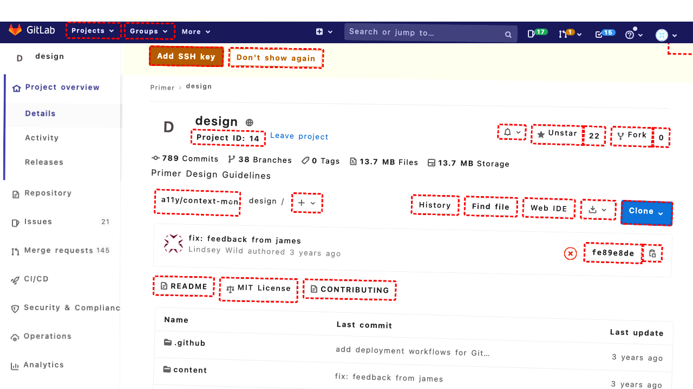
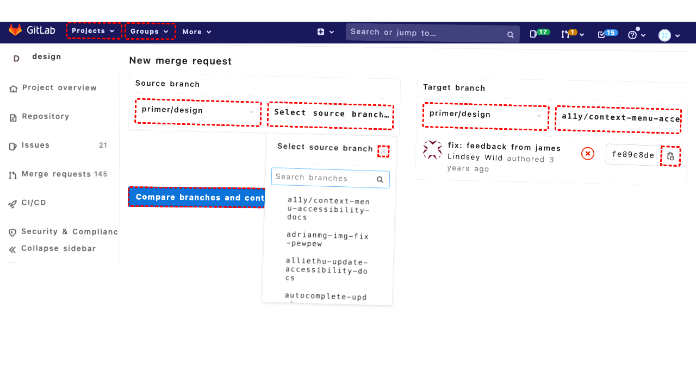
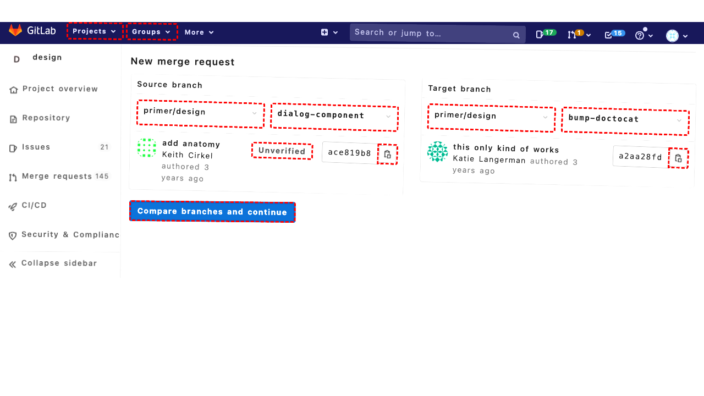
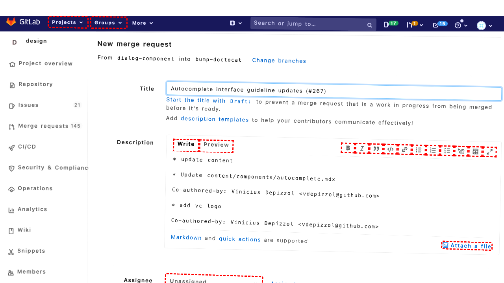
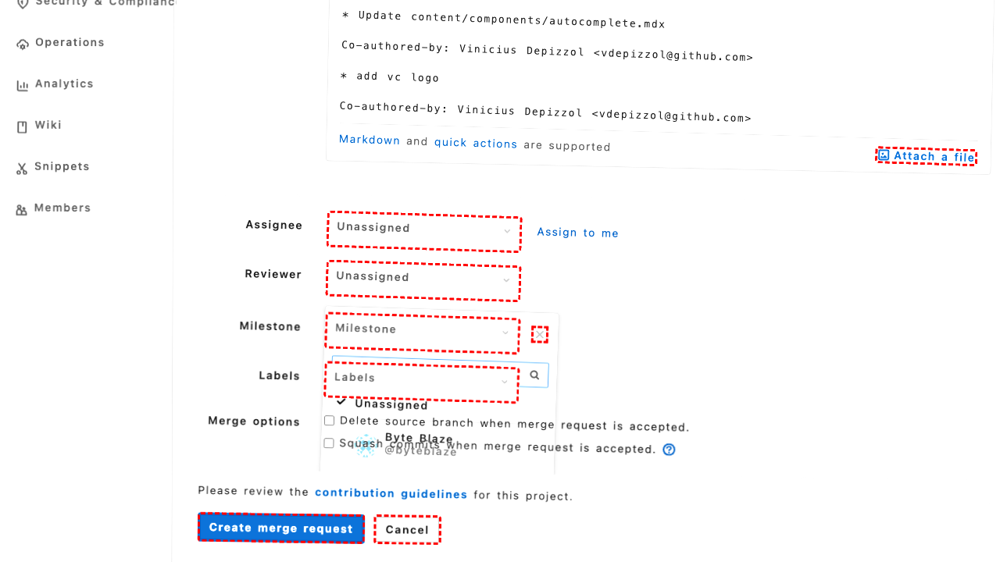
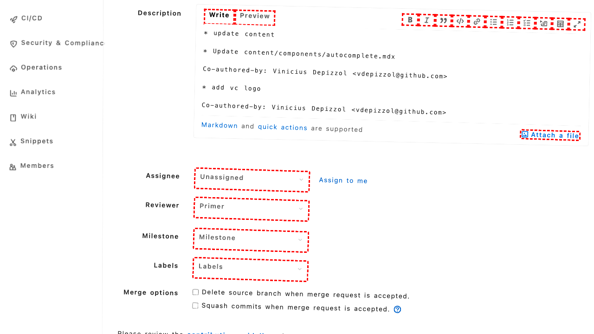
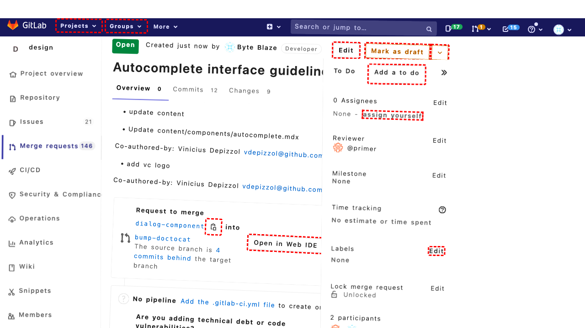

## Intent

Create a new public project "web_arena" and add Abishek, Vinta as members

## RM

Thoughts: The user's intent is to create a new public project named "web_arena" and add Abishek and Vinta as members. The action history shows that the agent filled the project name "web_arena" and searched for "Abishek", with "Abishek S @abisubramanya27" appearing in the search results. However, the agent only clicked on the search result for Abishek (action 10) but did not confirm adding Abishek as a member, nor did it add Vinta at all. The final state indicates that the agent is still in the process of selecting Abishek and has not completed adding either member. Since the task requires both members to be added and the project to be created, and the actions are incomplete, the task fails.

Status: failure

## Final Response 

## Captions

===============Looking at the current page, I can see I'm on the GitLab dashboard with a list of projects. To accomplish the goal of creating a new public project "web_arena" and adding Abishek and Vinta as members, I need to first navigate to the project creation page. I can see there's a "New project" link with ID '224' in the accessibility tree.

The first step is to click on this "New project" link to start the project creation process.
===============The error indicates that the "New project" link is being intercepted by another element (likely the profile dropdown in the header). I need to try a different approach to create a new project. Looking at the accessibility tree, I can see there's also a "New..." dropdown in the left navigation with ID '125' that contains a "New project" option. Let me try using that instead.
===============Looking at the current situation, I can see that clicking the "New..." dropdown (ID '125') was successful since there's no error. Now I need to select the "New project" option from the dropdown menu. In the accessibility tree, I can see there's a "New project" link with ID '131' within the dropdown list that appears when "New..." is expanded.

The next step is to click on this "New project" option to navigate to the project creation page.
===============Looking at the current state, I can see I'm now on the "New Project" page (Tab 0). The accessibility tree shows I'm on the project creation form with various fields available. To create the "web_arena" project as public and add members later, I need to:

1. Fill in the project name "web_arena" in the textbox with ID '260'
2. Change the visibility level to "Public" by selecting the radio button with ID '297'
3. Click the "Create project" button with ID '311'

The project name field is already focused according to the accessibility tree, so I can start by filling it.
===============Looking at the current state, I can see that the project name field (ID '260') has already been filled with "web_arena" as shown in the accessibility tree. Now I need to change the visibility level from the default "Private" to "Public" to make this a public project as requested in the goal. The public visibility radio button has ID '297' in the accessibility tree.

The next step is to select the public visibility option by clicking on the radio button with ID '297'.
===============Looking at the current state, I can see that:

1. The project name "web_arena" is already filled in the textbox (ID '260')
2. The public visibility radio button (ID '297') is already checked and focused according to the accessibility tree
3. The "Create project" button (ID '311') is available

Since both the project name and public visibility are already set correctly, I can proceed directly to creating the project by clicking the "Create project" button. After the project is created, I can then navigate to the project settings to add Abishek and Vinta as members.
===============Looking at the current state, I can see the project "web_arena" has been successfully created as indicated by the success message "Project 'web_arena' was successfully created." in the accessibility tree. Now I need to add Abishek and Vinta as members to this project.

To add members, I need to navigate to the project settings and then to the members management section. I can see in the accessibility tree there's a "Settings" link with ID '363' in the left sidebar. This is where I can access the member management functionality.

The next step is to click on the "Settings" link to access the project settings where I can manage members.
===============Looking at the current state, I can see I'm now on the project settings page for the "web_arena" project. The accessibility tree shows I'm in the "General" settings section, but I need to navigate to the "Members" section to add Abishek and Vinta as members.

In the left sidebar under Settings, I can see there's a "Members" link with ID '376' that will take me to the member management page where I can add new members to the project.

The next step is to click on the "Members" link to access the member management interface.
===============Looking at the current state, I can see I'm now on the "Members" page for the "web_arena" project. The accessibility tree shows the member management interface with:

1. A search box for "Select members to invite" (ID '453')
2. A role selection dropdown (ID '461') currently set to "Guest"
3. An "Add to project" button (ID '475') that is currently disabled

To add Abishek and Vinta as members, I need to:
1. Search for each user in the search box
2. Select them from the search results
3. Choose their role (I'll use the default "Guest" role unless specified otherwise)
4. Click "Add to project"

Let me start by searching for "Abishek" in the member search box.
===============Looking at the current state, I can see that I've successfully filled "Abishek" in the search box (ID '453'), and the accessibility tree shows that "Abishek S @abisubramanya27" appears as an option in the search results (ID '570'). This is the user I need to add.

The next step is to select Abishek from the search results by clicking on the option with ID '570'. After selecting the user, I can then proceed to add them to the project.

## Images












## Main Prompt

```md
User Intent: Create a new public project "web_arena" and add Abishek, Vinta as members

Action History:
1: click("224")
2: click("125")
3: click("131")
4: fill("260", "web_arena")
5: click("297")
6: click("311")
7: click("363")
8: click("376")
9: fill("453", "Abishek")
10: click("570")


The detailed final state of the webpage:

```md
Looking at the current state, I can see that I've successfully filled "Abishek" in the search box (ID '453'), and the accessibility tree shows that "Abishek S @abisubramanya27" appears as an option in the search results (ID '570'). This is the user I need to add.

The next step is to select Abishek from the search results by clicking on the option with ID '570'. After selecting the user, I can then proceed to add them to the project.
```

Bot response to the user: None.
```
