## Intent

Create a new public project "AutoAGI" and add primer as members

## RM

Thoughts: The user's intent is to create a new public project named "AutoAGI" and add "primer" as members. This is a content modification task. The action history shows the agent filled the project name "AutoAGI" and searched for "primer" in the member field, but the final state indicates that the search result for "Primer @primer" was not selected (selected=False), and there is no subsequent action to add the member to the project. Without selecting the user from the search results, the member "primer" would not be added to the project, so the task is incomplete.

Status: failure

## Final Response 

## Captions

===============Looking at the current page, I can see I'm on the GitLab dashboard with a "Projects" view. To accomplish the goal of creating a new public project called "AutoAGI" and adding primer as members, I need to first navigate to the project creation page. I can see there's a "New project" link available with ID 224.

The first step is to click on this "New project" link to start the project creation process.
===============Looking at the error message, it appears that the "New project" link (ID 224) is being intercepted by another element - specifically the user profile dropdown (ID 186) from the header. This is a common issue where overlapping elements prevent clicking.

I need to try a different approach. I can see there's also a "New..." dropdown in the left navigation with ID 125, which should also lead to project creation. Let me try clicking that instead.
===============Looking at the current situation, I can see that clicking the "New..." dropdown (ID 125) was successful since there's no error message. Now I need to select the "New project" option from this dropdown to navigate to the project creation page. I can see in the accessibility tree that there's a "New project" option with ID 131 available in the dropdown menu.
===============Looking at the current page state, I can see I'm now on the "New Project" page in GitLab. The goal is to create a public project called "AutoAGI" and add primer as members.

From the accessibility tree, I can see:
- Project name field (ID 260) is focused and ready for input
- Visibility level options are available (currently set to Private)
- Create project button (ID 311) is available

First, I need to fill in the project name "AutoAGI" and set the visibility to Public. Then I can create the project, and afterwards navigate to add members.
===============Looking at the current page state, I can see that the project name field (ID 260) is already filled with "AutoAGI" and focused. The next step is to change the visibility level from Private to Public, since the goal requires creating a public project. I can see there's a radio button for "Public" with ID 297 that is currently unchecked.
===============Looking at the current state, I can see that:

1. The project name "AutoAGI" is already filled in the project name field (ID 260)
2. The Public visibility radio button (ID 297) has been selected (it shows "focused, checked='true'" in the accessibility tree)
3. All other required fields like project slug are automatically populated

The project creation form is now properly configured with:
- Project name: "AutoAGI"
- Visibility: Public (checked)
- Other fields: Auto-populated

The next step is to click the "Create project" button to actually create the project. Once the project is created, I can then navigate to add "primer" as members.
===============Looking at the current page state, I can see that the project "AutoAGI" has been successfully created - there's a success message "Project 'AutoAGI' was successfully created." visible in the accessibility tree. The project is now active and I'm on the project details page.

The next part of the goal is to add "primer" as members to this project. To do this, I need to navigate to the project settings and then to the members management section. I can see there's a "Settings" link in the sidebar with ID 363 that should lead to the project settings.
===============Looking at the current page, I can see I'm now on the project settings page for the "AutoAGI" project. The goal requires adding "primer" as members to this project. I need to navigate to the members management section specifically.

From the accessibility tree, I can see there's a "Members" link in the settings sidebar with ID 376. This is exactly what I need to access the member management functionality where I can add new members to the project.
===============Looking at the current page, I can see I'm now on the "Members" page for the AutoAGI project. The accessibility tree shows:

1. An "Invite member" tab (ID 437) that is currently not selected
2. A search field for "Select members to invite" (ID 453)
3. A role selection dropdown (ID 461) currently set to "Guest"
4. An "Add to project" button (ID 475) that is currently disabled

To add "primer" as members, I need to:
1. Make sure I'm on the "Invite member" tab (it appears to be active based on the tabpanel being visible)
2. Search for the user "primer" in the member search field
3. Select the appropriate role (likely "Developer" or "Maintainer" based on typical member permissions)
4. Click "Add to project"

The "Add to project" button is currently disabled because no member has been selected yet. I should start by searching for "primer" in the member search field.
===============Looking at the current state, I can see that:

1. I successfully filled "primer" into the member search field (ID 453)
2. The accessibility tree shows that "primer" is now the value in the search field
3. More importantly, I can see in the tree that there's a search result for "Primer @primer" with ID 570 that appeared in the dropdown list (ID 455)
4. This result is currently not selected (selected=False)

The search has found the user "primer" and now I need to select this user from the search results to enable the "Add to project" button.

## Images

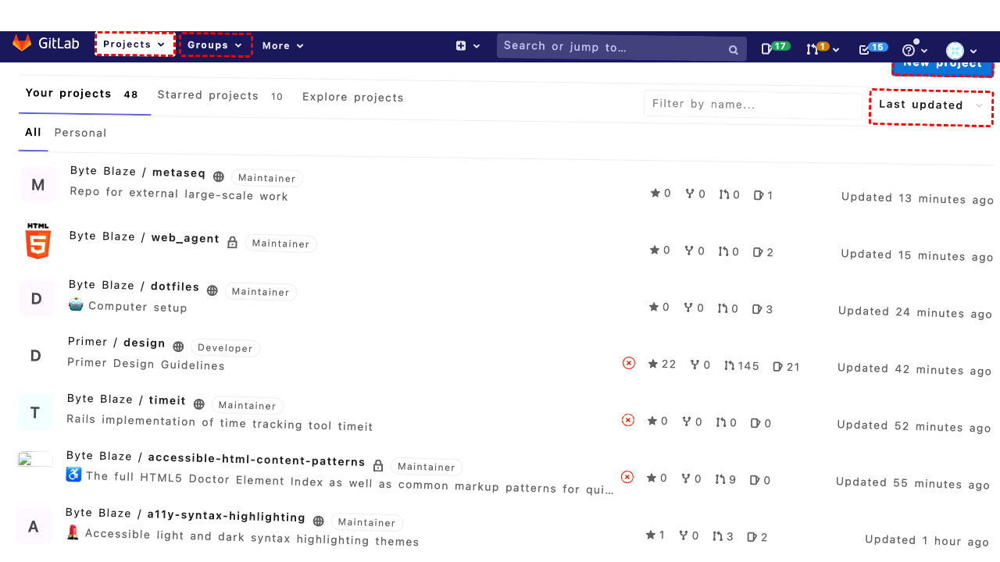
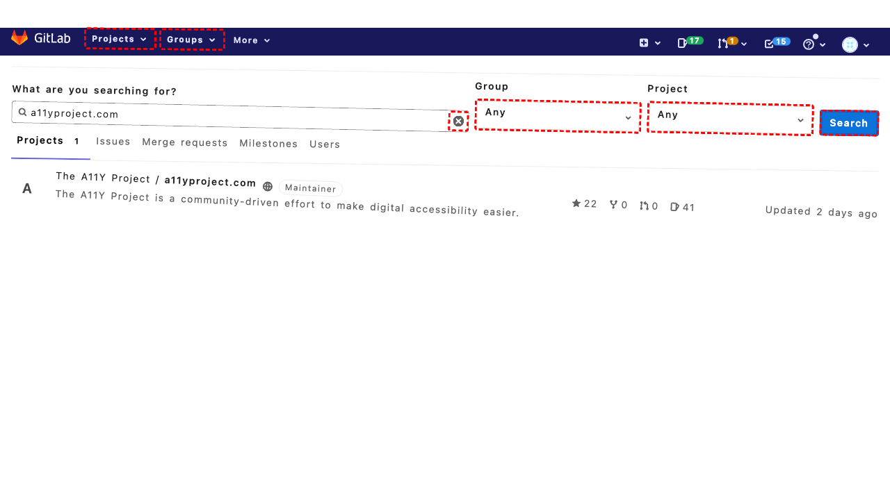
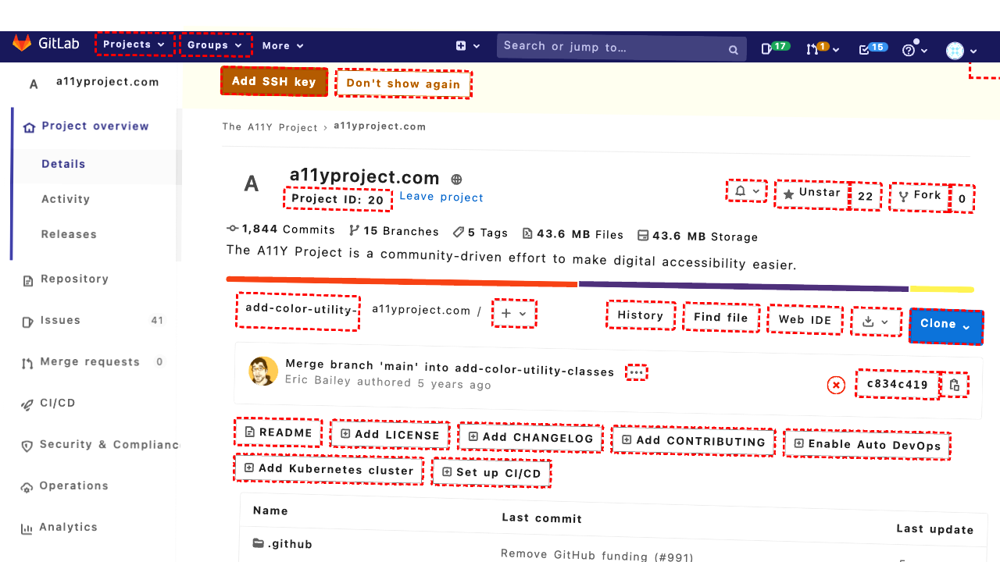
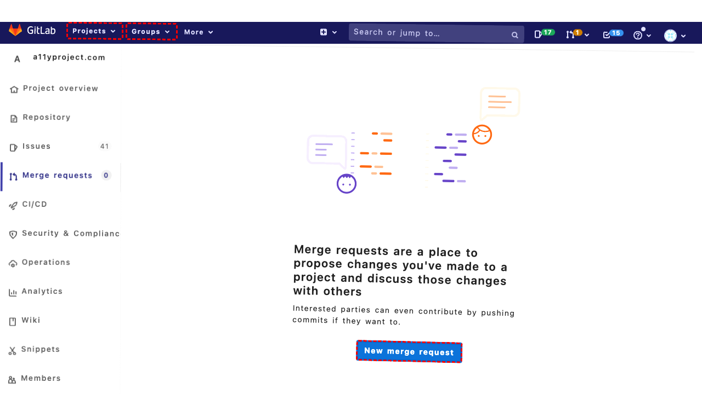
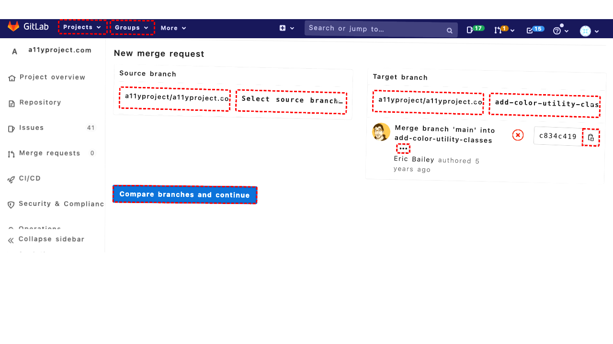
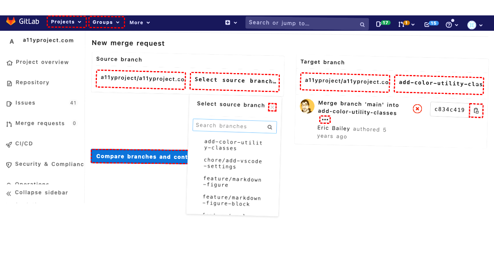
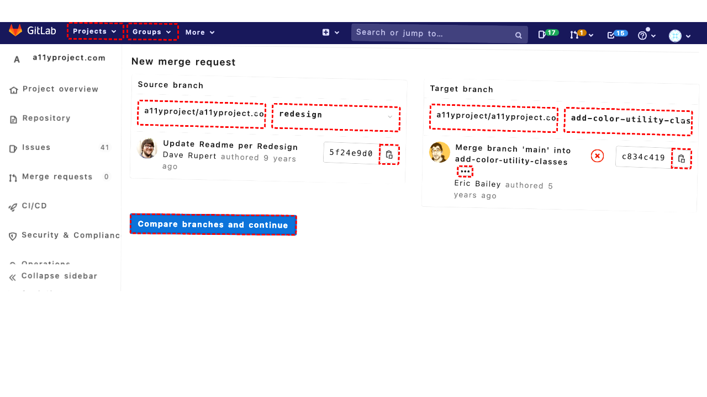
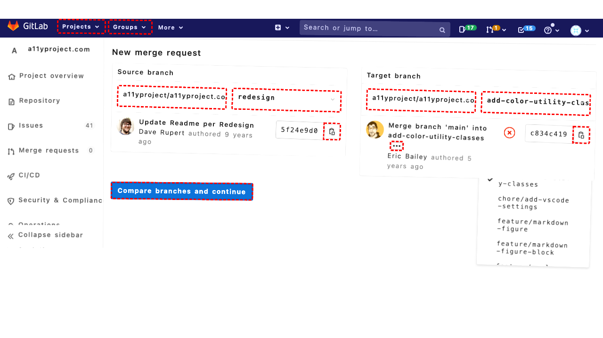
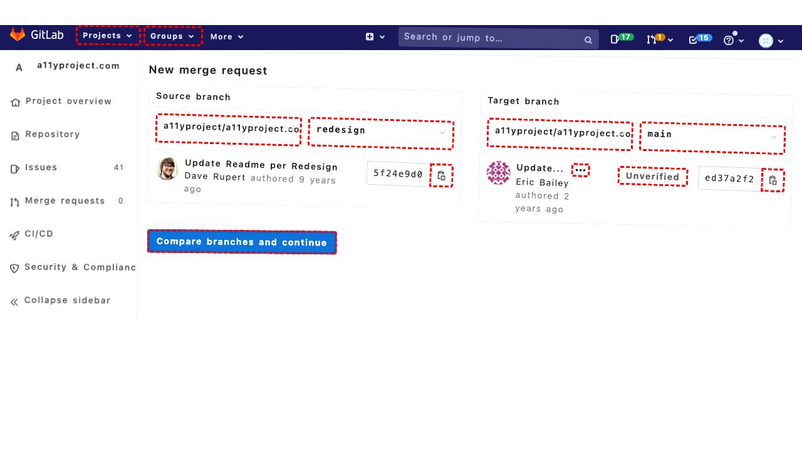
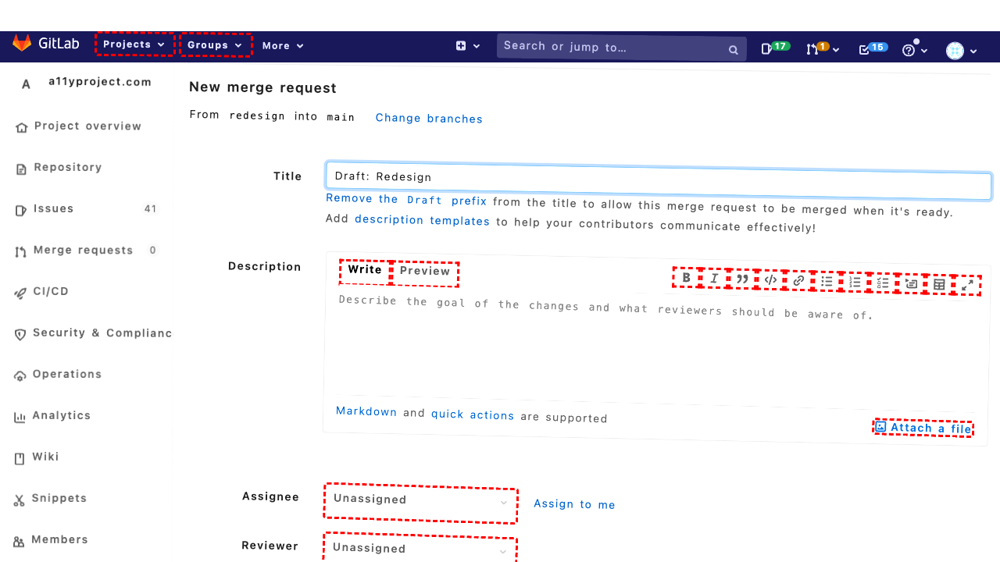
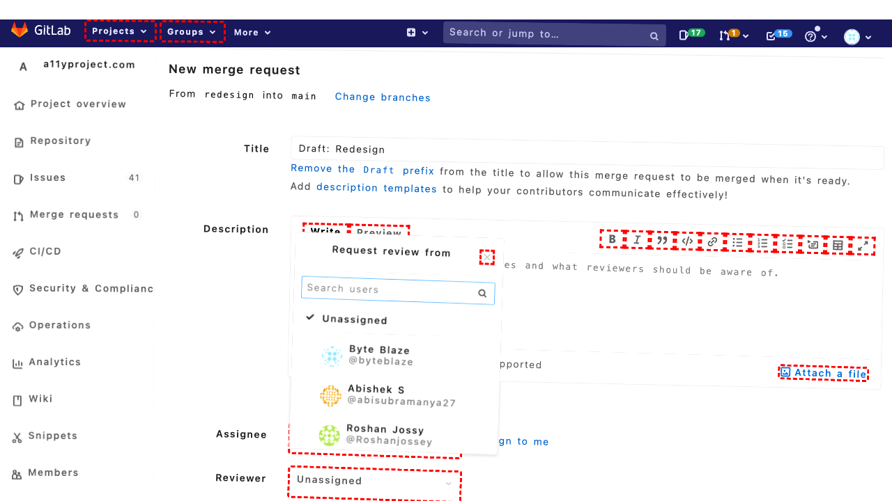
## Main Prompt

```md
User Intent: Create a new public project "AutoAGI" and add primer as members

Action History:
1: click("224")
2: click("125")
3: click("131")
4: fill("260", "AutoAGI")
5: click("297")
6: click("311")
7: click("363")
8: click("376")
9: fill("453", "primer")
10: click("570")


The detailed final state of the webpage:

```md
Looking at the current state, I can see that:

1. I successfully filled "primer" into the member search field (ID 453)
2. The accessibility tree shows that "primer" is now the value in the search field
3. More importantly, I can see in the tree that there's a search result for "Primer @primer" with ID 570 that appeared in the dropdown list (ID 455)
4. This result is currently not selected (selected=False)

The search has found the user "primer" and now I need to select this user from the search results to enable the "Add to project" button.
```

Bot response to the user: None.
```
