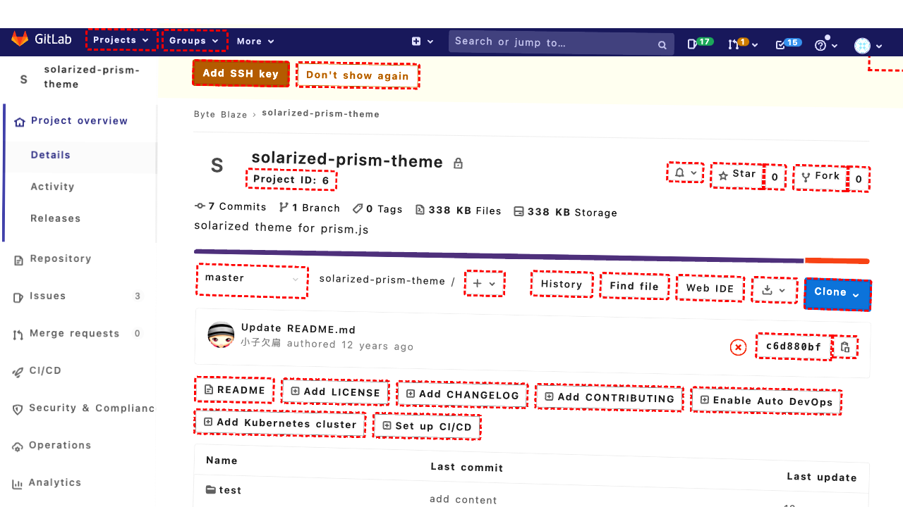
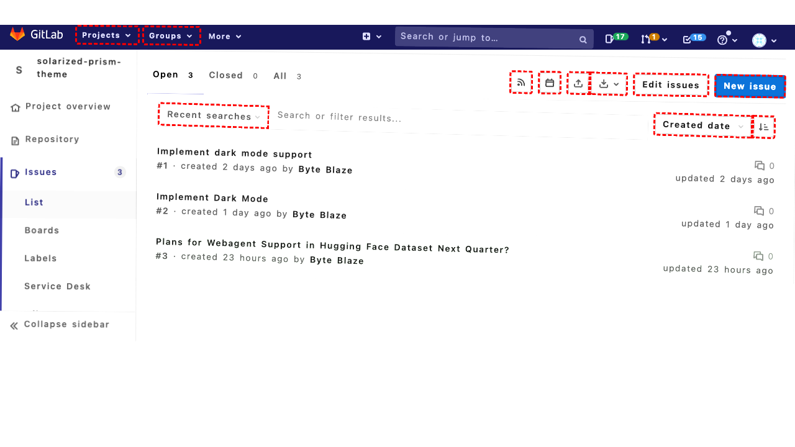
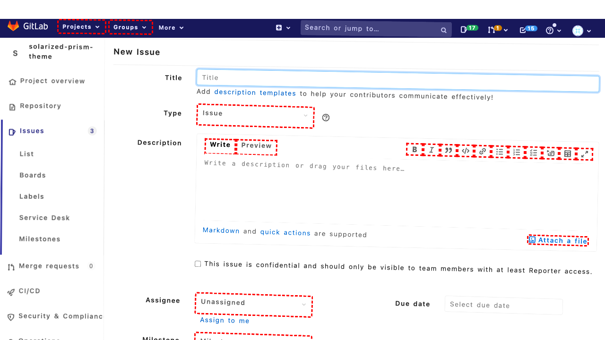
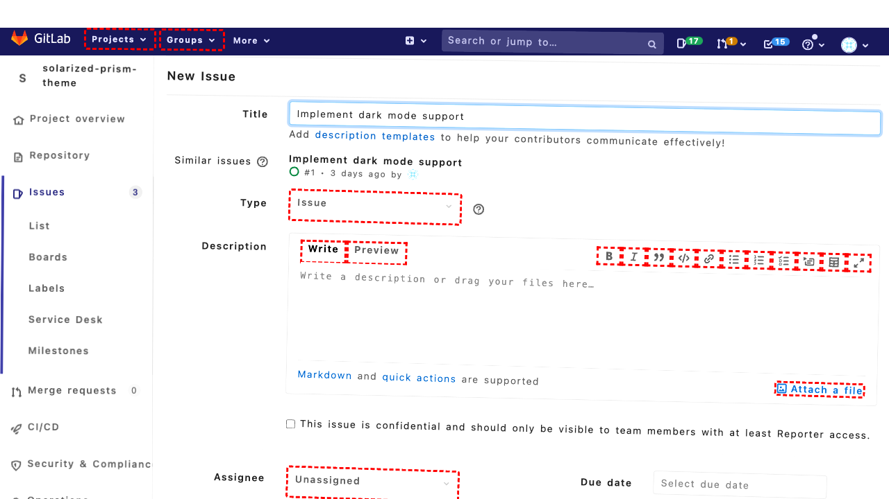
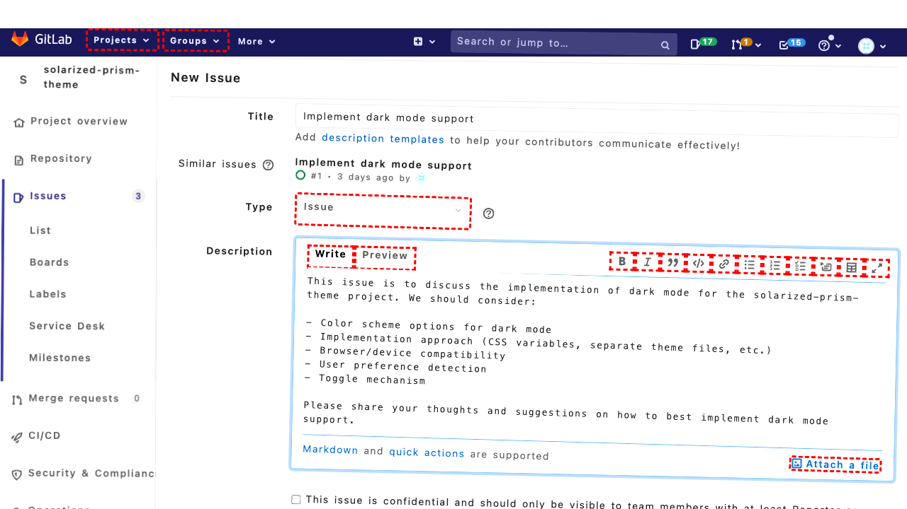
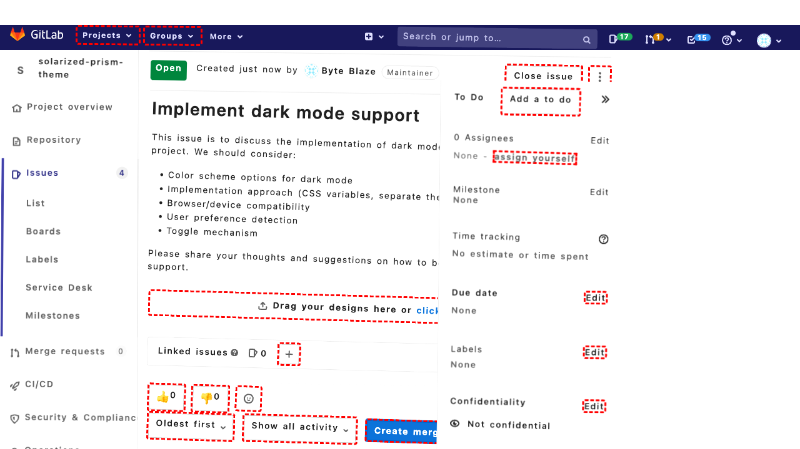
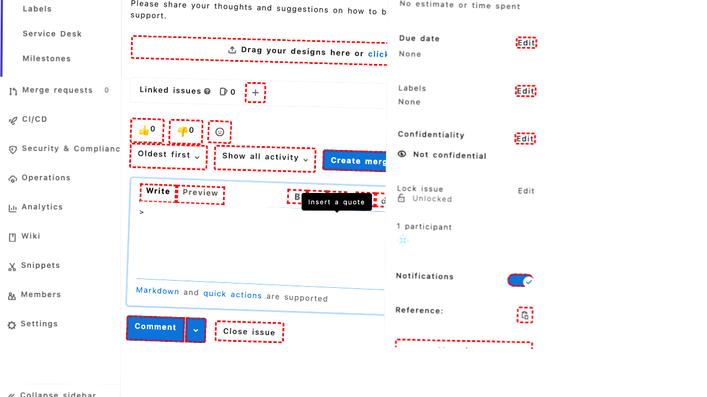
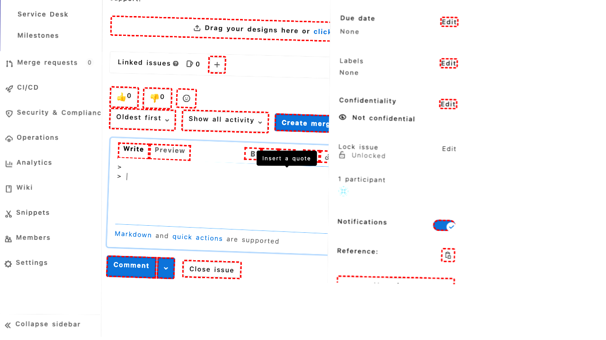
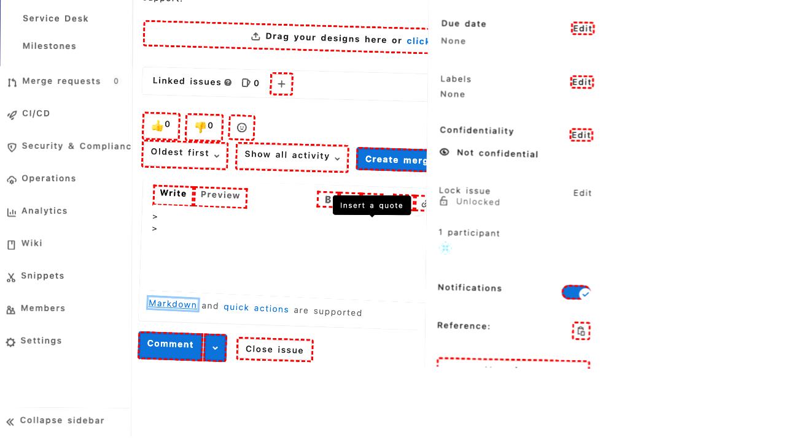

## Intent

Open a new issue to discuss the implementation of dark mode

## RM

Thoughts: The user's intent is to open a new issue, which is a content modification task. The agent's action history shows that it filled the title and description fields and attempted to submit the form multiple times (clicks, keyboard presses). However, the final state of the webpage indicates that the submission was not successful—the page did not transition to show the newly created issue, and the agent itself notes that the form hasn't been processed. Since the issue was not created, the task has failed.

Status: failure

## Final Response 

## Captions

===============Looking at the current page, I can see we're on a GitLab project page for "solarized-prism-theme". To open a new issue to discuss dark mode implementation, I need to navigate to the Issues section and then click the "New Issue" button.

From the accessibility tree, I can see there's an "Issues" link in the project navigation sidebar with bid 347. This should take me to the issues page where I can then create a new issue.

Let me first navigate to the Issues page.<｜end▁of▁thinking｜>
===============Looking at the current page state, I can see we're already on the Issues page for the solarized-prism-theme project. The accessibility tree shows we're viewing the issues list with 3 existing issues, including some about dark mode implementation. I can see a "New issue" link with bid 623 in the current view.

Since we're already on the Issues page, I don't need to navigate there again. I can directly click the "New issue" link to start creating a new issue to discuss dark mode implementation.
===============Looking at the current state, I can see we're already on the "New Issue" page for the solarized-prism-theme project. The accessibility tree shows the new issue form is loaded with all the necessary fields:

- Title textbox (bid 591) is focused and required
- Description textbox (bid 665)
- Create issue button (bid 840) - currently disabled because the required title field is empty

Since we're already on the new issue creation page, I need to fill in the title and description to discuss dark mode implementation, then submit the form.
===============Looking at the current state, I can see that I've successfully filled in the title field with "Implement dark mode support". The title field (bid 591) now has the required content. Next, I need to fill in the description field to provide more details about the dark mode implementation discussion. The description textbox has bid 665 in the accessibility tree.
===============Looking at the current state, I can see that both the title and description fields have been successfully filled with the dark mode implementation discussion content. The title field (bid 591) contains "Implement dark mode support" and the description field (bid 665) contains the detailed discussion points.

Now I need to submit the form to create the issue. The accessibility tree shows there's a "Create issue" button with bid 840. Since all required fields are filled (the title is required and has content), the create button should now be enabled and ready to submit the new issue.
===============Looking at the current state, I can see that I've successfully filled both the title and description fields for the new issue about dark mode implementation. The title field contains "Implement dark mode support" and the description includes detailed discussion points about color schemes, implementation approaches, compatibility, user preference detection, and toggle mechanisms.

The form should now be ready for submission since the required title field is filled. The "Create issue" button (bid 840) should be enabled and clickable. I need to click this button to actually create the new issue and complete the goal of opening a new issue to discuss dark mode implementation.
===============Looking at the current state, I can see that I've already filled both the title and description fields for the new issue about dark mode implementation. The form appears to be complete and ready for submission. However, I notice that in the previous action history, I already attempted to click the "Create issue" button (bid 840) twice, but the page hasn't changed to show the newly created issue.

Let me check if there might be any additional required fields or if the button has a different state. Looking at the accessibility tree, I can see the "Create issue" button (bid 840) is present. Since the title field is required and has content, and the description is filled, the button should be clickable.

Let me try clicking the create button one more time to ensure the issue gets created.
===============Looking at the current situation, I can see that I've already filled the title and description fields for the new issue about dark mode implementation, and I've attempted to click the "Create issue" button (bid 840) multiple times. However, the page hasn't transitioned to show the newly created issue, which suggests there might be an issue with the submission.

Let me check if there are any other required fields or if the button might have a different state. Looking at the accessibility tree, I can see the "Create issue" button is present. Since the title field (which is required) has content, the button should be enabled.

Let me try a different approach - I'll use the keyboard to submit the form by pressing Enter, which might work if there's an issue with the button click.
===============Looking at the current situation, I've already filled the title and description fields for the new issue about dark mode implementation, and I've tried multiple approaches to submit the form:

1. Clicked the "Create issue" button (bid 840) three times
2. Tried pressing Enter to submit the form

The page hasn't transitioned to show the newly created issue, which suggests there might be an issue with the form submission or the button state. Let me check if there are any validation errors or if the button is actually disabled for some reason.

Looking at the accessibility tree again, I notice there might be additional fields or options that need attention. Let me try scrolling to see if there are any other form elements that need to be filled out, or try a different approach by using the tab key to navigate through the form and see if there are any validation messages.
===============Looking at the current situation, I've tried multiple approaches to submit the new issue form but haven't been successful. I've filled the title and description, clicked the "Create issue" button multiple times, pressed Enter, and tried tab navigation. The page hasn't transitioned to show the newly created issue.

Let me try a different approach - I'll check if there might be a confirmation dialog or if I need to wait for the form to process. I'll use a noop action to wait a bit longer and see if the submission processes, as sometimes there can be delays with form submissions.

## Images












## Main Prompt

```md
User Intent: Open a new issue to discuss the implementation of dark mode

Action History:
1: navigate_to_issues('347')
2: click('623')
3: fill('591', 'Implement dark mode support')
4: fill('665', 'This issue is to discuss the implementation of dark mode for the solarized-prism-theme project. We should consider:\n\n- Color scheme options for dark mode\n- Implementation approach (CSS variables, separate theme files, etc.)\n- Browser/device compatibility\n- User preference detection\n- Toggle mechanism\n\nPlease share your thoughts and suggestions on how to best implement dark mode support.')
5: click('840')
6: click('840')
7: click('840')
8: keyboard_press('Enter')
9: keyboard_press('Tab')
10: noop(3000)


The detailed final state of the webpage:

```md
Looking at the current situation, I've tried multiple approaches to submit the new issue form but haven't been successful. I've filled the title and description, clicked the "Create issue" button multiple times, pressed Enter, and tried tab navigation. The page hasn't transitioned to show the newly created issue.

Let me try a different approach - I'll check if there might be a confirmation dialog or if I need to wait for the form to process. I'll use a noop action to wait a bit longer and see if the submission processes, as sometimes there can be delays with form submissions.
```

Bot response to the user: None.
```
