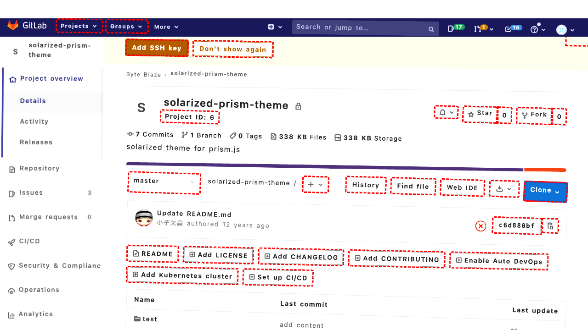
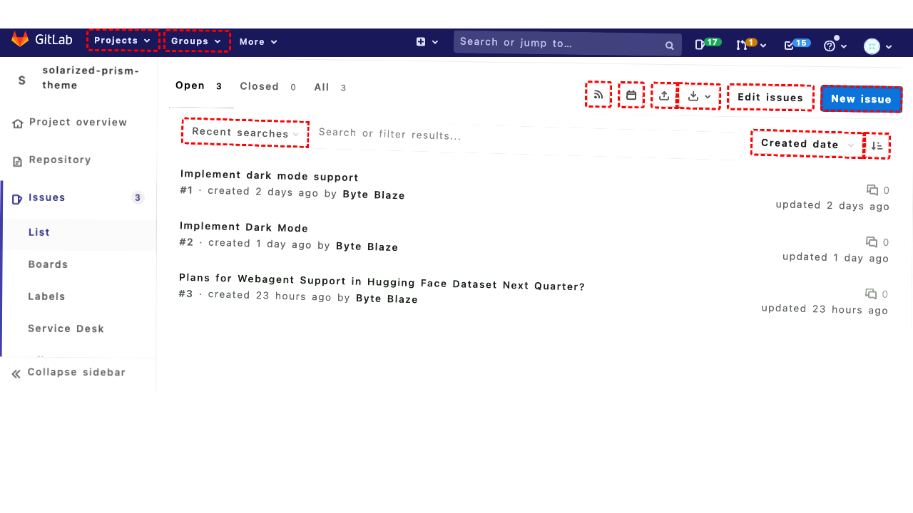
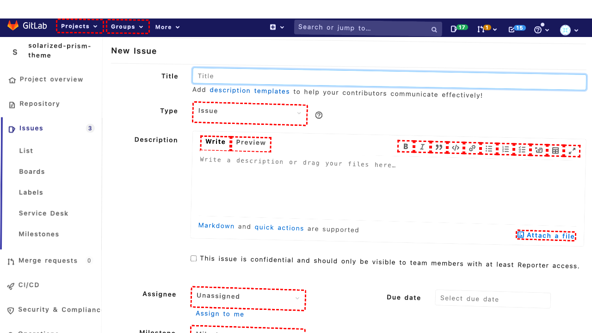
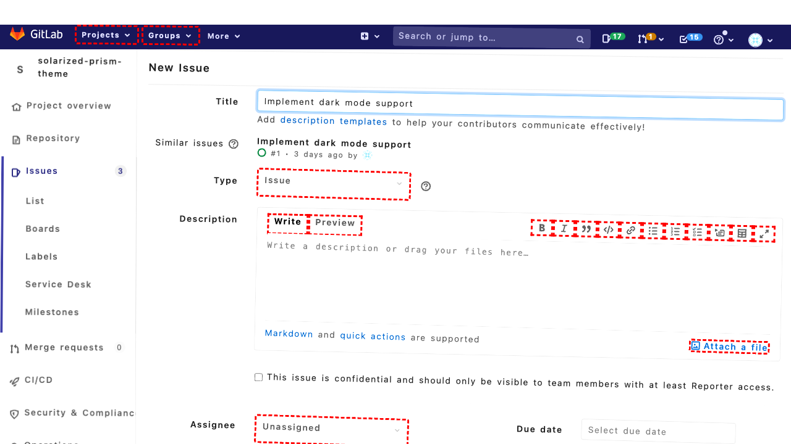
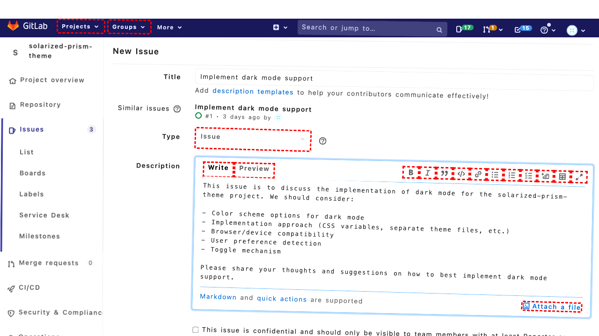
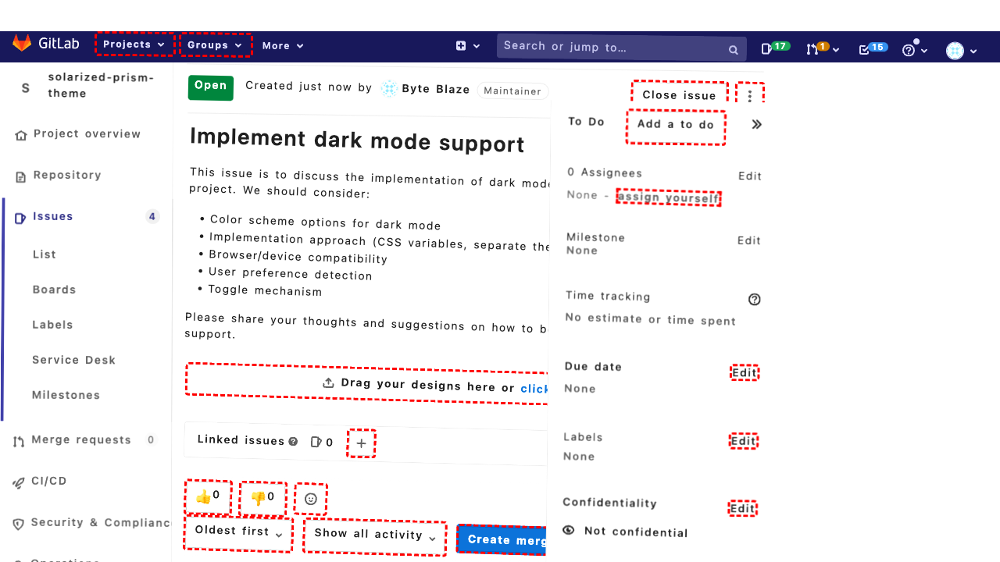
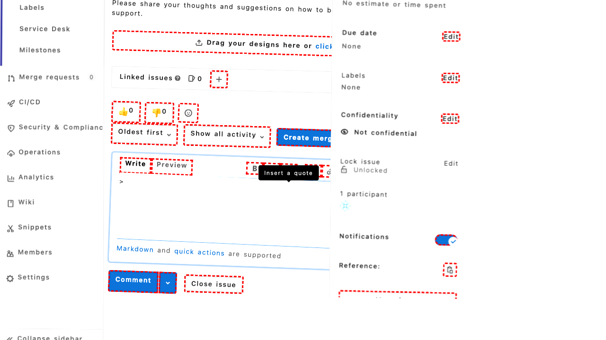
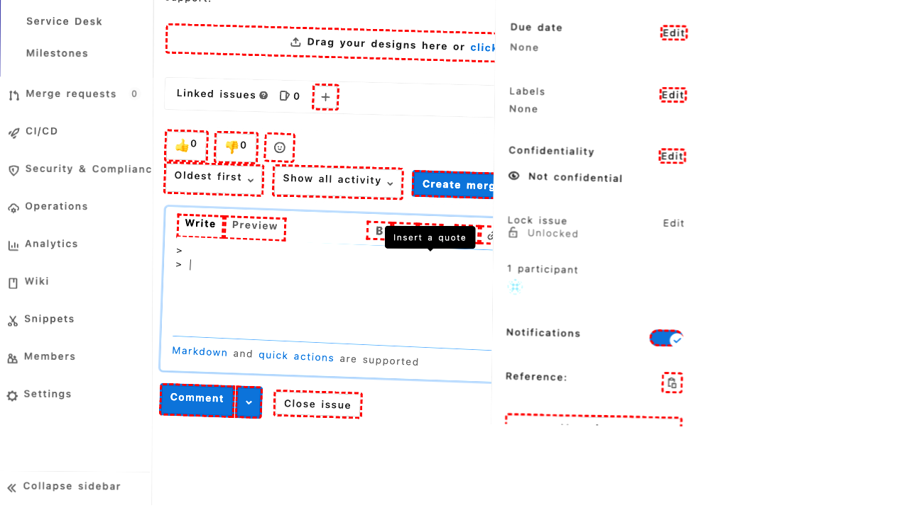
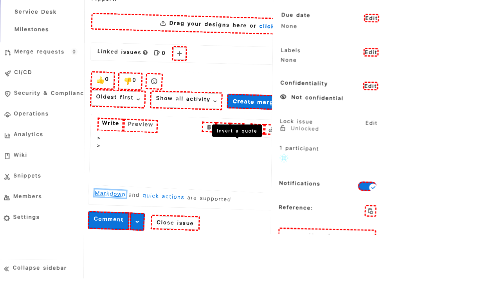

## Intent

Create a new public project "awesome-llms" and add primer, convexegg, abishek as members

## RM

Thoughts: The user's intent is to create a new public project named "awesome-llms" and add three members: primer, convexegg, and abishek. The action history shows that the agent successfully created the project by filling in the name and clicking relevant buttons, and then began adding members by searching for and selecting "primer" (ID 570). However, the action history stops after selecting "primer" and does not show any actions to add convexegg or abishek. The final state only confirms that "primer" was found and could be added, but there is no evidence that all three members were actually added to the project. Since the task requires adding all specified members and the agent's actions are incomplete, the execution is a failure.

Status: failure

## Final Response 

## Captions

===============Looking at the current page, I can see I'm on the GitLab dashboard with a list of projects. To accomplish the goal of creating a new public project "awesome-llms" and adding members, I need to first navigate to the project creation page. I can see there's a "New project" link with ID 224 in the accessibility tree.

The best next action is to click on the "New project" link to start the project creation process.
===============The error indicates that the "New project" link is being intercepted by another element (the profile dropdown). I need to find an alternative way to create a new project. Looking at the accessibility tree, I can see there's also a "New..." dropdown in the left navigation with ID 125 that contains a "New project" option. This might be a more reliable way to access the project creation page.
===============Looking at the current situation, I can see that clicking the "New..." dropdown (ID 125) was successful, and now I need to select the "New project" option from the expanded dropdown menu. The accessibility tree shows that there's a "New project" link with ID 131 available in the dropdown list.

This should navigate me to the project creation page where I can set up the "awesome-llms" project and configure it as public.
===============Looking at the current state, I can see I'm on the "New Project" page in GitLab. The accessibility tree shows I'm on the correct page with the project creation form visible. I can see the "Project name" field (ID 260) is focused, and there are visibility level options below.

To accomplish the goal:
1. First, I need to fill in the project name "awesome-llms"
2. Then set the visibility to "Public" (currently "Private" is selected)
3. Finally create the project

The best next action is to fill in the project name field with "awesome-llms".
===============Looking at the current state, I can see that the project name field (ID 260) already has the value "awesome-llms" filled in, as shown in the accessibility tree. This means my previous action was successful.

Now I need to change the visibility level from "Private" (currently selected) to "Public" to meet the goal of creating a public project. The accessibility tree shows there are three radio buttons for visibility levels:
- Private (ID 283, currently checked)
- Internal (ID 290, not checked)
- Public (ID 297, not checked)

I need to click the "Public" radio button (ID 297) to make the project public.
===============Looking at the current state, I can see that the project creation form is filled out correctly:
- Project name "awesome-llms" is already set in field ID 260
- Public visibility is selected (radio button ID 297 is checked and focused)

The next step is to create the project by clicking the "Create project" button (ID 311). After the project is created, I'll need to navigate to the project settings to add the members (primer, convexegg, abishek).
===============Looking at the current state, I can see the project "awesome-llms" was successfully created (as indicated by the success message "Project 'awesome-llms' was successfully created." in the accessibility tree).

Now I need to add the members (primer, convexegg, abishek) to this project. To do this, I need to navigate to the project's member management section. I can see there's a "Settings" link in the sidebar with ID 363 that should lead to the project settings where I can manage members.

The best next action is to click on the "Settings" link to access the project settings and then navigate to the members section.
===============Looking at the current state, I can see I'm on the project settings page for "awesome-llms". The accessibility tree shows I'm in the "General" settings section, but I need to navigate to the "Members" section to add the users (primer, convexegg, abishek).

I can see in the sidebar navigation that there's a "Members" link with ID 376 under the Settings section. This is where I need to go to manage project members.

The best next action is to click on the "Members" link to access the member management page.
===============Looking at the current state, I can see I'm now on the "Members" page for the "awesome-llms" project. The accessibility tree shows the "Invite member" tab is available with a search field (ID 453) for "Select members to invite", a role selection dropdown (ID 461), and an "Add to project" button (ID 475).

To add the members (primer, convexegg, abishek), I need to:
1. Search for each user in the search field
2. Select the appropriate role (I'll use the default "Guest" role for now)
3. Click "Add to project"

The search field (ID 453) is currently focused and ready for input. I'll start by searching for the first user "primer".
===============Looking at the current state, I can see that after filling "primer" in the search field (ID 453), the accessibility tree shows a search result for "Primer @primer" appears in a list item with ID 569. This means the user "primer" was found in the search results.

To add this user to the project, I need to select them from the search results by clicking on the option that appears. The accessibility tree shows there's an option with ID 570 that represents "Primer @primer".

After selecting the user, I can then proceed to add them to the project using the "Add to project" button.

## Images












## Main Prompt

```md
User Intent: Create a new public project "awesome-llms" and add primer, convexegg, abishek as members

Action History:
1: click("224")
2: click("125")
3: click("131")
4: fill("260", "awesome-llms")
5: click("297")
6: click("311")
7: click("363")
8: click("376")
9: fill("453", "primer")
10: click("570")


The detailed final state of the webpage:

```md
Looking at the current state, I can see that after filling "primer" in the search field (ID 453), the accessibility tree shows a search result for "Primer @primer" appears in a list item with ID 569. This means the user "primer" was found in the search results.

To add this user to the project, I need to select them from the search results by clicking on the option that appears. The accessibility tree shows there's an option with ID 570 that represents "Primer @primer".

After selecting the user, I can then proceed to add them to the project using the "Add to project" button.
```

Bot response to the user: None.
```
