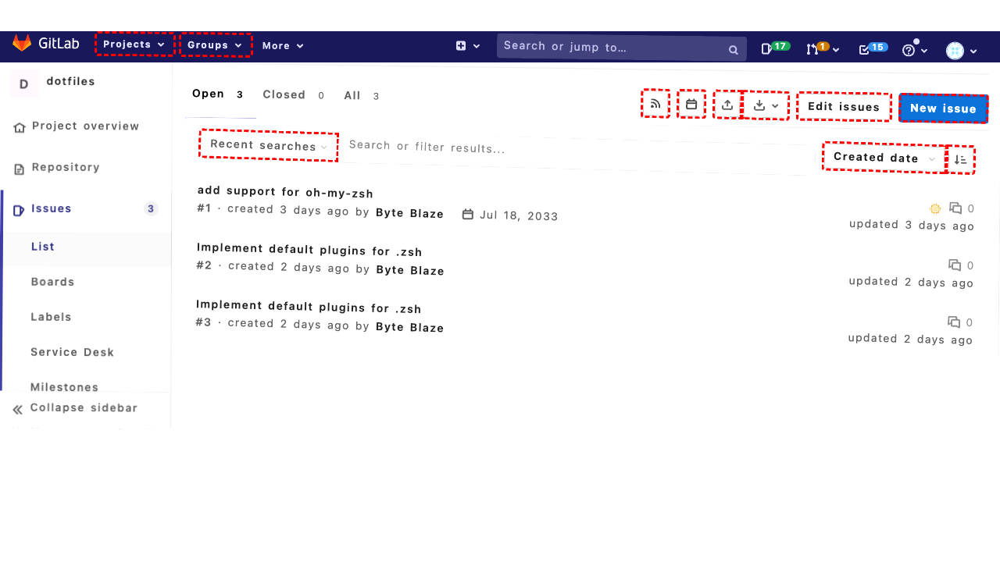
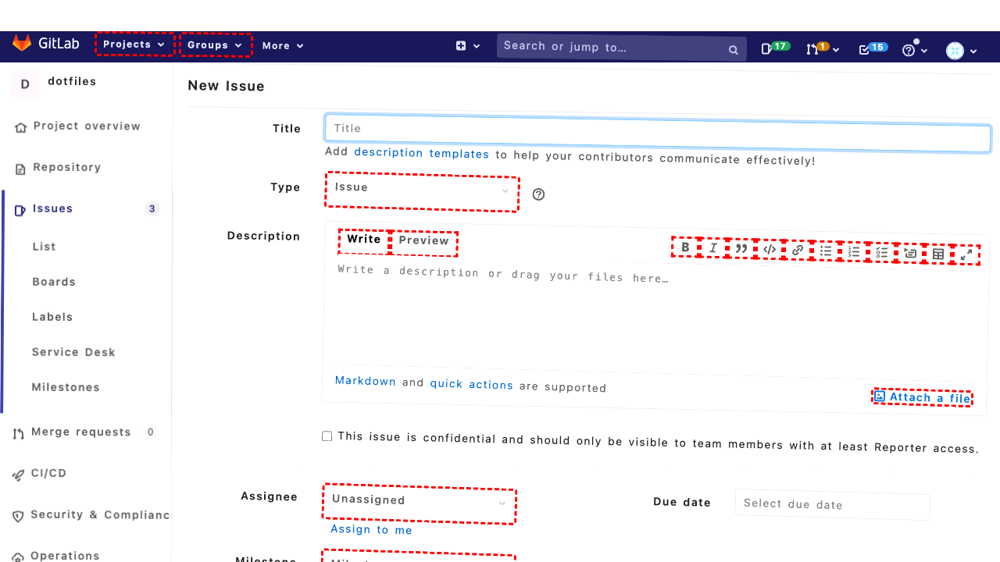
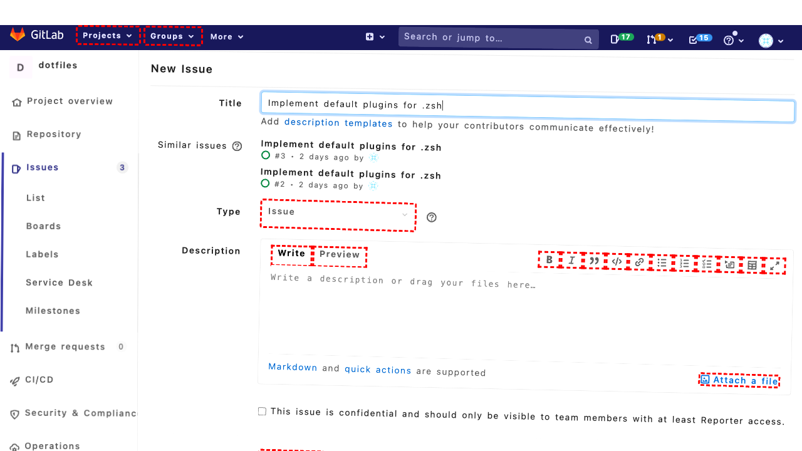
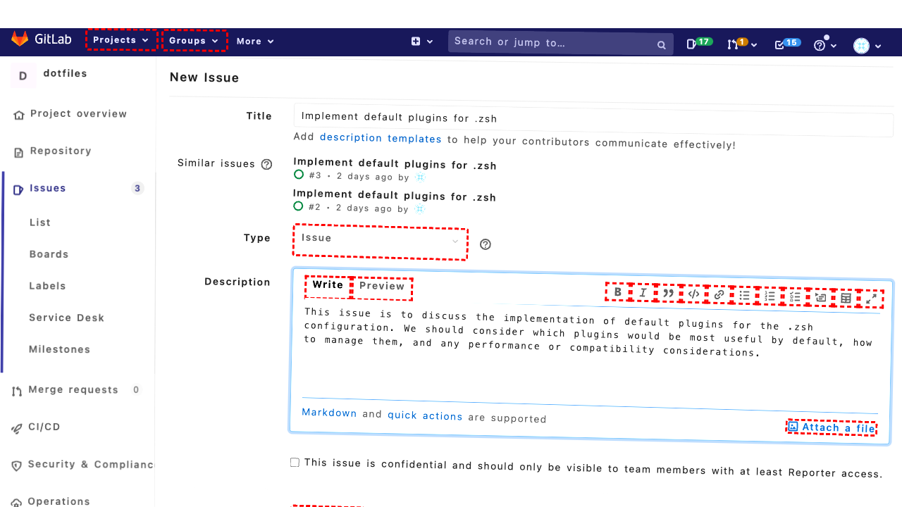
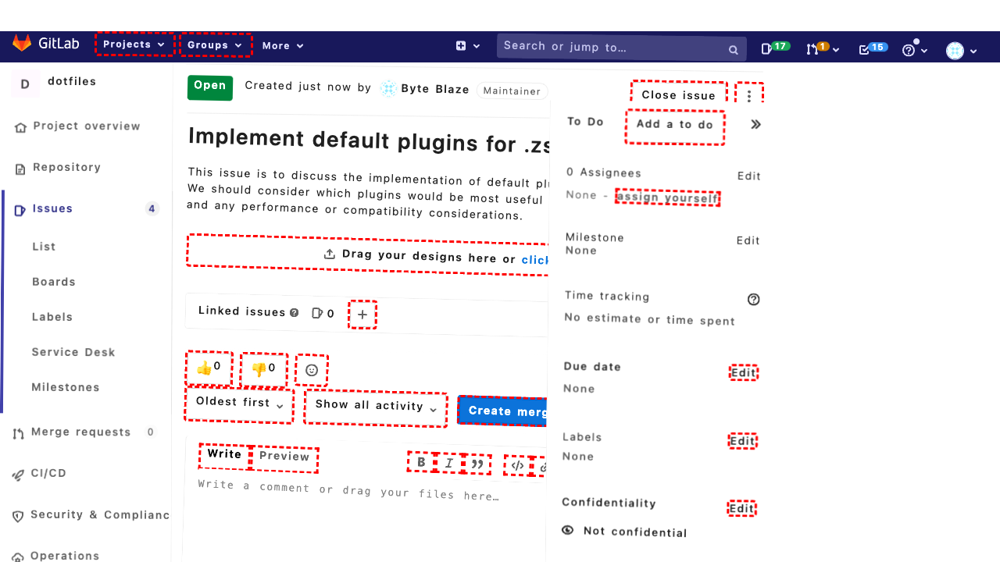
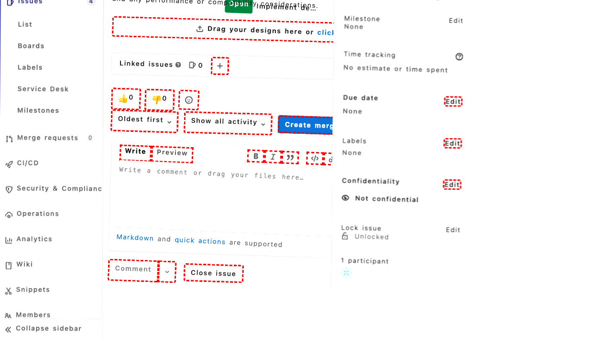
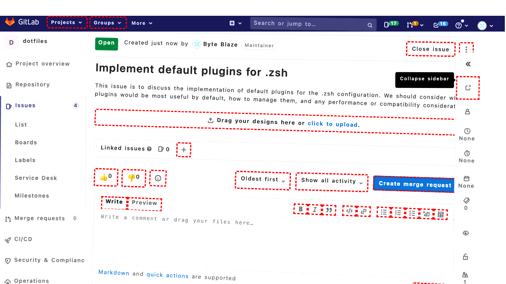
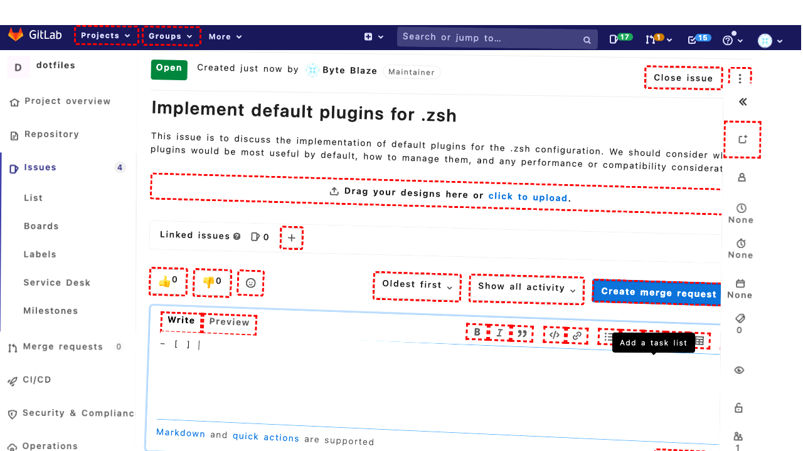

## Intent

Open a new issue to discuss the implementation of default plugins for .zsh

## RM

Thoughts: The user's intent is to open a new issue to discuss the implementation of default plugins for .zsh, which falls under the "Content modification" task type. The agent's action history shows that it navigated to an existing issue (347), clicked on an element (623), filled in the issue title and description, and then attempted to click the "Create issue" button (840) multiple times, encountering an issue with the sidebar obstructing the button. The agent then clicked the "Toggle sidebar" button (918) to collapse the sidebar and attempted to click the "Create issue" button again. The final state of the webpage indicates that the sidebar was collapsed to remove the obstruction, but it does not confirm whether the issue was successfully created. Since the final state does not show a new issue being created or any confirmation, and the bot's response is "None," I cannot verify that the task was completed. For content modification tasks, the final state must reflect the intended change, which is not evident here.

Status: failure

## Final Response 

## Captions

===============Looking at the current page, I can see I'm on the GitLab project page for "dotfiles". The goal is to open a new issue to discuss the implementation of default plugins for .zsh.

From the accessibility tree, I can see there's an "Issues" link in the project navigation sidebar with ID 347. This should take me to the issues page where I can then create a new issue.

Let me first navigate to the Issues page.<｜end▁of▁thinking｜>I can see I'm on the GitLab project page for "dotfiles". To create a new issue about default plugins for .zsh, I need to navigate to the Issues section first. I can see there's an "Issues" link in the project navigation sidebar with ID 347.
===============Looking at the current state, I can see that I'm already on the Issues page (as indicated by the URL and page title). I can see there are existing issues listed, including some about implementing default plugins for .zsh. I can also see a "New issue" link with ID 623 in the accessibility tree. Since I'm already on the Issues page, I should click the "New issue" button to start creating a new issue.
===============Looking at the current state, I can see that I'm already on the "New Issue" page for the dotfiles project. The page shows a form with fields for Title, Description, and other issue metadata. The goal is to create a new issue about implementing default plugins for .zsh.

I can see:
- A focused textbox for the Title (bid 591)
- A textbox for Description (bid 665)
- A disabled "Create issue" button (bid 840)

I need to fill in the title and description to enable the Create button. Let me start by filling in the title with an appropriate name for this issue.
===============Looking at the current state, I can see that the title field is already filled with "Implement default plugins for .zsh" (as shown in the accessibility tree where the textbox has value='Implement default plugins for .zsh'). The title appears to be pre-filled, which means I can proceed to fill in the description field. The description field is currently empty, so I need to add content there to create a meaningful issue for discussion.
===============Looking at the current state, I can see that both the title and description fields are already filled with appropriate content for the issue about implementing default plugins for .zsh. The title field (bid 591) shows "Implement default plugins for .zsh" and the description field (bid 665) contains a detailed discussion prompt.

The "Create issue" button (bid 840) should now be enabled since the required fields are filled. I can proceed to click the "Create issue" button to submit the new issue.
===============Looking at the current state, I can see that I've successfully filled both the title and description fields for the new issue about implementing default plugins for .zsh. The title is "Implement default plugins for .zsh" and the description contains a comprehensive discussion prompt.

The "Create issue" button (bid 840) should now be enabled and ready to submit the new issue. Since all the required information is provided, I can proceed to click the "Create issue" button to create the new issue.
===============Looking at the error message, I can see that the click on bid 840 ("Create issue" button) failed because another element (bid 1025) from the sidebar is intercepting pointer events. This suggests there might be an overlay or sidebar element blocking the button.

Let me first try to scroll the page to ensure the "Create issue" button is fully visible and not obstructed by any other elements. Then I'll try clicking it again.
===============Looking at the current situation, I can see that the "Create issue" button (bid 840) was blocked by another element (bid 1025) from the sidebar. I've just scrolled down 200 pixels to try to clear any obstructions. Now I should attempt to click the "Create issue" button again, as the form appears to be complete and ready for submission.
===============Looking at the error message, I can see that the "Create issue" button (bid 840) is being blocked by an element from the sidebar (bid 1025). The sidebar appears to be intercepting pointer events, which is preventing the click from going through to the button.

I need to either close the sidebar or find an alternative way to create the issue. Looking at the accessibility tree, I can see there's a "Toggle sidebar" button (bid 918) in the sidebar area. Let me try to close the sidebar first, then attempt to click the "Create issue" button again.
===============Looking at the current situation, I can see that the sidebar is interfering with clicking the "Create issue" button. I just clicked the "Toggle sidebar" button (bid 918) to collapse the sidebar, which should remove the obstruction. Now that the sidebar is likely collapsed, I should try clicking the "Create issue" button (bid 840) again to submit the new issue about implementing default plugins for .zsh.

## Images












## Main Prompt

```md
User Intent: Open a new issue to discuss the implementation of default plugins for .zsh

Action History:
1: navigate_to_issues('347')
2: click('623')
3: fill('591', "Implement default plugins for .zsh")
4: fill('665', "This issue is to discuss the implementation of default plugins for the .zsh configuration. We should consider which plugins would be most useful by default, how to manage them, and any performance or compatibility considerations.")
5: click('840')
6: click('840')
7: scroll(0, 200)
8: click('840')
9: click('918')
10: click('840')


The detailed final state of the webpage:

```md
Looking at the current situation, I can see that the sidebar is interfering with clicking the "Create issue" button. I just clicked the "Toggle sidebar" button (bid 918) to collapse the sidebar, which should remove the obstruction. Now that the sidebar is likely collapsed, I should try clicking the "Create issue" button (bid 840) again to submit the new issue about implementing default plugins for .zsh.
```

Bot response to the user: None.
```
