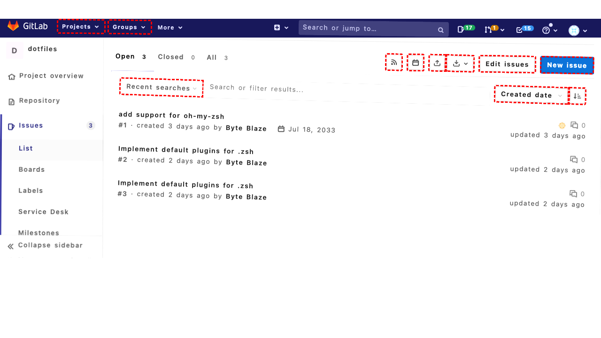
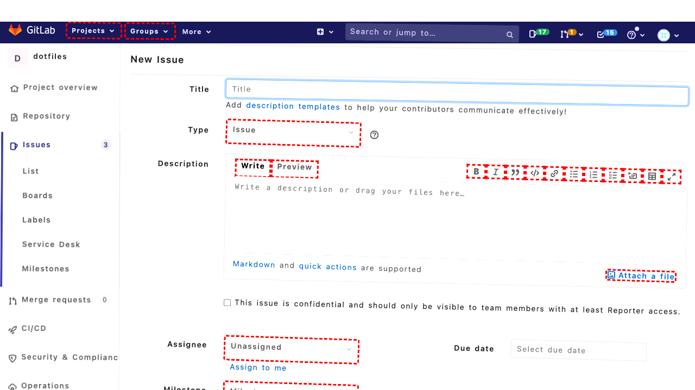
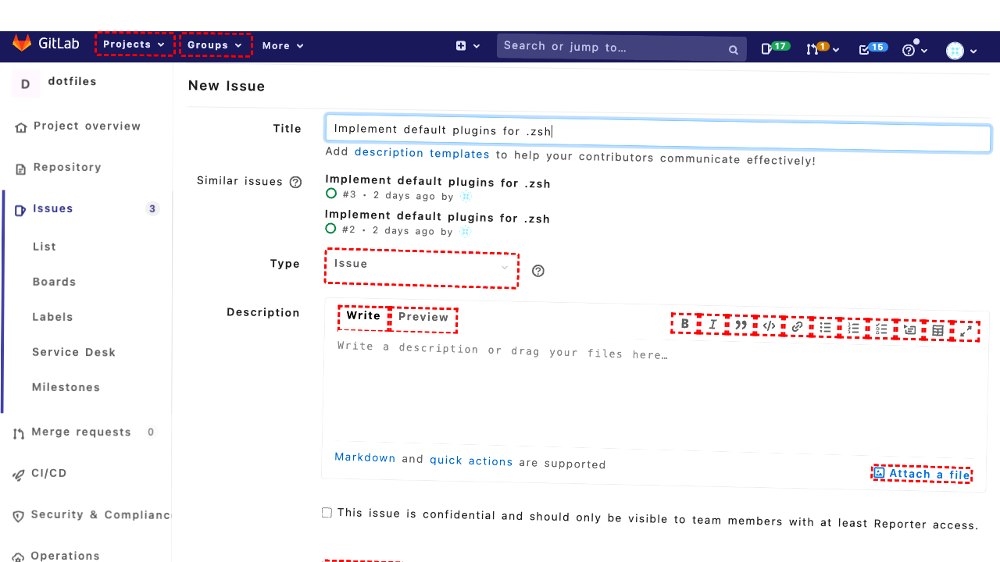
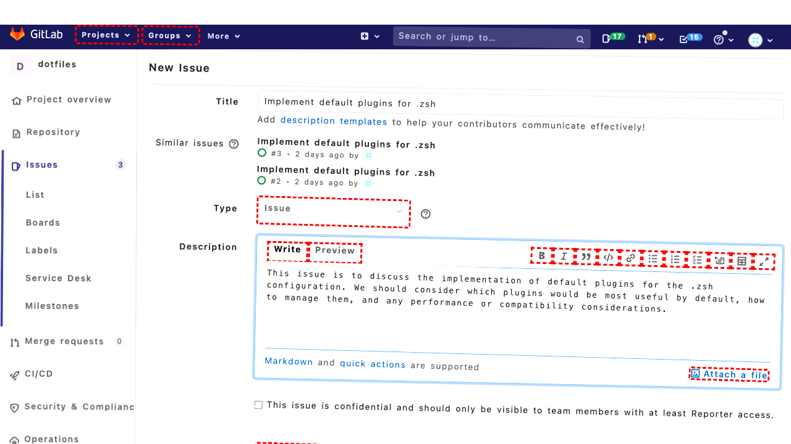
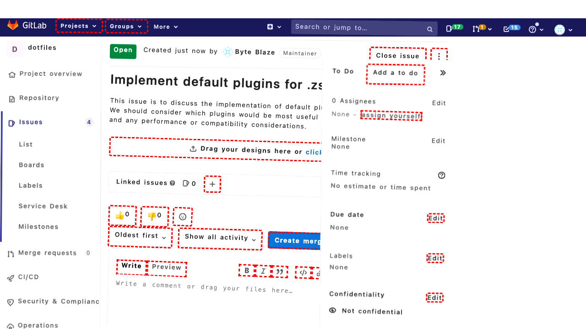
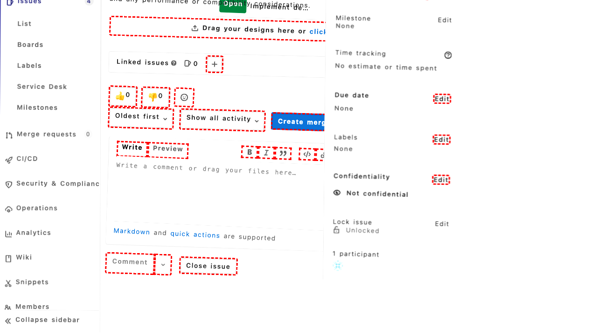
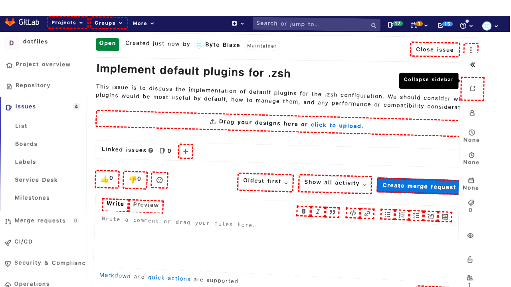
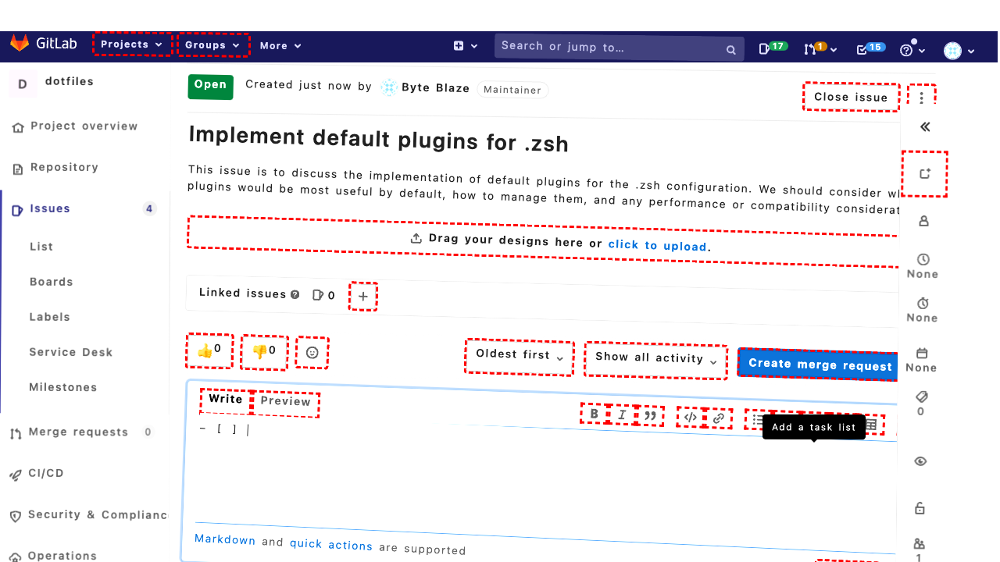

## Intent

Create a new private project "llm_bulk_inference" and add primer, convexegg, abishek as members

## RM

Thoughts: The user's intent is to create a new private project named "llm_bulk_inference" and add three members: primer, convexegg, and abishek. The action history shows the agent filled the project name and added "primer" as a member, but the final state indicates only "primer" was added, and the agent's internal note states it needs to repeat the process for the remaining users. Since the actions stopped after adding only one member and the project creation and member addition for the other two are incomplete, the task is not successfully completed.

Status: failure

## Final Response 

## Captions

===============Looking at the current page, I can see I'm on the GitLab dashboard with a list of existing projects. To accomplish the goal of creating a new private project "llm_bulk_inference" and adding members, I first need to navigate to the project creation page. I can see there's a "New project" link available on the page.
===============Looking at the error message, it seems the "New project" link (bid 224) is being intercepted by another element in the header. The error indicates that a profile dropdown element is blocking the click. Let me try a different approach by using the "New..." dropdown in the left navigation instead, which should also lead to project creation.
===============Looking at the current situation, I can see that clicking the "New..." dropdown (bid 125) was successful, but now I need to select the "New project" option from the expanded dropdown menu. The accessibility tree shows that after clicking "New...", a dropdown list appears with options including "New project" (bid 131), "New group" (bid 133), and "New snippet" (bid 135). Since my goal is to create a new project, I should click the "New project" option.
===============Looking at the current state, I can see I'm now on the "New Project" page with the form ready to be filled out. The accessibility tree shows I have a textbox for "Project name" (bid 260) that's already focused, and I can see the visibility level options with "Private" already selected (bid 283 is checked).

To accomplish the goal, I need to:
1. Fill in the project name "llm_bulk_inference"
2. Ensure the project remains private (which it already is)
3. Create the project
4. Then navigate to member management to add the specified users

Since the project name field is already focused, I can directly fill it with the project name.
===============Looking at the current state, I can see that the project name field (bid 260) has already been filled with "llm_bulk_inference" based on the accessibility tree showing "value='llm_bulk_inference'". The project is set to private (bid 283 is checked), which matches the goal requirements.

Now I need to create the project by clicking the "Create project" button (bid 311). After the project is created, I'll need to navigate to the member management section to add the specified users (primer, convexegg, abishek).
===============Looking at the current page, I can see the project "llm_bulk_inference" has been successfully created - the accessibility tree shows the success message "Project 'llm_bulk_inference' was successfully created." and I'm now on the project's main page.

To accomplish the goal of adding members (primer, convexegg, abishek), I need to navigate to the project settings and then to the members management section. I can see in the accessibility tree there's a "Settings" link (bid 363) in the left navigation sidebar.
===============Looking at the current state, I can see I'm on the project settings page for "llm_bulk_inference". The accessibility tree shows I'm in the "General" settings section, but I need to navigate to the "Members" section to add users. I can see in the sidebar there's a "Members" link (bid 376) under the Settings section.

To add the specified users (primer, convexegg, abishek), I need to click on the "Members" link to access the member management interface.
===============Looking at the current page, I can see I'm now on the "Members" page for the "llm_bulk_inference" project. The accessibility tree shows the "Invite member" tab is active with a search field (bid 453) for "Select members to invite", a role dropdown (bid 461) set to "Guest", and an "Add to project" button (bid 475) that's currently disabled.

To add the specified users (primer, convexegg, abishek), I need to:
1. Search for each user in the search field
2. Select them from the search results
3. Set their role (I'll use the default "Guest" role unless specified otherwise)
4. Click "Add to project"

Let me start by searching for the first user "primer" in the member search field.
===============Looking at the current state, I can see that after filling "primer" in the search field (bid 453), the accessibility tree shows a dropdown list with an option for "Primer @primer" (bid 570) that appears in the search results. This means the user "primer" has been found and is available to be selected.

To add this user to the project, I need to click on the search result option to select "primer", which should then enable the "Add to project" button.
===============Looking at the current state, I can see that "primer" has been successfully selected from the search results - the accessibility tree shows "Primer" appears in the selected members list (bid 577). The "Add to project" button (bid 475) should now be enabled since a user has been selected.

Now I need to click the "Add to project" button to add primer as a member to the project. After adding primer, I'll need to repeat the process for the remaining users (convexegg and abishek).

## Images












## Main Prompt

```md
User Intent: Create a new private project "llm_bulk_inference" and add primer, convexegg, abishek as members

Action History:
1: click("224")
2: click("125")
3: click("131")
4: fill("260", "llm_bulk_inference")
5: click("311")
6: click("363")
7: click("376")
8: fill("453", "primer")
9: click("570")
10: click("475")


The detailed final state of the webpage:

```md
Looking at the current state, I can see that "primer" has been successfully selected from the search results - the accessibility tree shows "Primer" appears in the selected members list (bid 577). The "Add to project" button (bid 475) should now be enabled since a user has been selected.

Now I need to click the "Add to project" button to add primer as a member to the project. After adding primer, I'll need to repeat the process for the remaining users (convexegg and abishek).
```

Bot response to the user: None.
```
