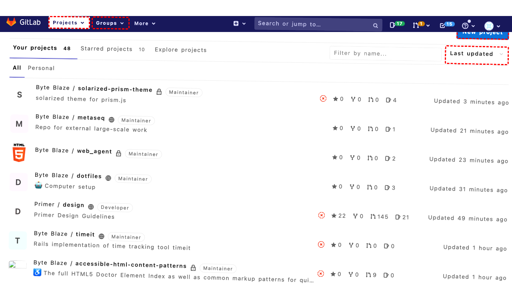
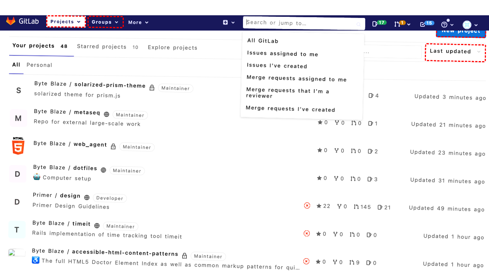
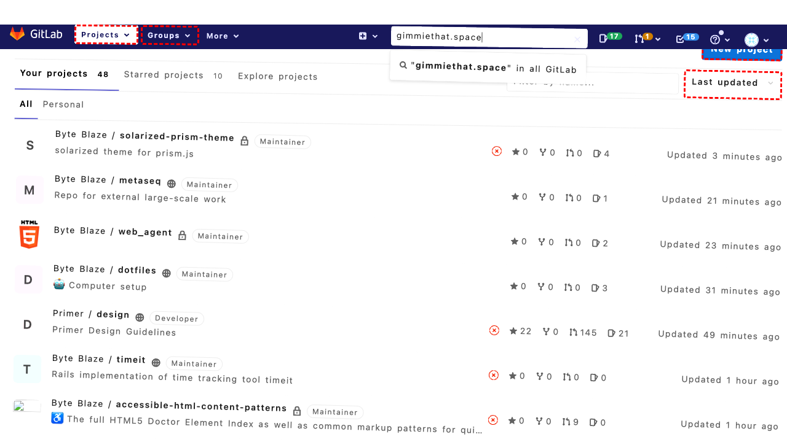
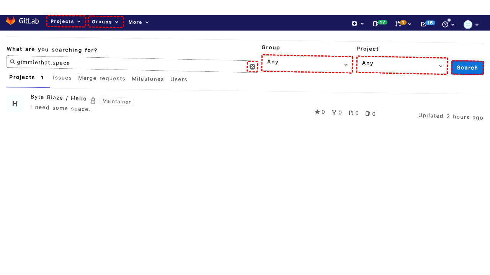
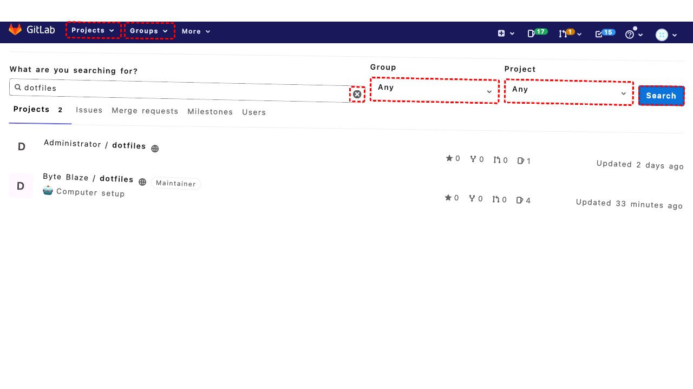
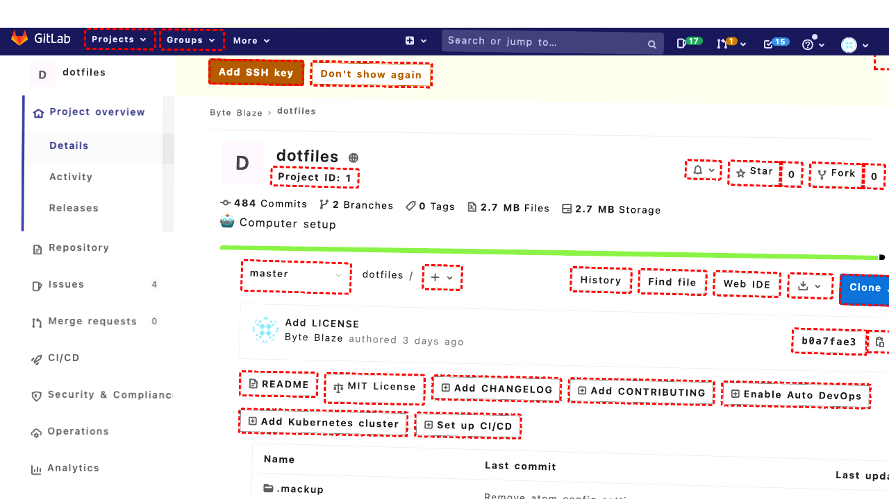
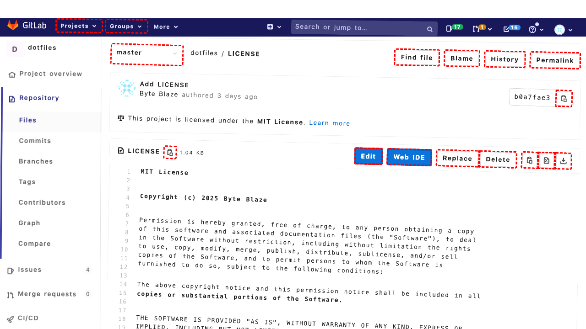

## Intent

Make the LICENSE of gimmiethat.space and dotfiles to MIT license.

## RM

Thoughts: The user's intent is to change the LICENSE of both "gimmiethat.space" and "dotfiles" to MIT license. This is a content modification task. The action history shows the agent searched for "gimmiethat.space" and "dotfiles", clicked on the LICENSE file for "dotfiles", and found it was already MIT. However, the agent did not successfully locate or modify the LICENSE for "gimmiethat.space"—the final state indicates the agent is still searching for it and has not completed the modification. Since the task requires both licenses to be MIT, and one was not addressed, the execution is incomplete and thus a failure.

Status: failure

## Final Response 

## Captions

===============Looking at the current page, I can see I'm on the GitLab dashboard showing a list of projects. I need to find and update the LICENSE files for two specific projects: "gimmiethat.space" and "dotfiles".

First, I need to locate the "dotfiles" project which I can see in the list (Byte Blaze / dotfiles), but I don't see "gimmiethat.space" in the current view. I should search for it using the search functionality.

I'll start by searching for "gimmiethat.space" using the search box.
===============Looking at the current page, I can see the search box with ID "156" is already focused (as indicated in the accessibility tree), so I don't need to click it again. I should directly fill in the search term "gimmiethat.space" to search for that project.
===============Looking at the current state, I can see that the search box (ID "156") already has "gimmiethat.space" filled in from my previous action, and the search results are already showing below it with a link for '"gimmiethat.space" in all GitLab'. I should now click on that search result to navigate to the gimmiethat.space project page.
===============Looking at the current state, I can see that I'm still on the search results page for "gimmiethat.space". The search results show one project result - "Byte Blaze / Hello" - but this doesn't match what I'm looking for. I need to find the actual "gimmiethat.space" project.

Let me try executing the search by pressing Enter to see if there are more specific results, or perhaps the project has a different name. The search box still has "gimmiethat.space" filled in, so I'll press Enter to perform the search.
===============Looking at the current state, I can see that after pressing Enter, I'm still on the search results page showing "Byte Blaze / Hello" as the only result for "gimmiethat.space". This doesn't appear to be the correct project I'm looking for. Let me try searching for "dotfiles" instead, since that project was visible in the initial search results and I need to update both licenses.

The search box (ID "156") is still available, so I'll search for "dotfiles" to find that project first.
===============Looking at the error message, I see that the element with ID "156" is actually an SVG element, not a text input field. This means I was trying to fill an element that isn't a proper input field.

Looking back at the accessibility tree, I can see there's a proper textbox with ID "253" that has the label "Search for projects, issues, etc." and it currently has the value "gimmiethat.space". This is the correct search input field I should be using.

Let me clear the current search and search for "dotfiles" using the correct textbox element.
===============Looking at the current state, I can see that I successfully filled the search box (ID "253") with "dotfiles". Now I need to execute the search by pressing Enter to see the search results for "dotfiles".
===============Looking at the current state, I can see that after filling the search box with "dotfiles" and pressing Enter, I'm now on the search results page for "dotfiles". The search results show two projects:
1. "Administrator / dotfiles"
2. "Byte Blaze / dotfiles"

Since the goal is to update the LICENSE for both "gimmiethat.space" and "dotfiles", and I can see the "Byte Blaze / dotfiles" project in the results, I should click on that project link to navigate to its repository page where I can access and modify the LICENSE file.
===============Looking at the current state, I can see that after clicking on the "Byte Blaze / dotfiles" search result, I'm now on the dotfiles project repository page. I can see in the file listing that there's a "LICENSE" file that was added 3 days ago.

Since my goal is to update the LICENSE to MIT license for both projects, I should first click on the LICENSE file in this repository to view and potentially edit it.
===============Looking at the current state, I can see that I successfully navigated to the dotfiles repository and clicked on the LICENSE file. Now I'm viewing the LICENSE file content, which appears to already be an MIT license (as shown in the accessibility tree with "MIT License" text and the standard MIT license content).

Since the goal is to make the LICENSE of dotfiles MIT license, and it's already MIT, I don't need to modify this file. Now I need to find and update the gimmiethat.space project. Let me search for it again using the search functionality.

## Images












## Main Prompt

```md
User Intent: Make the LICENSE of gimmiethat.space and dotfiles to MIT license.

Action History:
1: click("156")
2: fill("156", "gimmiethat.space")
3: click("1024")
4: keyboard_press("Enter")
5: fill("156", "dotfiles")
6: fill("253", "dotfiles")
7: keyboard_press("Enter")
8: click("366")
9: click("1175")
10: click("253")


The detailed final state of the webpage:

```md
Looking at the current state, I can see that I successfully navigated to the dotfiles repository and clicked on the LICENSE file. Now I'm viewing the LICENSE file content, which appears to already be an MIT license (as shown in the accessibility tree with "MIT License" text and the standard MIT license content).

Since the goal is to make the LICENSE of dotfiles MIT license, and it's already MIT, I don't need to modify this file. Now I need to find and update the gimmiethat.space project. Let me search for it again using the search functionality.
```

Bot response to the user: None.
```
