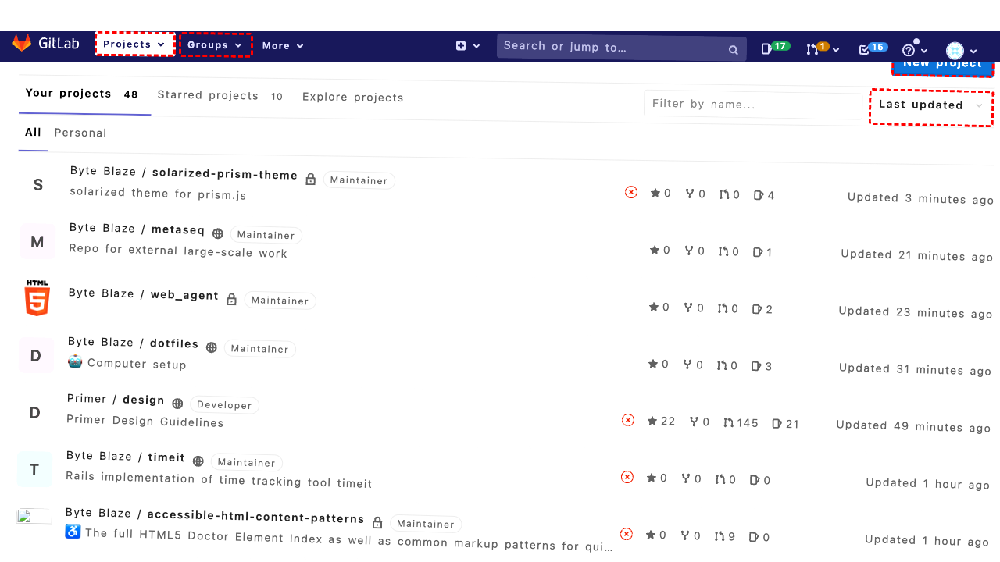
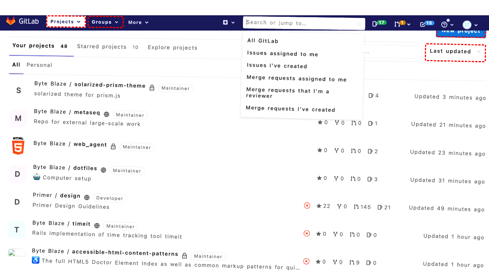
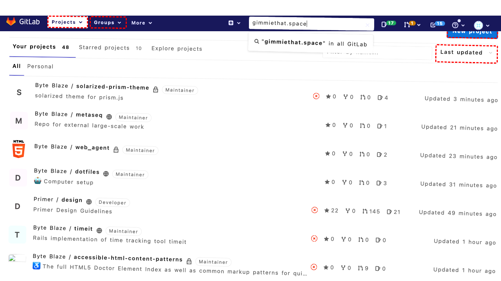
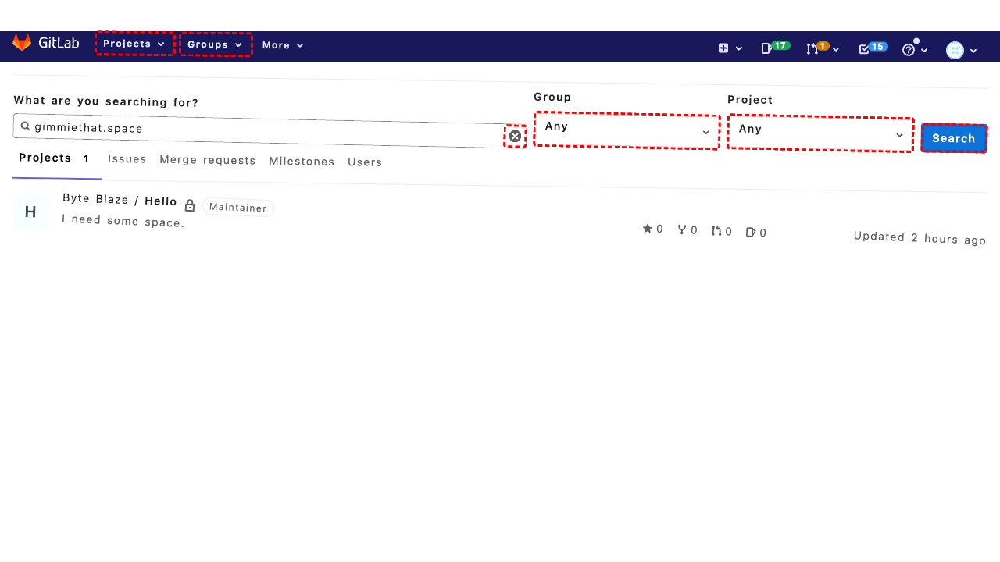
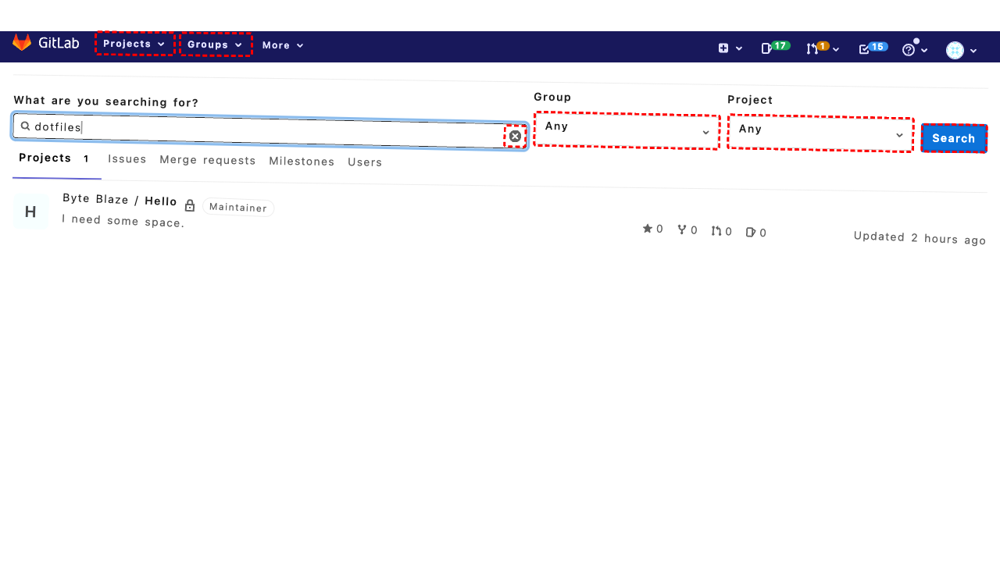
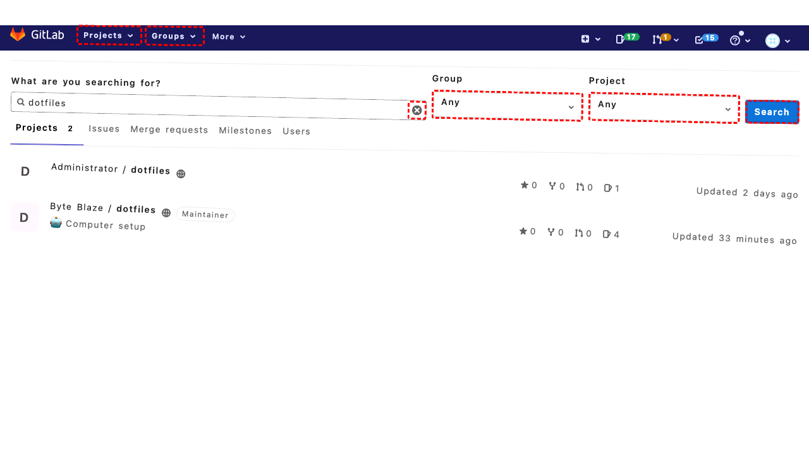
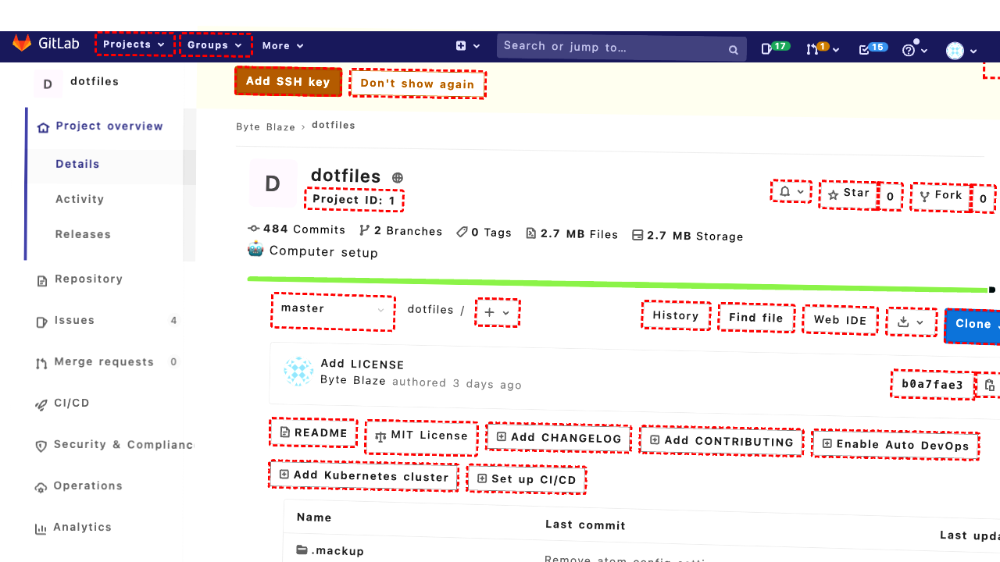
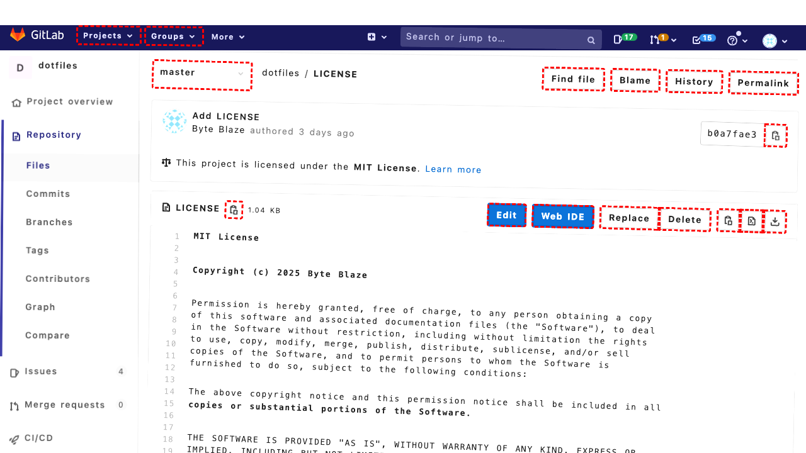

## Intent

Start a private project awesome_web_agents with blank template and add Abishek, Vinta as members

## RM

Thoughts: The user's intent is to create a private project named "awesome_web_agents" with a blank template and add Abishek and Vinta as members. The action history shows the agent successfully created the project (actions 1-5) and started adding members by searching for and selecting "Abishek" (actions 6-9). However, the final state only confirms Abishek S is selected and ready to be added, but the action history stops at clicking "Add to project" (action 10) without confirming the addition or proceeding to add Vinta. Since Vinta is not added and the final state does not show both members in the project, the task is incomplete and thus a failure.

Status: failure

## Final Response 

## Captions

===============Looking at the current page, I can see I'm on the GitLab dashboard with a list of existing projects. To accomplish the goal of creating a private project called "awesome_web_agents" with a blank template and adding Abishek and Vinta as members, I need to first create the project.

I can see there's a "New project" link available with ID '224'. This is the logical first step to start creating a new project.
===============Looking at the error message, it seems the "New project" link (ID '224') is being intercepted by another element in the header. The error indicates that a profile dropdown element (ID '186') is intercepting pointer events, preventing the click from reaching the "New project" link.

I need to try a different approach. I notice there's also a "New..." dropdown in the left navigation with ID '125' that contains a "New project" option. This might be more accessible.

Let me try clicking the "New..." dropdown first, then selecting "New project" from there.
===============Looking at the current situation, I can see that clicking the "New..." dropdown (ID '125') was successful, and now I need to select the "New project" option from the dropdown menu. The accessibility tree shows that after expanding the "New..." dropdown, there's a list with options including "New project" (ID '131'), "New group" (ID '133'), and "New snippet" (ID '135').

Since my goal is to create a new project, I should click on the "New project" option with ID '131'. This should take me to the project creation page where I can set up the "awesome_web_agents" project with a blank template.
===============Looking at the current page state, I can see I'm now on the "New Project" page with the blank project template already selected (as indicated by the tab structure showing "Blank project" as one of the options). The page shows the project creation form with fields for project name, description, visibility level, etc.

Since I'm already on the blank project creation page, I can proceed directly to filling out the form to create the "awesome_web_agents" project as private. I can see:

- Project name textbox with ID '260' (focused)
- Private radio button is already checked (ID '283')
- Create project button with ID '311'

I should fill in the project name "awesome_web_agents" and click create. The project slug will auto-populate, and the private visibility is already set, which matches the goal requirements.
===============Looking at the current state, I can see that the project name field (ID '260') is already filled with "awesome_web_agents" and has focus. The private visibility option is already selected (checked='true'), which matches the goal requirement for a private project. The blank project template is also already selected since we're on the blank project creation tab.

The next logical step is to click the "Create project" button to finalize the project creation. After the project is created, I'll need to navigate to the project settings to add Abishek and Vinta as members.
===============Looking at the current page state, I can see the project "awesome_web_agents" has been successfully created (as indicated by the success message "Project 'awesome_web_agents' was successfully created."). The project is private (shown by the lock icon \uf023 next to the project name).

Now I need to add Abishek and Vinta as members to this project. To do this, I need to navigate to the project settings and then to the members management section. I can see in the accessibility tree there's a "Settings" link with ID '363' in the sidebar.
===============Looking at the current page, I can see I'm on the project settings page for "awesome_web_agents". The accessibility tree shows that I'm in the "General" settings section, but I need to navigate to the "Members" section to add users. I can see there's a "Members" link in the settings sidebar with ID '376'.

Since my goal is to add Abishek and Vinta as members to the project, I should click on the "Members" link to access the member management page where I can search for and add users.
===============Looking at the current page, I can see I'm now on the "Members" page for the "awesome_web_agents" project. The accessibility tree shows the member management interface with:

- A search box for "Select members to invite" (ID '453')
- A role selection dropdown (ID '461') currently set to "Guest"
- An "Add to project" button (ID '475') that is currently disabled

To add Abishek and Vinta as members, I need to search for each user in the search box, select them from the results, choose their role, and then click "Add to project". Since the button is currently disabled, I'll need to search for a user first to enable it.

Let me start by searching for "Abishek" in the member search field.
===============Looking at the current state, I can see that I've successfully searched for "Abishek" in the member search field (ID '453'). The accessibility tree shows that there's a search result for "Abishek S @abisubramanya27" available in the dropdown list (ID '569').

Now I need to select Abishek from the search results to add him as a member. I can see the specific option element with ID '570' that represents Abishek in the search results.
===============Looking at the current state, I can see that Abishek S has been successfully selected from the search results. The accessibility tree shows that Abishek is now selected (indicated by the checkmark ✓ next to his name), and the "Add to project" button (ID '475') should now be enabled.

Now I need to set the appropriate role for Abishek. The role dropdown (ID '461') is currently set to "Guest" by default. Since the goal doesn't specify a particular role, I'll keep the default "Guest" role and proceed to add Abishek to the project.

## Images












## Main Prompt

```md
User Intent: Start a private project awesome_web_agents with blank template and add Abishek, Vinta as members

Action History:
1: click("224")
2: click("125")
3: click("131")
4: fill("260", "awesome_web_agents")
5: click("311")
6: click("363")
7: click("376")
8: fill("453", "Abishek")
9: click("570")
10: click("475")


The detailed final state of the webpage:

```md
Looking at the current state, I can see that Abishek S has been successfully selected from the search results. The accessibility tree shows that Abishek is now selected (indicated by the checkmark ✓ next to his name), and the "Add to project" button (ID '475') should now be enabled.

Now I need to set the appropriate role for Abishek. The role dropdown (ID '461') is currently set to "Guest" by default. Since the goal doesn't specify a particular role, I'll keep the default "Guest" role and proceed to add Abishek to the project.
```

Bot response to the user: None.
```
