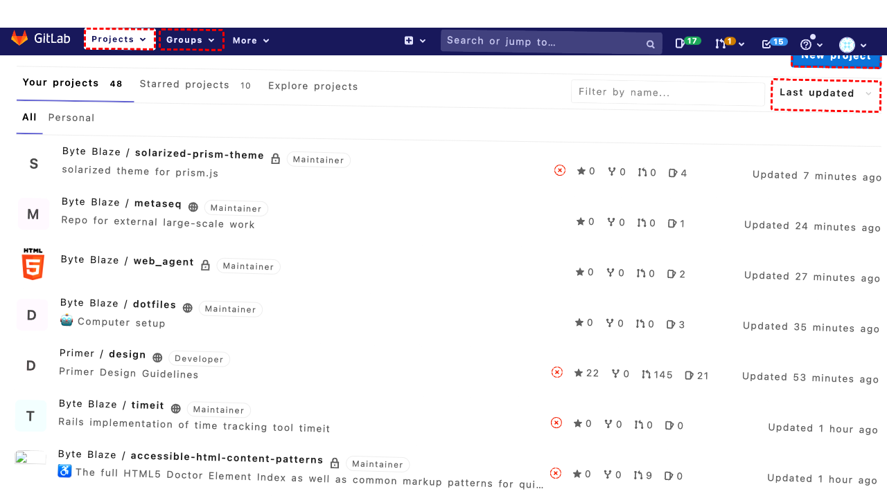
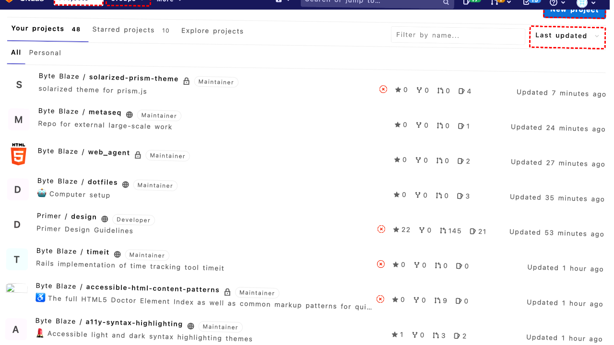
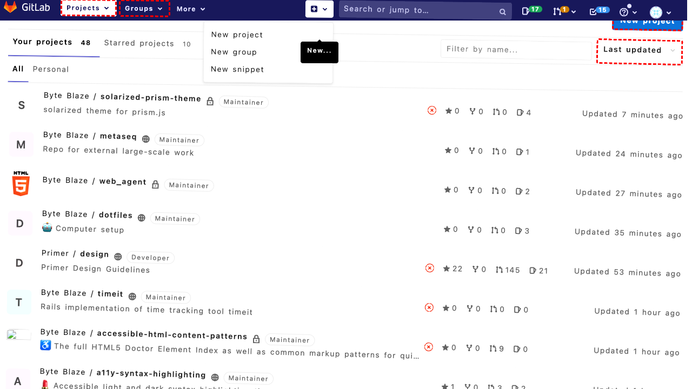
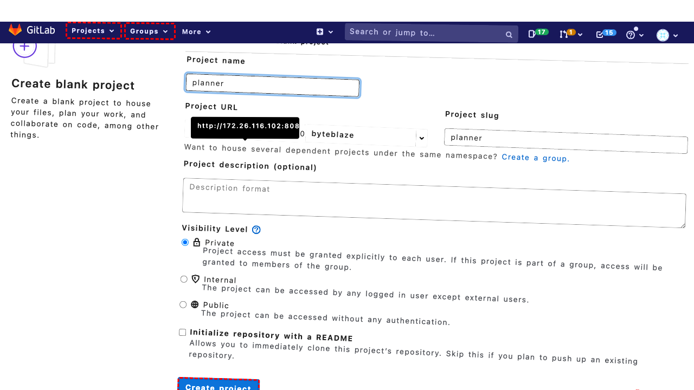
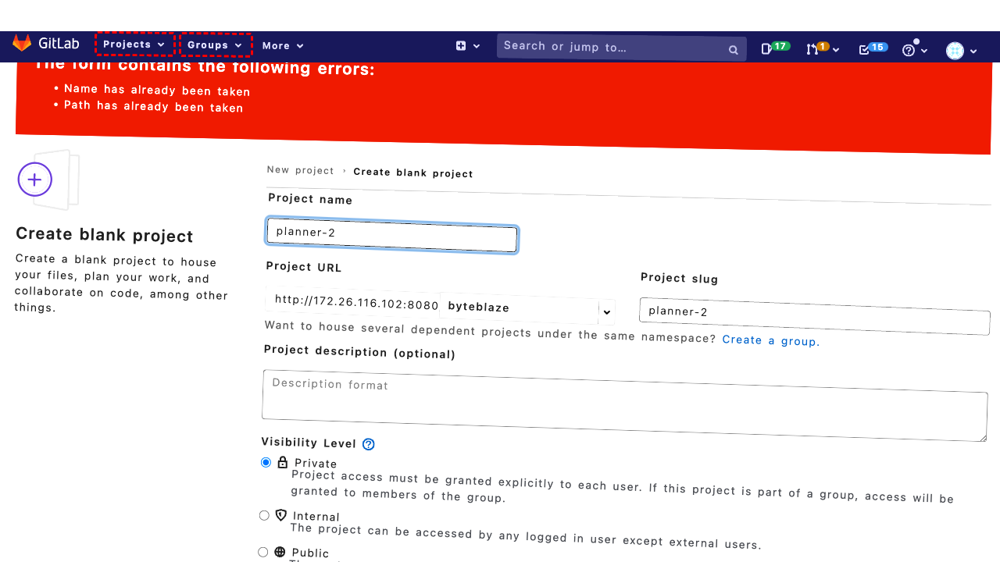
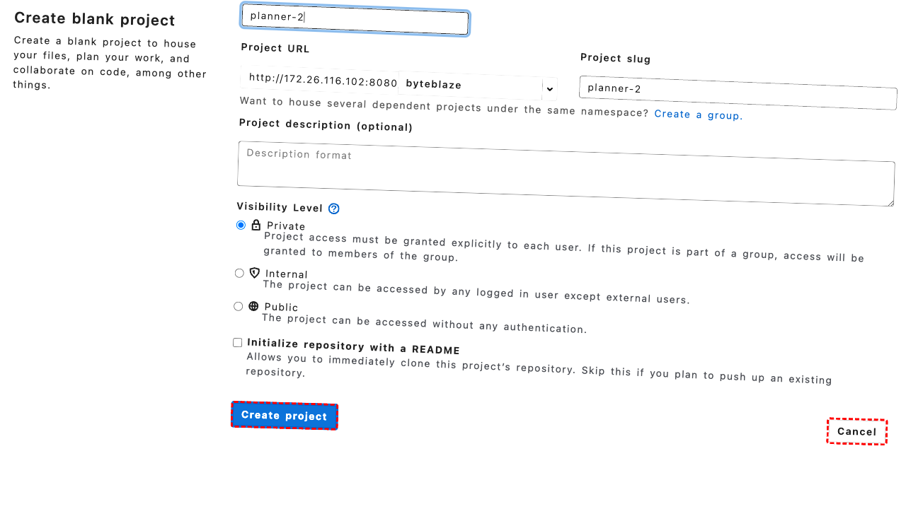

## Intent

Start a private project web_agent_android_xl with Android template and add primer, convexegg, abishek as members

## RM

Thoughts: The user's intent is to create a private project named "web_agent_android_xl" using the Android template and add specific members. The action history shows the agent attempted to fill the project name field (element 543) and clicked various elements, but the final state indicates the project name field was not visible even after scrolling, and the agent did not successfully proceed to the project configuration page where the name and visibility could be set. The bot response is "None," and the final state suggests the agent encountered an issue and did not complete the project creation or member addition. Since this is a content modification task, I examine the action history and final state, which show the task was not successfully completed.

Status: failure

## Final Response 

## Captions

===============Looking at the goal and the current page, I need to create a new private project called "web_agent_android_xl" using an Android template and add three members (primer, convexegg, abishek).

The current page shows the GitLab dashboard with a "New project" link visible. I should start by clicking this link to begin the project creation process.
===============Looking at the error message, it seems the "New project" link is being intercepted by another element (the profile dropdown). I need to try a different approach to create a new project. Let me use the "New..." dropdown in the left navigation instead, which should also lead to project creation.
===============Looking at the current situation, I previously tried clicking the "New project" link but it was intercepted by the profile dropdown. Then I tried clicking the "New..." dropdown in the left navigation. Now I need to select the "New project" option from that dropdown menu to proceed with creating the project.

The accessibility tree shows that after clicking "New..." (element 125), there's a dropdown list with options including "New project" (element 131). I should click that specific option to navigate to the project creation page.
===============Looking at the current state, I can see I'm already on the "New Project" page (URL: http://172.26.116.102:8080/projects/new) based on the accessibility tree. The page shows the project creation form with tabs for "Blank project", "Create from template", and "Import project".

Since I need to create a project using an Android template, I should click the "Create from template" tab rather than proceeding with the default blank project option.
===============Looking at the current page, I can see I'm on the "Create from template" tab where various project templates are displayed. I need to select the Android template to create the project. In the accessibility tree, I can see the Android template section with a radio button labeled "Use template" (element 394). I should click this radio button to select the Android template.
===============Looking at the error message, the click on the Android template radio button (element 394) is being intercepted by the label element (395) that says "Use template". This is a common UI pattern where clicking the label also selects the radio button. I should click the label element instead to successfully select the Android template.
===============Looking at the current state, I successfully selected the Android template by clicking the "Use template" label. Now I need to proceed with creating the project. The next step should be to fill in the project name "web_agent_android_xl" and then create the project.

Based on the accessibility tree, I can see various form fields and buttons that would appear after template selection. I need to locate the project name input field and fill it with the desired name, then click the create button.
===============Looking at the error, it seems the element with ID "543" (project name field) is not currently visible on the page. This suggests that after selecting the Android template, the page might have navigated to a different URL or the form fields might not be immediately visible.

Let me check if there's a "Create project" button or similar that appears after template selection. Looking at the accessibility tree, I can see various template options but no visible form fields for project creation yet. I should try to scroll down to see if the project creation form appears below the template selection area.
===============Looking at the current situation, I've successfully selected the Android template by clicking the "Use template" label. However, the project creation form with the name field doesn't seem to be immediately visible. After scrolling, I should be able to see the project creation form that appears after template selection.

The goal requires creating a private project, so I need to look for the project name field and ensure the project visibility is set to private. Let me try to locate and fill the project name field now that I've scrolled down.
===============Looking at the error, it seems the project name field (element 543) is not visible even after scrolling. This suggests that after selecting the Android template, the page might have navigated to a different URL or the form fields might be on a different page.

Let me check if there's a "Create project" button or similar that should appear after template selection. Looking at the accessibility tree again, I notice that after selecting a template, there should typically be a "Create project" button that appears. Let me try to locate and click that button to proceed to the project configuration page where I can set the name and visibility.

## Images












## Main Prompt

```md
User Intent: Start a private project web_agent_android_xl with Android template and add primer, convexegg, abishek as members

Action History:
1: click("224")
2: click("125")
3: click("131")
4: click("243")
5: click("394")
6: click("395")
7: fill("543", "web_agent_android_xl")
8: scroll(0, 500)
9: fill("543", "web_agent_android_xl")
10: click("586")


The detailed final state of the webpage:

```md
Looking at the error, it seems the project name field (element 543) is not visible even after scrolling. This suggests that after selecting the Android template, the page might have navigated to a different URL or the form fields might be on a different page.

Let me check if there's a "Create project" button or similar that should appear after template selection. Looking at the accessibility tree again, I notice that after selecting a template, there should typically be a "Create project" button that appears. Let me try to locate and click that button to proceed to the project configuration page where I can set the name and visibility.
```

Bot response to the user: None.
```
